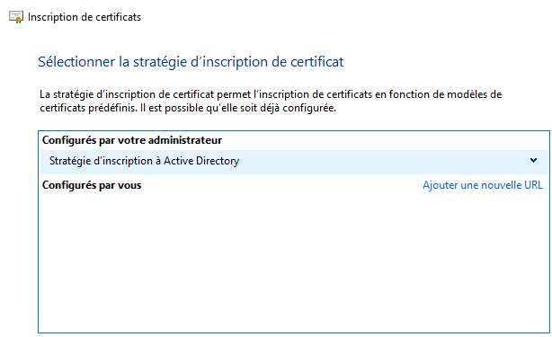
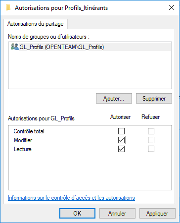
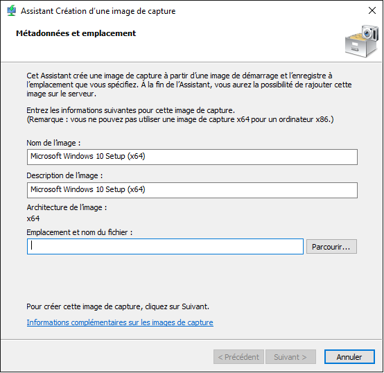

# Bosse QCM par thème

[TOC]

<span id="toc"></span>


## 19 - Cloud

<a href="#toc">Retour en haut</a>

### SaaS \> PaaS \> IaaS

<a href="#toc">Retour en haut</a>

#### SaaS Software as a Service (O365)

-   permet mise à dispo d'applications aux utilisateurs finaux.
-   l'utilisateur est déchargé de la partie configuration des logiciels

**Avantages**

-   pas d'admministration
-   disponibilité proche de 100%
-   évolution des produits dans le temps
-   pas de contraintes matérielles
-   coût maîtrisé (?)

**Inconvénients**

-   tributaire de l'éditeur
-   dépendance à internet
-   confidentialité des données ?
-   ROI croise à env. 4 ans (?)

**Exemples** : Office365, Google Suite

<a href="#toc">Retour en haut</a>

#### PaaS Platform as a Service (Apache)

-   Permet mise à dispo d'environnements et de plateformes informatiques
-   ex. OS ou applications spécifiques sur des infra mutualisées

```{=html}
<table class="table">
```
```{=html}
<tr>
```
```{=html}
<th>
```
Avantages
```{=html}
</th>
```
```{=html}
<th>
```
Inconvénients
```{=html}
</th>
```
```{=html}
</tr>
```
```{=html}
<tr>
```
```{=html}
<td>
```
```{=html}
<ul>
```
```{=html}
<li>
```
Economie de licences logicielles à l'achat
```{=html}
</li>
```
```{=html}
<li>
```
Flexibilité
```{=html}
</li>
```
```{=html}
<li>
```
Sécurité assurée par le fournisseur
```{=html}
</li>
```
```{=html}
<li>
```
Facilité de mise en oeuvre
```{=html}
</li>
```
```{=html}
</ul>
```
```{=html}
</td>
```
```{=html}
<td>
```
```{=html}
<ul>
```
```{=html}
<li>
```
Dépendance à Internet
```{=html}
</li>
```
```{=html}
<li>
```
Confidentialité des données ?
```{=html}
</li>
```
```{=html}
</ul>
```
```{=html}
</td>
```
```{=html}
</tr>
```
```{=html}
</table>
```
**Exemples** : Apache, Tomcat, SQL SERVER

<a href="#toc">Retour en haut</a>

#### IaaS Infra as a Service (AWS, OVH)

-   Permet la mise à disposition d'infrastructures aux administrateurs.
-   Les admins n'ont plus besoin de se préoccuper des problématiques
    liées à l'hébergement interne des serveurs, le matériel est mis à
    disposition par le fournisseur.

```{=html}
<table class="table">
```
```{=html}
<tr>
```
```{=html}
<th>
```
Avantages
```{=html}
</th>
```
```{=html}
<th>
```
Inconvénients
```{=html}
</th>
```
```{=html}
</tr>
```
```{=html}
<tr>
```
```{=html}
<td>
```
```{=html}
<ul>
```
```{=html}
<li>
```
Plus besoin d'aménager une salle serveur
```{=html}
</li>
```
```{=html}
<li>
```
La sécurité matérielle est assurée par le fournisseur
```{=html}
</li>
```
```{=html}
<li>
```
Garantie de disponibilité
```{=html}
</li>
```
```{=html}
<li>
```
Pas d'obsolescence du matériel
```{=html}
</li>
```
```{=html}
<li>
```
Evolutivité à la demande
```{=html}
</li>
```
```{=html}
</ul>
```
```{=html}
</td>
```
```{=html}
<td>
```
```{=html}
<ul>
```
```{=html}
<li>
```
100% tributaire de l'hébergeur
```{=html}
</li>
```
```{=html}
<li>
```
dépendance à l'accès internet
```{=html}
</li>
```
```{=html}
<li>
```
confidentialité des données ?
```{=html}
</li>
```
```{=html}
</ul>
```
```{=html}
</td>
```
```{=html}
</tr>
```
```{=html}
</table>
```
**Exemples** : AWS, OVH, Microsoft 365

<a href="#toc">Retour en haut</a>

#### Conclusion

Pour tous les modes, l'avantage est qu'on reporte sur l'opérateur la
sécurité, la mise à niveau matérielle et logiciel, la mise à disposition
et l'entretien de l'équipement.

L'inconvénient est qu'on est parfois tributaire du fournisseur, qu'on
dépend de notre connection internet, et qu'on peut émettre des doutes
sur la confidentialité des données (où sont hébergés les serveurs ?)

<a href="#toc">Retour en haut</a>

### Différences entre Cloud Privé, Cloud Public et Cloud hybride

```{=html}
<table class="table">
```
```{=html}
<tr>
```
```{=html}
<th>
```
Cloud Privé
```{=html}
</th>
```
```{=html}
<th>
```
Cloud Public
```{=html}
</th>
```
```{=html}
<th>
```
Cloud Hybride
```{=html}
</th>
```
```{=html}
</tr>
```
```{=html}
<tr>
```
```{=html}
<td>
```
```{=html}
<ul>
```
```{=html}
<li>
```
intégration du matos dans un datacenter tiers ou interne à l'entreprise
```{=html}
</li>
```
```{=html}
<li>
```
fiabilité, sécurité et extensibilité sont à la charge de l'entreprise
```{=html}
</li>
```
```{=html}
<li>
```
sécurité accrue car matos n'est pas mutualisé
```{=html}
</li>
```
```{=html}
<li>
```
évolutivité sous réserve d'investissements par l'entreprise
```{=html}
</li>
```
```{=html}
</ul>
```
```{=html}
</td>
```
```{=html}
<td>
```
```{=html}
<ul>
```
```{=html}
<li>
```
matos est la propriété du fournisseur (serveurs, stockage)
```{=html}
</li>
```
```{=html}
<li>
```
matos partagé avec d'autres clients du fournisseur (mutualisé)
```{=html}
</li>
```
```{=html}
<li>
```
extensibilité pratiquement illimité (à la charge du fournisseur)
```{=html}
</li>
```
```{=html}
<li>
```
fiabilité
```{=html}
</li>
```
```{=html}
<li>
```
coût relativement faibles
```{=html}
</li>
```
```{=html}
<li>
```
pas de matos à maintenir (à la charge du fournisseur)
```{=html}
</li>
```
```{=html}
<li>
```
attention au débit internet nécessaire + temps d'allumage des VM
```{=html}
</li>
```
```{=html}
</ul>
```
```{=html}
</td>
```
```{=html}
<td>
```
```{=html}
<ul>
```
```{=html}
<li>
```
C'est un mix de privé+public, ou hébergement local
```{=html}
</li>
```
```{=html}
<li>
```
permet de gérer les coûts, de maitriser la sécurité, optimiser les perf
en prenant le meilleur des différents types de cloud
```{=html}
</li>
```
```{=html}
<li>
```
permet de fiabiliser les services en les "éclatant" sur les différents
type de cloud
```{=html}
</li>
```
```{=html}
<li>
```
expansion facile grâce au cloud public, performance et sécurité grâce au
cloud privé
```{=html}
</li>
```
```{=html}
<li>
```
rapport coût / efficacité
```{=html}
</li>
```
```{=html}
</ul>
```
```{=html}
</td>
```
```{=html}
</tr>
```
```{=html}
</table>
```
<a href="#toc">Retour en haut</a>

#### Hébergement on-premise

```{=html}
<table class="table">
```
```{=html}
<tr>
```
```{=html}
<th>
```
Avantages
```{=html}
</th>
```
```{=html}
<th>
```
Inconvénients
```{=html}
</th>
```
```{=html}
</tr>
```
```{=html}
<tr>
```
```{=html}
<td>
```
```{=html}
<ul>
```
```{=html}
<li>
```
maîtrise total de l'env matériel et OS
```{=html}
</li>
```
```{=html}
<li>
```
montées de version contrôlées
```{=html}
</li>
```
```{=html}
<li>
```
investissement initial et pas de notion de "location" pour la mise à
disposition des services
```{=html}
</li>
```
```{=html}
<li>
```
ajout de nouveaux services "gratuitement" sous réserve de disponibilité
du matos
```{=html}
</li>
```
```{=html}
</ul>
```
```{=html}
</td>
```
```{=html}
<td>
```
```{=html}
<ul>
```
```{=html}
<li>
```
obscolescence du matériel
```{=html}
</li>
```
```{=html}
<li>
```
disposer d'un salle serveur qui ferme à clé, avec clim, pare-feu,
onduleur, etc.
```{=html}
</li>
```
```{=html}
<li>
```
sécurité à la charge de l'entreprise (logicielle et matérielle avec alim
éléctrique, refroidissement)
```{=html}
</li>
```
```{=html}
</ul>
```
```{=html}
</td>
```
```{=html}
</tr>
```
```{=html}
</table>
```
<a href="#toc">Retour en haut</a>

### Révisions

<a href="#toc">Retour en haut</a>

#### \[t32\] Différences IaaS / PaaS

IaaS (Infrastructure as a Service) est la mise à disposition par un
fournisseur d'une infrastructure complète (ex. OVH, AWS).

PaaS (Plateforme as a Service) est la mise à disposition par un
fournisseur d'une plateforme, d'un environnement de travail (ex. Apache,
Tomcat)

**chatgpt**

IaaS fournit une infrastructure informatique virtuelle de base, telle
que des serveurs virtuels, du stockage et des réseaux, sur lesquels les
utilisateurs peuvent déployer leurs propres systèmes d'exploitation et
applications.

PaaS fournit une plateforme de développement et de déploiement
d'applications complète, comprenant l'infrastructure sous-jacente, les
systèmes d'exploitation, les services de développement et les outils.

En résumé, IaaS se concentre sur la fourniture d'une infrastructure de
base virtualisée, tandis que PaaS offre une plateforme complète pour le
développement et le déploiement d'applications. IaaS offre plus de
contrôle et de flexibilité, tandis que PaaS offre une abstraction plus
élevée et une plus grande simplicité pour les développeurs
d'applications.

<a href="#toc">Retour en haut</a>

#### \[t31\] Schema SaaS IaaS PaaS à compléter

application \> middleware \> OS \> virtu \> serveur/stockage \> reseau
\> datacenter

saas \> saas / paas \> paas \> paas / iaas \> iaas \> iaas \> iaas

<a href="#toc">Retour en haut</a>

## Linux

<a href="#toc">Retour en haut</a>

### \[g04\] définition \$PATH

La variable `$PATH` est une variable d'environnement que l'on trouve
dans les systèmes \*nix (Unix, Linux). Elle contient des chemins absolus
vers des répertoires contenant des exécutables. Cela permet d'appeler
une commande dans le terminal, telle que `echo`, sans taper le chemin
entier vers elle. Par exemple, si le chemin `/sbin` est dans la variable
PATH, on peut accéder à tous les executables contenus dans ce répertoire
et appeler la commande `shutdown` sans avoir à faire `/sbin/shutdown`.

**v2**

C'est une variable d'environnement utilisée par les systèmes UNIX et
UNIX-like (y compris Linux) pour spécifier les répertoires dans lesquels
le système recherche les commande exécutable. C'est l'équivalent de la
variable d'environnement `%PATH%` utilisée par les systèmes Windows.

<a href="#toc">Retour en haut</a>

### \[g05\] Emplacement fichier "utilisateurs"

**Où se trouve l'emplacement du fichier avec la liste des utilisateurs
?**

Dans `/etc/passwd`

<a href="#toc">Retour en haut</a>

### \[t46\] ajout disque: nom ?

**Si on ajoute un disque, quel sera son nom ?** (illustration)

/dev/sdb

<a href="#toc">Retour en haut</a>

### \[t47\] access denied sur un `ls -l`

**Un utilisateur n'a pas accès à un repertoire avec un ls -l, pourquoi ?
que faire ?**

Parce qu'il n'a pas les droits ni en lecture ni en exécution, ce qui lui
permettrait de lister le contenu du répertoire.

3 solutions sont possibles :

-   changer les permissions de l'utilisateur `other` sur le répertoire
    (sudo chmod o+rx foo/)
-   ajouter l'utilisateur au groupe propriétaire (sudo usermod -g bar
    toto) (groupe secondaire)
-   changer l'ownership du répertoire pour la passer à l'utilisateur
    (sudo chown :toto foo/)

<a href="#toc">Retour en haut</a>

### \[t48\] Comment sécuriser une connection SSH ?

**Comment sécuriser une connection SSH ?**

-   changer le port par défaut (fichier /etc/ssh/config)
-   utiliser un cryptage asymétrique (clé publique / clé privée)
-   limiter l'usage du port à certaines ip uniquement via des règles de
    pare-feu
-   changer les clés régulièrement (?)

**Commandes** :

``` sh
ssh-keygen
ssh-copy-id toto@192.168.34.180

# usage:
ssh toto@192.168.34.180
```

<a href="#toc">Retour en haut</a>

### \[g03\] Syslog

**Envoyer des messages système vers un serveur syslog. Comment le mettre
en place et comment traiter les messages ?**

voir cours 05-linux-sysadmin (p.66)

```{=html}
<blockquote>
```
Pour conserver les logs, Debian utilise `rsyslog`. Tous les logs de
`journalctl` lui sont transférés.

`rsyslog` travaille sur des "facilities" et des niveaux de priorités qui
déclenchent une action.

Ex. de facilities : auth, daemon, mail, user

Ex. de niveau de priorité: alert, crit, warning, info, debug

Les actions correspondent à l'écriture du journal dans un fichier mais
il est possible de configurer `rsyslog` pour qu'il envoie les messages à
enregistrer vers un autre serveur `rsyslog`

La config est dans /etc/rsyslog.conf.
```{=html}
</blockquote>
```
**Notes**: ils ne disent pas comment "envoyer des logs vers un serveur
syslog... Comprend pas non plus la 2e partie de la question.

**chatgpt**

Pour envoyer des messages système vers un serveur syslog, vous avez
besoin de configurer votre système pour utiliser le protocole syslog et
spécifier l'adresse du serveur syslog. Voici les étapes générales pour
mettre en place ce processus :

1.  **Choisissez un serveur syslog** : Tout d'abord, vous devez avoir un
    serveur syslog prêt à recevoir les messages système. Vous pouvez
    installer un serveur syslog open-source tel que rsyslog, syslog-ng
    ou utiliser un service cloud de syslog.

2.  **Configuration du client** : Sur la machine à partir de laquelle
    vous souhaitez envoyer les messages système, vous devez configurer
    le démon syslog pour rediriger les journaux vers le serveur syslog.
    Le processus de configuration peut varier en fonction du système
    d'exploitation que vous utilisez.

3.  Sur Linux (rsyslog) : Ouvrez le fichier de configuration
    /etc/rsyslog.conf (ou /etc/rsyslog.d/50-default.conf) et ajoutez une
    ligne pour rediriger les journaux vers le serveur syslog. Par
    exemple, `*.* @adresse_serveur_syslog:port`.

4.  Redémarrez le service syslog : Après avoir modifié la configuration,
    redémarrez le service syslog pour appliquer les modifications. Par
    exemple, sur Linux, vous pouvez utiliser la commande sudo service
    rsyslog restart ou sudo systemctl restart rsyslog.

<a href="#toc">Retour en haut</a>

## Les VPN

Cours:
[15-services-web-et-securite](file:///media/reno/Toshiba/3-tssr/15-services-web-et-securite)

Définition : VPN (Virtual Private Network) est un tunnel chiffré qui
permet de garantir la confidentialité des données qui y transitent.

La plupart du temps, est mis en oeuvre sur le pare-feu et utilisé dans 2
cas de figure :

-   VPN site à site (entre 2 sites d'une société)
-   VPN nomade (entre un utilisateur distant et l'entreprise)

<a href="#toc">Retour en haut</a>

### VPN Nomade

-   Utilisé pour permettre à un utilisateur itinérant de se connecter
    aux services de l'entreprise en toute sécurité.
-   Dans le cadre de connection sur des hotspots (wifi public), c'est la
    bonne pratique pour éviter que les communications soient
    interceptées par un tiers.
-   Une fois la connection VPN établie, l'ordinateur se retrouve
    directement connecté au réseau interne de l'entreprise.
    L'utilisateur a accès aux../ressources.

A ce jour, il existe 3 technologies pour le VPN Nomade :

-   **VPN PPTP** : Point to Point Tunneling Protocol (by Microsoft, port
    TCP 1723)
-   **VPN SSL** : mode préféré des admins, port 443
-   **VPN L2TP/IPSEC** : Layer 2 Tunneling Protocol / Internet Protocol
    Security (by Cisco, ports UPD 1701 pour service, UPD 500 pour
    échange de clé, UPD 50 pour chiffrement)

<a href="#toc">Retour en haut</a>

#### VPN PPTP

-   PPTP : Point to Point Tunneling Protocol
-   Protocole développé par **Microsoft**
-   **Utilise le port TCP 1723**
-   **Authentification uniquement par mot de passe**
-   Facile à configurer
-   Multi plateforme (Win, MacOS, Linux, OS Mobiles)
-   Fonctionne sur la couche présentation du modèle OSI (presentation
    lvl 6) \[dans le texte: "couche 2" ???\]
-   **Protocole non chiffré**

<a href="#toc">Retour en haut</a>

#### VPN SSL

-   **Souvent utilisé** par les admins
-   **utilise port 443**
-   **Ouvert par défaut** sur tous les réseaux publics
-   Aucun logiciel supplémentaire à installer : **le client est
    généralement le navigateur web**
-   Facile à configurer
-   **Multiples méthodes d'authentification**
-   Utilise la couche session du modèle OSI (session lvl 5)

<a href="#toc">Retour en haut</a>

#### VPN L2TP/IPSec

-   L2TP : Layer 2 Tunneling Protocol
-   IPSec : Internet Protocol Security
-   Protocoles développés par **Cisco**
-   **Utilise des ports spécifiques** qui peuvent être bloqués par les
    réseaux publics
    -   **udp 1701** pour le service
    -   **udp 500** pour l'échange de clé
    -   **udp 50** pour le chiffrement par IPSec
-   L2TP utilise la couche liaison du modèle OSI (data link lvl 2)
-   IPSec utilise la couche réseau du modèle OSI (network lvl 1)

<a href="#toc">Retour en haut</a>

### VPN Site à Site

-   Utilisé pour relier 2 sites distants géographiquement
-   Utilise généralement le protocole IPSec établi en couche 3 du modèle
    OSI
-   Particularités d'IPSec :
    -   confidentialité (chiffrement)
    -   authentification
    -   intégrité
    -   anti-rejeu (sic)

**Fonctionnement** :

Un tunnel IPSec est établi en 2 phases :

1.  Phase 1 :
    -   établissement d'un canal
    -   échange de clés permettant l'authentification
    -   ouverture d'un canal
    -   aucune donnée ne peut transiter
    -   le mode Main est utilisé pour le site à site (entre 2 adresses
        IP publiques)
2.  Phase 2 :
    -   établissement d'un tunnel chiffré qui sera utilisé pour le
        transport de données
    -   échange bidirectionnel de clés prépartagées pour authentifier
        les partenaires
    -   mise en place du canal (phase 1)
    -   échange bidirectionnel de clés dans le canal
    -   établissement du VPN chiffré

<a href="#toc">Retour en haut</a>

### OpenVPN

Peut être mis en place sur pfSense

-   Ajout d'une AC (Autorité de Certification) dans pfSense
    -   permet de sécuriser la communication dans le VPN
    -   **utilisation de certificats**
-   Ajout d'une authentification LDAP
    -   ajout d'une connection entre pfSense et Active-Directory
    -   permet une **double authentification**

=\>

-   fonctionne avec clés et certificats.
-   fonctionne pour nomade et site-to-site
-   authentification par LDAP
-   openvpn client / openvpn server

<a href="#toc">Retour en haut</a>

## Les Certificats
<a href="#toc">Retour en haut</a>

### Certificats v1 (slides)
Un certificat est comparable à une carte d'identité sécurisée. Il contient les informations suivantes :
 
- un numéro de série
- l'autorité de certification émettrice
- la période de validité
- le nom du titulaire de la clé publique
- l'algo de chiffrement (la clé publique)
- l'algo de signature (signature numérique)

Un certificat permet d'authentifier une connexion et de garantir que le serveur contacté est bien celui qu'il prétend être.

- Dans le cas d'une connection HTTPS, l'utilisation d'un certificat SSL est obligatoire
- Présence d'un symbole cadenas sur la page web
- "On peut donc désormais naviguer en toute confiance, le site internet est bien celui qui est ciblé."

<a href="#toc">Retour en haut</a>

#### Comment ça marche
Comment l'identité du serveur web est-elle validée ?

- utilisation d'une chaîne de certification
    + un client (navigateur)
    + un serveur (site web)
    + une autorité de certification

- Navigateur demande l'accès à des../ressources de façon sécurisée
- Site web héberge des../ressources sécurisées, possède et utilise un certificat pour garantir la communication
- Autorité de certification a émis et garantie le certificat stocké par le serveur, déchiffre et valide le certificat reçu par le client

<a href="#toc">Retour en haut</a>

#### Comment obtenir un certificat
3 possibilités :

1. générer et utiliser un certificat auto signé
2. utiliser un certificat provenant d'une autorité de certification interne
3. obtenir/acheter un certificat auprès d'une autorité de certification publique

Chacune a ses avantages et ses inconvénients

<a href="#toc">Retour en haut</a>

#### Certificat interne
Dans pfSense, le paramétrage d'un certificat interne contient :

- autorité de certification (choisir laquelle)
- key type : ex. RSA + longueur (minimum 2048)
- algo de hashage : ex. minimum SHA256
- durée de vie : durée de validité (max. 398 jours)
- nom commun
- Pays

<a href="#toc">Retour en haut</a>

#### Certificat IIS
<a href="#toc">Retour en haut</a>

##### Installation
1. serveur hébergeant IIS 
    + console certlm.msc > clic-droit, "personnel" > toutes les tâches > demander un nouveau certificat

<a href="../ressources/img/r01.png"></a>

2. inscription de certificats
    + stratégies d'inscription à Active Directory 
    + séléctionner le certificat
    + configurer les paramètres

<div class="img-row">
<div class="img-col">
<a href="../ressources/img/r02.png" target="_blank">

</a>
</div>
<div class="img-col">
<a href="../ressources/img/r03.png" target="_blank">

</a>
</div>
</div>

3. propriétés du certificat
    + onglet "Objet" > nom du sujet, nom commun (FQDN)
    + onglet "Général" > nom convivial, description
    + valider les modifications > Ok
    + inscrire le certificat > inscription > terminer

<div class="img-row">
<div class="img-col">
<a href="../ressources/img/r04.png" target="_blank">

</a>
</div>
<div class="img-col">
<a href="../ressources/img/r05.png" target="_blank">

</a>
</div>
</div>

<div class="img-row">
<div class="img-col">
<a href="../ressources/img/r06.png" target="_blank">

</a>
</div>
<div class="img-col">
<a href="../ressources/img/r07.png" target="_blank">

</a>
</div>
</div>

4. Vérifier la présence du certificat

<a href="../ressources/img/r08.png" target="_blank">
    
</a>

5. Vérifier la présence sur le serveur IIS
    + Gestionnaire de services Internet (IIS)
    + Certificat de serveur
    + Certificat présent avec son nom convivial


<div class="img-row">
   <div class="img-col">
   <a href="../ressources/img/r09.png" target="_blank">
   
   </a></div>
   <div class="img-col">
   <a href="../ressources/img/r10.png" target="_blank">
   
   </a></div>
</div>

6. Installation du certificat
    + Modifier le site GLPI : ajouter ou modifier la liaison en HTTPS
    + Paramétrer la liaison : nom de l'hôte (FQDN du site), sélectionner le certificat


<div class="img-row">
  <div class="img-col">
  <a href="../ressources/img/r11.png" target="_blank">
  
  </a></div>
  <div class="img-col">
  <a href="../ressources/img/r12.png" target="_blank">
  
  </a></div>
</div>

<a href="#toc">Retour en haut</a>

### Certificats auto-signé
- Protocol SSL (Secure Socket Layer) crée par Netscape
- passé sous la responsabilité de l'IETF (Internet Engineering Task Force)
- renommé TLS (2008: TLS 1.2, 2018: TLS 1.3)

TLS est chargé de 3 fonctions :

1. l'authentification (vérification de l'id du serveur via certificat numérique)
2. la confidentialité (chiffrement des données sur le média)
3. l'intégrité (garantie de la validité des données via l'algo de hashage)

<a href="#toc">Retour en haut</a>

#### Certificat autosigné Apache
**Etapes de création des certificats**

- création de l'arborescence de stockage des certificats 
- création d'une clé privée
- création d'un fichier de demande de "signature de certificat"
- création d'un certificat autosigné
- modification du fichier configuration du site 


**Arborescence du stockage** : /etc/ssl

**Création de la clé privée** (via une commande)

```sh
sudo openssl genrsa -des3 -out /etc/ssl/private/www.tssr.lcl.key 2048
```

- **genrsa** : génération d'une clé privée avec l'algo RSA
- **-des3** : oblige l'utilisation d'une phrase de passe pour protéger l'utilisation de la clé
- **-out chemin/fichier-cle-privée** : chemin et nom du fichier contenant la clé privée
- **2048** : longueur de la clé en bits (valeur par défaut)

**Création d'un fichier de demande de signature de certificat** : pour faire une demande de certificat auprès d'une autorité de certification (ex. Let's Encrypt)

```sh
sudo openssl req -new -key /etc/ssl/private/www.tssr.lcl.key -out /etc/ssl/reqs/www.tssr.lsl.request.car
```

- **req** gestion des requêtes de certification
- **-new** : nouvelle demande
- **-key /path/to/fichier-cle-privee** : clé privée à utiliser
- **-out /path/to/fichier-demande-certif** : fichier contenant la demande de certificat

Pour en savoir plus, voir `man req`

**Gestion des information du certificat** : des infos sont à renseigner, elles prennent en compte le nom du site, le pays, etc.

**Création du certificat autosigné**

page 42

<a href="#toc">Retour en haut</a>

#### Notes: distinction entre les sites

- site web par port : les sites ne sont accessibles que via des ports différents (ew. site1 sur 81, site2 sur 82, etc.)
- site web par adresse ip : chaque site a une ip différente (ex. site1 @ip1:80, site2 @ip2:80)
- site web par FQDN : chaque site a une URL différentes (ex. site1 FDQN1:80, site2 FQDN2:80, etc.)


<a href="#toc">Retour en haut</a>

## Difference RemoteApp vs Remote Desktop

https://www.anyviewer.com/how-to/remoteapp-vs-rdp-2578.html

Remote App permet d'utiliser une application installée sur un poste distant en utilisant un webservice. On peut y acceder grace à un raccourci sur son propre bureau.

Remote Desktop permet d'accèder à distance à une machine distante. On a ainsi accès à l'entiereté de son environnement, et non plus juste à une application.


<a href="#toc">Retour en haut</a>

## Procédure de déploiement 
Plusieurs méthodes de déploiement :

- WDS Windows Deployment Services
- MDT Microsoft Deployment Toolkit 
- USB 

### Déploiement par WDS (par moi)

1. Avoir un serveur WDS (activer la fonctionnalités)
2. On crée une image de déploiement
3. On y ajoute le fichier boot.wim contenu dans l'image iso (?)
4. On boot le système (dans quoi?)
5. On fait ses réglages, on installe ses logiciels
6. On sysprep le système pour réinitialiser (ex. nouveau SUID)
7. On éteint
8. On boot la machine hôte sur le réseau (boot order) afin de lancer PXE
9. Dans PXE on choisit "image de déployment" 
10. On laisse s'installer le master.

## Vue d'ensemble MDT-WDS et WinPE

Source : https://www.it-connect.fr/overview-mdt-wds-winpe/

### Présentation
Principales technologies utilisée pour un déploiement :

- WDS : déploiement de l'OS (pour postes clients)
- MDT : outils à part mais aide WDS
- WinPE : ?

Sysprep : pour rendre unique la machine. Régénère le SSID

#### WDS (Windows Deployment Services)
Service de déploiement Windows. C'est un "rôle" facultatif disponible sur toutes les versions Windows Server depuis 2003R2. 

2 fonctions majeures :

1. Le déploiement des images WIM pour les OS Windows
2. la fourniture d'images de démarrage (via PXE) pour l'initialisation des processus d'installation ou de réparation

Le premier intérêt de WDS est d’offrir une "dématérialisation" des DVD de distribution afin de les centraliser sur un serveur et fournir par la même occasion un système d’amorçage via le réseau PXE.

#### MDT (Microsoft Deployment Toolkit)
Outil d'automatisation de la fabrication et de l'installation des systèmes Windows.

Disponible en téléchargement gratuit, requiert un kit complémentaire nommé Windows ADK (Assessment and Deploiment Kit)

**Le MDT est une console graphique (de type MMC) dont l'objectif est de fédérer des sources, réaliser l'assemblage et proposer des séquences de tâches pour piloter le tout.**

**Notes**:

- Si on utilise MDT sans le produit commercial SCCM (System Center Configuration Manager), les scénarios proposés par MDT seront de type "LiteTouch" ou "LTI" en abrégé. C'est à dire qu'en l'absence de mécanisme tiers, il restera toujous une intervention humaine, aussi infime soit-elle pour les déploiements, d'où le nom "LiteTouch" ("légère intervention").
- Si on utilise MDT en couple avec SCCM, il est possible de fédérer entièrement les processus de déploiement, jusqu'à la planification du déclenchement. Microsoft appelle ça le "ZeroTouch". 


#### WinPE
C'est le remplaçant de l'ancestral disquette DOS. Il s'agit d'un noyau système minimaliste présent pratiquement partout depuis Vista. On peut le trouver dans des DVD d'installation, dans le MDT sous la forme d'un client **LiteTouch**, au sein des images de démarrage WDS, sans oublier sa déclinaison "WinRE" pour les procédures de réparation.

#### Notes

<a href="../ressources/img/r14.png" target="_blank">
    
</a>

Cette illustration montre la complémentarité des différents composants utilisés dans une solution de déploiement Windows.

Il n'y a pas forcément besoin de dédier un serveur pour MDT. 

Le partage "DeploymentShare$" du MDT mentionné n'est pas nécessairement stocké sur un serveur de fichier Windows (un NAS peut faire l'affaire).

On ne peut pas utiliser WinPE comme un live-cd 

#### Sysprep

Utiliser impérativement sysprep avant une capture. 

Parmi les actions de sysprep, les plus importantes sont :

- nettoie les traces d'utilisation
- supprime les pilotes tiers de périphérique
- supprime la clé de licence et réarme le processus d'activation
- régénère l'identifiant unique de sécurité local (SID) de l'ordinateur
- passe le système en condition de "re-personnalisation" (OOBE = Out Of the Box Experience)

Depuis Vista, son chemin d'accès est le suivant : `%SystemRoot%\System32\sysprep\sysprep.exe`

Master = machines de références

Tous les master déstiné à être dupliqués doivent impérativement subir une préparation préalable, via l'outil intégré SYSPREP. Ce programme réalise un certain nombre de dépersonnalisation et remet la machine en condition de réinitialisation.


Bien que cela ne soit pas imposé par l'outil lui-même, pour fabriquer un système de référence, il est fortement conseillé que la machine ne soit pas membre d'un domaine.

Si vous réalisez une machine de référence, prenez l'habitude de réactiver le compte administrateur intégré et éviter l'usage des autres comptes tels que celui de l'installation.

#### Les images WIM

#### Les processus de fabrication et de déploiement
Le processus de fabrication et de déploiement se résume comme suit :

1. Préparation du PC de référence et génération de l'image WIM
2. Installation
3. Partitionnement des disques
4. Configuration de l'amorçage
5. Extraction (ou application) de l'image WIM

(THE END ?!)


## Procédures déploiement WDS, MDT
Classe : ASR

https://hackmd.io/@Corentin/H17o9AQxS 

### 1. Profils itinérants et redirection
#### 1.1 Objectif
Ce document a pour but de décrire les différentes étapes de configuration d'un profil itinérant et de la redirection de dossiers d'un profil.

#### 1.2 Création d'un profil itinérant

Pour commencer, créez un dossier de partage qui héregera les profils itinérants.


Clic droit > Propriétés > onglet Partage > Partage avancé > cochez Partager ce dossier


Donnez accès au groupe de sécurité dédié



Dans les propriétés du compte > onglet Profil > renseigner le chemin vers le partage


Dans le partage réseau, on retrouve le profil de l’utilisateur avec son dossier nominatif.


Dans les propriétés des profils des utilisateurs, on constate que le type du profils utilisateur est marqué comme étant Itinérant.


#### 1.3 Redirection de dossier

Créez un dossier qui accueillera les redirections de profils.


Rendez-vous dans l’onglet Partage puis cliquez sur Partage avancé et cochez l’option Partager ce dossier.


Donnez l’accès au groupe de sécurité dédié ou tous les utilisateurs du domaine.


Créez une GPO qui accueillera la stratégie.


Se rendre dans Configuration utilisateur, Stratégie, Paramètre Windows puis Redirection de dossiers.


Sélectionnez un dossier puis faites un clic droit dessus et cliquez sur Propriétés.


Sélectionnez le paramètre base pour rediriger les profils de tous les utilisateurs.

Sélectionnez Créer un dossier pour chaque utilisateur puis renseignez le chemin vers le partage.


Il est possible de spécifier un groupe de sécurité dédié à la redirection des profils en sélectionnant l’option Avancé.


Renseignez le groupe de sécurité et le chemin vers le partage.


Dans la rubrique Paramètre, décochez la première option puis cliquez sur Appliquer.


Validez le message d’avertissement.


Dans le partage réseau, on retrouve le dossier nominatif de l’utilisateur avec la redirection du bureau.

### 2. Déploiement d'application MSI


### 3. Migration de profils utilisateur


### 4. Installation et configuration 


### 5. Création et déploiement d'un Master
#### 5.1 Objectif 
Ce document a pour but de décrire les différentes étapes de création puis de déploiement d'une image master.

#### 5.2 Préparation du poste
On considère que tous les logiciels sont installés sur le poste Master.

Ouvrir un navigateur de fichier puis aller dans le répertoire `C:\Windows\System32\sysprep\` et executer le programme sysprep.exe

Sélectionner le mode "OOBE" > cocher "Généraliser"

Options d'extinction > sélectionner "Arrêter le système"


#### 5.3 Création d'une image de capture
Sur le serveur WDS > rubrique "Images de démarrage" 

Clic droit sur l'image de démarrage > selectionner "Créer une image de capture"


Renseigner le nom de l'image, l'emplacement, et le nom du fichier



Patientez pendant la création de l'image de capture


Cocher l'option "Ajouter une image au serveur de déploiement Windows"


Renseigner l'emplacement du fichier


Renseignez le nom et la description de l’image.


Cliquez sur Suivant.


Patientez pendant l'ajout de l'image au démarrage


#### 5.4 Capture de l'image Master
Sur le poste Master, démarrez sur l'image de démarrage dédiée à la capture du Master


On démarre sur l'assistant de capture d'image


Selectionnez le volume et indiquer le nom de l'image de capture


Selectionner l'emplacement du fichier en local > cochez l'option "Charger l'image sur un serveur" > Renseigner l'adresse IP du serveur et le groupe d'images


Patienter pendant la capture de l'image


Pour finir cliquer sur Terminer


L'image est automatiquement ajouté au serveur WDS


### 6. Image personnalisée avec Windows ICD (comme Toolkit ?)
### 7. Fichier de réponse WSIM
### 8. Création d'une image avec MDT Microsoft Deployment Toolkit
#### 8.1 Objectif
#### 8.2 Création du dossier de partage "Deployment Shares"
#### 8.3 Importation du système d'exploitation ("Import operating system")
#### 8.4 Importation du système d'exploitation ("New application")
#### 8.5 Importation d'un groupe d'application
#### 8.6 Importation des drivers
#### 8.7 Importation des paquets
#### 8.8 Creation d'un séquence de tâches
#### 8.9 Création d'un séquence de tâches 
#### 8.10 Création d'un séquence de tâches 
#### 8.11 Création d'un fichier ISO 
#### 8.12 Démarrage de l'application

<link rel="stylesheet" type="text/css" href="../ressources/css/style.css">
<link rel="stylesheet" type="text/css" href="../ressources/css/bootstrap.min.css">
<link rel="stylesheet" type="text/css" href="../ressources/css/headings.css">
