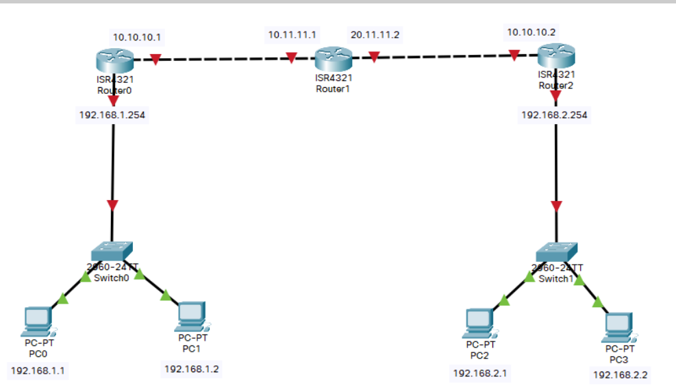
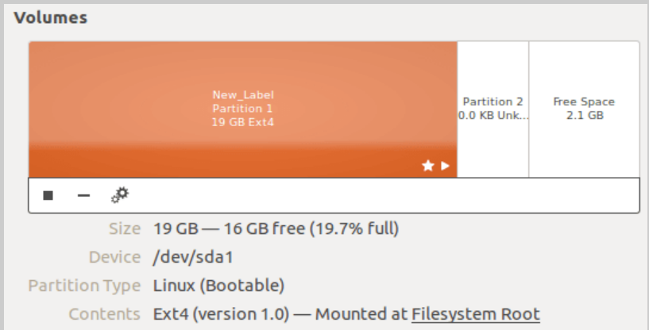
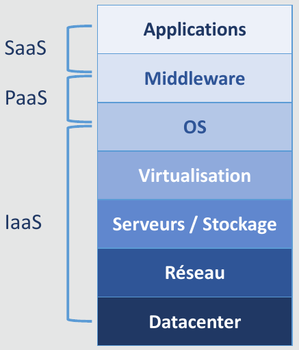
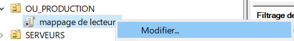
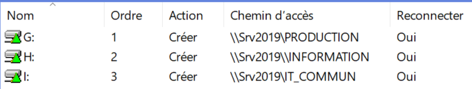
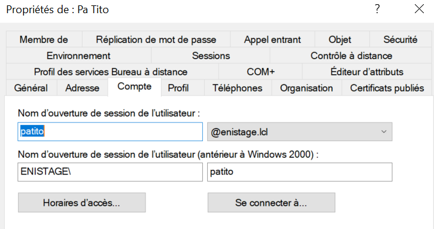
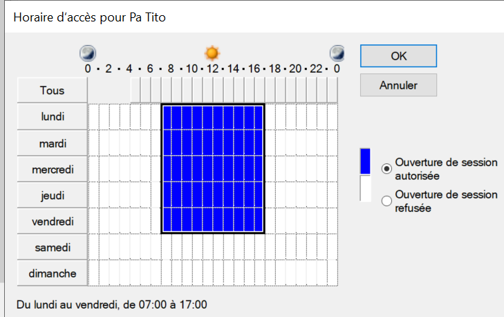
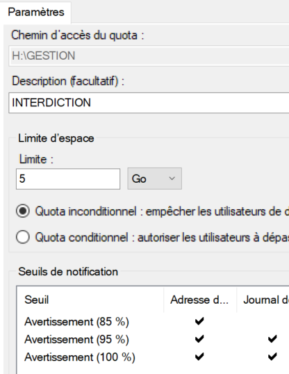

<span id="toc"></span>

## QCM Tati
### 1. MDM
<div class="is-question">
Outil centralisé de gestion d'équipement mobiles MDM : pour quoi faire + exemple
</div>

=> Intune, Microsoft Endpoint Manager [A VERIFIER]

- Déployer des mobiles rapidement
- Facilite le déploiement et la mise à jour des applications
- Réaffecte les mobiles simplement (aidé d'une solution de déploiement automatisé)
- Sécurise l'accès aux données de l'entreprise
- Déploie des applications approuvées pour se prémunir des contenus malveillants
- Impose le verrouillage automatique des terminaux
- Restreint les connections automatiques des terminaux
- Restreint les connections wifi aux points d'accès autorisés
- Protège les données entreprise dans le cadre du BYOD
- Rend étanche l'espace professionnel et le personnel
- Réduit les coûts 

<a href="#toc">Retour en haut</a>

### 2. Politique mdp
<div class="is-question">
Sécuriser les accès par mot de passe en entreprise + politique à mettre en place
</div>

- Au moins 8 caractères. L'ANSSI recommande une longueur minimum de 12 caractères.
- Des caractères spéciaux ex. ponctuation
- Des chiffres
- Des majuscules, minuscules

**ChatGPT**

<div class="chat">
- Complexité des mdp
- Renouvellement régulier
- Authentification à 2 facteurs (2FA)
- Verrouillage auto des compte après un certain nombre de connections infructueuse
- Sensibilisation à la sécurité

[BS MODE ACTIVATED]

- Gestion des privilèges de manière granulaire
- Stockage sécurisé des mots de passe
- Surveillance des activités suspectes (ex. journaux d'audit, alertes sur tentatives d'accès non autorisées)
- Politique mdp par défaut à changer, utilisateur doit changer son mdp dès sa première connection
- Éducation continue (informer aux dernieres menaces, sensibilisation à l'ingénierie sociale, meilleure pratique)
</div>

<a href="#toc">Retour en haut</a>

### 3. Avantages d'un outil de gestion de parc
<div class="is-question">
Avantages d'un outil de gestion de parc
</div>

- Diminution du temps de gestion
- Meilleure organisation
- Réduction des pertes 
- Amélioration de la comptabilité de../ressources
- Surveillance de l'état du parc informatique
- Prévention de pannes

<div class="chat">
- Centralisation des informations
- Suivi et inventaire précis
- Optimisation des../ressources : en identifiant les équipements sous-utilisés ou inutilisé 
- Maintenance proactive : fournit des alertes sur les mises à jour
- Gestion des licences
- Sécurité renforcée : facilite la gestion des correctifs de sécurité, des politiques de mots de passe (?)
- Suivi des garanties et contrats : gestion efficace des problèmes et des remplacements
- Rapport et analyses : sur les performances, les cours, les tendances d'utilisation, etc.
- Automatisation des tâches : ex. le déploiement de logiciel (ah bon ?),  les mises à jour et les sauvegardes (efficacité opérationnelle)
- Amélioration de la productivité : en réduisant le temps consacré à la gestion manuelle des actifs informatiques
</div>

<a href="#toc">Retour en haut</a>

### 4. Avantages d'un outil de gestion d'incidents
<div class="is-question">
Avantages d'un outil de gestion d'incidents
</div>

- Des opérations de travail fluides
- Une meilleure productivité
- Des utilisateurs finaux satisfaits
- Identification et prévention proactives des incidents majeurs

<div class="chat">
- Traçabilité et suivi des incidents
- Réduction des temps d'arrêt
- Priorisation des incidents
- Collaboration et communication améliorées
- Suivi des délais de résolution : garantit le respect des objectifs de niveau de service (SLA)
- Base de connaissance
- Automatisation des processus
- Analyse et rapports 
- Amélioration continue
- Satisfaction des utilisateurs
</div>

<a href="#toc">Retour en haut</a>

### 5. ITIL : différence incident / problème
<div class="is-question">
Quelle différence entre incident et problème ?
</div>

Un **incident** est une <u>dégradation ou interruption</u> imprévue du service ou réduction de la qualité du service et de la productivité des clients. Il y a donc une incidence sur le service fourni.

Un **problème** est la <u>source</u> d'un ou plusieurs incidents dont la cause fondamentale est inconnue.

<a href="#toc">Retour en haut</a>

### 6. ITIL : étapes de résolution d'incident
<div class="is-question">
Quelles sont les étapes de résolution d'incident dans une communication téléphonique
</div>

1. enregistrement de l'incident
2. catégorisation 
3. hiérarchisation
4. affectation
5. création et gestion d'une tâche 
6. gestion de SLA et réaffectation
7. résolution
8. fermeture de l'incident

<a href="#toc">Retour en haut</a>

### 7. Ex. outils collab sync/async

<div class="is-question">
Exemples d'outils collaboratifs synchrone / asynchrone
</div>

**Asynchrone** : courrier électronique, forums, liste de diffusion (Outlook) 

**Synchrone** : visioconf, chat, voip, messagerie instantanné (Teams) 

<a href="#toc">Retour en haut</a>

### 8. Excel

<div class="is-question">
formule avec une cellule en forme `$H$1`
</div>

Pour "fixer" la cellule 

**Moi**

Le signe `$` permet de verrouiller la référence. Ainsi la formule restera toujours liée à la cellule H1 quel que soit la cellule dans laquelle la formule est copiée ou déplacée.

<a href="#toc">Retour en haut</a>

### 9. Découpage sous-réseaux
<div class="is-question">
Découper le réseau 192.168.20.128/25 en 4 sous-réseaux avec les adresses de sous-réseaux, le masque, la première adresse d'hôte et les broadcast pour 2 premiers sous-réseaux.
</div>

**Moi**

- 4 sous-réseaux = sur 2 bits (2^2 = 4)
- Reste 5 bits pour les ip, donc 2^5 = 32 ip par réseau
- SR1 = 192.168.20.128/27 (Attention au /27 ! -- faut le voir en binaire)
- SR2 = 192.168.20.160/27 (+32)
- SR3 = 192.168.20.192/27 (+32)
- SR4 = 192.168.20.224/27 (+32)
- Après pour la 1e IP et le broadcast, c'est facile en partant de ça.

Donc formules :

- **2^n = x sous-réseaux**, avec n=le nb de bits nécessaires pour faire 4 réseaux (voir en binaire)
- **2^resteBits = nb d'ip dans chaque sous réseau**
- Autrement dit : **2^(32 - cidr - n)**, ex. 2^(32-25-2) = 2^(32-27) = 2^5 = 32 adr ip


**ChatGPT**

<div class="chat">
Pour découper le réseau 192.168.20.128/25 en 4 sous-réseaux, vous pouvez suivre les étapes suivantes :

1. Déterminer le nombre de bits de sous-réseau nécessaires :
   - Pour diviser le réseau en 4 sous-réseaux, vous aurez besoin de 2 bits de sous-réseau (2^2 = 4).

2. Calculer la nouvelle longueur du masque de sous-réseau :
   - Le masque de sous-réseau initial est /25, ce qui signifie qu'il y a 25 bits réservés pour l'adresse réseau.
   - Pour créer 4 sous-réseaux, vous ajouterez 2 bits de sous-réseau, ce qui portera la longueur du masque de sous-réseau à /27 (/25 + 2 = /27).

3. Répartir les adresses IP disponibles :
   - Avec le masque de sous-réseau /27, chaque sous-réseau aura 32 adresses IP disponibles.
   - Calculez les plages d'adresses IP pour chaque sous-réseau en incrémentant l'octet de l'adresse réseau de 32 à chaque fois.
     - Sous-réseau 1 : 192.168.20.128/27 (plage d'adresses : 192.168.20.129 - 192.168.20.158)
     - Sous-réseau 2 : 192.168.20.160/27 (plage d'adresses : 192.168.20.161 - 192.168.20.190)
     - Sous-réseau 3 : 192.168.20.192/27 (plage d'adresses : 192.168.20.193 - 192.168.20.222)
     - Sous-réseau 4 : 192.168.20.224/27 (plage d'adresses : 192.168.20.225 - 192.168.20.254)

Assurez-vous de réserver l'adresse réseau et l'adresse de diffusion pour chaque sous-réseau et d'allouer les adresses restantes pour les périphériques réseau.

Notez que cette méthode divise le réseau en sous-réseaux de taille égale. Si vous avez besoin d'une répartition différente des adresses IP, vous pouvez ajuster les plages en conséquence.
</div>

- SR1 : 
	+ SR1 : 192.168.20.128/27
	+ IP1 : 192.168.20.129 - ...
	+ MSK : 255.255.255.224
	+ BDT : 192.168.20.159
- SR2 :
	+ SR2 : 192.168.20.160/27
	+ IP2 : 192.168.20.161 - ...
	+ MSK : 255.255.255.224
	+ BDT : 192.168.20.191

[A REVOIR]

<a href="#toc">Retour en haut</a>

### 10. Sécuriser un réseau sans fil
<div class="is-question">
Comment sécuriser un réseau sans fil ?
</div>

- Changer le mot de passe utilisateur du routeur wifi
- L'accès à l'utilitaire de configuration est sécurisé par login & mdp
- Définir le nom du réseau (SSID)
- Activer le cryptage du réseau (clé de sécurité)
- Filter les adresses MAC

<div class="chat">
- [x] Chiffrement du réseau
- [x] Mot de passe fort pour le réseau wifi
- [ ] SSID masqué
- [x] Filtrage des adresses MAC
- [ ] Désactivation des services inutiles 
- [ ] Mise à jour régulière
- [ ] Activer un pare-feu sur le routeur 
- [ ] Réseau invité afin d'isoler le trafic des invités du réseau interne 
- [ ] Surveillance du réseau 
- [ ] Sensibilisation des utilisateurs (?) 
</div>


<a href="#toc">Retour en haut</a>

### 11. Port Switch & ToIP

<div class="is-question">
Sur quel port du switch plugger tél IP avec chargeur PoE ou pas
</div>

En principe, sur tous... selon les besoins en électricité

<div class="chat">
- S'assurer que le switch prenne en charge la fonctionnalité PoE (Power over Ethernet)
- Les ports PoE sont généralement marqués PoE (ou PoE+) ou avec le symbole du PoE
- Certains switchs peuvent avoir tous leurs ports compatibles PoE, d'autres peuvent en avoir seulement quelques uns désignés.
</div>


<a href="#toc">Retour en haut</a>

### 12. Cisco - routes statiques
<div class="is-question">
Packet Tracer : Routes statiques à ajouter sur routeur central pour communication entre PC0 et PC3
</div>

[](../ressources/img/t17.png)

```cisco
ip route 192.168.1.0 255.255.255.0 10.10.10.1
ip route 192.168.2.0 255.255.255.0 10.10.10.2
```

[REVOIR ROUTE STATIQUE DANS PT]


<a href="#toc">Retour en haut</a>

### 13. Cisco - ACL
<div class="is-question">
Rôle ACL 101 (www + 443 pour une ip externe)
</div>

<pre>access-list 101 deny host 10.0.0.1 host 10.10.0.1 eq www
access-list 101 deny host 10.0.0.1 host 10.10.0.1 eq 443
access-list 101 permit ip any any</pre>

Interdire l'accès de l'ip 10.0.0.1 à 10.10.0.1 via les ports définis et autoriser le reste :

[](../ressources/img/t18.png)

**Moi** : Faut dire ce que fait la commande ???

- La première interdit tout trafic provenant de l'adresse 10.0.0.1 vers l'adresse 10.10.0.1 sur le port 80 (HTTP)
- La seconde interdit tout trafic provenant de l'adresse 10.0.0.1 vers l'adresse 10.10.0.1 sur le port 443 (HTTPS)
- La dernière autorise tout autre trafic. Cette commande est à la fin car les commandes sont exécutées de manière séquentielle.

<div class="chat">
Cette séquence de commandes Cisco configure une liste de contrôle d'accès (ACL) numérotée 101. Voici ce que chaque ligne de commande signifie :

1. `access-list 101 deny host 10.0.0.1 host 10.10.0.1 eq www` : Cette commande indique que tout trafic provenant de l'adresse IP source 10.0.0.1 et destiné à l'adresse IP de destination 10.10.0.1 sur le port www (80) est interdit (bloqué).

2. `access-list 101 deny host 10.0.0.1 host 10.10.0.1 eq 443` : Cette commande indique que tout trafic provenant de l'adresse IP source 10.0.0.1 et destiné à l'adresse IP de destination 10.10.0.1 sur le port 443 (HTTPS) est interdit (bloqué).

3. `access-list 101 permit ip any any` : Cette commande autorise tout autre trafic IP provenant de n'importe quelle source et destiné à n'importe quelle destination. Cela permet de permettre le trafic non spécifié dans les deux règles de refus précédentes.

En résumé, cette liste de contrôle d'accès (ACL) numéro 101 bloque spécifiquement le trafic provenant de l'adresse IP 10.0.0.1 et destiné à l'adresse IP 10.10.0.1 sur les ports www (80) et 443 (HTTPS), tandis que tout autre trafic IP est autorisé.
</div>

<a href="#toc">Retour en haut</a>

### 14. Web
<div class="is-question">
Comment accéder au server HTTPS de façon sécurisée depuis internet ? 

(schéma avec internet + firewall + DMZ + serveur interne)
</div>

- Il faut faire du NAT au niveau du pare-feu, puis éventuellement des ACL. 
- Le site internet devra être certifié par une authorité de certification publique, ou à défaut par un certificat numérique autosigné.

**Moi** : pas de reverse-proxy ?

<a href="#toc">Retour en haut</a>

### 15. Intérêt de mettre à jour le matériel réseau

<div class="is-question">
Quel est l'intérêt de mettre à jour le firmware d'un matériel réseau ?
</div>

- Correction d'une faille de sécurité, un problème technique, de comptabilité ou de fonctionnement important
- Améliore les performances
- Apporte de nouvelles fonctionnalités

<div class="chat">
- Correction d'une faille de sécurité
- Amélioration des fonctionnalités
- Correction des bugs et des problèmes de compatibilité
- Conformité aux normes et aux protocoles 
- Optimisation des performances
</div>

<a href="#toc">Retour en haut</a>

### 16. Hyperviseur - intérêt cluster
<div class="is-question">
Quel est l'intérêt de mettre des hyperviseurs en cluster ?
</div>

- Haute disponibilité 
- Tolérance aux pannes
- Sécurisation des données
- Répartition de la charge

**Moi**

- Partage des../ressources
- Répartition de la charge
- ...

**IMPORTANT ! REVOIR LA DEFINITION DE "HAUTE DISPONIBILITÉ**

**ChatGPT**

<div class="chat">
Mettre des hyperviseurs en cluster présente plusieurs avantages significatifs :

1. Haute disponibilité : les machines virtuelles peuvent être réparties sur plusieurs nœuds physiques. En cas de défaillance matérielle ou d'incident sur un nœud, les machines virtuelles peuvent être automatiquement migrées vers d'autres nœuds du cluster, assurant ainsi une haute disponibilité des services sans interruption.

2. Tolérance aux pannes : Grâce à la fonctionnalité de migration en temps réel, les hyperviseurs en cluster peuvent détecter les pannes matérielles ou les problèmes de performances sur un nœud spécifique. Les machines virtuelles peuvent être rapidement déplacées vers d'autres nœuds fonctionnels, garantissant ainsi la continuité des opérations sans interruption de service.

3. Équilibrage de charge entre les noeuds du cluster : Cela optimise l'utilisation des../ressources et évite la surcharge d'un seul nœud, assurant ainsi des performances équilibrées et une utilisation efficace des../ressources disponibles.

4. Gestion centralisée : Les administrateurs peuvent utiliser une console de gestion commune pour déployer, surveiller et administrer les machines virtuelles réparties sur différents nœuds, simplifiant ainsi la gestion et réduisant la complexité opérationnelle.

5. Évolutivité : L'ajout de nouveaux nœuds à un cluster d'hyperviseurs permet d'augmenter la capacité de calcul et de stockage disponible pour les machines virtuelles. Cela permet de faire face à la croissance des besoins en../ressources sans perturber les opérations existantes, offrant ainsi une évolutivité flexible et rapide.

6. Maintenance planifiée sans interruption : Les machines virtuelles peuvent être migrées en douceur vers d'autres nœuds du cluster avant la maintenance, évitant ainsi les temps d'arrêt prévus et assurant la continuité des opérations.

7. Récupération après sinistre : En répliquant les machines virtuelles sur des nœuds distants ou des sites géographiquement séparés, le cluster offre une redondance géographique et permet la reprise rapide des services en cas de catastrophe ou de panne majeure.

En combinant ces avantages, la mise en place d'un cluster d'hyperviseurs offre une infrastructure robuste, flexible et résiliente pour les environnements de virtualisation, garantissant une disponibilité élevée, une tolérance aux pannes et une gestion efficace des../ressources.
</div>

<a href="#toc">Retour en haut</a>

### 17. Hyperviseur - Outil de sauvegarde de VM
<div class="is-question">
Citer un outil de sauvegarde de VM depuis un hyperviseur ?
</div>
 
- Veeam pour Hyper-v
- Hyper-V Backup
- UCover pour Hyper-V et VMware ESXi

**ChatGPT**

<div class="chat">
Un outil populaire de sauvegarde de machines virtuelles depuis un hyperviseur est **Veeam Backup & Replication**. Il offre des fonctionnalités avancées de sauvegarde, de restauration et de réplication pour les environnements virtuels, prenant en charge différents hyperviseurs tels que VMware vSphere et Microsoft Hyper-V.
</div>

<a href="#toc">Retour en haut</a>

### 18. Hyperviseur - perf dégradées
 
<div class="is-question">
Dans un cluster d'hyperviseurs, un d'eux affiche des performances dégradées (ou charge élevée). Quelle serait la solution ?
</div>

=> Basculer les vm sur un autre hyperviseur

Le problème peut venir de l'état de dégradation du cluster. Regarder les events, les alarmes, les logs, etc. 
Ca peut être d'un défaillance matérielle ou une islation de réseau (?). Verifier si le noeud défaillant est mis sous tension.

Peut être une défaillance de la réplication... 

**Moi** : gné?!

**ChatGPT**

<div class="chat">
Si l'un des nœuds d'un cluster d'hyperviseurs affiche des performances dégradées ou une charge élevée, voici quelques solutions possibles :

1. Équilibrage de charge : Vérifiez si la charge de travail est répartie de manière équilibrée entre les nœuds du cluster. Vous pouvez déplacer certaines machines virtuelles d'un nœud surchargé vers d'autres nœuds moins sollicités afin de répartir la charge de manière plus équitable.

2. Allocation de../ressources : Assurez-vous que les../ressources telles que le CPU, la mémoire et le stockage sont correctement allouées aux machines virtuelles. Réévaluez et ajustez si nécessaire les allocations de../ressources pour répondre aux besoins spécifiques des machines virtuelles et réduire la charge sur le nœud affecté.

3. Identification des goulots d'étranglement : Analysez les performances du nœud affecté pour identifier les goulots d'étranglement potentiels. Cela peut inclure des../ressources spécifiques surchargées, des processus ou des machines virtuelles consommant excessivement des../ressources. Une fois identifiés, vous pouvez prendre des mesures pour optimiser l'utilisation des../ressources ou ajuster les configurations.

4. Mise à jour du matériel ou de l'infrastructure : Si les performances dégradées persistent malgré les ajustements, envisagez d'examiner le matériel sous-jacent ou l'infrastructure réseau. Il est possible que des mises à niveau matérielles, des correctifs de micrologiciels ou des optimisations du réseau soient nécessaires pour améliorer les performances globales du cluster.

5. Surveiller et diagnostiquer : Utilisez des outils de surveillance et de diagnostic pour suivre les performances du nœud affecté et identifier les problèmes potentiels. Cela peut inclure des outils fournis par votre plateforme d'hyperviseur ou des solutions tierces. Les données de surveillance peuvent aider à identifier les goulots d'étranglement et à prendre des mesures appropriées.

6. Planification des opérations : Si la charge élevée est due à des opérations spécifiques, telles que des sauvegardes, des migrations ou des mises à jour, assurez-vous de les planifier de manière à minimiser l'impact sur les performances du nœud et des autres machines virtuelles du cluster.

En appliquant ces mesures, vous devriez être en mesure de résoudre les problèmes de performances dégradées ou de charge élevée sur un nœud spécifique d'un cluster d'hyperviseurs, assurant ainsi un équilibre optimal des../ressources et une continuité des opérations efficace.
</div>

**Résumé**

- Equilibrage des charges
- Allocation de../ressources
- Identification des goulots d'étranglement
- Mise à jour du matériel ou de l'infra
- Surveiller et diagnostiquer
- Planification des opérations

<a href="#toc">Retour en haut</a>

### 19. Linux - nom disque
<div class="is-question">
Si on ajoute un nouveau disque (voir image), quel sera son nom ?
</div>

[](../ressources/img/t19png)

Si c'est un nouveau disque physique, le nouveau nom sera `/dev/sdb`.

<a href="#toc">Retour en haut</a>

### 20. Linux - permissions
<div class="is-question">
Sous Linux, un utilisateur n'a pas d'accès à un répertoire (`ls -l .. permission denied`). Quel est le problème et quelle serait la solution ?
</div>

**tati** :

Il n'a pas les droits d'accès au répertoire. Solution : `sudo chmod` sur le repertoire, ou ajout à un groupe adapté.

**Moi** :

- Voir les permissions, si possible
- Voir le proprio du groupe, lui demander de donner au moins les permissions en lecture/execution à `other` (sudo chmod o+rx -R mondossier)
- Sinon ajouter l'utilisateur au groupe propriétaire du répertoire

**Re-Moi (après tests)**

Problème : l'utilisateur n'a pas les droits en lecture et en execution qui lui permettraient de lister le contenu du répertoire.

3 Solutions : disons que c'est l'utilisateur `toto` qui veut accéder au dossier appartenant à `www-data:www-data`

1. Ajouter "toto" au groupe propriétaire du dossier 

```sh
sudo usermod -g www-data toto
```

2. Modifier les droits d'accès "other" du répertoire

```sh
sudo chmod o+rx foo/
```

3. Modifier le ownership du groupe pour le donner au groupe de "toto"

```sh
sudo chown :toto foo/
``` 

<a href="#toc">Retour en haut</a>

### 21. Comment sécuriser SSH
<div class="is-question">
Comment sécuriser une connection SSH ?
</div>

- Changer le port par défaut
- Donner des adresses ip pour permission 
- Modifier le temps de changement de clé de chiffrement
- Authentification multi-facteur

<div class="chat">
- Utiliser des clés d'authentification: Au lieu d'utiliser uniquement des mots de passe, configurez l'authentification basée sur des clés SSH. Générez une paire de clés (une clé publique et une clé privée) sur votre ordinateur local, et ajoutez la clé publique au fichier authorized_keys sur le serveur distant. Cela rend l'authentification plus forte et élimine les risques liés aux mots de passe.
- Désactiver l'accès root
- [x] Utiliser des ports non standards
- [x] Utiliser des règles de pare-feu: limiter les connections à certaines adresses IP
- Mettre à jour régulièrement SSH
- Surveiller les journaux d'authentification: activer la journalisation des events d'authentification SSH
- Limiter les droits des utilisateurs
- Utiliser un logiciel de detection d'intrusion
</div>


<a href="#toc">Retour en haut</a>

### 22. Procédure création master & déploiement

<div class="is-question">
Décrivez une procédure de création d'un master et son déploiement.
</div>

- Préparation de l'OS sur le serveur de déploiement avec les .wim et redémarrage de la machine pour boot UEFI en PXE (Pre boot eXecution Environment)
- Préparation de l'OS hôte, installation de logiciels, des pilotes, redémarrage de la machine pour boot en PXE sur un env de prévoit type WinPE. 
- Séléction de l'image de capture distribuée par le serveur WDS (sysprep et capture)
- Ajout de cette image dans le deployment share WDS
- Mise à jour du deployment share
- Création d'une séquence de tach approprié
- Boot d'un machine hôte en PXE
- Selection du nouveau master à déployer

**Moi** : gné?!

**ChatGPT**

<div class="chat">
Voici une procédure de base pour la création d'un master et son déploiement en utilisant Sysprep :

1. Configuration du master :
   - Installez le système d'exploitation sur une machine dédiée qui servira de master.
   - Personnalisez le système d'exploitation en installant les logiciels, les pilotes et les paramètres de configuration spécifiques requis.
   - Effectuez toutes les configurations nécessaires, telles que les paramètres réseau, les politiques de sécurité, les paramètres régionaux, etc.
   - Ne rejoignez pas le master à un domaine pour éviter les conflits lors du déploiement sur d'autres machines.

2. Utilisation de Sysprep :
   - Exécutez l'outil Sysprep fourni par le système d'exploitation sur le master. Sysprep prépare le système pour la duplication et le déploiement sur d'autres machines.
   - Sélectionnez les options appropriées dans Sysprep pour généraliser le système, supprimer les informations spécifiques au master, tels que le nom d'utilisateur, les SID (Security Identifiers), les clés de produit, etc.
   - Configurez Sysprep pour arrêter le système après le traitement.

3. Capture de l'image du master :
   - Utilisez un outil de capture d'image, tel que Windows Deployment Services (WDS), Microsoft Deployment Toolkit (MDT), ou un logiciel tiers tel que Clonezilla, pour capturer l'image du master.
   - Suivez les étapes de l'outil de capture d'image pour créer une image du système d'exploitation généralisé et prêt à être déployé.

4. Déploiement des instances :
   - Utilisez l'image capturée pour déployer des instances supplémentaires.
   - Utilisez à nouveau l'outil de déploiement ou la méthode de votre choix pour déployer l'image sur d'autres machines.
   - Lors du déploiement, chaque instance nouvellement créée sera configurée avec des paramètres uniques, tels que le nom de l'ordinateur, l'adresse IP, etc.

5. Personnalisation des instances déployées :
   - Une fois les instances déployées, personnalisez-les en fonction des besoins spécifiques. Cela peut inclure la configuration des paramètres réseau, l'installation de logiciels supplémentaires, l'ajout aux domaines, etc.

6. Maintenance continue :
   - Assurez-vous de maintenir et de mettre à jour régulièrement le master et les instances déployées. Cela inclut l'application des correctifs de sécurité, les mises à jour logicielles et la surveillance des performances.

L'utilisation de Sysprep simplifie le déploiement en permettant de créer une image généralisée du système d'exploitation qui peut être déployée sur d'autres machines avec des paramètres personnalisés. Cela facilite la gestion et la mise à l'échelle des déploiements.
</div>

<a href="#toc">Retour en haut</a>

### 23. Avantage màj centralisée
<div class="is-question">
Quels sont les avantages d'un service de mise à jour centralisé ?
</div>

- Contribue à la protection des données sensibles qui circulent sur le réseau de l'entreprise
- Réduit le coût poour les matériels et les logiciels matériaux
- Diminue le coût global d'exploitation et de MCO (Maintien en Condition Opérationnelle) du parc des serveurs

<div class="chat">
1. Gestion simplifiée : une seule interface to rule them all
2. Gain de temps : màj peuvent être déployées simultanément sur plusieurs systèmes
3. Cohérence et uniformité : mêmes màj pour tout le monde
4. Sécurité renforcée : màj récentes pour tous = faille sécurité patché plus tôt pour tous
5. Suivi et conformité : une seule interface permet de suivre facilement, mise en conformité plus simple (derniers patchs)
6. Réduction des interruptions : màj peuvent être planifiée de façon à minimiser les interruptions de service
7. Economie de bande passante : les màj sont téléchargées une seule fois sur un emplacement centralisé puis distribuées aux systèmes internes.
</div>


<a href="#toc">Retour en haut</a>

### 24. Inconvénient client léger vs poste fixe
<div class="is-question">
Quels sont les inconvénients d'un terminal léger comparé à un poste fixe ?
</div>

- Consommation réseau importante
- Non applicable à tous les logiciels
- Achat d'un serveur

**ChatGPT**

<div class="chat">
1. Dépendance réseau     : les terminaux légers ont impérativement besoin d'une connection réseau pour accéder aux applications et aux données
2. Performance limitée   : les terminaux légers ont généralement une puissance de traitement et des capacités de stockage limitées par rapport à un poste fixe
3. Dépendance du serveur : les TL reposent sur un serveur centralisé pour le traitement des applications. Si le serveur rencontre des problèmes, cela impacte tous les TL.
4. Dépendance des application : les TL peuvent avoir des limitations en termes de compatibilité avec certaines applications ou logiciels spécifiques.
5. Cout initial plus élevé ? les TL sont moins chers que les PF à l'achat mais nécessite un serveur centralisé robuste et des infra réseaux solides, ce qui peut entraîner des coûts supplémentaires que n'ont pas les PF
</div>


<a href="#toc">Retour en haut</a>

### 25. Identifier types de VPN (image)
<div class="is-question">
Quels sont les types de VPN ? (voir image)
</div>

[](../ressources/img/t20.png)

Celui du haut = VPN Nomade
Celui du bas  = VPN Site-to-Site

**ChatGPT** (Hors-Sujet)

<div class="chat">
1. VPN d'accès à distance (Remote Access VPN) : des utilisateurs individuels de se connecter à un réseau privé
2. VPN Client-Serveur (Client-to-Server VPN) : client individuel se connecte à un réseau privé
3. VPN MPLS (Multiprotocol Label Switching) : pour les réseaux d'entreprise
4. VPN Extranet 
5. VPN de niveau opérateur
6. VPN basé sur le cloud
</div>


<a href="#toc">Retour en haut</a>

### 26. Echange de clés
<div class="is-question">
Echange de clés / certificat entre Bob et Valérie... (pas trop de souvenir)
</div>

- Asymétrique : clé privéé/clé publique
- Symétrique : même clé pour le chiffrement/déchiffrement

<div class="chat">
1. Asymétrique : Les systèmes asymétriques, également appelés cryptographie à clé publique, utilisent une paire de clés distinctes : une clé publique et une clé privée. La clé publique est partagée avec les autres parties pour le chiffrement des données, tandis que la clé privée est conservée secrètement par le propriétaire pour le déchiffrement des données. Cela permet des échanges de clés sécurisés et des authentifications numériques grâce à la vérification des signatures électroniques.

2. Symétrique : Les systèmes symétriques, également appelés cryptographie à clé secrète, utilisent une seule clé partagée entre les parties pour le chiffrement et le déchiffrement des données. La même clé est utilisée à la fois pour le chiffrement et le déchiffrement. Cela permet des opérations de chiffrement et de déchiffrement plus rapides, mais nécessite un échange sécurisé de la clé secrète entre les parties prenantes.

En résumé, les systèmes asymétriques utilisent une paire de clés distinctes (clé publique et clé privée) pour le chiffrement et le déchiffrement des données, tandis que les systèmes symétriques utilisent une seule clé partagée entre les parties. Les systèmes asymétriques sont souvent utilisés pour des fonctionnalités telles que l'authentification numérique et la signature électronique, tandis que les systèmes symétriques sont utilisés pour des opérations de chiffrement et de déchiffrement rapides et efficaces.
</div>


<a href="#toc">Retour en haut</a>

### 27. Texte en anglais à traduire en français


<a href="#toc">Retour en haut</a>

### 28. SNMP
<div class="is-question">
Quelle communauté peut modifier la configuration SNMP ? (illustration)
</div>

Il y avait un résultat avec un groupe en RO et un autre en RW, donc la communauté serait celle en RW et no RO.

<div class="chat">
La communauté qui peut modifier la configuration SNMP est généralement l'administrateur ou l'équipe de gestion du réseau. Ces personnes sont responsables de la configuration et de la gestion des dispositifs réseau, y compris la configuration des paramètres SNMP. L'accès à la configuration SNMP peut être restreint aux personnes autorisées pour des raisons de sécurité.
</div>


<a href="#toc">Retour en haut</a>

### 29. Infos à surveiller sur un commutateur
<div class="is-question">
Infos à surveiller sur un commutateur de couche accès
</div>

- La bande passante
- Le port sur lequel est connecté + IP
- L'interface voir si elle est UP ou DOWN
- L'adresse MAC
- La charge électrique si c'est un switch PoE


<div class="chat">
1. Utilisation des ports : port actif, inactif + conso de bande passante
2. Trafic réseau : trafic entrant et sortant pour évaluer la charge réseau
3. Erreurs sur les ports : collisions, paquets perdus
4. Etats des liens : id liens inactifs, actifs, défectueux
5. Tables d'adresses MAC : detecte attaques par MAC Spoofing
6. Consommation des../ressources : cpu, mémoire tampon, etc. Détection pb de surcharge
7. Sécurité : journaux d'activité, alertes de sécurité pour tentatives d'accès non autorisées
</div>


<a href="#toc">Retour en haut</a>

### 30. Nagios swap full critique
<div class="is-question">
Capture d'écran Nagios swap full critique à 100%. Que faire ?
</div>

- Vider le swap
- Augmenter la taille du swap
- Augmenter la RAM

**Moi** : qu'est-ce que ça signifie ? Que faire ? (revoir cours de quoi ?)

**ChatGPT**

<div class="chat">
Nagios est un logiciel de surveillance open-source utilisé pour la supervision et la gestion des systèmes et réseaux.

Signifie que tous les services surveillés par Nagios sont en état critique.

[donne des solutions génériques, rien de concret]

</div>


<a href="#toc">Retour en haut</a>

### 31. PaaS IaaS SaaS (schéma à compléter)
<div class="is-question">
Un schéma à compléter
</div>

[](../ressources/img/t21.png)

<a href="#toc">Retour en haut</a>

### 32. IaaS vs PaaS
<div class="is-question">
Différence entre IaaS et PaaS
</div>

- IaaS (Infrastructure as a Service) est l'infrastructure du Cloud
- PaaS (Platform as a Service) est une plateforme ajoutée à l'IaaS prenant en charge des middlewares (logiciels intermédiaires)

**ChatGPT**

<div class="chat">
PaaS (Platform as a Service) et IaaS (Infrastructure as a Service) sont deux modèles de services cloud qui offrent différentes niveaux d'abstraction et de contrôle sur l'infrastructure informatique. Voici les principales différences entre PaaS et IaaS :

Infrastructure as a Service (IaaS) :

- IaaS fournit une infrastructure informatique virtuelle de base, telle que des serveurs virtuels, du stockage et des réseaux, sur lesquels les utilisateurs peuvent déployer leurs propres systèmes d'exploitation et applications.
- Les utilisateurs ont un contrôle plus granulaire sur l'infrastructure, ce qui leur permet de gérer et de configurer les serveurs, les réseaux et les systèmes d'exploitation.
- Les utilisateurs sont responsables de l'installation, de la configuration et de la gestion des logiciels et applications sur l'infrastructure fournie.
- IaaS est adapté aux développeurs et aux administrateurs système qui ont besoin d'une flexibilité et d'un contrôle approfondi sur l'infrastructure sous-jacente.

Platform as a Service (PaaS) :

- PaaS fournit une plateforme de développement et de déploiement d'applications complète, comprenant l'infrastructure sous-jacente, les systèmes d'exploitation, les services de développement et les outils.
- Les utilisateurs peuvent se concentrer sur le développement et le déploiement des applications, sans avoir à se soucier de la gestion de l'infrastructure sous-jacente.
- Les fonctionnalités et les services prédéfinis sont fournis par la plateforme, tels que la gestion de bases de données, la mise à l'échelle automatique, la gestion des versions, etc.
- PaaS est adapté aux développeurs d'applications qui veulent se concentrer sur la création d'applications sans se préoccuper de l'infrastructure ou des détails de gestion.

En résumé, IaaS se concentre sur la fourniture d'une infrastructure de base virtualisée, tandis que PaaS offre une plateforme complète pour le développement et le déploiement d'applications. IaaS offre plus de contrôle et de flexibilité, tandis que PaaS offre une abstraction plus élevée et une plus grande simplicité pour les développeurs d'applications.
</div>


<a href="#toc">Retour en haut</a>

## MSP Tati

<a href="#toc">Retour en haut</a>

### 1. Intervention sur le serveur AD

Ouvrez la VM WinServer et connectez-vous avec le compte `administrateur` (`P@ssw0rd`)

<a href="#toc">Retour en haut</a>

#### 1er Demande

Le script suivant (**network-drive.bat**) permet de connecter automatiquement les lecteurs réseaux des utilisateurs. Il est déployé par la GPO **network-drive-mount** depuis l'UO "**Production**".

```powershell
<a href="#toc">Retour en haut</a>

## Création des lecteurs réseaux sur poste de travail
net use G:\SERVAD01.TSSR.INFO\PRODUCTION 
net use H:\SERVAD01.TSSR.INFO\INFORMATIONS
net use I:\SERVAD01.TSSR.INFO\IT_COMMUN
```
	
De nombreux appels au service Support ont été enregistrés : les lecteurs n'étaient pas montés.

Votre travail consiste à trouver et créer un autre type de stratégie pour connecter les lecteurs réseaux.


<a href="../ressources/img/t01.png" target="_blank"></a>
<a href="../ressources/img/t02.png" target="_blank"></a>
<a href="../ressources/img/t03.png" target="_blank"></a>
<a href="../ressources/img/t04.png" target="_blank"></a>

<a href="#toc">Retour en haut</a>

#### 2e demande

Vous devez mettre en place une série de mesures limitant la connection de l'utilisateur Sylvie BIGALKE afin qu'elle puisse se connecter qu'à partir de son poste de travail (**PC-CLIENT01**) et uniquement pendant les horaires d'ouverture des bureaux (7h-17h du lundi au vendredi


<a href="../ressources/img/t05.png" target="_blank"></a>
<a href="../ressources/img/t06.png" target="_blank"></a>
<a href="../ressources/img/t07.png" target="_blank"></a>


<a href="#toc">Retour en haut</a>

#### 3e Demande

La quantité de données stockées dans le dossier partagé "Gestion" doit être contrôlée.

Votre travail consiste à appliquer un modèle de quotas selon les critères suivants (Gestionnaire de../ressources du serveur de fichiers) :

- Avertissement de l'utilisateur et de l'administrateur à partir de 4 Go de stockage
- Interdiction d'écrire au-delà de 5 Go

ATTENTION ! Le serveur de messagerie n'est pas configuré sur cette plateforme, donc vous pouvez mettre en place l'avertissement mais pas le tester. **Ne tenez pas compte d'éventuels messages d'erreur à ce sujet**.


<a href="../ressources/img/t08.png" target="_blank"></a>
<a href="../ressources/img/t09.png" target="_blank"></a>
<a href="../ressources/img/t10.png" target="_blank"></a>

Il est recommandé de créer des **quotas** uniquement à partir de modèles. De cette façon, vous pouvez facilement gérer vos quotas en modifiant les modèles plutôt que les quotas individuels. Le seul emplacement central pour la gestion des quotas facilite l'adoption de règles de stratégie de stockage.

<a href="../ressources/img/t11.png" target="_blank"></a>
<a href="../ressources/img/t12.png" target="_blank"></a>
<a href="../ressources/img/t13.png" target="_blank"></a>
<a href="../ressources/img/t14.png" target="_blank"></a>

Et modifier ou ajouter l'avertissement à 80%, ce qui correspondra au 4 Go.

<a href="../ressources/img/t15.png" target="_blank"></a>

<a href="#toc">Retour en haut</a>

### 2. Adaptation de scripts
<a href="#toc">Retour en haut</a>

#### 1e demande : remplacer les commentaires
Remplacer dans ce script les commentaires `#xxx` par un commentaire qui explique ce que fait la ligne ou le paragraphe en dessous. 

```bash
#condition.sh

#!/bin/bash

age=18

if [ $age = "18" ]; then
	echo "vous êtes majeur"
fi
```
(ceci est un exemple)


<a href="#toc">Retour en haut</a>

#### 2e Demande : modifier un script
Vous devez rendre maintenant votre script générique. 

- Le nom du fichier à prendre en compte sera passé en paramètre
- Vous devez pouvoir executer le script de cette manière (ex.)

```bash 
$ importUser.sh ./eleve.txt
$ importUser.sh ./classe1.txt
```

<a href="#toc">Retour en haut</a>

### 3. Intervention sur serveur Linux
<a href="#toc">Retour en haut</a>

#### 1e demande : changer le port SSH sur un serveur
Afin d'améliorer la sécurité de l'accès SSH à votre serveur, vous devez changer le port TCP de ce service pour qu'il soit accessible sur le port 26.

<div class="is-success">Dans le fichier **/etc/ssh/sshd_config** changer le numéro de port</div>

<a href="../ressources/img/t16.png" target="_blank"></a>

<a href="#toc">Retour en haut</a>

#### 2e Demande : permission sur un fichier
Le site intranet se trouve sur le serveur **SRVLX02**.

Un fichier **LisezMoi** présent dans votre home vous indique où se trouve ce site et quel serveur HTTP est installé. 

Faites en sorte que le webmaster qui se connecte sur ce serveur avec le compte **webmaster** (**P@ssw0rd**) puisse modifier les fichiers du site et qu'il soit le seul à pouvoir le faire.

```bash
# cd /root
# ls -l
# cat LisezMoi
```

<div class="is-success">
Une fois le chemin du site web /var/www/... et modifier les droits (chmod 764) et modifier aussi l'ownership (`chown`) des fichiers, et du même pour fichier **webmaster**. 

Après se connecter avec webmaster... A vérifier
</div>

Moi : alors c'est pas tout à fait ça, refaire la manip vite fait histoire d'être sûr.


<a href="#toc">Retour en haut</a>

### 4. Téléphonie
- Ouvrir les VM **IPBX** et **PC_CLIENT01**.
- Pour ces manipulations, 2 softphones seront utilisés : un sur chacun des windows client (phy...)
- Il est impératif de désactiver le son de vos postes de travail pour préserver le silence.
- Le softphone de l'utilisateur **Serge KESSLER** est configuré sur la VM. Son numéro est le **102**.

<a href="#toc">Retour en haut</a>

#### 1e Demande : IPBX ???
Votre travail consiste à créer la ligne 110 et à la mettre en service pour l'utilisatrice **Sofia K** - softphone de votre machine physique (sic)

[...]


<link rel="stylesheet" type="text/css" href="../ressources/css/bootstrap.min.css">
<link rel="stylesheet" type="text/css" href="../ressources/css/style.css">
<link rel="stylesheet" type="text/css" href="../ressources/css/headings.css">


<style>
.is-success {	
	font-family: Roboto, sans-serif;

	font-style: normal;
	font-variant: normal;
	font-weight: 400;
	letter-spacing: normal;
	line-height: 24px;
	text-decoration: rgb(27, 94, 32);
	text-align: start;
	text-indent: 0px;
	text-transform: none;
	vertical-align: baseline;
	white-space: normal;
	word-spacing: 0px;
	
	background-attachment: scroll;
	background-color: rgb(232, 245, 233);
	background-image: none;
	background-position: 0% 0%;
	background-repeat: no-repeat;
	color: rgb(27, 94, 32);
	
	border: ;
	border-top: 0px none rgb(129, 199, 132);
	border-right: 0px none rgb(129, 199, 132);
	border-bottom: 0px none rgb(129, 199, 132);
	border-left: 55px solid rgb(129, 199, 132);
	margin: 16px 0px;
	padding: 0px 16px 16px;
	max-height: none;
	min-height: 0px;
	max-width: none;
	min-width: 0px;
	
	position: relative;
	top: 0px;
	bottom: 0px;
	right: 0px;
	left: 0px;
	float: none;
	display: block;
	clear: none;
	z-index: auto;
	
	list-style-image: none;
	list-style-type: disc;
	list-style-position: outside;
	
	border-collapse: separate;
	border-spacing: 0px 0px;
	caption-side: top;
	empty-cells: show;
	table-layout: auto;
	
	overflow: visible;
	cursor: auto;
	visibility: visible;
	
	transform: none;
	transition: all 0s ease 0s;
	box-sizing: border-box;
	resize: none;
	text-shadow: none;
	text-overflow: clip;
	word-wrap: normal;
	box-shadow: none;
	border-top-left-radius: 8px;
	border-top-right-radius: 8px;
	border-bottom-left-radius: 8px;
	border-bottom-right-radius: 8px;
}

.is-question {	
	font-family: Roboto, sans-serif;

	font-style: normal;
	font-variant: normal;
	font-weight: 400;
	letter-spacing: normal;
	line-height: 24px;
	text-decoration: rgb(13, 71, 161);
	text-align: start;
	text-indent: 0px;
	text-transform: none;
	vertical-align: baseline;
	white-space: normal;
	word-spacing: 0px;
	
	background-attachment: scroll;
	background-color: rgb(227, 242, 253);
	background-image: none;
	background-position: 0% 0%;
	background-repeat: no-repeat;
	color: rgb(13, 71, 161);
	
	border: ;
	border-top: 0px none rgb(100, 181, 246);
	border-right: 0px none rgb(100, 181, 246);
	border-bottom: 0px none rgb(100, 181, 246);
	border-left: 55px solid rgb(100, 181, 246);
	margin: 16px 0px;
	padding: 0px 16px 16px;
	max-height: none;
	min-height: 0px;
	max-width: none;
	min-width: 0px;
	
	position: relative;
	top: 0px;
	bottom: 0px;
	right: 0px;
	left: 0px;
	float: none;
	display: block;
	clear: none;
	z-index: auto;
	
	list-style-image: none;
	list-style-type: disc;
	list-style-position: outside;
	
	border-collapse: separate;
	border-spacing: 0px 0px;
	caption-side: top;
	empty-cells: show;
	table-layout: auto;
	
	overflow: visible;
	cursor: auto;
	visibility: visible;
	
	transform: none;
	transition: all 0s ease 0s;
	box-sizing: border-box;
	resize: none;
	text-shadow: none;
	text-overflow: clip;
	word-wrap: normal;
	box-shadow: none;
	border-top-left-radius: 8px;
	border-top-right-radius: 8px;
	border-bottom-left-radius: 8px;
	border-bottom-right-radius: 8px;
}

</style>
