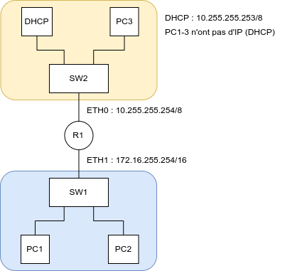
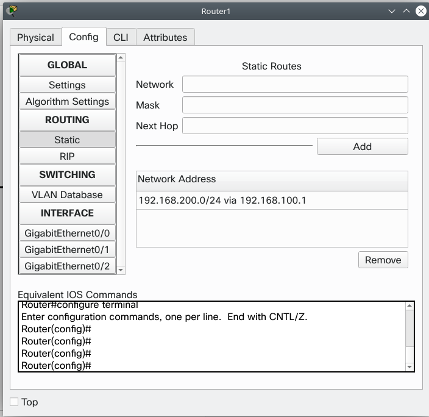
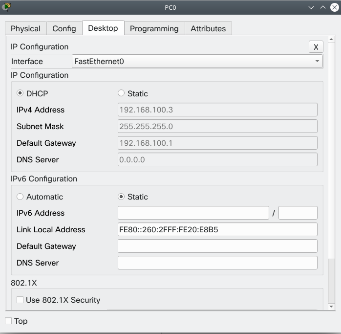

# Notes Réseau Packet Tracer

[TOC]

## Mise en place d'un DHCP Relais
Source : https://www.it-connect.fr/mise-en-place-dun-agent-relais-dhcp/



### 1. Activer l'interface VLAN 1 sur tous les switches
Procédure à effectuer sur tous les switches.

clic sur **Switch** > onglet **CLI** > <kbd>ENTREE</kbd>

```cisco
switch> enable                                   # passer en mode SU
switch# configure terminal                       # passer en mode config
switch(config)# interface vlan 1                 # accès à config vlan
switch(config-if)# no shutdown                   # activer interface
switch(config-if)# exit 
switch(config)# exit 
switch# copy running-config startup-config       # enregistrer la config
<ENTREE>
```

### 2. Configurer le serveur DHCP

- clic **DHCP** > onglet **DESKTOP** > **IP Configuration**
- bouton **Static** > entrer IP fixe du DHCP + son masque + IP du routeur (Gateway)

- onglet **Services** > **DHCP**
- Configurer les pools d'adresses qu'il distribuera à ses différents clients. Autrement dit, il faut renseigner les 2 réseaux qu'il devra servir.

Ici :

| Quoi       | Réseau 1       | Réseau 2       | serverPool     |
|:-----------|:---------------|:---------------|:---------------|
| Nom (str)  | 10.0.0.0/8     | 172.16.0.0/16  | serverPool     |
| Gateway    | 10.255.255.254 | 172.16.255.254 | 0.0.0.0        |
| DNS srv    | 0.0.0.0        | 0.0.0.0        | 0.0.0.0        |
| Start IP   | 10.0.0.10      | 172.16.0.10    | 10.0.0.10      |
| Subnet     | 255.0.0.0      | 255.255.0.0    | 255.0.0.0      |
| Max number | 50             | 50             | 50             |
| TFTP srv   | 0.0.0.0        | 0.0.0.0        | 0.0.0.0        | 


Il faut modifier les plages par défaut car elle ne peut pas être supprimer.

ATTENTION au remplissage automatique des plages "Start IP". Toujours vérifier.

Ajouter mask + start ip à serverPool (qui est la config par défaut, insupprimable) pour que les machines du réseau du DHCP trouvent leur passerelle.

### 3. Configurer les interfaces du routeur

1. Attribuer une IP à l'interface ETH0 et ETH1
2. Ajouter l'IP HELPER sur ETH1 (172.16.0.0) en lui renseignant l'IP du DHCP.

Grâce à l'option **IP Helper** le routeur pourra relayer la trame de diffusion au serveur DHCP.

ATTENTION on ajoute l'**IP Helper** sur l'interface du coté où il n'y a pas de serveur DHCP.

```cisco
# Attribution d'ip sur interface ETH0

Routeur# configure terminal
Routeur(config)# interface fastEthernet 0/0
Routeur(config-if)# ip address 10.255.255.254 255.0.0.0
Routeur(config-if)# no shutdown
Routeur(config-if)# exit

# Attribution d'ip sur interface ETH1 + IP Helper

Routeur(config)# interface fastEthernet 1/0
Routeur(config-if)# ip address 172.16.255.254 255.255.0.0
Routeur(config-if)# ip helper-address 10.255.255.253           # on lui donne l'ip du DHCP
Routeur(config-if)# no shutdown
Routeur(config-if)# exit
Routeur(config)# exit
Routeur# copy running-config startup-config
```

### 4. Tester
clic sur un **PC** > onglet **DESKTOP** > **Ip Configuration** > cocher **DHCP** > attendre...

Ca peut prendre du temps...

## Un seul DHCP pour 2 réseaux

Appliquer la méthode ci-dessus.


## Un seul DHCP pour 3 réseaux


**Plan d'action**

1. Router : attribuer IP static
2. DHCP : 
	+ attribuer IP static
	+ activer service DHCP 
	+ ajouter serverPool (réseaux visés + leur passerelle)
3. Switch : activer interface **vlan 1**
4. Router : 
	+ routage static (router les réseaux hors-de-portée
	+ ajouter ip helper (ip du DHCP)
5. Machine : activer l'ip par DHCP (ip config)

### 1. Routeur
#### Attribuer IP static
- clic Routeur > onglet **CLI** 

```cisco
Routeur> enable
Routeur# configure terminal
Routeur(config)# interface GigabitEthernet 0/1 
Routeur(config-if)# ip address 10.17.16.1 255.255.240.0
Routeur(config-if)# end
Routeur(config-if)# exit
Routeur(config)# exit
Routeur# copy running-config startup-config
```

### 2. DHCP
#### Attribuer une IP static au serveur DHCP

- clic **Serveur** > onglet **Services** > **DHCP** > **ON**
- entrer **nom** + **IP** + **Subnet** + **Start ip address** puis **Save** (serverPool)
- onglet **Desktop** > entrer **IP**, **masque** et **Gateway**

**ex. de Server Pool**

| Quoi       | Réseau 1       | Réseau 2         | Réseau 3         | serverPool     |
|:-----------|:---------------|:-----------------|:-----------------|:---------------|
| Nom (str)  | 10.17.16.0/20  | 192.168.100.0/24 | 192.168.200.0/24 | serverPool     |
| Gateway    | 10.17.16.1     | 192.168.100.1    | 192.168.200.1    | 192.168.200.1  |
| DNS srv    | 0.0.0.0        | 0.0.0.0          | 0.0.0.0          | 0.0.0.0        |
| Start IP   | 10.17.16.0     | 192.168.100.0    | 192.168.200.0    | 192.168.200.0  |
| Subnet     | 255.255.240.0  | 255.255.255.0    | 255.255.255.0    | 255.255.255.0  |
| Max number | 4000           | 250              | 250              | 250            |
| TFTP srv   | 0.0.0.0        | 0.0.0.0          | 0.0.0.0          | 0.0.0.0        | 


### 3. Switch
#### Activer le VLAN 1 sur *chaque* switches
- clic sur un Switch > onglet **CLI**

```cisco
switch> enable
switch# configure terminal
switch(config)# interface vlan 1
switch(config-if)# no shutdown
switch(config-if)# end
switch(config-if)# exit
switch(config)# exit
switch# copy running-config startup-config
```

### 4. Routeur (bis) 
Enregistrer les routes statiques sur chaque routeur, afin qu'ils connaissent la porte d'entrée des réseaux qui ne leur sont pas adjacents.

#### Routage via GUI
- onglet **Config** > **Routing** > **Static**
- Remplir les infos
	+ Network  : 10.17.16.0
	+ Subnet   : 255.255.240.0
	+ Next hop : 192.168.100.254

Sera noté `10.17.16.0/20 via 192.168.100.254`


 

#### Routage via CLI
- clic Routeur > onglet **CLI**

```cisco
Router> enable
Router# configure terminal
Router(config)# ip route <ip du réseau à atteindre> <son masque> <passerelle pour y aller>
Router(config)# ip route 192.168.200.0 255.255.255.0 192.168.100.254
Router(config)# end
```

#### Ajout de l'ip du DHCP (`ip helper-address`)
Permet au routeur lointain de connaître l'ip du DHCP.

ATTENTION à sélectionner l'interface qui reçoit le broadcast de la requête au DHCP. Ici, c'est l'interface G0/1 sur le Routeur 1 (la gatewat du réseau qui n'a pas de DHCP.

```cisco
Router> enable
Router# configure terminal
Router(config)# interface GigabitEthernet 0/1
Router(config-if)# ip helper-address <ip du DHCP>
Router(config-if)# ip helper-address 192.168.200.2
Router(config-if)# end
Router(config-if)# exit
Router(config)# exit
Router# copy running-config startup-config
```

### 5. Les PC
Activer l'IP par DHCP sur chaque machine de tous les réseaux.

- clic sur PC > onglet **Desktop** > **IP Configuration** > radio **DHCP**



