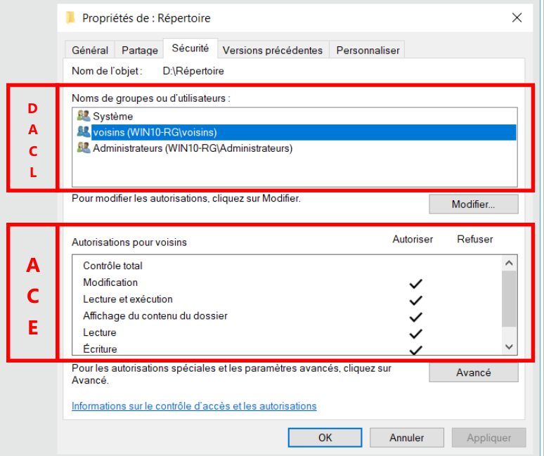
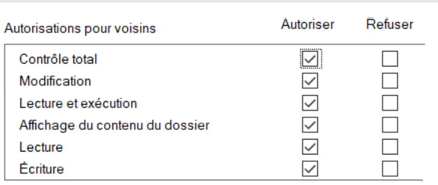
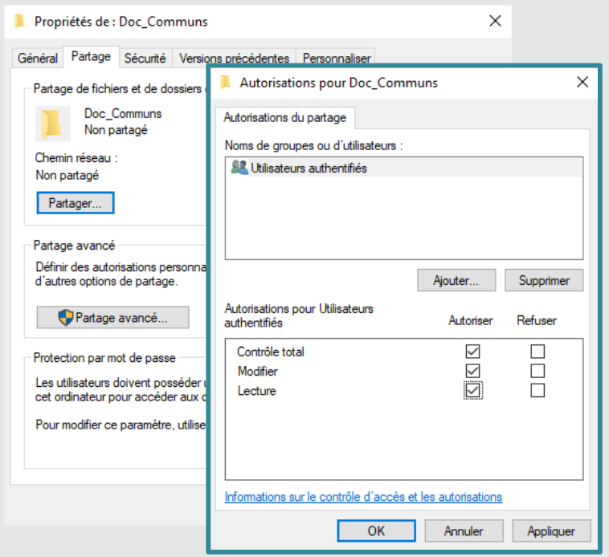
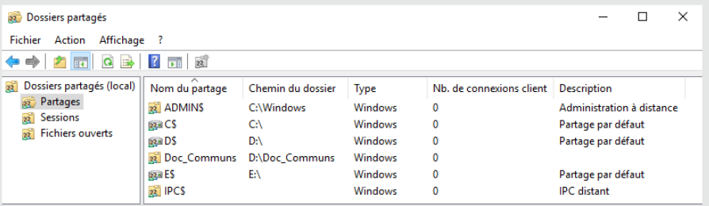
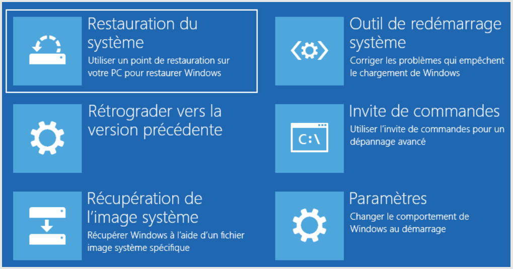

title: 03-notes

# ENI 03 - Services Client Windows

<table class="formateur">
	<tbody>
		<tr>
			<th scope="row">Date</th>
			<td>du 13/12 au 24/12/2021</td>
		</tr>
		<tr>
			<th scope="row">Formateur</th>
			<td>Jordan RONSAULT</td>
		</tr>
	</tbody>
</table>

[TOC]

## Mod 1 - Les OS & Windows 10
### Définition
Un système d'exploitation (OS) est un logiciel qui pilote les dispositifs matériels et reçoit des instructions de l'utilisateur ou d'autres logiciels (ou application).

### Composition OS
- un noyau
- un interprète de commande 
- une interface graphique
- un système de fichier

### Fonctions principales
- gérer les processeurs et la RAM
- optimiser l'execution des applications en leur attribuant les ressources
- fournir des info sur le fonctionnement de la machine
- utiliser les périphériques dans les meilleures conditions
- protéger l'accès aux ressources

### Vocabulaire
- KB Knowledge Base : correctif de sécurité, fonctionnalités
- SP Service Pack : ensemble de KB
- Release : MàJ majeure

Win7 : fin en janv 2020
Win8 : fin en jan 2023

**WaaS Windows as a Service**

- Windows Insider : communauté de beta-tester de win10
- Build : version de win10 id par un numero (ex. 1903, 21H2). Support de 18 mois.
- Feature updates : mise à dispo d'une nouvelle build. 2 par an (majeure au printemps, mineur à l'automne)
- Quality updates : mise à jour de qualité (patch de sécurité, bugfix). Tous les 2e mardis du mois (le *patch tuesday*)

### Les Licences Windows
**Notes**: la version Win Famille ne peut pas être mis dans un domaine.

- **OEM** Original Equipment Manufacturer 	: préinstallée, liée à la machine
- **Retail** 								: Vente au détail (boîte ou numérique). Licence liée à l'utilisateur, sinstalle sur un poste
- **MAK** Multiple Activation Key 			: une licence pour plusieurs poste clients
- **VLK** Volume Licence Key 				: pour déployer les systèmes clients. Nécessite le service KMS (Key Manager Service) et plus de 25 postes
- **CAL** Client Access Licence 			: licence permettant au client de solliciter le service d'un serveur microsoft

## Aparté virtu

un ordi c'est minimum:
- 1 proc
- de la ram
- un dd
- une carte réseau

Hyperviseur est indispensable à la virtualisation. fait le lien entre hôte et vm. Sous la forme d'un logiciel ou d'un OS

### Les differents types de réseaux
Les switchs sont virtuels :

- Host-Only 
- VMnet et Lan Segment
- Bridge
- NAT (translation d'adresse)

Workstation justte bon pour maquettage, pas pour de la prod.

## Mod 2 - Installation de win10
Les 64 Bits c'est quoi ? 
- adaptation de l'OS aux évolution des composants (meilleures perf)
- prise en compte native de plus de 4 Go de RAM
- meilleure protection du systeme car necessite des pilotes signés

Un mini OS est requis pour installer Windows
- os leger pour installer/réparer windows
- dispo dans le fichier boot.wim du support d'installation

### TP01 - Installation de Win10

- Installation d'une VM win10 pro
- Importation d'une VM Win11

Outil natif permettant d'enregistrer les clic et les écrans : **psr** (Step Recorder) est a disposition depuis Executer.

## Mod 3 - Intéragir avec win10
**Objectifs**
- Intéragir avec le système
- Découvrir l'IHM
- Administrer le systeme en CLI
- Démarrer avec PowerShell

### CLI & Powershell
#### CLI

```cmd
> help shutdown
> shutdown /?
```

- `/` : option
- **quotes** permettent de convertir les caractères spéciaux en caractères alphanumériques 
- `>` : redirection de flux. Ex. `help shutdown > aide.txt`

**Notation** :

```

COPY [/D] [/V] [/N] [/Y | /-Y] [/Z] [/L] [/A | /B ] source [/A | /B]
     [+ source [/A | /B] [+ ...]] [cible [/A | /B]]
```

- `foo` : obligatoire
- `[foo]` : facultatif
- `{foo}` : choisir un élément parmi ceux présents
- `|` : pipeline (séparateur d'éléments)
- `...` : éléments qui peuvent être répétés et utilisés plusieurs fois

### TP02 - Prise en main de l'interface graphique
pass

### TP03 - Prise en main de la cmd

```ps1
REM mkdir
cmd> md CommandList

REM Create file (x2)
cmd> echo > foo.txt
cmd> help > InternalCommands.txt

REM Afficher contenu du fichier
cmd> type InternalCommands.txt

REM Copy to desktop
cmd> copy InternalCommands.txt %userprofile%\Desktop 

REM List folders and subfolders ordered by size
cmd> dir /os /s %userprofile%\Desktop
```

- `dir /o` : order + `s` pour ordre par taille croissante
- `dir /s` : +subfolders

### Powershell

- Langage de script orienté objet. S'appuie sur les bibliothèques .NET Framework.
- Console Graphique ISE (integrated Scripting Environment), pour manipuler les scripts.
- Des outils tiers existent et ressemblent  différentes consoles dans le même environnement (windows terminal, VSCode)

La variable d'env `$PSVersionTable` est une variable tableau des versions de PowerShell.

- PSVersion : version de powershell dispo sur le système
- PSCompatibleVersioons : rétro-compatibilité

Les commandes de ps sont appelées les **cmdlets**.
- constituées d'un **verbe** et d'un **nom** séparé par un `-`
- verbes les plus courants: `Get`, `Set`, `Remove`, `Add`, `New`
- Les noms dépendent du contexte d'utilisation : `LocalUser`, `NetAdapter`, `Alias`, `variable`, etc.

**Exemple**

```powershell
Get-Alias            REM affiche liste des alias
New-LocalUser        REM crée un nouvel utilisateur local dans l'ordinateur
```

#### Aide de Powershell
A besoin d'être mise à jour mais attention, il y a une file d'attente

- Mise à jour en ligne `Update-Help`, ajouter `-force`pour outrepasser la limite d'1 màj par jour

```powershell
Update-Help [-force]
```

- Mise à jour hors ligne (pré-requis: posséder un dépot local) : `Update-help -SourcePath \\chemin\vers\aide\powershell -UIculture en-US -credential <login>`

Attention les traductions en FR sont pourraves et incomplètes.

- Aide est accessible depuis :

```powershell
Get-Help <recherche>
Help <recherche>         REM affiche l'aide page par page
Man <recherche>          REM alias de Help
<recherche> -?           REM dispo depuis tous les cmdlets
```

**Exemples**:

<dl>
	<dt><code>Get-Help Disable-LocalUser</code></dt>
	<dd>Affiche l'aide sur la cmdlet passée en arg</dd>
	<dt><code>Help help</code></dt>
	<dd>Affiche aide page par page</dd>
	<dt><code>Man about_Variables</code></dt>
	<dd>Affiche le manuel d'utilisation des variables PowerShell, page par page</dd>
</dl>

##### Astuces

<dl>
	<dt><code>Get-help -examples &lt;recherche&gt;</code></dt>
	<dd>n'affiche que les examples d'utilisation d'une cmdlet</dd>
	<dt><code>Get-help -ShowWindow &lt;recherche&gt;</code></dt>
	<dd>affiche l'aide complète dans une fenêtre séparée</dd>
	<dt><code>Get-help -Online &lt;recherche&gt;</code></dt>
	<dd>affiche l'aide à jour détaillée disponible sur les serveurs Internet Microsoft (web browser requis)</dd>
</dl>

##### Cmdlet de base et objets
Constitution d'un objet :
- des propriétés
- des méthodes

Exemple avec un object monBallon.

###### Afficher des caractéristiques de l'objet

- Afficher certaines propriétés de l'objet et leur valeurs associées. Toutes les autres propriétés sont présentes mais cachées pour faciliter la lecture

```powershell
get-monBallon
```

- Afficher toutes les propriétés de l'objet et leurs valeurs associées

```powershell
get-monBallon | select *
```

- Affiche seulement les propriétés demandées et leurs valeurs associées

```powershell
get-monBallon | select diametre,forme,couleur
```

- Affiche la propriété *description* de l'objet **monBallon** et sa valeur. Equivaut à `get-monBallon|select description`

```powershell
(get-monBallon).description
```

##### Get-Command
La commande la plus importante à connaître. Permet de découvrir toutes les commandes disponibles.

```powershell
get-command           REM liste toutes les commandes
get-command get-*     
get-command *printer*
get-command new-*user*
```

Une fois ma commande trouvée, utiliser get-help pour en savoir plus.

##### Modifier un object monBallon

```powershell
REM Modification
set-monBallon -nom "Basket" -description "Ballon de basket"

REM Création
new-monBallon -nom "Rugby" -Forme "ovale" -Couleur "blanc" -Description "Ballon de rugby"

REM Delete
Remove-monBallon -Nom "Football"
```


### TP04 - Premier pas avec PowerShell

- Quelle version de Powershell ?

```powershell
$PSVERSIONTABLE
```

- Afficher le contenu d'un repertoire

```powershell
ls
dir
get-childitem
```

- Afficher la liste des alias dans Powershell

```powershell
REM Correction
get-alias -Definition get-childitem

REM Moi
get-alias | where-object ResolvedCommand -like get-childitem
```

- Afficher contenu d'un fichier foo.txt

```powershell
cat foo.txt
type foo.txt
more foo.txt
REM less ne fonctionne pas 
foo.txt
get-content foo.txt
```

### TP05 - Manipuler l'aide de Powershell

- Afficher l'aide complète de la cmdlet Get-Alias

```powershell
get-help -full get-alias
```

- Différence sur Win11 : oui parce que l'update-help a été faite sur win10.
- Màj dépot local (mettre vm en bridge pour avoir accès au net). Attention c'est le login AD machine hôte

```powershell
update-help -SourcePath \\ad.campus-eni.fr\Campus\distrib\depot\powershell -UICulture en-us -Credential rlizot2019
```

- obtenir les exemples de get-help

```powershell
get-help -examples get-help
```

- afficher la liste de tous les concepts disponibles et utilisables

```powershell
get-help about_*
```

- en apprendre plus sur le concept d'alias

```powershell
get-help -showwindow about_alias
```

- The aliases you create are saved only in the current session
- Aliases can be imported/exported
- historique de commande : `get-history`
- nombre maxi de ligne d'historique conservée définie dans la variable `$MaximumHistoryCount`. Valeur par défaut : 4096 (lignes)
- modifiée cette valeur :

```powershell
ps> get-history -count <int32>
```

### TP06 - Devenir autonome avec PowerShell
- afficher les commandes disponibles sur le systeme

```powershell
ps> get-command
```

- afficher seulement les cmdlets

```powershell
ps> get-command -type cmdlet
ps> get-command -comndtype cmdlet
```

- afficher seulement les cmdlets commençant par get

```powershell
ps> get-command -commandtype cmdlet | where Name -like get*
ps> get-command -commandtype cmdlet [-Name] get*  
```

- afficher la liste des groupes locaux présents sur le système

```powershell
ps> get-command *group*         REM recherche
ps> get-localgroup              REM trouvé
```

- quelles sont les 2 propriétés des groupes locaux que le système affiche par défaut : **Name**, **Description**
- afficher les autres propriétés des groupes locaux qui ne sont pas affichés par le systeme 

```powershell
ps> get-localgroup | select *       REM solution 1
ps> get-localgroup | format-list    REM solution 2
```

- Afficher SID etsource principale du groupe **Utilisateurs du bureau à distance**
```
ps> get-localgroup - name *bureau*distance | select SID,PrincipalSource
```

#### Win11
- afficher les disques dur de la vm ? combien de disques ?

```powershell
REM Moi
ps> get-command *drive*
ps> get-psdrive -provider filesystem

REM correction
ps> get-command *disk*
ps> get-disk
```

- afficher numéro et modele des disques

```powershell 
ps> get-disk | select Number, Model
```

- Afficher seulement le nom, le type de bus et le fabricant du disque no. 2

```powershell
REM Moi
ps> get-disk | select Name, BusType, Manufacturer | where Number -like 2

REM Correction
ps> get-disk -Number 2 | select Name, BusType, Manufacturer
```

- afficher nom, status, edescription duu pilote de l'adaptateur réseau de la vm

```powershell
ps> get-netadapter | select name, status, driverdescription
```

- afficher les membres du groupe local Administrateurs de lal vm

```powershell
ps> get-localGroupMember administrateurs
```

## Mod 4 - Gestion du stockage

Partitionner un disque consiste à séparer un dsque en plusieurs portion logiques, étanches et indépendantes.

### table de partition
- détermine les caracteristiques des partitions du disque
- "sommaire" du disque

Table de partition au format MBR

- master boot record
- format historique
- lecture du mbr par le bios
- stocké sur le premier secteur du disque  (512o)
- 4 partitions maximum
- ne gere pas les disques de plus de 2.2 To
- compatible avec les os 32 & 64 bits

### Partitionnement
#### partitionnement de base
- possibilité d'étendre une partition grâce à l'espace libre contigu
- 4 partitions maximum. Pour plus de partition, il faut faire des partitions logiques (partition étendue)

Partition étendue = partition physique contenant des partitions logiques

Le MBR ne connaît que les partitions physiques et sait l'existence de partitions logiques

#### partitionnememnt dynamique
- evolution du disque de base
- les partitions contenues dans une partition dynamiques s'appellent des volumes (chez microsoft) et c'est un faux amis
- possibilité d'étendre les partitions sur des espaces non-contigus. Permet de gérer les disques par ensemble (RAID)
- Convertir un disque de base en disque dynamique ? Pas de perte de données.

#### Partitionnement GPT
Table de partitionnement au format GPT
- GUID partition table
- nouveau format qui gomme les inconvénients du MBR
- dupliqué sur plusieurs secteurs du disque
- lecture du GPT par l'UEFI (évolution du Bios depuis 2013)
- taille maxi des partitions : 256 To
- seulement compatibles avec les OS 64bits et les puces UEFI

[NDLR: reprendre les schemas du cours p39 et avant]

### Les systèmes de fichiers
- formater une partition ou un lecteur logique, c'est installer un système de fichiers
- le FS organise les données. Une partition ou un lecteur logique formaté s'appelle un volume
- Plusieurs FS existent

#### NTFS
- FS par défaut chez microsoft
- nativement sécurisé (ACL Acces Control List)
- chiffrement intégré (EFS)
- compression intégrée 
- support des fonctionnalités supplémentaires
- taille maxi du volume 256 To

#### FAT16/FAT32
- File Allocation Table
- Historique standard
- pas d'ACL
- volume de 4 Go maxi
- non sécurisé nativement

#### ReFS
- Resilient File System
- evolution de NTFS
- taille des volumes quasi illimitée
- correction proactive des erreurs

#### etc.
- ext4, VMFS, UDF... et des dizaines d'autres

### Les disques durs virtuels
- VHD (Virtual Hard Drive) et VHDX
- bootable (monter le fichier disque comme une iso pour acceder à son contenu)
- taille fixe et dynamique
- manipulable comme un fichier
- montable comme un iso
- disque dur virtuel par defaut pour hyper-v

### Stockage et GUI
#### Les outils de gestion

- Avec la console graphique **diskmgmt.msc**
- Avec **diskpart** pour la gestion en CLI
- Avec PowerShell

##### powershell

<dl>
<dt><code>Get-disk</code></dt>
<dd>relever le numero du nouveau disque</dd>

<dt><code>initialize-disk -number</code></dt>
<dd>par défaut en GPT. Il faut préciser le paramètre <code>-PartitionStyle MBR</code> pour la rétrocompatibilité</dd>

<dt><code>New-partition -disknumber &lt;numero&gt; -UseMaximumSize -AssignDriveLetter</code></dt>
<dd>on peut assigner la lettre apres avec <code>set-partition -diskNumber &lt;numero&gt; -PartitionNumber &lt;numero&gt; -NewDriveLetter &lt;newLetter&gt;</code></dd>

<dt><code>format-volume -DriveLetter &lt;lettre&gt;</code></dt>
<dd>format en NTFS par défaut<br>Votre volume est prêt à l'utilisation</dd>
</dl>

### TP07 - Gestion du stockage
#### utilisation de diskmgmt.msc
Rien de nouveau

#### utilisation de diskpart
Ouvrir PS ou CMD en admin et lancer `diskpart`
- formater la 3e partition de 15Go en NTFS. La nommer **COMMUN**, assigner une lettre au choix.
- étendre le volume **COMMUN** en utilisant l'espace libre restant sur le **disque 1**
- supprimer le volume **DATA**
- recréer le volume **DATA** avec l'ensemble de l'espace libre de deux disques

Voir [Déroulement verbatim](./tp07-diskpart.html)

**Résumé**

```
C:\Windows\system32>diskpart

DISKPART> list disk
DISKPART> select disk 1

DISKPART> list volume
DISKPART> select volume 1

# FORMAT + LABEL
DISKPART> format fs=ntfs label="COMMUN" quick

# ASSIGNER LETTRE
DISKPART> assign letter=Q

# EXTEND COMMUN
DISKPART> select disk 1
DISKPART> extend

# REMOVE DATA
DISKPART> select volume 3
DISKPART> remove                   (supprime la lettre du lecteur)
DISKPART> select disk 0
DISKPART> select volume 3
DISKPART> assign letter=D
DISKPART> delete volume

# RECREATION OF "DATA" VOLUME
DISKPART> select disk 1
DISKPART> create volume simple disk=1
DISKPART> assign letter=D
DISKPART> format fs=ntfs label="Data" quick
DISKPART> extend disk=2
```

#### Investigation sur la VM win11 avec Powershell
- afficher le numéro, la taille et le type de table de partitionnement des disques durs présents sur la VM

```powershell
REM Moi
ps> get-partition | select DiskNumber, Size, Type

REM Correction (la bonne solution)
ps> get-disk | select DiskNumber, PartitionStyle, Size
```

- afficher la lettre de lecteur le nom, la taille totale des volumes qui possèdent un FriendlyName

```powershell
REM Moi
ps> get-volume | select DriveLetter, FileSystemLabel, Size, SizeRemaining
```
- attribuer le nom "SYSTEM" au disque C:

```powershell
REM Moi
ps> set-volume -DriveLetter "C" -NewFileSystemLabel "SYSTEM"
```

#### Bonus: sur la vm win10
Sur le lecteur ARCHIVE, créer des repertoires et des fichiers. Convertir le format du systeme de fichiers de FAT32 à NTFS sans perte de données.

```
REM Boucle
cmd> for($i=0;$i -lt 8;$i++) { md rep$i; echo $i > file$i.txt }

REM Formatage (/v:verbose)
cmd> convert A: /fs:nfts /v    
```

## Mod 5 - Les utilisateurs et les groupes
Les objets utilisateurs et groupes :
- notions d'uitilisateur
- les profil utilisateurs
- les groupes
- le contrôle de compte utilisateurs

### Utilisateurs
#### Accès au SI validé par 
- couple login + mdp
- biométrie (Windows Hello)
- objet tiers (carte à puce, badge, etc.)
- 2e authentification possible dans certains contexte spécifique (SMS, mail)

#### Utilisateur local
- Propre à chaque machine
- stocké dans la bdd locales SAM ( Base Security Account Manager)
- l'user ne peut pas exploiter que les ressources de l'ordinateur source

#### Utilisateur du domaine
- stocké dans la bdd commune (annuaire Active Directory). Sur un serveur de l'entreprise (controleur de domaine) ou chez un prestataire (Microsoft Azure)
- authentification KKerberos sécurisée par le réseau
- un user peut ouvrir une session sur toutes les machines du domaine
- un user (local, de domaine) est identifiée par le système grâce à son SID (Security IDentifier)

#### Ouverture de session
- pour les user locaux 
	+ utiliser un compte present dans la base SAM
	+ sont affichés par défaut sur l'ecran d'accueil
- pour les user du domaine
	+ jonction du poste au domaine de l'entreprise indispensable au préalable
	+ domaine sélectionné par défaut (possibilité de changer de domaine)

### Categories d'utilisateurs
- Standard : 
	+ pour utiliser les ressources du pc
	+ être membre du groupe **Utilisateurs**
- Administrateur
	+ pour utiliser et modifier les ressources du pc
	+ être membre du groupe **Administrateurs**
	+ l'utilisateur créé à l'installation du système est membre du groupe **Administrateurs**
	+ le compte *administrateur* est désactivé par défaut
- Le compte Invité
	+ pour une utilisation restreinte des ressources du pc
	+ pas besoin de mdp pour accèder aux ressources
	+ ce compte est desactivée par défaut

### TP08 - Les utilisateurs et les groupes
#### CMD.EXE
- Afficher les infos du user account François

```ps1
cmd> net user françois
```

- Afficher les membres du groupe Administrateurs

```ps1
cmd> net localgroup administrateurs
```

- Créer un utilisateur ROMAIN avec mdp. Attention le mdp ne devra pas être visible en CLI

```ps1
cmd> net user Romain * /ADD
```
(prompt pour mdp + confirmation)

- Ajouter Romain au groupe L_Responsables

```ps1
cmd> net localgroup L_Responsables Romain /ADD
```

- Afficher le SID du current user, puis les SID des groupes dont il est membre

```ps1
cmd> whoami /USER
cmd> whoami /USER /GROUPS
```

#### POWERSHELL sur WIN11
- Afficher la liste des utilisateurs sur le systeme (nom, sid, description)

```ps1
ps> get-localuser | select name,sid,description
```

- Afficher les informations suivantes pour l'utilisateur James

```ps1
ps> get-localuser james | select fullname, name, description, objectclass, lastlogon 
```

- Ajouter la description "Compte générique avec privilèges d'administration"

```ps1
ps> set-localuser -Name "adm" -Description "Compte générique avec privilèges d'admin"
```
ATTENTION, il y a une limite de 50 caractères en powershell mais que sur la description, ici.

- Afficher le nom et le SID des membres du groupe local L_SupportInfo

```ps1
ps> get-LocalGroupMember -Name "L_SupportInfo" | select name,sid
```

**Bonus** : Création d'utilisateur

```ps1
ps> $pswd=Read-Host -AsSecureString
ps> New-LocalUser "francois" -Password $pswd -FullName "François" -Description "Responsable Info" -UserMayNotChangePassword -PasswordNeverExpires
ps> Add-LocalGroupMember -Group "L_Reesponsables" -Member "francois"
```


```ps1
ps> new-localuser "francois" -Password $mdp -FullName "François" -UserMayNotChangePassword -PasswordNeverExpires
ps> new-localuser "romain" -Password $mdp -FullName "Romain" -UserMayNotChangePassword -PasswordNeverExpires
ps> new-localuser "yann" -Password $mdp -FullName "Yann" -UserMayNotChangePassword -PasswordNeverExpires
ps> new-localuser "voisin1" -Password $mdp -FullName "Voisin" -UserMayNotChangePassword -PasswordNeverExpires
ps> new-localuser "voisin2" -Password $mdp -FullName "Voisin" -UserMayNotChangePassword -PasswordNeverExpires

ps> new-localgroup L_Responsables
ps> new-localgroup L_Voisins
ps> new-localgroup L_Informatique

ps> Add-LocalGroupMember -Group "L_Responsables" -Member "francois" 
ps> Add-LocalGroupMember -Group "L_Informatique" -Member "francois" 
ps> Add-LocalGroupMember -Group "Administrateurs" -Member "francois"

ps> Add-LocalGroupMember -Group "L_Voisins" -Member "voisin1"
ps> Add-LocalGroupMember -Group "L_Voisins" -Member "voisin2"

ps> Add-LocalGroupMember -Group "L_Responsables" -Member "romain"
```

**Bonus 2**: Vos voisins pourront ouvrir une session uniquement du lundi au vendredi entre 9h et 17h

```ps1
ps> net user voisin1 /time:l-v,9:00,17:00
```

Oui, les jours sont en français...

## Mod 6 - La sécurité NTFS et les ACL

- NTFS = New Technology File System
- ACL = ?


Sur un volume formaté en NTFS :

- tous les repertoires et tous les fichiers sont soumis à la sécurité NTFS
- des **autorisations** définissent des **privilèges d'accès**
- l'utilisateur présente son **jeton d'accès**, qui est **filtré** par la ressource
- les autorisations sont stockées dans l'index du système de fichier NTFS
- consultable, modifiable dans l'**onglet sécurité** de chaque objet

### Permissions

**L'onglet Sécurité**

- accessible via les propriétés d'un objet
- **DACL** (Liste des contrôles d'accès discretionnaire)
- les DACL filtrent les groupes locaux, les groupes prédéfinis (généralement Administrateurs ou Utilisateurs), les entités de sécurités, les utilisateurs
- **ACE** (Access Control Entry) privilèges d'accès du groupe en question



- Pour les **besoins courants**, les ACE de base sont utilisées et cumulatives
- Configurable depuis le menu modifier
	+ **Lecture** : affichage, lecture, lecture et execution
	+ **Modification** : ecriture, modification
	+ **Contrôle total**



- Pour les **besoins spécifiques**, des autorisations spéciales peuvent être configurées (via menu Avancé). 
	+ Permet d'affiner les privilèges (création de fichier, suppression de subfolder, etc)

**Permissions basées sur des règles explicites**

- un groupe absent de la DACL se verra l'accès refusé (refus implicite)
- chaque règle peut accorder des privilèges (autoriser) ou les ôter (refuser)
- plusieurs règles d'accès peuvent s'appliquer à un même utilisateur (la règle la plus permissive l'emporte)
- le refus explicite l'emporte sur l'autorisation

### Héritage

**Heritage**

- Par défaut, un répertoire propage ses autorisations à ses objets enfants. 
- Les autorisations héritées apparaissent grisées et ne sont pas modifiables.
- Une autorisation d'accès l'emporte sur un refus explicite hérité.

Pour les modifier, il faut

- modifier les autorisations sur le dossier parent (voir parfois celles du volume racine) 
- "casser" l'héritage (à effectuer avec précaution)
 
### Copie

Que se passe-t-il lors de la copie ? Du déplacement ?

|   | Au sein d'une même partition/volume | Entre 2 partitions/volumes |
|:--|:------------------------------------|:---------------------------|
| Déplacement | **Conservation** | Héritage |
| Copie | Héritage | Héritage | 

Une fois les ACL configurées, que faire ?
- tester les accès avec les utilisateurs
- et/ou vérifier les accès depuis l'onglet **Accès Effectif** du menu **Avancé**

- A manipuler avec précaution
- Bonne pratiques pour éviter les effets de bord et les mauvaises surprises
	+ privilégier les groupes dans les DACL
	+ utiliser au max ACE de base
	+ garder en tête les mécanismes d'héritage (attention aux copies, aux déplacements)
	+ privilégier l'héritage
	+ privilégier le refus implicite
	+ toujours tester/vérifier les accès aux ressources
	+ attention au double jeton d'accès des administrateurs

**Conclusion**

- La gestion des ACL est indispensable
- ACL = DACL + ACE
	+ liste de controle d'accès
	+ liste de contrôle d'accès discrétionnaire
	+ entrées de contrôle d'accès
- Tester les accès
- Respecter les bonnes pratiques Microsoft


**Notes**: Toujours passer par des groupes, ne jamais ajouter un utilisateur directement dans un DACL

### TP09 - NTFS & ACL

#### VM Win10 - GUI
**Objectif**: Sur la VM win10, configurer les autorisations d'accès sur les dossiers donnés.

Sur le volume **DATA**, créer le dossier **Echange**.

- Quelles sont les autorisations positionnées par défaut sur le dossier Echange .
	+ utilisateur authentifiés (autoriser)
	+ systeme (controle total)
	+ administrateur (control total)
	+ utilisateur (lecture & exe + affichage + lecture)

- Configurer les autorisations d'acces du dossier Echange
	+ Les voisins pourront modifier tous les objets et sous-objets du dossier
	+ Les admin auront le controle total
	+ Les utilisateurs du poste auront les droit en lecture
	+ Tester

**Notes** :
- Desactiver l'héritage pour pouvoir modifier les permissions
- Modifier "Utilisateurs authentifiés" (CORRECTION : supprimer complètement)


- Sur volume TOOLS, créer les dossiers "logiciels" et "manuels d'utilisation"
	+ Yann et François ont les droits en modif de ces dossiers
	+ Les utilisateurs standards ont les droits en lecture
	+ Les admin ont le contrôle total

**Pour tester le bons fonctionnement des autorisations** : clic-droit sur le dossier partagé > *propriétés* > *sécurité* > *accès effectif*

#### VM Win11 - Powershell

- Afficher la liste des droits d'accès au dossier **2022** du lecteur **M:**

```ps1
ps> get-acl m:\2022
```

- Modifier les ACL d'un dossier

```ps1
ps> set-acl [...]
```

## Mod 7 - La gestion du réseau et du pare-feu
**Sommaire**

- rappel des bases de réseau
- configurer la carte et l'emplacement réseau
- manipuler le pare-feu windows

### Carte réseau

Accès carte réseau : **ncpa.cpl**

#### Configuration
##### Quels paramètres ?
- Adresse IP et masque de sous-réseau
- Passerelle (ip du router)
- Serveurs DNS préféré et auxiliaire

##### Le Type d'adressage
- **Statique** : configuré manuellement
- **Dynamique** : fourni par le DHCP ou APIPA

##### APIPA : Communication temporaire sur le réseau local
- obtenir automatiquement une adresse grâce à l'OS Windows si aucun serveur DHCP n'est joignable
- réseau 169.254.0.0/16
- communication sur le réseau local possible


#### Type de réseau possible
- **Réseau privé** sur un poste autonome
- **Réseau avec domaine** non-modifiable si le poste est joint à un domaine
- **Réseau public** si aucune passerelle n'a été définie, si le domaine n'a pas été détecté pour les postes en domaine, si vous refusez de rendre votre ordinateur visible sur le réseau, etc.

#### Outils

- **ipconfig** : afficher la config et intéragir avec la pile réseau 
- **ping** : tester la connectivité
- **tracert** : tester la route empruntée par les paquets TCP/IP
- **nslookup** : diagnostic de la résolution de nom d'hôte

### Pare-feu

**Rôles** :

- délimiter quels flux réseau sont autorisés en entrée et en sortie
- protéger le poste contre les accès non autorisées
- élément de la stratégie globale de sécurité de l'entreprise

Activé par défaut

3 Niveaux de configuration 

- "*Utilisateur*" depuis le composant **Vérifier l'état du pare-feu** pour l'activation/désactivation
- "*Programme*" avec la fonction **Autoriser une application via le pare-feu Windows**
- "*Avancé*" avec la console **Pare-feu windows defender avec fonctions avances de sécurité**

- **firewall.cpl** : accès à l'interface du pare-feu

### TP10 - Configuration du réseau

**Objectif** : configurer le poste pour qu'il communique sur le réseau.

#### Win10
Configurer les accès réseau

- ip (static) : 10.54.42.69
- masque      : 255.255.0.0
- réseau      : 10.54.0.0
- DNS préféré : 10.35.0.3
- passerelle  : 10.54.255.254

Utilisation de **ping**, **tracert**, **nslookup**

##### Parefeu

- Autoriser le bureau à distance : 
	1. `ps> firewall`
	2. *Autoriser une appli* > *bureau à distance* > cocher *[x] privé*

- Dans la console Pare-feu et fonctions avancées, utiliser la règle prédéfinie permettant d'autoriser le ping
	+ "*Diagnostic de réseau de base (ICMP) IPv4*" > *Activer*
	+ à faire dans règles de trafic entrant, puis sortant

#### Bonus Win10 - powershell
- Faire des test de connections réseaux (comme un ping mais sans visibilité sur la perte de réseau)
```ps1
ps> test-connection www.nainwak.com
```

- Créer une régle personalisée dans le parefeu permettant d'autoriser les requêtes ICMP Echo vers notre VM, requêtes provenant de notre réseau local
```ps1
ps> firewall   # pour ouvrir l'IHM du parefeu
```
Ensuite, ouvrir "*Assistant nouvelle règle entrante*" > protocole ICMP > nom ping entrant. Puis pareil dans le sens de la sortie. (?!)


### TP final de synthèse (teams)
Créer une VM Windows 11 avec WorkStation

- Configuration **typique**
- OS invité : **Windows 11 x64**
- Nom de la VM : **winfinal-RL**
- Emplacement : dans un sous-dossier **winfinal-RL** du dossier **VM**
- Disque dur : **60 Go**
- RAM : **4 GB**
- CPU : **2 processeurs, 2 coeurs**
- Réseau : **Host-Only**
- Options : dans onglet *options* > ***contrôle d'accès*** > ***encrypter la VM***
- Ajout périphérique : **TPM (Trusted Platform Module)**

- Renommer l'OS pour qu'il porte le même nom que la VM. 
- Mettre les mise à jour en pause

#### Interface Graphique
- Réduire le disque C: de 30 Go
- Créer une partition principale de 30 Go. Formater en NTFS, attribuer la lettre **D:** et le label **TOOLS**
- Dans Workstation, ajouter un disque NVMe de 45 Go. Initialiser le disque graphiquement dans *diskmgmt.msc*

#### CMD.exe
- Créer un volume avec intégralité de l'espace disponible sur le disque de 45 Go, attribuer la lettre **E:** et le label **DATA**
```
cmd> diskpart
DISKPART> list disk
DISKPART> select disk 1
DISKPART> create partition primary
DISKPART> format fs=ntfs label="DATA" quick
DISKPART> assign letter=E
```

#### Powershell
- Dans Workstation, ajouter un disque de type SCSI de 20 Go
- Initialiser le disque dans powershell
- Créer une nouvelle partition de 20 Go ayant la lettre **F:** et le label **Echange**

```ps1
ps> get-disk

# Initialize
ps> initialize-disk -Number 2

# Partition + Format + Label
ps> new-partition -DiskNumber 2 -UseMaximumSize | Format-Volume -FileSystem NTFS -New-FileSystemLabel Echange

# Assign Letter
ps> Get-Partition -DiskNumber 2 -PartitionNumber 2 | Set-Partition -NewDriveLetter F
```

- Afficher au format liste le nom, la lettre de lecteur, le type et la taille des volumes de type NTFS **et** ayant une taille supérieure à 20 Go
```ps1
ps> get-volume | where -FilterScript {$_.FileSystemType -like "NTFS" -and $_.Size -gt "20GB"}
```

- Affiner l'affichage du résultat précédent
```ps1
ps> get-volume | where -FilterScript {$_.FileSystemType -like "NTFS" -and $_.Size -gt "20GB"} | select DriveLetter,FileSystemType,FileSystemLabel,Size | fl
```

#### Gestion des utilisateurs et des groupes
##### Powershell

- Créer les groupes **L\_Info** avec description "**Groupe informatique**", et **L_Compta** avec "**Groupe Comptabilité**"
```ps1
ps> new-localgroup "L_Info" -Description "Groupe Informatique"
ps> new-localgroup "L_Compta" -Description "Groupe Comptabilité"
```

- Créer les utilisateurs suivants, sachant qu'ils ne pourront pas changer leur mdp et que celui-ci n'expire pas

| AD | Nom Complet | Description | Groupes |
|:--|:--|:--|:--|
| adupond | Alex Dupond | Directeur Informatique | L_Info, Administrateurs |
| pmartin | Pierre Martin | Comptable Groupe | L_Compta |

```ps1
# Mot de passe
ps> $mdp=Read-Host -AsSecureString
****

# Création utilisateurs
ps> $user="adupond"; $fullname="Alex Dupond"; $descr="Responsable SI"
ps> New-LocalUser $user -Password $mdp -FullName $fullname -Description $descr -UserMayNotChangePassword -PasswordNeverExpires

ps> $user="pmartin"; $fullname="Pierre Martin"; $descr="Comptable"
ps> New-LocalUser $user -Password $mdp -FullName $fullname -Description $descr -UserMayNotChangePassword -PasswordNeverExpires

# Ajout aux groupes
ps> Add-LocalGroupMember -Group L_Info -member adupond -verbose
ps> Add-LocalGroupMember -Group Administrators -member adupond -verbose
ps> Add-LocalGroupMember -Group L_Compta -member pmartin -verbose
```

- Afficher au format liste le nom, le nom complet, le SID et la description de l'utilisateur pmartin

```ps1
ps> get-localuser pmartin | select fullname, name, SID, description | fl

FullName    : Pierre Martin
Name        : pmartin
SID         : S-1-5-21-312851257-2639103893-4125210144-1005
Description : Comptable
```

#### Gestion des dossiers et des droits NTFS
##### Notes ICACLS.EXE

```
ps> icacls.exe /?

ICACLS name /save aclfile [/T] [/C] [/L] [/Q]
    stores the DACLs for the files and folders that match the name
    into aclfile for later use with /restore. Note that SACLs,
    owner, or integrity labels are not saved.

ICACLS directory [/substitute SidOld SidNew [...]] /restore aclfile
                 [/C] [/L] [/Q]
    applies the stored DACLs to files in directory.

ICACLS name /setowner user [/T] [/C] [/L] [/Q]
    changes the owner of all matching names. This option does not
    force a change of ownership; use the takeown.exe utility for
    that purpose.

ICACLS name /findsid Sid [/T] [/C] [/L] [/Q]
    finds all matching names that contain an ACL
    explicitly mentioning Sid.

ICACLS name /verify [/T] [/C] [/L] [/Q]
    finds all files whose ACL is not in canonical form or whose
    lengths are inconsistent with ACE counts.

ICACLS name /reset [/T] [/C] [/L] [/Q]
    replaces ACLs with default inherited ACLs for all matching files.

ICACLS name [/grant[:r] Sid:perm[...]]
       [/deny Sid:perm [...]]
       [/remove[:g|:d]] Sid[...]] [/T] [/C] [/L] [/Q]
       [/setintegritylevel Level:policy[...]]

    /grant[:r] Sid:perm grants the specified user access rights. With :r,
        the permissions replace any previously granted explicit permissions.
        Without :r, the permissions are added to any previously granted
        explicit permissions.

    /deny Sid:perm explicitly denies the specified user access rights.
        An explicit deny ACE is added for the stated permissions and
        the same permissions in any explicit grant are removed.

    /remove[:[g|d]] Sid removes all occurrences of Sid in the ACL. With
        :g, it removes all occurrences of granted rights to that Sid. With
        :d, it removes all occurrences of denied rights to that Sid.

    /setintegritylevel [(CI)(OI)]Level explicitly adds an integrity
        ACE to all matching files.  The level is to be specified as one
        of:
            L[ow]
            M[edium]
            H[igh]
        Inheritance options for the integrity ACE may precede the level
        and are applied only to directories.

    /inheritance:e|d|r
        e - enables inheritance
        d - disables inheritance and copy the ACEs
        r - remove all inherited ACEs


Note:
    Sids may be in either numerical or friendly name form. If a numerical
    form is given, affix a * to the start of the SID.

    /T indicates that this operation is performed on all matching
        files/directories below the directories specified in the name.

    /C indicates that this operation will continue on all file errors.
        Error messages will still be displayed.

    /L indicates that this operation is performed on a symbolic link
       itself versus its target.

    /Q indicates that icacls should suppress success messages.

    ICACLS preserves the canonical ordering of ACE entries:
            Explicit denials
            Explicit grants
            Inherited denials
            Inherited grants

    perm is a permission mask and can be specified in one of two forms:
        a sequence of simple rights:
                N - no access
                F - full access
                M - modify access
                RX - read and execute access
                R - read-only access
                W - write-only access
                D - delete access
        a comma-separated list in parentheses of specific rights:
                DE - delete
                RC - read control
                WDAC - write DAC
                WO - write owner
                S - synchronize
                AS - access system security
                MA - maximum allowed
                GR - generic read
                GW - generic write
                GE - generic execute
                GA - generic all
                RD - read data/list directory
                WD - write data/add file
                AD - append data/add subdirectory
                REA - read extended attributes
                WEA - write extended attributes
                X - execute/traverse
                DC - delete child
                RA - read attributes
                WA - write attributes
        inheritance rights may precede either form and are applied
        only to directories:
                (OI) - object inherit
                (CI) - container inherit
                (IO) - inherit only
                (NP) - don't propagate inherit
                (I) - permission inherited from parent container

Examples:

        icacls c:\windows\* /save AclFile /T
        - Will save the ACLs for all files under c:\windows
          and its subdirectories to AclFile.

        icacls c:\windows\ /restore AclFile
        - Will restore the Acls for every file within
          AclFile that exists in c:\windows and its subdirectories.

        icacls file /grant Administrator:(D,WDAC)
        - Will grant the user Administrator Delete and Write DAC
          permissions to file.

        icacls file /grant *S-1-1-0:(D,WDAC)
        - Will grant the user defined by sid S-1-1-0 Delete and
          Write DAC permissions to file.
```

##### CMD
- Sur le volume ECHANGE, créer les dossiers "**SRV_Info**" et "**SRV_Compta**"
```
cmd> cd /d F:
cmd> md srv_info
cmd> mkdir srv_compta
```

- Accorder à adupond le contrôle total récursif sur le dossier F:\srv_info.
```
cmd> icacls f:\SRV_Info /grant L_Info:(OI)(CI)f /t
processed file: f:\SRV_Info
Successfully processed 1 files; Failed processing 0 files
```

**Attention** Ca ne marche qu'avec cmd.exe. La commande est différente avec Powershell, ou ne marche juste pas...

**Notes ICACLS.exe**

- (OI) - object inherit
- (CI) - container inherit
- (IO) - inherit only
- (NP) - don't propagate inherit
- (I) - permission inherited from parent container
- F - grants total control
- /T permission descend dans arborescence (sous-dossier etc.).
- Exemple : `icacls file /grant Administrator:(D,WDAC)`  
	+ Will grant the user Administrator Delete and Write DAC permissions to file.


##### GUI
- Accorder à pmartin les droits en lecture/execution (récursif) sur le dossier F:\srv_compta
	+ clic-droit sur dossier > propriété > sécurité 
	+ avancé > désactiver héritage (permet de modifier les droits)
	+ supprimer les utilisateurs authentifiés pour éviter les effets de bord
	+ ajouter les droits à pmartin


## Mod 8 - Le partage des ressources
**Objectifs**

- Utiliser le réseau pour accèder aux infos de l'entreprise
- Accéder aux documents via des partages
- Accèder aux machines grâce aux Bureau à Distance

### Principes du partage

Le partage permet d'accèder à une ressource hébergée par **un serveur**, depuis **un client** ou à travers **le réseau**

- Les ressources ? ... peuvent être des fichiers, des imprimantes.
- Les serveurs ? ... tout type de système connecté au réseau de l'entreprise peut potentiellement partager ses ressources (serveur, poste client, copieur, tablette, etc.)
- Les clients ? ... tout type de système connecté au réseau peut accéder aux ressources partagées de l'entreprise (serveur, poste client, copieur, tablette, etc.)

Qui peut partager ? Il faut avoir des droits admin car partager, c'est modifier le système !

Qui a accès au partage ? 

- une authentification est requise (compte local du domaine)
- 3 niveaux d'accès sont définis sur la ressource partagée : **Lecture**, **Modifier**, **Contrôle Total**
- 2 vérifications d'identité sont effectuées: 1) au niveau du partage, 2) puis au niveau des **droits NFTS**
- Les autorisations du partage sont restrictives

### Accès
Comment accéder aux fichiers partagés depuis Windows 10 ?
- De façon momentanée depuis l'explorateur avec le **chemin UNC** `\\serveur\partage`
- Durablement avec la fonctionnalité **Connecter un lecteur réseau**. Les lecteurs mappés sont mémorisés avec le profil utilisateur.
- En ligne de commande avec **`net use G: \\serveur\partage`**. La commande **`net view`** permet de lister les partages.
- En powershell avec la cmdlet **`New-SmbMapping`**. Ex. **`New-SmbMapping -LocalPath 'R:' -RemotePath '\\srv-fic\Compta'`**

### Comment partager des fichiers ?
#### Depuis l'explorateur de fichier 
- ouverture du partage sur le conteneur
- **partage de base** : partage simplifié orienté utilisateur (à éviter)
- **partage avancé** : onglet **Partage** depuis les propriétés du conteneur
- Par défaut, l'entité **Tout le monde** est en **Lecture**

Bonne pratique : préférez l'entité sécurité **Utilisateurs Authentifiés**



#### Depuis le composant MMC "Dossiers Partagés" (fsmgmt.msc)
- **fsmgmt.msc** : Composant MMC
- Virtualisation des partages actifs
- assistant de création de partages
- Vues **Sessions** et **Fichiers Ouverts**
- Affichage des partages administratirs générés par le système




#### En ligne de commande
##### CMD
- `cmd> net share` permet de lister et configurer les partages

Exemple :

```
cmd> net share commun=d:\Note_de_Service /grant:"utilisateurs authentifiés",FULL
```

##### Powershell
- cmdlet équivalente : `ps> New-SmbShare`

Exemple :

```ps1
ps> New-SmbShare -Name "VMSFiles" -Path "C:\ClusterStorage\Volume1\VMFiles" -FullAccess "Authenticated Users"
```

Types d'accès disponibles:
- `-FullAccess monUser`
- `-ChangeAccess monUser`
- `-ReadAccess monUser`
- `-NoAccess monUser`


#### Demo partage
```
cmd> net share
cmd> net share commun
cmd> net share commun /delete
cmd> net share commun=G:\demopartage /grant:utilisateurs,full
```

Même chose que :

```ps1
ps> New-SmbShare -Name "Commun" -Path "G:\demopartage" -FullAccess "Utilisateurs"
```


### Session à Distance
- Accès distant au poste 
	+ avec **Bureau à Distance**
	+ authentification avec un compte valide (local ou domaine)
	+ Nécessite des privilèges spécifiques
	+ Même niveau de fonctionnement qu'une session locale
- Utilisation courante
	+ maintenance de serveur à distance
	+ accès à son poste de travail (VPN)
- Les Limites
	+ mode maintenance sur un poste client (pas d'intéraction possible avec l'utilisateur)
	+ sur les serveurs, seulement 2 sessions simultanées sont permises

- Connection via l'outil **Connexion Bureau à Distance** (en ligne de commande : **mstsc**)
- Connection en ligne de commande, ex. **mstsc /v:serveur**

Le poste cible a besoin d'être configuré pour permettre le bureau à distance
- activer l'**Assistance à distance**
	+ Système > menu Paramètres systeme avancés > onglet Utilisation à distance
- 2 niveaux d'authentification : authentification standard ou authentification NLA
- par défaut, l'accès est autorisé pour les admin

Il faut parfois aussi autoriser le protocole RDP dans le parefeu (port 3389). Voir la règle prédéfinie à activer dans le sens sortant et entrant.

### TP11 - Partage et session distante

#### Win10
- Partager le dossier Echange, y qué s'apélorio NeighborShare. Permettre aux voisins de modifier le contenu.

```ps1
ps> new-smbshare -Name "Echange" -Path "F:\Echange" -ChangeAccess "L_Voisins"
```

#### Win11 
##### Powershell
- Lister les partages disponibles 

```ps1
ps> get-smbshare
```

- Quel dossier de l'arborescence du système est partagé par le nom **ADMIN$**

```ps1
ps> get-smbshare ADMIN$
```

- Qui peut accéder au partage **N$**

```ps1
ps> Get-SmbShareAccess N$
```

##### Bureau à Distance
- Activer le bureau à distance : 
	*Systeme* > *Bureau à distance* > *Activer*
- Permettre aux utilisateurs lebron et giannys d'ouvrir une session RDP sur la vm win11
	*Systeme* > *Bureau à distance* > *Utilisateur du BàD* > *Ajouter* > *nom utilisateur*

## Mod 9 - Les pilotes et les imprimantes
### Pilotes
- Prise en charge du matériel
	+ plug n play (prise en charge à chaud)
	+ non plug n play : necessite un redémarrage (plus rare)
- Plusieurs mode de prise en charge
	+ detection et installation automatique
	+ Detection et installation manuelle
- Affichage et paramétrage
	+ Outil **Gestionnaire de périphérique** (**devmgmt.msc**)

- Pour la gestion des composants matériel et logiciel
- Spécifiques à chaque architecture, 32 bits & 64 bits

#### Pilotes signés

- Les pilotes signés sont privilégiés par Microsoft ou généré en suivant les procédures fournies par Microsoft
- Ils permettent de garantir la stabilité des systèmes 
- Ils sont obligatoires pour les éditions 64 bits

#### Principaux fichiers
- **.inf**: définition du pilote au format texte
- **.sys**: pilote lui-même
- **.cat**: certificat fourni par Microsoft ou un tiers de confiance
- **.exe**, **.dll**, **.xml**, etc. fichiers complémentaires selon les besoins

#### Fonctionnement
- La prise en charge se fait à partir du fichier **.inf**
	+ directement depuis le fichier (clic-droit > **Installer**)
	+ à partir d'un assistant d'installation (setup.exe) ou de mise à jour
- Une fois installé, le pilote est mémorisé par le système
	+ permet sa réinstallation automatique
	+ fichier INF dans **C:\Windows\inf**. Chaque pilote installé manuellement génère un fichier **oemXX.inf**
	+ autres fichiers dans **C:\Windows\system32** et **C:\Windows\sysWOW64**
- Le magasin de pilotes Windows
	+ pour une prise en charge immédiate du matériel (installation du systeme)
	+ emplacement : **C:\Windows\System32\DriverStore**
	+ gestion du magasin en ligne de commande avec **pnputil** (utilitaire Plug N Play Microsoft)

#### Utilitaires CMD
- **msinfo32**: pour le détail du matériel
- **driverquery**: outil cmd pour lister les pilotes installés (voir TP)
- **pnputil**: gestion du magasin de pilote (ajout, suppression, information)
	+ `pnputil /enum-driver` pour lister les pilotes tiers (**oemXX.inf**)
	+ `pnputil /add-driver pilote.inf` pour ajouter un pilote au magasin


### Gestionnaires de périphérique
- affichage des composants pris en charge et non pris en charge
- mettre à jour, désactiver, désinstaller
- fonctionnalités avancées: restaurer le pilote, informations détaillées, paramètre

### Imprimantes
#### Imprimante Locale
- Directement reconnue par le système
- Utilisation d'un pilote générique du magasin de pilote
- Possibilité d'installer le pilote signé ddu constructeur pour plus de fonctionnalités
- Sécurité NTFS de l'imprimante : **Propriété de l'imprimante** > onglet **Sécurité**

L'imprimante locale est disponible via le composant du **Panneau de configuration**. Permet de visualiser la file d'attente, éditer les propriétés de l'imprimante, partager l'imprimante local sur le réseau (onglet **Partage**).

- Partager l'imprimante locale sur le réseau
	+ dispo et utilisable depuis le réseau de l'entreprise
	+ accessible depuis chemin UNC **\\serveur\imprimante**
	+ **Dispo si l'ordi hôte est allumé**
	+ les droits NTFS s'appliquent


#### Imprimante Réseau
- Les imprimantes sont généralement connectées au réseau de l'entreprise
- Le service de rôle **Serveur d'impression** pour 
	+ partager plusieurs imprimantes
	+ centraliser la gestion des imprimantes
	+ simplifier l'accès et la gestion des imprimantes

Depuis le client : accès via le chemin UNC, puis connecter


#### Le spouleur d'impression
- gère la file d'attente
- envoie les travaux d'impression au périphérique d'impression
- peut être déplacé via une clé de la base de registre

##### Créer un spouler d'impression
- imprimante connectée à plusieurs périphriques d'impression
- distribuer automatiquement les travaux d'impression à la prochaine imprimante disponible
- réduit les délais d'attente des documents pour les utilisateurs


### TP12 - Pilote et Imprimante
**Objectifs**: Gérer les pilotes et les imprimantes

#### Win10 avec CMD
- Générer la liste des pilotes détaillée au format csv, puis la liste des pilotes signés

```
cmd> help driverquery
cmd> driverquery /FO CSV /V > D:\pilotes_detailles.csv
cmd> driverquery /FO CSV /SI > D:\pilotes_signes.csv
```

- `/FO` : format
- `/V`  : détaillé, y compris les pilotes non signés
- `/SI` : pilotes signés uniquement

#### Win10 GUI
- afficher les infos détaillée sur le pilote graphique avec la console MMC adaptée (gestionnaire de périphériques). 
- Retrouver le VENDOR_ID et le DEVICE_ID du périphérique.

**Propriétés** > **Détails** > **ID Compatible**

**AJOUTER SCREENCAP**

#### Gestion des imprimantes
- Quelles sont les 4 imprimantes dispo par défaut sur Win10 ?
	+ Fax, Microsoft to PDF, Microsoft XPS to Doc Writer, OneNote

- Depuis la VM Win10, se connecter à l'imprimante partagée **HP_LaserJet_Accueil_RDC_Bat2** disponible via Discovery
	+ Allumé Discovery
	+ Récupérer son IP (10.54.101.43)
	+ Modifier/créér la clé de registre **HKLM\System\CurrentControlSet\Control\Print**, ajouter/modifer la clé DWORD32 RpcAuthnLevelPrivacyEnabled, la mettre à 0. C'est dû aux MàJ windows qui perturbe les impressions. Voir https://www.it-connect.fr/windows-et-les-impressions-comment-corriger-lerreur/?nowprocket=1 
	+ Sur Win10, ajouter une imprimante
	+ entrer le chemin UNC (`\\10.54.10.43\HP_LaserJet_Accueil_RDC_Bat2`)
	+ entre les identifiant AD de Discovery.
	+ L'imprimante sera dispo que si Discovery est allumée

#### Gestion de configurations personnalisées

Sur Win11, en powershell, afficher les info par défaut concernant l'imprimante "HP Laserjet"

```ps1
ps> Get-printer -name "HP Laserjet" | select name,sharename,portname,location,priority
```

## Mod 10 - La maintenance du système
- Les outils de diagnostic
- Les points de restauration
- La récupération du système

### Outils de diagnostic

Les méthodes disponibles
- analyse en **temps réel**
- analyse sur **historique** 
- diagnostic **automatique** (proposé par Windows)

Certains outils proposent de résoudre automatiquement les problèmes mais sans préciser la solution qui va être appliquée !

#### Analyse en temps réel
- **Gestionnaire des tâches** (taskmgr.exe) : processus, services, perf CPU & RAM
- **Observateur d'évènements** (eventvwr.exe): tous les évènements enregistrés par le système
- **Moniteur de ressources** (resmon.exe) : affichage détaillé pour les 4 composants principaux (Processeur, Mémoire, Disque, Réseau) 
- **Analyseur de performance** (perfmon.exe): affichage des performances à partir de compteurs

#### Analyse sur un historique
- **Historique de fiabilité**: vue synthétique de l'état de santé du système dans le temps
- **Observateur d'évènements** (eventvwr.exe): les évènements sont mémorisés dans des journaux (fichiers de 20 Mo par défaut)
- **Analyseur de performance** (perfmon.exe): permet de planifier des compteurs ddans des plages horaires pour une analyse a posteriori

#### Diagnostique automatique
- **diagnostic de mémoire windows**: redémarre automatiquement le système eet lance une serie de tests surla mémoire physique
- Composant **Résolution de problème** (`control.exe /name Microsoft.Troubleshooting`): série de packs de résolution de problèmes intégrés à Windows. Ils sont orientés utilisateur, il n'est pas possible de choisir ou consulter la solution trouvée.

#### Autres sources
Tecnet, etc.


### Points de restauration
Enregistrement des modifications du système
- propose de les restaurer à un état antérieur
- plus rapide qu'une restauration complète
- sauvegarde le registre, certains fichiers système et les programmes
- ne sauvegarde pas les données
- désactivé par défaut
- s'active sur un lecteur


- Outil disponible via **sysdm.cpl**
- espace protégé alloué au stockage des points de restauration (méthode FIFO)
- restauration possible via WinRE
- Création des points de restaurations chaque jour + à chaque modification importante, ou manuellement

### Récuperation du Système : WinRE
- WinRE est un environnement de récupération de l'OS principal de la machine
- OS, léger, de réparation du système orsquele principal ne peut plus démarrer
- embarque des outils de diagnostics et des outils de réparation
- Offre la possibilité de réinitialiser le PC (reinit, retour à la config d'usine, etc.)

#### Comment lancer WinRE ?

- Depuis le menu démarrer : <kbd>MAJ</kbd> + <kbd>Redémarrer</kbd>
- En ligne de commande : **shutdown /r /o**
- Menu **Paramètres** > **Mise à jour et sécurité** > **Récupération** > **Redémarrer maintenant**
- Depuis le support d'installation, menu **Réparer l'ordinateur**

#### Chargement automatique
- Après 2 échecs consécutifs du démarrage du système d'exploitation
- Après 2 arrêts imprévus survenus moins de 2 minutes après le démarrage

#### Options Avancées



- Restauration du système
	+ utilisation d'un point de restauration système
	+ privilège d'administration requis
- Récupération de l'image systeme
	+ utilisation d'une sauvegarde de l'image système valide "si elle existe"
	+ média source requis (DVD, disque dur, etc.)
- Invite de commandes
	+ pour utiliser des outils de diagnostic ou de réparation
	+ **cmd** exécuté en tant qu'administrateur
- Restorer vers la version précédente
	+ si win10 est une MAN, possibilité de retrouver Win7 ou Win8.1 source
	+ impossibilité de retrograder vers la build Win10 précédente
- Paramètres
	+ Redemarrage du poste et choix du démarrage spécifique (sans echec, mode vidéo basse résolution, désactiver le contrôle obligatoire des signatures de pilotes)
- Outil de redémarrage système
	+ Reconstruit/répare le MBR éventuellement manquant ou corrompu
	+ Reconstruit/répare le magasin BCD


### TP13 - Maintenance Système
**Objectifs**: Connaître les bases de la maintenance du système

#### Analyse des évènements
Sur Win10, afficher et analyser les problèmes majeurs survenus sur le système

- depuis le démarrage de votre VM et de manière synthétique
- de manière détaillée sur le dernier évènement critique (si aucun évènement critique n'est survenu, proceder à un arret brutal avec PowerOff dans Workstation)


#### Analyse en temps réel
- Lancer plusieurs tâches: copier un gros fichier depuis le partage distrib, démarrer les applications console Powershell, taskmgr, Edge, etc.
- Avec les outils adaptés et en temps réel, rechercher les processus qui consomment le plus sur les 4 composants principaux

#### Sauvegarde de l'état du système et des données
- Vérifier la config de la Protection du système
- Verifier les points de restaurations dispo
- créer un point de restauration manuellement
- creer des fichiers dans le repertoire Documents de l'utilisateur en cours d'utilisation
- supprimer des composants installés sur le systme (Lecteur Windows Media, IE11)

#### Restauration du système
- A l'aide de WinRE, restaurez l'état du système au dernier point de restauration. 
- Retrouve-t-on les fichiers surpprimés ? (Non parce que ne sauvegarde pas les fichiers)

#### Bonus
- Tenter une sauvegarde/restauration système avec l'outil Veeam Endpoint disponible sur distrib


## Mod 11 - Plus loin avec Powershell
**Objectifs** :
- Savoir rediriger les flux des cmdlets
- Utiliser le pipeline
- Filtrer puis formater le résultat

### Redirection
- entree standard **stdin:0** (par défaut le clavier)
- sortie standard **stdout:1** (par défaut l'écran)
- sortie erreur standard **stderr:2** (par défaut l'écran)

**Redirection du flux de sortie standard**

- `cmdlet > foo.txt`, `cmdlet 1> foo.txt` : redir vers fichier
- `cmdlet >> foo.txt`, `cmdlet 1>> foo.txt` : redir à la fin du fichier
- `cmdlet 2> foo.txt` : redir vers fichier
- `cmdlet 2>> foo.txt` : redir à la fin du fichier
- `cmdlet > foo.txt 2>&1` : redirige stdout et stderr vers le fichier
- `cmdlet 2>$null` : équivalent de `dostuff 2> /dev/null`

#### Exemples

```ps1
# Redirection du stdout vers un fichier
ps> Get-LocalUser > foo.txt 

# Lecture d'un fichier
ps> Get-Content foo.txt
```


### Pipeline

Le pipeline transmet le résultat de la sortie standard d'une cmdlet à une entrée standard d'une autre cmdlet.

```ps1
ps> Get-NetAdapter | Select Name,Status,LinkSpeed | Format-List
```

### Filtre

Permet de filtrer les nombreux éléments fournis par une pipeline. Prérequis: connaître les **opérateurs de comparaison**.

Les Opérateurs de comparaison :
- par défaut insensible à la casse
- les prefixer de "c" pour les rendre sensibles
- **Get-Help about_comparison_operator**


| Comparaison | Insensible à la casse | Sensibilité à la casse |
|:------------|:----------------------|:-----------------------|
| Egal| -eq | -ceq |
| Inégalité | -ne | -cne |
| Supérieur à | -gt | -cgt |
| Sup ou égal à | -ge | -cge |
| Inférieur | -lt | -clt |
| Inf ou égal à | -le | -cle |
| Comparaison d'égalité d'expression | -like | -clike |
| Comparaison d'inégalité d'expression | -notlike | -cnotlike |

#### Filtrage basique
- Ne peut filtrer qu'une seule propriété
- Nécessité la cmdlet **Where-Object**
- Ex. **Get-NetAdapter | select Name,Status,Linkspeed**
- Ex. **Get-NetAdapter | select Name,Status,Linkspeed | Where Status -like Up**

#### Filtrage avancé
- Pour filtrer plusieurs propriétés
- Nécessité aussi la cmdlet **Where-Object**
- Nécessité un script de filtrage **-FilterScript {}** dans la cmdlet **Where-Object**
- Possibilité d'utiliser la variable **$PSITEM** (ou **$_**) pour être plus productif
- **$_** contient tous les objets transmis à **Where-Object**

**Exemples**

```ps1
ps> Get-NetAdapter | select Name,Status,Linkspeed | Where -FilterScript {$_.Status -like "Up" -and $_.LinkSpeed -gt "100 Mbps"}
```


### Formatage
Par défaut, Powershell "formate" les résultats des cmdlets avant de les afficher à l'écran. Le format peut être modifié à l'aide des cmdlets suivantes :
- **Format-List**
- **Format-Table**
- **Format-Wide**

Ces cmdlet sont à mettre en dernier lieu. 

- Affichage sous forme de liste

```ps1
ps> Get-Service | Format-List
ps> Get-Service | Format-List -Property *
ps> Get-Service | FL -Property Name,Status,DisplayName
ps> Get-Service | select Name,Status,DisplayName | FL    # equivalent
```

- Affichage sous forme de tableau

```ps1
ps> Get-TimeZone | Format-Table
ps> Get-TimeZone | Format-Table -Property *
ps> Get-TimeZone | FT -Property DisplayName,StandardName -autosize
```

- Affichage sous forme de liste élargie
	+ Afficher une liste sur une ou plusieurs colonnes
	+ une seule propriété de la collection d'objet est séléctionnée

```ps1
ps> Get-Process | Format-Wide
ps> Get-Process | Format-Wide -Property ID
ps> Get-Process | FW -Property ID -column 5
ps> Get-Process | FW -Property ID -autosize
```

### TP14 - Plus loin avec Powershell
#### Win10 - Afficher les propriétés
- Afficher la date du jour, puis le quantième de l'année (numéro du jour)

```ps1
ps> get-date
ps> get-date | select dayofyear
```

- Afficher la liste des évènements ayant été enregistrés dans le journal **security**

```ps1
ps> get-eventlog security
ps> get-eventlog -LogName security
```

- Afficher l'event dont l'EventId est 4624

```ps1
ps> get-eventlog security | where eventid -eq 4624
```

- Afficher l'event d'id 4624 en ne montrant que l'eventid, la date d'écriture de l'event et le message

```ps1
ps> get-eventlog security | where eventid -eq 4624 | fl -Property EventID, TimeWritten, Message
```

- Afficher la liste des règles de pare-feu activées

```ps1
ps> get-NetFirewallRule -enabled true                 # version courte
ps> get-NetFirewallRule | where enabled -like true    # version longue
```

- Afficher les règles de pare-feu activées en ne montrant que leurs noms, le profil réseau à laquelle elles appartiennent, leur directions et si elles autorisent l'accès ou non

```ps1
ps> get-NetFirewallRule -enabled true | select DisplayName, Profile, Direction, Action
```

#### Win11 - Afficher des propriétés selon plusieurs critères

- Afficher la liste des volumes qui possèdent plus de 8 Go d'espace libre

```ps1
ps> get-volume | where SizeRemaining -gt "8GB"
```
**Notes**: Attention "8GB"=ok mais "8 GB" pas ok ! Pas mettre d'espace.

- Afficher la liste des volumes dont la taille maximum ne dépasse pas 25 Go

```ps1
ps> get-volume | where size -lt "25GB" 
```

- Afficher la liste des volumes qui possèdent plus de 8 Go d'espace libre et dont la taille maximale ne dépasse pas 25 Go

```ps1
# Methode sûre mais longuette
ps> get-volume | where -filterscript {$_.size -lt "25GB" -and $_.sizeremaining -gt "8GB"}

# C'est un AND donc on peut aussi enchaîner les pipelines
ps> get-volume | where size -lt "25GB" | where SizeRemaining -gt "8GB"
```

- Même commande mais l'afficher que le nom, la lettre du lecteur et le type de systeme de fichier. Le tout sous forme de liste.

```ps1
# Methode sûre mais longuette
ps> get-volume | where -filterscript {$_.size -lt "25GB" -and $_.sizeremaining -gt "8GB"} | fl -Property FileSystemLabel, DriveLetter, FileSystemType

# C'est un AND donc on peut aussi enchaîner les pipelines
ps> get-volume | where size -lt "25GB" | where SizeRemaining -gt "8GB" | fl -Property FileSystemLabel, DriveLetter, FileSystemType
```
**Note**: un select avec les noms des propriétés ne fonctionne pas, il faudrait ajouter size et SizeRemaining au select pour que ça marche... Peut-être placer le select en bout de chaîne à la place du fl ?

- Afficher le nom et le status des services qui sont actuellement démarrés et qui démarrent automatiquement au lancement de l'OS

```ps1
ps> get-service | select name,status,starttype | where status -like "running" | where starttype -like "automatic"
ps> get-service | where -filterScript {$_.status -like "running" -and $_.starttype -like "automatic"} | fl -Property name,status
ps> get-service | where status -like "running" | where starttype -like "automatic" | fl -Property name,status
```

### Bonus sur Win11
- Afficher les membres et leur SID du groupe **L_HA_Ventes**

```ps1
ps> get-LocalGroupMember | select name,sid
```

- Afficher le nom et le chemin des partages administratifs sous forme de liste

```ps1
ps> Get-SMBShare | Select Name,Path Where -like *$
```

- Afficher la lettre de lecteur, le type de lecteur et l'état de santé des volumes dont l'état est sain et de type CD-Rom

```ps1
# Pipelines
ps> get-volume | where DriveType -like "cd-rom" | where healthstatus -like "healthy" | fl -Property DriveLetter,DriveType,HealthStatus

# Filter
ps> Get-Volume | Where -FilterScript {$_.DriveType -eq 'CD-ROM' -and $_.HealthStatus -eq 'Healthy'} | Select DriveLetter,DriveType,HealthStatus
```

- Afficher le nom, le type, le nom du pilote et le nom du partage de l'imprimante **HP LaserJet**, le tout sous forme de liste

```ps1
ps> get-printer "HP LaserJet" 

# Correction
ps> Get-Printer *Laser* | FL Name,Type,DriverName,ShareName
```

### Bonus 2 Nombre de commandes disponibles
- Quelle cmdlet permet de mesurer le nombre d'objets renvoyé par une autre cmdlet : **measure-object**

```ps1
ps> ... | measure [-Line|-Word|etc.]
```

- Combien de cmdlets sont actuellement dispo dans powershell

```ps1
ps> get-command | where CommandType -like cmdlet | measure -line
665
```

- Afficher les 10 dernières entrées du journal d'events système

```ps1
ps> get-WinEvent -LogName "System" -maxevents 10
ps> get-EventLog -LogName "System" -maxevents 10 
```


## Mod 12 - Intro à la capture et au déploiement d'image
**Objectifs**

- Introduction à l'industrialisation de l'utilisation de Windows
- Créer un système modèle
- Déployer des clones

### Problématique
- Recherche de productivité dans le SI
	+ avoir un parc homogène pour réduire les configurations
	+ avoir un ensemble d'OS homogènes pour réduire le maintien
	+ posséder des OS clés en main pour les nouvelles installations
- Solution : posséder des images de références


### Préparation du master
- Installation du poste de référence
- Configuration initiale de son OS
- Installation d'applications validées par la DSI
- Préparation pour le clonage avec l'outil **sysrep**

### Sysrep
Pour rendre les postes uniques dans l'entreprise :
- les paramètres personnalisés du Master sont remis à zéro
- une version par générations de systèmes
- outils graphiques et en ligne de commande

#### Paramètres nécessaires

- **OOBE** (Out-of-the-box Experience) : intéraction utilisateur au redémarrage
- **Généraliser**
- **Arrêter le système**

**En ligne de commande**

```
cmd> C:\Windows\System32\sysprep\sysprep.exe /oobe /generalize /shutdown

cmd> sysprep.exe /oobe /generalize /shutdown
```

#### En complément

- **Audit** : pré-paramétrages spécifiques au poste avant OOBE
- **Journaux** consultables après redémarrage dans les répertoires **Panther** (dans <kbd>C:\Windows\System32\Sysprep</kbd>, fichiers TXT et EVT)

**INSERER CAPTURE DU COURS P.104**

#### Notes
Sysprep est...

- incompatible avec toutes les configurations (certains rôles serveur, jonction, etc.)
- incompatible avec des Apps installées depuis le Microsoft Store
- Pilotes installés manuellement 
	+ supprimés par défaut par sysprep
	+ non supprimés avec le paramètre **/PersistAllDeviceInstalls** en ligne de commande
- Les comptes utilisateurs ne sont pas supprimés par sysprep
- Activez et utilisez le compte administrateur pour un paramètrage plus précis (il sera réinitialisé par sysprep)


### Exploitation du master
Une fois le système de référence éteint :

- Ne pas redémarrer avant d'avoir capturé l'image du système !
- Récupérer l'image systme grâce au serveur de déploiement 
	+ méthode automatisée
	+ amorçage PXE
	+ images d'amorçage à disposition sur le serveur de déploiement
	+ déploiement possible grâce au serveur
- Récupérer l'image système grâce à **dism**
	+ Méthode manuelle 
	+ nécessite un support **WinPE amorçable** (DVD, Clé USB, etc.)
	+ Léger, contient des outils spécifiques pour la capture et le déploiement
	+ commande puissante
- Mise à jour des images
	+ possible en mode "déconnecté" (*offline*) avec le format WIM et l'outil en ligne de commande **dism** (présent dans WinPE et dans Windows)
- Le poste cible est-il prêt
	+ des outils microsoft permettent d'évaluer la comptabilité du matériel et des logiciels cibles (Conseiller de mise à niveau, *Application Comptability Toolkit*, etc.)
	+ WinPE comprend des outils de préparation (**diskpart**, **mount**, **drvload**, **net use**, **powershell**, etc.)

### Déploiement
- Automatisé grâce au serveur de déploiement
	+ déploiement en masse
	+ démarrer les postes sur le réseau (**Boot PXE**)
	+ les clients requêtent puis se connectent au serveur de déploiement (ici **WDS**)
	+ choix de l'image à déployer
- Manuel grâce à **dism**
	+ déploiement au cas par cas
	+ démarrer les postes sur le support amorçable WinPE
	+ partitionnement du stockage d'accueil

### TP15 - Introduction à la capture et au déploiement
**Objectifs**: Connaître les principes de capture et de déploiement d'image Windows.

#### Préparation Win10
- Activer le compte utilisateur **Administrateur** et lui fixer un mot de passe.
- Fermer la session actuelle et ouvrir une session avec le compte Administrateur
- Effectuer un snapshot de sauvegarde avant de faire les manipulations suivantes
- Supprimer tous les utilisateurs créés au cours du TP08 qui traitait des utilisateurs et des groupes. Y compris l'utilisateur créé lors de l'installation. 
- Supprimer aussi leur profil  (?)
```ps1
ps> remove-localuser monUser
```
- Procéder à un **sysprep** généralisé en mode OOBE suivi d'une extinction de la machine
```ps1
cmd> C:\Windows\system32\SysPrep\sysprep.exe /oobe /generalize /shutdown 
```

#### Création d'un clone de la machine de référence
Dans WorkStation, créer un clone de la vm Win10-RL :
- **full clone**, dans son **état actuel**
- sauvegarder dans dossier des vm, dans un dossier **Win10-RL-Clone**

#### Configuration / Observation du clone
- Allumer la vm Win10-RL 
- Appliquer le dernier snapshot
- Allumer la vm Win10-RL-Clone
- Procéder à sa configuration initiale

|   | Originale | Clone |
|:--|:----------|:------|
| Vmware Tools présents ? | Oui | Oui |
| Nom de la machine | WIN10-RL | DESKTOP-GIRGV4F |
| Nb de volumes | 5 | 5 |
| Nb users dans la base SAM | 6 | 1 (celui crée à l'init) |
| Adresse IP | ip fixe attribuée dans TP | ip attribuée par DHCP |
| Date et heure du dernier event système | date install TP1 | Date démarrage du clone |
| Nb de point de restauration | Activé dans TP | Désactivée par défaut |
| Compte Admin activé ? | Oui | Non |
| Pilote de l'imprimante HP LaserJet | Oui | Non |
| Règle entrant IMCP | Oui | Oui |


## Bonus - Les stratégies de groupe local
Les stratégies de groupe local permettent de personnaliser l'environnement des utilisateurs, de personnaliser Windows 10, et de sécuriser le système.

- La base de registre Windows 
	+ base de données hiérarchique et centrale
	+ **stocke toutes les informations de configuration du système** pour un ou plusieurs utilisateurs, programmes et périphériques matériels
	+ utilisée depuis Windows 98
	+ contient des milliers de paramètres
- Lors de son execution, Windows consulte en permanence les informations contenues dans le Registre
- Consultation et modification du registre: commande **regedit**
- **Careful now!**

### La base de registre
Les paramètres sont regroups en 5 catégories (ou **ruches**)

| Ruche/Cat.          | Description                                                    |
|:--------------------|:---------------------------------------------------------------|
| HKEY_CLASSES_ROOT   | Information sur les application (objets OLE, extensions)       |
| HKEY_CURRENT_USER   | Configuration relative à l'utilisateur qui a ouvert la session |
| HKEY_LOCAL_MACHINE  | Informations de configuration spécifiques à la machine         |
| HKEY_USERS          | Tous les profils utilisateurs chargés activement sur le PC     |
| HKEY_CURRENT_CONFIG | Profile matériel utilisé par l'ordinateur                      |

### LGPO - Local Group Policy Object
Gérer le comportement du poste de travail et des utilisateurs avec une seule et même console

- console **mmc** personnalisé composant logiciel enfichable
- **éditeur d'objets de stratégie de groupe**
- console **mmc** **Stratégie de sécurité locale** (outil **secpol.msc**) 
- Réduire le temps consacré à la gestion du poste de travail
- Agir sur la base de registre de façon plus conviviale

Concrètement, que peut-on faire par LGPO ?

- modifier les stratégies de mots de passe
- agir sur les privilèges d'administration du système
- uniformiser l'aspet du poste de travail (bureau, barre des tâches)
- restreindre l'accès à certains paramètres (panneau de config, ligne de commande)
- démarrer des scripts à l'ouverture, à la fermeture de session utilisateur
- Possibilité d'agir sur le poste local ou sur un poste distant
- possibilité d'agir sur différents objets de la base SAM

**INSERER SCREEN P112**

Chaque Parametres :

- peut être activer ou désactiver
- peut être non configuré (ie. comportement par défaut du système)
- peut être commenté
- possède des conditions
- peut possèder des options supplémentaires
- possède surtout une aide précieuse

**inserer screen p112**

### TP16 - Les LGPO
**Objectifs**: Gérer les stratégies de groupe local

#### Tâches à réaliser - Win10
A l'aide des consoles appropriée, réaliser les tâches suivantes :

- Pour augmenter le niveau de scurité d'accès aux ressources de votre VM, tous les utilisateurs devront utiliser un mot de passe avec les caractéristiques suivantes :
	+ 7 car. minimum
	+ 3 mdp conservés dans l'histoprique
	+ devra respecter les exigences de complexité

- Creer une GPO non-administrateurs
	+ interdire l'accès au panneau de config et l'application Paramètres du PC
	+ Verrouiller la barre des tâches
	+ Mettre un fond d'écran de son choix

- Creer une GPO pour l'utilisateur Romain
	+ accès au panneau de config et à Paramètres OK
	+ supprimer l'accès au taskmgr

## Index

## Récapitulatif des commandes CMD, PS, outils, etc.

### Outils

### Commandes
#### help
```ps1
cmd> help shutdown
cmd> help shutdown > aide.txt
cmd> shutdown /?
```

#### syntaxe
```
cmd> COPY [/D] [/V] [/N] [/Y | /-Y] [/Z] [/L] [/A | /B ] source [/A | /B]
     [+ source [/A | /B] [+ ...]] [cible [/A | /B]]
```

- `foo` : obligatoire
- `[foo]` : facultatif
- `{foo|bar|zob}` : choix obligatoire
- `|` : pipeline
- `...` : éléments qui peuvent être répétés

#### mkdir
```
cmd> md fooDir
cmd> mkdir fooDir
```

#### Create file (x2)
```
cmd> echo > foo.txt
cmd> help > InternalCommands.txt
```

#### Afficher contenu du fichier
```
cmd> type InternalCommands.txt
```

#### Copy to desktop
```
cmd> copy InternalCommands.txt %userprofile%\Desktop 
```

#### List folders and subfolders ordered by size
```
cmd> dir /os /s %userprofile%\Desktop
```

- `/o` : order
- `/os` : `/o` pour order + `s` pour par ordre de taille croissante
- `/s` : subfolders


## Index

- mkdir 
- md
- afficher contenu d'un fichier
- copy to desktop
- lister les dossiers et sous-dossiers
- créer un fichier
- help
- dir
- type
- copy
- get-alias
- get-command
- new-localuser
- update-help
- man
- get-help
- about_*
- creation d'objet perso
	+ remove-monObjet
	+ set-monObjet
	+ new-monObjet
- version de powershell
- get-childitem
- where-object, where
	+ -FilterScript
	+ filtre
	+ -and, -gt, -lt, etc.
- select-object, select
- cat
- more
- get-content
- get-history
- history, voir get-history
- get-localgroup
- format-list
- get-psdrive
- get-disk
- get-netadapter
- get-localgroupmember
- get-partition
- get-volume
- set-volume
- cmd boucle for 
- cmd convert
- net user
	+ net user /time
- net localgroup
- whoami
- variable
- new-localuser
- add-localgroupmember
- get-acl
- set-acl
- test-connection
- firewall
- diskpart
- New-SmbMapping
- net view
- net use
- net share
- new-SmbShare
- driverquery 
- shutdown /r /o : redemarrage en mode WinRE
- format-list, fl
- format-table, ft
- $PSITEM, $_
- $PSVERSION
- Format-Wide
- get-date
- get-eventlog
- get-WinEvent
- measure-object, measure
- get-NetFirewallRule
- get-SmbShare
- get-volume
- get-printer
- mount
- drvload
- diskpart
- net use


## Outils
- diskmgmt : gestion de disque (screencap)
- diskpart : gestion de disque en ligne de commande
- ncpa.cpl : carte réseau
- ipconfig : (cmd) config réseau
- ping : (cmd) test de connectivité
- tracert : test des routes employées par les paquets TCP/IP
- nslookup : diagnostic de la résolution de nom d'hôte
- firewall.cpl : pare-feu
- firewall (ps) : lancer le pare-feu depuis une ligne de commande
- icacls.exe : gestion des dossiers et des droits NTFS
- fsmgmt.msc : composant MMC
- pnputil : utilitaire Plug N Play Microsoft, gestion du magasin de pilotes
- msinfo32 : la machine dans tous ses détails
- taskmgr : gestionnaire des tâches
- eventvwr : observateur d'évènements
- perfmon : anaylseur de performance
- control.exe /name Microsoft.Troubleshooting : troubleshooting
- sysdm.cpl : gestion des points de restauration
- sysprep.exe : outil de préparation du système en vue de le répliquer
- dism : récupération d'image système


<link rel="stylesheet" href="../ressources/css/bootstrap.min.css">
<link rel="stylesheet" href="../ressources/css/style.css">
