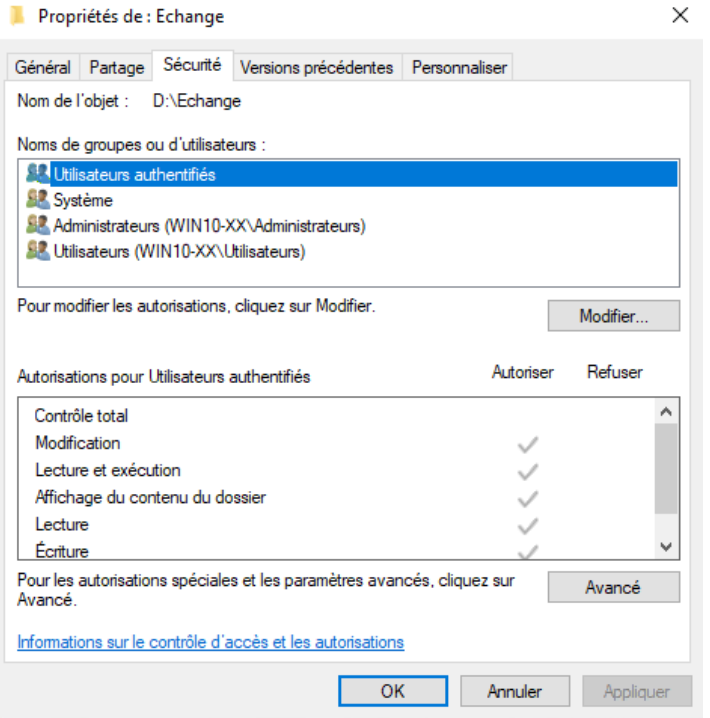
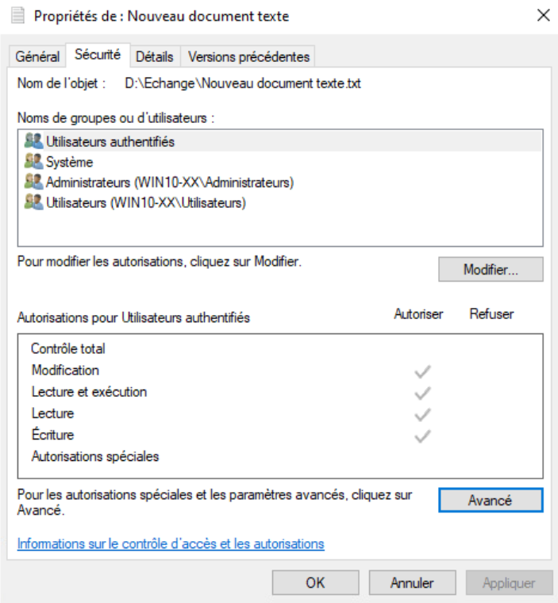
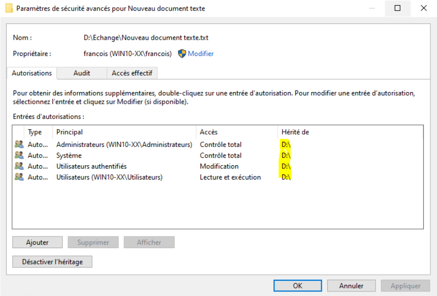
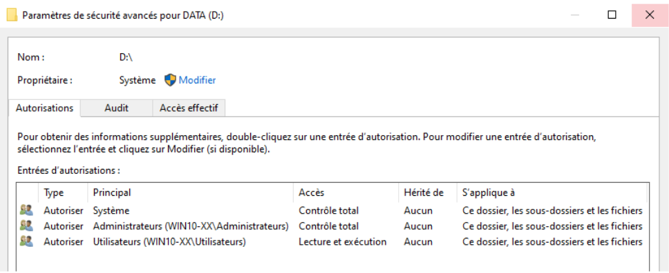
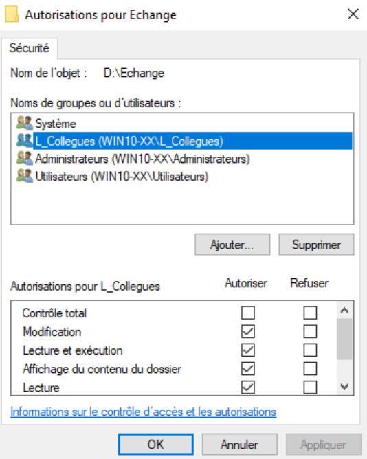
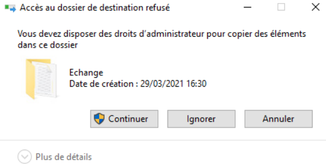
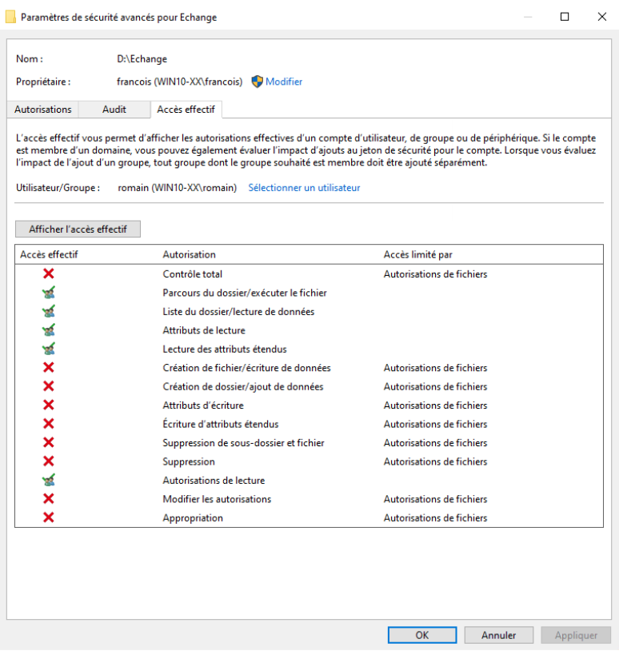
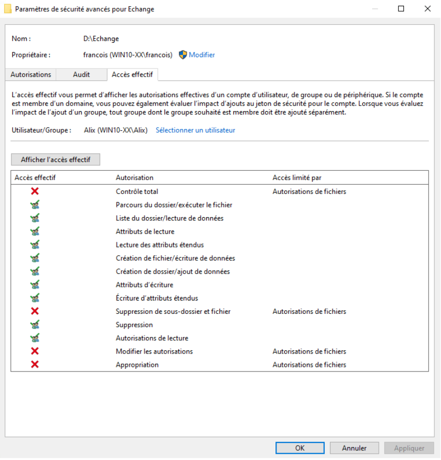

title: tp09 - NTFS & ACL

# ENI TSSR 03 - Services Client Windows
## TP09 - NTFS & ACL

[TOC]

### VM Win10 - GUI
**Objectif** : Configurer les autorisations d'accès sur les dossiers donnés sur Win10.

#### Question 1
Sur le volume **DATA**, créer le dossier **Echange**.

**Q1: Quelles sont les autorisations positionnées par défaut sur le dossier Echange ?** 

Pour connaître les autorisations NFTS positionnées par défaut sur ce répertoire :

1. clic droit sur **Echange** > **Propriétés** > onglet **Sécurité**
2. L’entité de sécurité **Utilisateurs authentifiés** possède des autorisations en **Modification**
3. L’entité de sécurité **Système** possède des autorisations en **Contrôle total**
4. Le groupe prédéfini **Administrateurs** possède des autorisations en **Contrôle total**
5. Le groupe prédéfini **Utilisateurs** possède des autorisations en **Lecture**

Ces autorisations proviennent de l’héritage du volume **D:** (c’est pourquoi les cases sont grisées…).

{:target="_blank"} 

#### Question 2
Peuplez ce répertoire de fichiers, de dossiers.

**Q2: Héritent-ils des autorisations du dossier parent ?**

1. Dans le dossier **Echange**, créer une nouveau document texte
2. Clic droit > **Propriétés** > onglet **Sécurité**
3. **Oui**, les nouveaux fichiers héritent des autorisations du dossier parent **Echange** (qui lui-même hérite des autorisations du lecteur **D:**). Pour s’en assurer, il suffit d’observer la présence des coches grisées. 

Pour plus de détails, cliquer sur **Avancé**.

  	

  		
	

  	

  		
	

	

#### Question 3

Configurer les autorisations d’accès au répertoire **Echange** :

- Les **collègues** pourront **modifier** tous les objets et sous-objets du dossier
- Les **admin** auront le **contrôle total**
- Les **utilisateurs du poste** auront les droit en **lecture**
- Tester

##### Reponses

Ici plusieurs possibilités, en voici une en modifiant les héritages

1. Lecteur D: > Clic droit > **Propriétés**
2. Onglet **Sécurité** > **Modifier**
3. Sélectionnez **Utilisateurs authentifiés** > **Supprimer**

##### Une Solution possible : _Modification de l’héritage_

1. Lecteur **D:** > Clic droit > **Propriétés** 
2. Onglet **Sécurité** > **Modifier**
3. Séléctionner **Utilisateurs authentifiés** > **Supprimer**
4. Par bonne pratique Microsoft, laisser **Système** et **Administrateurs** en **Contrôle total**
5. Laisser aussi **Utilisateurs** en **Lecture** car ce n’est pas demandé ici.
6. Valider

- - -

- Dossier **Echange** > clic droit **Propriétés** > onglet **Sécurité**
- On observe que l’entité de sécurité **Utilisateurs authentifiés** n’est plus présente, par héritage.
- **Modifier** > **Ajouter…**
- Entrer les noms des objets à sélectionner : **L_Collegues** > **Entrée**
- Cocher **Modification** (**Ecriture** se coche automatiquement)
- **Appliquer** > **OK**

  	

  		
	

  	

  		
	

	

#### Les tests d'accès (important)

**Q4: Comment tester les accès ?**

###### Solution 1 (+ probante) : Tests grandeur réelle
Première solution (peut-être la plus probante) : faire des tests "grandeur réelle"

1. Fermez votre session actuelle (**logoff**) puis ouvrez une session locale avec l'utilisateur **Romain**.
2. Tester l'accès au dossier **Echange** (**Lecture** possible car **Romain** (utilisateur) possède les autorisations en **Lecture**).
3. Tester la création d'un nouveau fichier dans le dossier **Echange** (impossible car **Romain** n'a pas les autorisations en **Modification**, il fait partie du groupe prédéfini **Utilisateurs**).

{:target="_blank"} 

4. Fermez la session de **Romain** et ouvrez une session avec **un de vos utilisateurs supplémentaires**.
5. Tester l'accès au dossier **Echange** (**Lecture** possible car votre utilisateur supplémentaire (**L_Collegues**) possède les autorisations en **Lecture**).
6. Tester la création d'un nouveau fichier dans le dossier **Echange** (possible car votre utilisateur possède les autorisations en **Modification**, par l'intermédiaire du groupe **L_Collegues**).
7. Tester l'accès à l'onglet **Sécurité** du dossier **Echange** pour tenter de modifier les ACL (Impossible car l'utilisateur supplémentaire, qui fait partie du groupe **L_Collegues**, ne possède pas les autorisations en **Contrôle Total**, le bouton **Modifier** est protégé par l'UAC).

{:target="_blank"} 

8. Fermer la session actuelle et ouvrez une session locale avec l'utilisateur **francois**.
9. Tester l'accès au dossier **Echange** (lecture possible car **francois** (Administrateurs) possède les autorisations en **Lecture**).
10. Tester la création d'un nouveau fichier dans le dossier **Echange** (possible car **francois** possède les autorisations en **Modification**, par l'intermédiaire du groupe prédéfini **Administrateurs**).
11. Tester l'accès à l'onglet Sécurité du dossier **Echange** pour tenter de modifier les ACL (possible car **francois**, qui fait partie du groupe prédéfini **Administrateurs** possède les autorisations en **Contrôle Total**).

{:target="_blank"} 

###### Solution 2 (+ rapide) : via onglet "Accès Effectif"
Deuxième possibilité (plus rapide) par l'intermédiaire de l'onglet Accès effectif__
- Ouvrez une session avec un utilisateur membre du groupe Administrateurs
- Affichez les propriétés du dossier **Echange** (clic droit > Propriétés)
-  Onglet Sécurité
- Avancé
- Onglet Accès effectif
- Sélectionner un utilisateur

**Tests d'autorisation d'accès avec un utilisateur membre du groupe utilisateurs**

- Entrez le nom de l'objet à sélectionner : **Romain**
- Entrée
- Afficher l'accès effectif
- On observe que **romain** n'a que des accès en **Lecture** (pas de création, d'écriture et de suppression possible).

**Tests d'autorisation d'accès avec un utilisateur membre du groupe **L_Collegues****
+ Sélectionner un utilisateur
+ Entrez le nom de l'objet à sélectionner : *l'un de vos utilisateurs supplémentaires*
+ Entrée
+ Afficher l'accès effectif
+ On observe qu'Alix possède un niveau d'autorisation plus élevé que **romain** car le groupe **L_Collegues** possède des accès en **Modification**

**Tests d'autorisation d'accès avec un utilisateur membre du groupe Administrateurs**
+ Sélectionner un utilisateur
+ Entrez le nom de l'objet à sélectionner : **francois**
+ Entrée
+ Afficher l'accès effectif
+ De par son appartenance au groupe prédéfini Administrateurs, **francois** possède le niveau d'accès Contrôle Total

###### Solution 2 (plus rapide) : via l’onglet “Accès effectif”

- Ouvrir une session avec un utilisateur du groupe Administrateurs.
- Dossier Echange > clic droit Propriétés > onglet Sécurité 
- Avancé > onglet Accès effectif
- On observe que romain (groupe Utilisateur) n’a que des accès en Lecture (pas de création, d’écriture et de suppression possible)
- On observe qu’alix (groupe L_Voisins) possède un niveau d’autorisation plus élevé que romain car le groupe L_Voisins possède des accès en Modification. 
- On observe que francois (groupe Administrateurs) possède le niveau d’accès **Contrôle total**. 

4.	Sur le volume TOOLS, créer les répertoires Logiciels et “Manuels 	d’utilisation”
    - Yann et François auront les droits en Modification
    - Les utilisateurs standards auront un accès en Lecture et les administrateurs posséderont un **Contrôle total**
    - Testez le bon fonctionnement des autorisations

Ici plusieurs possibilités, en voici une en modifiant les héritages
    - Lecteur E: > Clic droit > Propriétés > Onglet Sécurité
    - Modifier > Utilisateurs authentifiés > Supprimer
    -  Par bonne pratique Microsoft, laissez Système et Administrateurs en **Contrôle total** 
    - Laissez aussi Utilisateurs en Lecture car c'est ce qui est demandé ici.
    - OK > Appliquer > OK

    - Créer les dossiers Logiciels et “Manuels d'utilisation” sur le volume TOOLS.
    - Par héritage, ces dossiers permettent au Système et aux Administrateurs d'en avoir le **Contrôle total**. Les membres du groupe Utilisateurs, n'ont qu'un accès en Lecture.

Pour les autorisations d’accès de Yann et François :
    - Les DACL ne doivent contenir que des groupes. This is the way.
    - Yann et François sont tous les deux membres du groupe L_Informatique. 
    - Il suffit donc de rajouter le groupe L_Informatique dans les DACL des dossiers Logiciels et Manuel d’utilisation.

Sur les dossiers Logiciels et Manuel d’utilisation :
    - clic-droit > Propriétés > onglet Sécurité
    - On observe que l’entité de sécurité Utilisateurs authentifiés n’est plus présente, par héritage.
    - Modifier > Ajouter > “L_Informatique” > OK
    - Cocher la case Modification
    - Tester les autorisations “grandeur réelle” ou via l’onglet Accès effectif

VM Win11 - Powershell
    - Afficher la liste des droits d'accès au dossier 2022 du lecteur M:
      ps> get-acl m:\2022
    - Modifier les ACL d'un dossier
      ps> set-acl [...]

<link rel="stylesheet" type="text/css" href=".ressources/css/bootstrap.min.css">
<link rel="stylesheet" type="text/css" href=".ressources/css/style.css">
