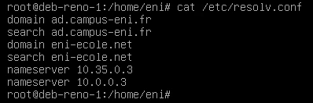
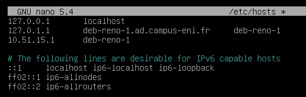
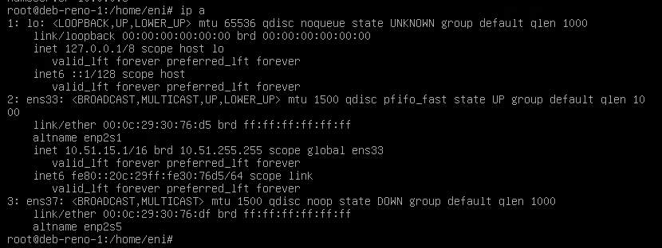
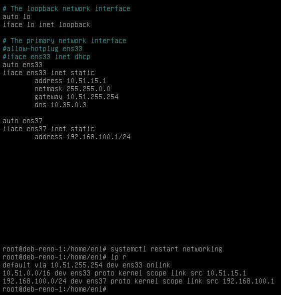
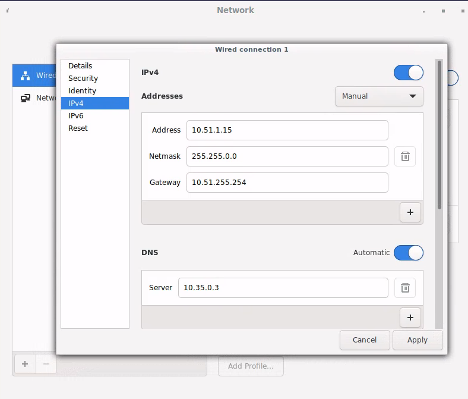

title: tp05 - réseau

## 05 - Linux Sysadmin
Du 21/02 au 04/03 - Formateur : Arnaud CORMIER

[TOC]

### TP 5 - Gérer la configuration réseau d’un poste [fait]
#### 1. Configuration d’un adressage IP statique : sur la seveur sans environnement graphique
1. Configurer la 1ere carte réseau détectée (ens33) avec l'adressage suivant :
	+ Adresse IP : 10.X.Y.1/16
	  avec X=n° de réseau salle : salle 101=11, 201=21, ...
	  avec Y=votre n° de stagiaire
	+ Passerelle : 10.X.255.254
	
```
# nano /etc/network/interfaces
```

```sh
# The loopback network interface
auto lo
iface lo inet loopback

# The primary network interface
auto ens33
iface ens33 inet static
	address 10.51.15.1
	netmask 255.255.0.0
	gateway 10.51.255.254
	dns 10.35.0.3
```

**Notes**: on peut écrire l'adresse en CIDR et omettre le netmask. Ex. `address 10.51.15.1/16`

Penser à vérifier l'ip de la machine distante qui héberge les VM. Dans mon cas, elle n'était pas sur le même réseau que dans l'énoncé.

2. Vérifier et adapter si nécessaire les paramètres de résolution de nom :
	+ Serveurs DNS : serveurs DNS de l’ENI
	+ Domaines résolus par défaut : ad.campus-eni.fr et eni-ecole.net

Pour valider la bonne prise en compte du point précédant, vous pourrez résoudre les hôtes suivants :
- dc44-fra  **OK**
- repos **marche pas mais c'est normal**

Ajouter DNS dc44-fra dans /etc/resolve.conf :

```sh
nameserver 10.35.0.3      (dns rennes)
nameserver 10.0.0.3       (dns nantes)
```

Pour ping repos, ajouter à /etc/resolve.conf:

```sh
domain eni-ecole.net
search eni-ecole.net
```



**Notes prof** :
- search & domain : pour ajouter un suffixe à la partie hote
- name server pour l'adresse ip du server dns


3. Modifier le nom de la machine :
- Indiquer le nom : deb-<prénom>-01 avec <prénom> = votre prénom. Attention, il y a 2 fichiers à modifier ! (/etc/hosts et /etc/hostname)


```sh
$ sudo nano /etc/hostname
(modifier)
$ sudo /sbin/reboot
```

**Autre méthode :**

```sh
$ hostname
debian

$ hostnamectl
   Static hostname: debian
         Icon name: computer-vm
           Chassis: vm
        Machine ID: 37eaf1edf1864dee9cfa90373206a449
           Boot ID: f4d3980df9da46f5b1a5dc997739f8b1
    Virtualization: oracle
  Operating System: Debian GNU/Linux 10 (buster)
            Kernel: Linux 4.19.0-16-amd64
      Architecture: x86-64
```


```
$ su -
# hostnamectl set-hostname deb-reno-1
# nano /etc/hosts                (update entries)
# hostnamectl                    (pour vérifier)
```

**MàJ de /etc/hosts :**

- Find all references to oldname and replace with newname except for the following entries:
```sh
127.0.0.1	localhost

# The following lines are desirable for IPv6 capable hosts
::1     localhost ip6-localhost ip6-loopback
ff02::1 ip6-allnodes
ff02::2 ip6-allrouters
```
- For ex. 
```sh
127.0.0.1	localhost
192.168.2.100   deb10.cyberciti.biz

# The following lines are desirable for IPv6 capable hosts
::1     localhost ip6-localhost ip6-loopback
ff02::1 ip6-allnodes
ff02::2 ip6-allrouters
```
- Save and close the file.



**Notes prof**:

- Le fichier /etc/hosts est pour la résolution locales des noms. L'ordre dans lequel on écrit les hosts n'importe pas. 
- Il faut reboot pour appliquer les modifications.


4. Ajouter une 2e carte réseau en Host-only à votre VM et utiliser les paramètres suivants :
	+ IP : 192.168.100.1/24
	+ Pas de passerelle par défaut
	
On ajoute la carte à chaud dans VMWare et on voit la nouvelle carte en faisant `ip a` et on voit que son state est `down`




Modifier `/etc/network/interfaces`

```
auto ens37
iface ens37 inet static
	address 192.168.100.1/24
```

Save & restart avec `systemctl restart networking`

Verifier avec `systemctl status networking`



	

#### 2. Configuration d’un adressage IP statique via les outils graphiques : sur la station avec environnement graphique

1) Configurer un adressage IP statique compatible avec la 1ere carte réseau de la VM Debian sans environnement graphique
	+ Pouvez-vous pinguer l'autre VM Debian ?
	+ Pouvez-vous pinguer les serveurs ENI ?



- deb-srv     : **10.51.15.1/16** 
- deb-desktop : **10.51.1.15/16**
- gateway     : **10.51.255.254**

Ca ping dans les 2 sens. Penser à restart la connection (bouton on/off) pour être sûr que les modifications soient appliquées.

<link rel="stylesheet" type="text/css" href=".ressources/css/bootstrap.min.css">
<link rel="stylesheet" type="text/css" href=".ressources/css/style.css">

<style>

img[alt="/etc/resolve.conf"] {	
	display:block;
	/*width:600px;*/
	margin:0 auto; 
}

img[alt="/etc/hosts"] {	
	display:block;
	/*width:75%;*/
	margin:0 auto; 
}

img[alt=new] {	
	display:block;
	/*width:75%;*/
	margin:0 auto; 
}


img[alt=new] {	
	display:block;
	/*width:75%;*/
	margin:0 auto; 
}

img[alt=tout] {	
	display:block;
	width:75%;
	margin:0 auto; 
}

img[alt=gui] {
	display : block;
	width : 600px; 
	margin : 0 auto;
}

</style>

