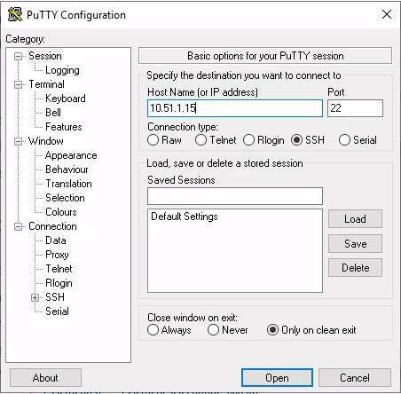

title: tp06 - packages
css: ./.ressources/css/style.css

## 05 - Linux Sysadmin
*Du 21/02 au 04/03 - Formateur : Arnaud CORMIER*

[TOC]

### TP 6 - Gérer les installations logicielles avec et sans environnement graphique [fait]

**Prérequis** : Avoir accès au dépôt de l’école

#### I. Sur la station avec environnement graphique

**Q: Afficher le composant les "Software & Updates"**

- Vérifier les paramétrages dans les différents onglets

Menu Démarrer > **Preferences** > **Software & Updates**


- Rechercher les informations relatives aux dépôts configurés


- Désactiver le dépôt CDROM : **commenter les dans /etc/apt/sources.list ou décocher ici**

**/etc/apt/sources.list** (original)

```sh
deb cdrom:[Debian GNU/Linux 11.2.0 _Bullseye_ - Official amd64 NETINST 20211218-11:12]/ bullseye main 

deb http://ftp.fr.debian.org/debian/ bullseye main
deb-src http://ftp.fr.debian.org/debian/ bullseye main 

deb http://security.debian.org/debian-security bullseye-security main
deb-src http://security.debian.org/debian-security bullseye-security main 

# bullseye-updates, to get updates before a point release is made;
# see https://www.debian.org/doc/manuals/debian-reference/ch02.en.html
#_updates_and_backports
deb http://ftp.fr.debian.org/debian/ bullseye-updates main
deb-src http://ftp.fr.debian.org/debian/ bullseye-updates main 

# This system was installed using small removable media
# (e.g. netinst, live or single CD). The matching "deb cdrom"
# entries were disabled at the end of the installation process.
# For information about how to configure apt package sources,
# see the sources.list(5) manual. 
```

**Q: Vérifier la configuration du fichier sources.list dans /etc/apt :**
 
- Quelles lignes définissent l'emplacement des sources d'installation des paquets binaires ? **deb**
- Quelles lignes définissent l'emplacement des mises à jour ? **gné? deb...**
- Pouvez-vous récupérer les paquets sous la forme du code source ? **bah oui : deb-src**
- Désactiver l'accès aux dépôts concernant le code source. **commenter les lignes commençant par deb-src**


**Q: Effectuer une mise à jour des paquets installés avec aptitude :**
 
- Combien de paquets seront mis à jour ? ( pourquoi ? )

Avec apt, 2 paquets seront upgraded (thunderbird & libexpat1). Parce que j'ai utilisé la dernière iso fournie sur le site de Debian, donc elle est relativement à jour.<br>
Avec aptitude, il ne dit pas mais c'est aussi les mêmes paquets...


**Q: Installer le logiciel suivant avec l'outil "Logiciels"**
 
- Gparted (outil de partitionnement)
- Lancer cette application depuis les menus Gnome

- Menu démarrer > **Administration** > **Softwares** 
- recherche gparted > **Installer**
- Menu démarrer > **Administration** > **Gparted** 

**Q: Installer les paquets suivants avec la commande apt :**
 
- vim (Editeur VI amélioré) ou neovim
- Serveur SSH (rechercher d’abord le nom du paquet adapté)
- terminator 

```
$ sudo apt install neovim ssh-server terminator
```

**Q: Afficher les informations sur ces 3 paquets avec les commandes :**

```sh
$ apt show <paquet>
$ dpkg -L <paquet>
```

```sh
eni@deb-desktop:~$ apt show neovim 
 Package: neovim 
 Version: 0.4.4-1 
 Priority: optional 
 Section: editors 
 Maintainer: Debian Vim Maintainers <team+vim@tracker.debian.org> 
 Installed-Size: 3,928 kB 
 Provides: editor 
 Depends: neovim-runtime (= 0.4.4-1), libc6 (>= 2.29), libluajit-5.1-2 (>= 2.0.4+dfsg), libmsgpackc2 (>= 2.1.0), libtermkey1 (>= 0.19), libunibilium4 (>= 2.0), libuv1 (>= 1.20.2), libvterm0 (>= 0.1), lua-luv (>= 1.36.0-0) 
 Recommends: python3-neovim, xclip | xsel, xxd 
 Suggests: ctags, vim-scripts 
 Homepage: https://neovim.io/ 
 Download-Size: 1,492 kB 
 APT-Manual-Installed: yes 
 APT-Sources: http://ftp.fr.debian.org/debian bullseye/main amd64 Packages 
 Description: heavily refactored vim fork 
 Neovim is a fork of Vim focused on modern code and features, rather than 
 running in legacy environments. 
 . 
 msgpack API enables structured communication to/from any programming language. 
 Remote plugins run as co-processes that communicate with Neovim safely and 
 asynchronously. 
 . 
 GUIs (or TUIs) can easily embed Neovim or communicate via TCP sockets using 
 the discoverable msgpack API. 
   
 eni@deb-desktop:~$ dpkg -L neovim 
 /. 
 /usr 
 /usr/bin 
 /usr/bin/nvim 
 /usr/libexec 
 /usr/libexec/neovim 
 /usr/libexec/neovim/ex 
 /usr/libexec/neovim/rview 
 /usr/libexec/neovim/rvim 
 /usr/libexec/neovim/view 
 /usr/libexec/neovim/vimdiff 
 /usr/share 
 /usr/share/doc 
 /usr/share/doc/neovim 
 /usr/share/doc/neovim/changelog.Debian.gz 
 /usr/share/doc/neovim/copyright 
```

**Q: Connectez-vous via Putty sur votre VM Debian graphique.**
 
 

 - On ne peut pas se connecter directement avec root
 - Existe parce qu'il n'y avait pas powershell ou autre à l'époque
 - On peut autoriser root mais faut modifier le fichier de conf
 - Prérequis : avoir ssh-server installé


#### II. Sur le serveur sans environnement graphique
**Q: Configurer manuellement les dépôts Internet dans le fichier /etc/apt/sources.list**
 
- Ajouter les directives :

```sh
deb http://ftp.fr.debian.org/debian/ bullseye main
deb http://ftp.fr.debian.org/debian/ bullseye-updates main
```

- Garder la directive :

```sh
deb http://security.debian.org/debian-security bullseye-security main
```

**Q: Vérifier les mises à jour disponibles**
 
- Combien de paquets seront mis à jour ? **12**
- Effectuer les mises à jour et redémarrer si nécessaire 

**Ok. Possible de faire `apt dry` pour tester la màj sans installer**<br>
**On reboot que si le noyau est modifié.**


**Q: Installer les paquets suivants avec la commande aptitude :**
 
- vim (éditeur VIM)
- cifs-utils (outils pour la connexion aux partages SMB)

```sh
$ sudo aptitude install vim cifs-utils
```

**Q: Afficher les informations sur les paquets installés avec les commandes**

```sh
$ aptitude show <paquet>
$ dpkg -L <paquet>
```

**Q: Configurer le fonctionnement de VIM pour les deux Postes:**
 
- Lancer l'édition : `# vi /etc/vim/vimrc`
- Décommenter la ligne contenant la mention : syntax on (active la coloration syntaxique)
- Ajouter les modifications suivantes pour retrouver un comportement normal de vim en créant le fichier : `/etc/vim/vimrc.local`

```sh
source /usr/share/vim/vim81/defaults.vim
let skip_defaults_vim = 1
if has('mouse')
	set mouse=r
endif
set paste
```

<link rel="stylesheet" type="text/css" href=".ressources/css/bootstrap.min.css">
<link rel="stylesheet" type="text/css" href=".ressources/css/style.css">

<style>

img {
	display: block;
	margin: 0 auto;
	max-width: 600px;
	max-height: 700px
}

</style>
