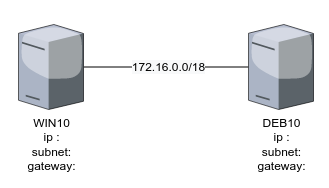

title: msp1-systemes-clients

## MSP 1 - Systemes clients

[TOC]

### Partie 1 - Installation
#### 1.1 Présentation

**Objectif** : installer et configurer progressivement deux OS, Win10 et Debian 10.

##### Q1.1.1 Partager les sous-réseaux
Vous et votre binôme prendrez les **dernières adresses disponibles** du **dernier sous-réseau en /26**. En classe, vous définirez les X premiers sous-réseaux, X étant le nombre de binômes dans la classe. Suite à cela, vous définirez les sous-réseaux appartenant à chaque binôme.

##### Q1.1.2 Utiliser VMWARE
Vous installerez 2 systèmes clients à l'aide de l'outil de virtualisation VMWARE WORKSTATION en respectant les caractéristiques fournies plus loin.

##### Q1.1.3 Travailler parfois en binôme
Certaines tâches nécessiteront de travailler en binôme.

**Note** : vous prendrez soin de créer des procédures relatant toutes vos actions. Utiliser l'outil PSR si besoin (qualité pourrie) ou faire les screens à la main, ça va aussi vite.

#### 1.2 Caractéristiques matérielles des VM

<table class="table">
  <thead class="thead-dark">
		<tr>
			<th scope="row"></th>
			<th scope="row">Machine 1</th>
			<th scope="row">Machine 2</th>
		</tr>
	</thead>
	<tbody>
		<tr>
			<th scope="col">Nom</th>
			<td scope="col">W10-NumeroDeStagiaire </td>
			<td scope="col">DEB10-NumeroDeStagiaire</td>
		</tr>
		<tr>
			<th scope="col">OS</th>
			<td scope="col">Win10 Pro</td>
			<td scope="col">Debian 10</td>
		</tr>
		<tr>
			<th scope="col">CPU</th>
			<td scope="col" rowspan="2"><i>suivre reco Microsoft</i></td>
			<td scope="col">1x vCPU</td>
		</tr>
		<tr>
			<th scope="col">RAM</th>
			<td scope="col">2048 MB</td>
		</tr>
		<tr>
			<th scope="col">HDD1</th>
			<td scope="col">32 Go</td>
			<td scope="col">20 Go</td>
		</tr>
		<tr>
			<th scope="col">HDD2</th>
			<td scope="col">40 Go</td>
			<td scope="col">40 Go</td>
		</tr>
		<tr>
			<th scope="col">Réseau</th>
			<td scope="col">1x carte en "Host-Only"</td>
			<td scope="col">1x carte en "Host-Only"</td>
		</tr>
	</tbody>
</table>

**Notes**: Lorsque vous aurez besoin d'une connection internet, ou du réseau de l'école, vous passerez en carte réseau *Bridged* et en DHCP.

#### 1.3 Tâches à réaliser

##### 1.3.1 Schéma

Reproduire le schéma du réseau et compléter avec les infos d'adressage IP. (avec drawio, par ex.)

##### 1.3.2 Tableau récapitulatif

Produire un tableau récapitulatif de l'ensemble des infos relatives aux configurations système (ex. login, mdp, hostname, ip, CPU, RAM).

##### 1.3.3 Installation de Win10

- La VM avec Win10 :
	+ le premier HDD ne comportera qu'une seule partition utilisant l'intégralité de l'espace
	+ configurer l'ip, le hostname
	+ empêcher Win Update de se connecter aux serveurs Microsoft.
	+ utiliser l'iso d'install sur le réseau `\\10.0.0.6\Distrib\iso\os\windows\10\xxxxx.iso`

##### 1.3.4 Installation de Debian 10
- La VM Debian 
	+ installer l'iso "DVD" de Debian 10.x **avec un environnement graphique**
	+ iso dispo ici : `\\10.0.0.6\Distrib\iso\os\unix-linux\linux\Debian\XXXX.iso`
	+ mettre la nic en bridged pour l'installation.

##### 1.3.5 Partitionnement

- Partitionner le disque manuellement selon le schéma suivant en prenant garde de pouvoir exploiter ultérieurement l'espace non-alloué.
- Conserver le système de fichier par défauts des différents points de montage

<table class="table">
	<tbody>
		<tr>
			<th scope="col">/</th>
			<td>17 Go</td>
		</tr>
		<tr>
			<th scope="col">/boot</th>
			<td>512 Mo</td>
		</tr>
		<tr>
			<th scope="col">swap</th>
			<td>256 Mo</td>
		</tr>
		<tr>
			<th scope="col">/home</th>
			<td>1 Go</td>
		</tr>
	</tbody>
</table>

##### 1.3.6 Paquets

Laisser cocher les paquets par défaut et sélectionner comme source d'installation le premier serveur miroir français de la liste (ftp.debian.org). 

<!-- CSS only -->
<link href="https://cdn.jsdelivr.net/npm/bootstrap@5.2.0/dist/css/bootstrap.min.css" rel="stylesheet" integrity="sha384-gH2yIJqKdNHPEq0n4Mqa/HGKIhSkIHeL5AyhkYV8i59U5AR6csBvApHHNl/vI1Bx" crossorigin="anonymous">
<!-- JavaScript Bundle with Popper -->

