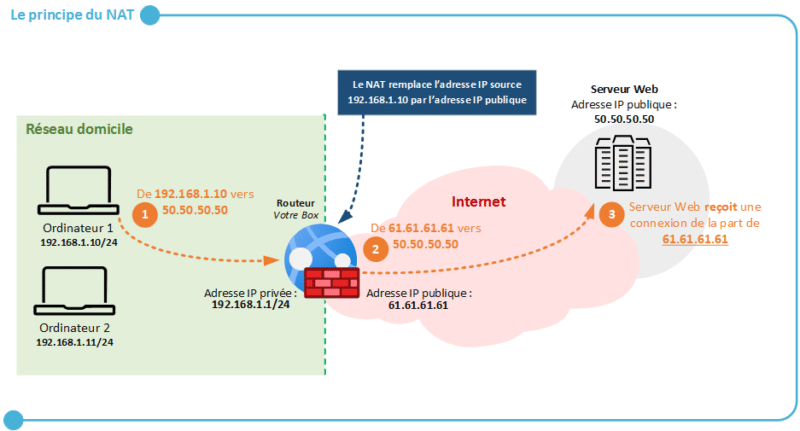
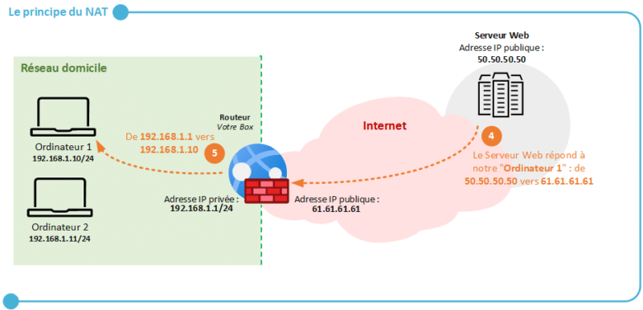
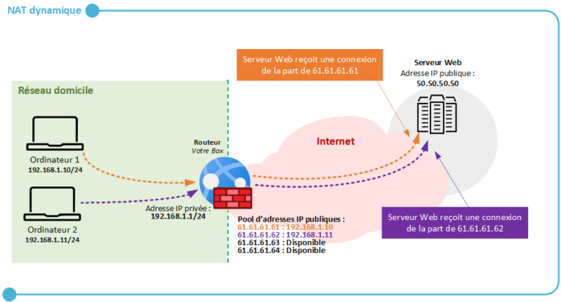
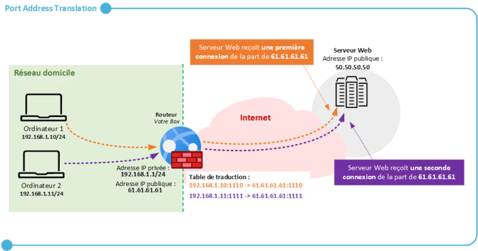
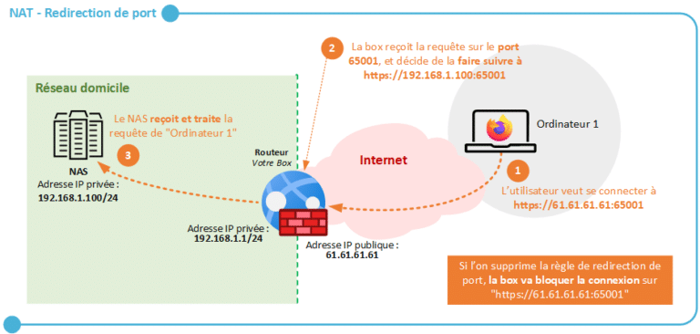

title: mod5-securite-nat

# ENI TSSR 08 - Réseau & Téléphonie sur IP (ToIP)

Du 07/06 au 17/06/2022 
Formatrice : Elisabeth LEFRANC

[TOC]

## Module 5 - La Sécurité
### Configuration NAT 

### 2. [IT-CONNECT[^1]] Le NAT

Très important à connaitre si on veut une façon simple de rendre accessibles certaines ressources d'un réseau local depuis Internet (NAS, un serveur, etc.)

#### 2.1 Principe du NAT

[^1]NAT ou **Network Address Translation** signifie la traduction d'adresse réseau.

Il s'agit d'un mécanisme mis en place sur les routeurs afin de **remplacer l'adresse IP privée source d'une machine par l'adresse IP publique du routeur dans un paquet réseau** lorsqu'une machine tente de **communiquer avec unserveur situé sur internet**.

##### 2.1.1 Pourquoi le NAT ?

A la base, le NAT a été inventé afin d'apporter une réponse à la future pénurie d'adresses IPv4. Le nombre d'IPv4 est limité à 2^32 adresses puisque codée sur 4 octetsn soit env. 4.3 milliards d'adresses IP.

Ainsi il ya des adresses ip dites **privées** que l'on utilise seulement sur les réseaux locaux (et qui sont réutilisables d'un réseau local à un autre). Les adresses ip dites **publiques** sont utilisées pour les communications sur Internet.

Le NAT est une réponse à cette problématique. A la base, cela devait être une réponse temporaire... car la vraie réponse est l'utilisation des IPv6 (codé sur 16 octets au lieu de 4). Bien qu'elles existent depuis plusieurs années, les IPv4 restent les plus utilisées. 

Grâce au NAT tel que nous l'utilisons à la maison notamment par l'intermédiaire de notre box Internet, **plusieurs appareils peuvent partager la même adresse IP publique** donc on fait des économies en terme d'utilisation des adresses IP publiques. Par définition une adresse IP privée telle que 192.168.1.10/24 n'est pas utilisable directement sur Internet mais grâce au NAT, on va pouvoir accéder à Internet malgré tout.

##### 2.1.2 Fonctionnement du NAT

Ex. le PC1 est connecté au réseau de mon domicile, où se situe ma box Internet (et donc il y a du NAT en place). Je souhaite accéder à un serveur Web ayant pour adresse IP publique 50.50.50.50 afin d'accéder au site mon-site.fr. **Que se passe-t-il ?**

**Aller**

1. L'ordinateur d'IP 192.168.1.10 va tenter de se connecter au serveur web 50.50.50.50, donc une requête va être envoyée à destination de ce serveur web, en passant par mon routeur, c'est-à-dire la box. On passe par le routeur car c'est la passerelle par défaut de mon réseau local, et qu'elle est définie sur ma machine.

2. Au moment où **requête émise de mon ordinateur à destination du serveur Web arrive à mon routeur, le mécanisme du NAT va entrer en jeu**. Autrement dit, ma requête n'est pas directement envoyée au serveur Web. Puisque le NAT est actif, le routeur va modifier le paquet réseau avant de l'envoyer au serveur Web, afin de **remplacer l'adresse IP source 192.168.1.10 par 61.61.61.61 qui est l'adresse publique de ma box**. Une fois que cette opération est effectuée, le paquet est émis au serveur Web 50.50.50.50.

3. **La requête arrive jusqu'au serveur Web, et ce dernier voit que la requête provient de l'adresse IP 61.61.61.61**. Autrement dit, il associe mon PC1 à l'adresse IP publique 61.61.61.61, et à aucun moment il n'aura connaissance de mon adresse IP privée, à savoir 192.168.1.10/24.

 
**Retour**

Pour la phase retour, lorsque le serveur web va répondre au client pour lui indiquer le contenu de la page Web du site, par exemple.

4. **Le serveur web va répondre à l'ordinateur PC1 en envoyant sa réponse sur l'adresse IP publique 61.61.61.61**, ce qui est logique. Le paquet est réceptionné par le routeur (la box), en provenance de 50.50.50.50.

5. **La box a mémorisée cette connection (grâce à une table de translation) et donc elle sait qu'elle doit adresser le paquet reçu de la part du serveur web à notre PC1**. A partir de son adresse IP 192.168.1.1, le routeur envoie la réponse à PC1, mais PC1 voit la réponse comme si elle provenait directement du serveur web 50.50.50.50.

**Le mécanisme de NAT sert d'intermédiaire entre le réseau local et Internet**. Il présente l'avantage de **masquer les machines du réseau vis-à-vis d'Internet** car elles ne sont pas directement accessibles d'Internet vers le réseau local. C'est une sécurité en plus mais nous verrons par la suite que l'on peut permettre cet accès par l'intermédiaire d'une redirection de ports.

#### 2.2 Les Types de NAT

##### 2.2.1 NAT statique

L'objectif du NAT statique est de **traduire une adresse IP privée en une adresse IP publique en fonctionnant par association statique, c'est-à-dire un pour un**. 

Autrement dit, une adresse IP privée est associée à une adresse IP publique.

| Appareils | Adresse IP privée | Adresse IP publique |
|:---------:|:-----------------:|:-------------------:|
| PC1       |      192.168.1.10 |         61.61.61.61 |
| PC2       |      192.168.1.11 |         61.61.61.62 |

Ainsi, lorsque PC1 accèdera à Internet, son adresse IP privée 192.168.1.10 sera automatiquement remplacée par 61.61.61.61. 

D'un autre côté, lorsque le PC2 accédera à Internet, son adresse IP privée 192.168.1.11 sera remplacée par 61.61.61.62. Cela est également vrai pour l'inverse, une requête envoyée sur l'adresse IP 61.61.61.61 sera automatiquement transmise à PC1 puisqu'il est associé à cette adresse IP publique.

**Ce mécanisme montre rapidement ses limites car chaque machine du réseau interne doit disposer à la fois d'une adresse IP privée et d'une adresse IP publique**. Le NAT statique, appelé également "**NAT one-to-one**" peut servir à rendre accessible un serveur Web en lui attribuant (en quelque sorte) une adresse IP publique. Cependant, pour publier un serveur Web sur Internet de façon sécurisée, il est préférable d'utiliser un **reverse proxy**[^2], ou éventuellement une règle de redirection de port pour autoriser uniquement les flux HTTPS, par exemple.

Pour finir, sachez qu'avec du NAT statique, l'équipement du réseau local est accessible depuis Internet via son adresse IP publique puisqu'il y a un mappage entre les 2 adresses IP (privée et publique). 

##### 2.2.2 NAT dynamique

Le NAT dynamique est différent du NAT statique car **les associations entre une adresse IP privée correspondante à une machine et une adresse IP publique disponible sur le routeur seront dynamiques et temporaires**. 

Ainsi si l'on a 50 ordinateurs, 10 smartphones et 20 tablettes connectés à son réseau local, et que l'on dispose de 4 adresses IP publiques, elles seront exploitées dynamiquement par nos machines afin de permettre un accès à Internet. 

**Lorsqu'une connection vers Internet est effectuée par une machine, le routeur associe temporairement l'adresse IP privée à l'adresse IP publique**. Pour cela, une adresse IP appartenant à votre pool d'adresses IP publiques est utilisée. Quand la connection est terminée, l'adresse IP est libérée et potentiellement attribuable à une autre machine.

<a href="#toc">Retour au sommaire</a>

##### 2.2.3 PAT

Le Port Address Translation est une forme de NAT dynamique, que l'on appelle "**NAT Overlay**" ou "**Masquerade NAT**", avec quelques différences très intéressantes, qui font du PAT le mode le plus couramment utilisé. 

Comme le NAT dynamique, le PAT va effectuer une association dynamique et temporaire entre une adresse IP privée et une adresse IP publique, sauf qu'il va ajouter à cette association une autre information : **un numéro port**, d'où le terme "PAT".

**Grâce au PAT, une seule et même adresse IP publique peut-être utilisée par X machines connectées sur le réseau local**. C'est exactement ce qu'il se passe à la maison : votre ordinateur, votre smartphone, votre tablette, voire même vos prises connectées et votre robot aspirateur sont connectées à votre réseau local et utilisent tous **la même adresse IP publique pour accéder à Internet**.

Pour s'en convaincre, il suffit de regarder notre adresse IP publique à partir de différents appareils connectés: c'est la même !

Ce schéma illustre ce fonctionnement, avec 2 ordi sur le même réseau local et qui accèdent à Internet via une même connection Internet, c'est-à-dire la même box. Si ces 2 ordi se connectent au même serveur Web, **le serveur web distant verra deux connexions différentes en provenance de l'IP publique 61.61.61.61 grâce au mécanisme PAT**.

Afin de pouvoir identifier ces connexions et de retourner chaque réponse du serveur Web au bon ordi, **un numéro de port est associé à chaque connexion** : c'est ce qui constitue la **table de traduction** (*table of translation*)

#### 2.3 DNAT pour les redirections de ports

La **redirection de ports** ou **port forwarding** correspond au **DNAT** ou **Destination NAT**.

On parle en fait de **Source NAT** qd c'est l'IP source du paquet qui est modifiée (ex. un PC du réseau local accède à un site Internet) et de **Destination NAT** qd c'est l'IP de destination du paquet qui est modifiée (ex. un PC connecté à Internet accède à un NAS connecté au réseau local).

Grâce à une règle de redirection de port, **une machine connectée au réseau local et qui dispose d'une adresse IP privée pourra être accessible depuis l'extérieur**, c'est-à-dire depuis Internet, sur un ou plusieurs ports spécifiques, via l'adresse IP publique du routeur (box).

**Exemples** :

- Un serveur Web connecté au réseau local pourra être joignable depuis l'extérieur sur le port TCP/443 correspondant au HTTPS, en accèdant à l'adresse IP puiblique de la box.
- Un serveur Linux connecté au réseau local pourra être joignable en SSH depuis l'extérieur sur le port TCP/22 (ou un autre port autre que celui par défaut), en accédant à l'adresse IP publique de la box.

##### 2.3.1 Exemple de redirection de port

<a href="#toc">Retour au sommaire</a>

-Fin-

 

[^1]: Source : https://www.it-connect.fr/le-nat-et-le-pat-pour-les-debutants/
[^2]: Le reverse proxy permet aux utilisateurs externes d'accéder à une ressource du réseau interne. Le client n'a pas de visibilité sur le ou les serveurs cachés derrière le reverse proxy. Permet par ex. d'avoir plusieurs serveurs Web derrière un reverse proxy. https://www.it-connect.fr/les-serveurs-proxy-et-reverse-proxy-pour-les-debutants/

<link rel="stylesheet" href=".ressources/css/style.css">
