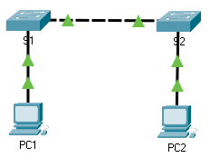

title: mod2-tp4-bases-connection

# M02 TP 4 - Packet Tracer - Mise en oeuvre de la connectivité de base
*ENI TSSR 08 - Réseau & Téléphonie sur IP (ToIP)*

<span id="toc"></span>

[TOC]




**Table d'adressage**

| Appareil | Interface | Adresse IP | Subnet |
|:----|:-------------|:--------------|:--------------|
| S1  | VLAN 1       | 192.168.1.253 | 255.255.255.0 |
| S2  | VLAN 1       | 192.168.1.254 | 255.255.255.0 |
| PC1 | Carte réseau | 192.168.1.1   | 255.255.255.0 |
| PC2 | Carte réseau | 192.168.1.2   | 255.255.255.0 |

**Objectifs**

- Partie 1 : Effectuer la configuration de base des commutateurs S1 et S2 
- Partie 2 : Configurer les PC
- Partie 3 : Configurer l'interface de gestion des commutateurs

**Contexte**

Au cours de cet exercice, vous allez effectuer des configurations de base sur les commutateurs. Vous mettrez ensuite en œuvre la connectivité de base en configurant l'adressage IP sur les commutateurs et les ordinateurs. Après la configuration de l'adressage IP, vous utiliserez plusieurs commandes show pour vérifier les configurations et la commande ping pour vérifier la connectivité de base entre les périphériques.

### Partie 1 : Configuration de base des commutateurs S1 et S2
#### Etape 1 : configurer S1 avec un nom d'hôte

1. clic sur **S1** > onglet **CLI**
2. Passer en mode d'exécution privilégié. Puis passer en mode de configuration globale.
```cisco 
switch> enable
switch# configure terminal
```
3. Attribuer le nom **S1** à l'hôte
```cisco
switch(config)# hostname S1
S1(config)#
```

#### Etape 2 : Configurer le mot de passe de console & celui du mode execution privilégié

1. Utiliser le mdp **cisco** pour l'accès à la console
```cisco
S1(config)# line console 0 
S1(config-line)# password cisco
S1(config-line)# login
S1(config-line)# exit 
```
2. et le mdp **class** pour le mode d'exécution privilégié chiffré.
```cisco
S1(config)# enable secret class
```

#### Etape 3 : Vérifications
1. Pour vérifier, sortir du mode de configuration globale et sortir du mode d'exécution privilégié.
```cisco
S1(config)# end
S1#
%SYS-5-CONFIG_I: Configured from console by console

S1# exit
```
2. Appuyez sur Entrée et vous serez invité à saisir un mot de passe pour accéder au mode d'exécution utilisateur.<br>**Q: Quel mot de passe avez-vous utilisé ?**
3. Saisissez enable pour passer en mode d'exécution privilégié. Saisissez le mot de passe lorsque vous y êtes invité.<br>**Q: Quel mot de passe avez-vous utilisé ?**
4. Saisissez configure terminal pour passer en mode de configuration globale.

#### Etape 4 : Configurer une bannière MOTD
Avec la commande `banner motd`

```cisco
S1(config)# banner motd "Authorized access only" 
```

#### Etape 5 : Enregistrer le fichier de configuration dans la mémoire NVRAM
1. Quitter le mode d'exécution privilégié
```cisco
S1(config)# exit
S1#
%SYS-5-CONFIG_I: Configured from console by console
S1#
```
2. Utiliser la commande `copy running-config startup-config` pour sauvegarder la configuration 
```cisco
S1# copy running-config startup-config
Destination filename [startup-config]?
Building configuration...
[OK]
```

#### Etape 6 : Répéter les étapes 1 à 5 pour S2

<a href="#toc">Retour au sommaire</a>
#### Récapitulatif Partie 1

```cisco
switch> enable
switch# configure terminal

switch(config)# hostname S1       # change hostname
S1(config)#

S1(config)# line console 0        # change pswd console (open console)
S1(config-line)# password cisco
S1(config-line)# login
S1(config-line)# exit 

S1(config)# enable secret class   # change pswd execution (enable)

S1(config)# end                   # check pswd
S1#
%SYS-5-CONFIG_I: Configured from console by console

S1# exit
S1> enable
S1# configure terminal

S1(config)# banner motd "Authorized access only"     # setup motd

S1(config)# exit               
S1# copy running-config startup-config               # save config into NVRAM
Destination filename [startup-config]?
Building configuration...
[OK]
```


<a href="#toc">Retour au sommaire</a>
### Partie 2 : Configurer les ordinateurs
#### Etape 1 : Attribuer les ip aux pcs
1. clic sur PC1 > onglet **Desktop** > **IP Configuration**
2. Dans la table d'adressage, l'ip de PC1 est 192.168.1.1/24 
3. Répéter pour PC2 

#### Etape 2 : Tester la connectivité entre les commutateurs
1. clic sur PC1 > onglet **Bureau** > clic **Command Prompt**
2. pinger l'ip de S1 : `ping 192.168.1.253`. **Ca marche ou pas ?**

<a href="#toc">Retour au sommaire</a>
### Partie 3 : Configurer l'interface de gestion des commutateurs
#### Etape 1 : Configurer l'ip de S1

Les commutateurs peuvent être utilisés sans configuration. Les commutateurs transmettent les informations d'un port à un autre en fonction des adresses MAC de contrôle d'accès au support. <br>
Q: **Pourquoi un commutateur a-t-il besoin d'une adresse IP ?**

1. En mode de config globale, saissir les commandes suivantes pour configurer S1 avec une ip sur le VLAN 1
```cisco
S1# configure terminal
S1(config)# interface vlan 1
S1(config-if)# ip address 192.168.1.253 255.255.255.0
S1(config-if)# no shutdown
%LINEPROTO-5-UPDOWN: Line protocol on Interface Vlan1, changed state to up
S1(config-if)#
S1(config-if)# exit
S1#
```

Q: **A quoi sert la commande `no shutdown`** ?

2. Enregistrer la configuration
```cisco
S1# copy running-config startup-config
Destination filename [startup-config]?
Building configuration...
[OK]
S1#
```

3. Vérifier la configuration de l'adresse ip sur S1
```cisco
S1# show ip interface brief
<blabla>
Vlan1 192.168.1.253 YES manual up up
```


#### Etape 2 : Configurer S2 avec une adresse ip
Voir la table d'adressage. Vérifier et enregistrer.

#### Etape 3 : Vérifier la connectivité du réseau (ping)

1. clic **PC1** > onglet **Desktop** > **Command Prompt**. Pinger PC2, S1, S2.
2. Sur **PC2**, pinger les autres périphériques du réseau
3. Sur **S1**,  pinger les autres périphériques du réseau
4. Sur **S2**,  pinger les autres périphériques du réseau

Toutes les requêtes ping doivent aboutir. 
Si le résultat du premier ping est à 80%, recommencer. On verra plus tard pourquoi une requête ping peut échouer la première fois. 


<a href="#toc">Retour au sommaire</a>

<link rel="stylesheet" type="text/css" href="../.ressources/css/style.css">


