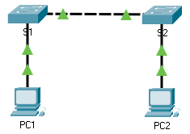

title: mod2-tp5-config-base-switch

# M02 TP5 - Packet Tracer - Configuration des paramètres initiaux du commutateur
*ENI TSSR 08 - Réseau & Téléphonie sur IP (ToIP)*

[TOC]



**Objectifs**

- Partie 1 : Vérifier la configuration par défaut du commutateur
- Partie 2 : Créer une configuration de commutateur de base
- Partie 3 : Configurer une bannière MOTD
- Partie 4 : Enregistrer les fichiers de configuration dans la mémoire NVRAM
- Partie 5 : Configurer S2

**Contexte**

Au cours de cet exercice, vous allez effectuer des configurations de base sur les commutateurs. Vous allez sécuriser l'accès à l'interface en ligne de commande (CLI) et aux ports de console à l'aide de mots de passe chiffrés et en texte clair. Vous découvrirez également comment configurer les messages destinés aux utilisateurs qui se connectent au commutateur. Ces bannières sont également utilisées pour prévenir les utilisateurs non autorisés que l'accès est interdit.

## Partie 1 : Vérifier la configuration par défaut du commutateur
### Étape 1 : Passez en mode d'exécution privilégié.

Vous pouvez accéder à toutes les commandes du commutateur en mode d'exécution privilégié. Toutefois, comme un grand nombre des commandes du mode privilégié permettent de configurer des paramètres d'exploitation, l'accès privilégié doit être protégé par mot de passe pour empêcher toute utilisation non autorisée.

Parmi les commandes du mode d'exécution privilégié, on retrouve celles du mode utilisateur, ainsi que la commande configure qui donne accès aux autres modes de commande.

1. Cliquez sur S1, puis sur l'onglet CLI. Appuyez sur Entrée.

2. Accédez au mode d'exécution privilégié en entrant la commande enable :

```Cisco
Switch> enable
Switch#
```

### Étape 2 : Examinez la configuration en cours du commutateur.

1. Entrez la commande `show running-config`.
```cisco
Switch# show running-config
```
2. Répondez aux questions suivantes :

- Combien d'interfaces FastEthernet le commutateur possède-t-il ? 2
- Combien d'interfaces Gigabit Ethernet le commutateur possède-t-il ? 0
- Quelle est la plage de valeurs affichée pour les lignes vty ?   ????
- Quelle commande affiche le contenu actuel de la mémoire vive non volatile (NVRAM) ? `show running-config`
- Pourquoi le commutateur indique-t-il que la configuration initiale startup-config est absente ? On a encore rien sauvegarder dedans.


## Partie 2 : Créer une configuration de commutateur de base
### Étape 1 : Attribuez un nom au commutateur.

Pour configurer les paramètres d'un commutateur, vous devrez peut-être passer d'un mode de configuration à l'autre. Notez dans ce cas que l'invite va changer.

```cisco
Switch# configure terminal
Switch(config)# hostname S1
S1(config)# exit
S1#
```

### Étape 2 : Sécurisez l'accès à la ligne de console.
Pour sécuriser l'accès à la ligne de console, accédez au mode config-line et choisissez le mot de passe de console **letmein**.

```cisco
S1#configure terminal
S1(config)# line console 0
S1(config-line)# password letmein
S1(config-line)# login
S1(config-line)# exit
S1(config)# exit

%SYS-5-CONFIG_I: Configured from console by console

S1#
```

**Q: Pourquoi la commande login est-elle requise ?**

### Étape 3 : Vérifiez que l'accès à la console est sécurisé.

Quittez le mode privilégié pour vérifier que le mot de passe de port de console est actif.

```cisco
S1# exit
Switch con0 is now available
Press RETURN to get started.

User Access Verification
Password:
S1>
```

**Remarque** : si le commutateur ne vous a pas demandé de mot de passe, cela signifie que vous n'avez pas configuré le paramètre login à l'étape 2.

### Étape 4 : Sécurisez l'accès au mode privilégié.
Définissez le mot de passe d'activation enable sur **c1$c0**. Ce mot de passe protège l'accès au mode privilégié.

**Remarque** : Le mot de passe ne sera pas considéré comme correct tant que vous ne l'aurez pas chiffré à l'Étape 8.

```cisco
S1> enable
S1#configure terminal
S1(config)# enable password c1$c0
S1(config)# exit
%SYS-5-CONFIG_I: Configured from console by console
S1#
```

### Étape 5 : Vérifiez que l'accès au mode privilégié est sécurisé.

1. Réexécutez la commande exit pour vous déconnecter du commutateur.
2. Appuyez sur <kbd>Entrée</kbd> et le système vous demandera maintenant d'entrer un mot de passe :
```cisco
User Access Verification
Password:
```
3. Le premier mot de passe est le mot de passe de console que vous avez configuré pour `line con 0`. Entrez ce mot de passe pour revenir au mode d'exécution utilisateur.
4. Entrez la commande pour accéder au mode privilégié.
5. Entrez le deuxième mot de passe que vous avez configuré afin de protéger le mode d'exécution privilégié.
6. Vérifiez votre configuration en examinant le contenu du fichier de configuration en cours.
```cisco
S1# show running-config
```

### Étape 6: Configurez un mot de passe chiffré pour sécuriser l'accès au mode privilégié.

Le mot de passe d'activation (`enable password`) doit être remplacé par le mot de passe secret chiffré plus récent à l'aide de la commande `enable secret`. Définissez **itsasecret** en tant que mot de passe secret actif.

```cisco
S1# config t
S1(config)# enable secret itsasecret
S1(config)# exit
S1#
```

**Remarque** : le mot de passe secret actif (`enable secret`) remplace le mot de passe d'activation (`enable`). Si les deux mots de passe sont configurés sur le commutateur, vous devez entrer le mot de passe secret actif (`enable secret`) pour accéder au mode d'exécution privilégié.

### Étape 7 : Vérifiez que le mot de passe secret actif (enable secret) a été ajouté au fichier de configuration.
1. Réexécutez la commande show running-config afin de vérifier que le nouveau mot de passe secret actif (`enable secret`) a été configuré.
```cisco
S1# show run
```
2. Comment s'affiche le mot de passe secret actif (`enable secret`) ? en crypté

3. Pourquoi le mot de passe secret actif (`enable secret`) s'affiche-t-il différemment de ce qui a été configuré ?

### Étape 8 : Chiffrez les mots de passe d'activation (`enable`) et de console.

Comme vous l'avez remarqué à l'étape 7, le mot de passe secret actif (`enable secret`) a été chiffré, mais les mots de passe d'activation (`enable`) et de console (`console`) sont toujours en clair. Nous allons maintenant chiffrer ces mots de passe en clair à l'aide de la commande `service password-encryption`.

```cisco
S1# config t
S1(config)# service password-encryption
S1(config)# exit
```

**Q: Si vous configurez d'autres mots de passe sur le commutateur, seront-ils affichés en clair ou chiffrés dans le fichier de configuration ? Expliquez votre réponse.**

Le passage en mode secret écrase le mdp en clair avec le nouveau mdp chiffré.

## Partie 3 : Configurer une bannière MOTD
### Étape 1 : Configurer une bannière MOTD (message of the day ou message du jour).

```cisco
S1# config t
S1(config)# banner motd "This is a secure system. Authorized Access Only!"
S1(config)# exit

%SYS-5-CONFIG_I: Configured from console by console

S1#
```

1. Quand cette bannière s'affichera-t-elle ? A la connection au terminal
2. Pourquoi chaque commutateur doit-il avoir une bannière MOTD ? C'est recommandé par Cisco. Permet de décrire le router/switch pour rendre plus lisible son accès.

## Partie 4 : Enregistrer les fichiers de configuration dans la mémoire NVRAM
### Étape 1 : Vérifiez que la configuration est correcte à l'aide de la commande show run.
```cisco
show run
```

### Étape 2 : Enregistrez le fichier de configuration.

Vous avez terminé la configuration de base du commutateur. Sauvegardez le fichier de configuration en cours dans la mémoire vive non volatile pour vous assurer que les modifications apportées seront conservées en cas de réamorçage du système ou de coupure de courant.

```cisco
S1# copy running-config startup-config
Destination filename [startup-config]?[Enter]
Building configuration...
[OK]
```

**Q: Quelle est la version abrégée la plus courte de la commande `copy running-config startup-config` ?**  `cop r st`

### Étape 3 : Examinez le fichier de configuration initiale.

**Q: Quelle commande affiche le contenu de la mémoire NVRAM ?** `show startup-config`

**Q: Quelles modifications ont été enregistrées dans le fichier ?**

## Partie 5 : Configurer S2

Vous avez terminé la configuration de S1. Vous allez maintenant configurer S2. Si vous ne vous souvenez plus des commandes, reportez-vous aux parties 1 à 4 pour obtenir de l'aide.

Configurez S2 à l'aide des paramètres suivants :

1. Nom du périphérique : S2
2. Protégez l'accès à la console en utilisant le mot de passe letmein.
3. Configurez le mot de passe d'activation c1$c0 et le mot de passe secret actif itsasecret.
4. Créez le message suivant pour les personnes qui se connectent au commutateur :
```
Authorized access only. Unauthorized access is prohibited and violators will be prosecuted to the full extent of the law.
```
5. Chiffrez tous les mots de passe en clair.
6. Assurez-vous que la configuration est correcte.
7. Enregistrez le fichier de configuration afin d'éviter toute perte de données en cas de mise hors tension du commutateur.

```cisco
Switch> enable
Switch# configure terminal

Switch(config)# hostname S2

S2(config)# line console 0
S2(config-line)# password letmein
S2(config-line)# login
S2(config-line)# exit

S2(config)# enable password c1$c0
S2(config)# enable secret itsasecret
S2(config)# service password-encryption

S2(config)# banner motd "This is a secure system. Authorized Access Only!"

S2(config)# show running-config

S2(config)# exit 
S2# cop run start
```


<link rel="stylesheet" type="text/css" href=".ressources/css/style.css">