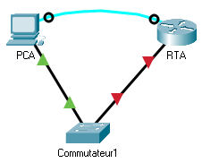

title: mod3-tp3-ssh

# M03 TP3 - Packet Tracer - Configure Secure Passwords and SSH
*ENI TSSR 08 - Réseau & Téléphonie sur IP (ToIP)*

[TOC]





**Addressing Table**

| Device       | Interface | IP Address | Subnet Mask   | Default Gateway |
|:-------------|:----------|:-----------|:--------------|:----------------|
| RTA          | G0/0      | 172.16.1.1 | 255.255.255.0 | n/a             | 
| PCA          | NIC       | 172.16.1.10| 255.255.255.0 | 172.16.1.1      | 
| Commutateur1 | VLAN 1    | 172.16.1.2 | 255.255.255.0 | 172.16.1.1      | 


**Scénario**

L'administrateur réseau vous a demandé de préparer RTA et SW1 pour le déploiement. Avant qu'ils puissent être connectés au réseau, les mesures de sécurité doivent être activées.

### Étape 1 : Configurer la sécurité de base sur le routeur
Ouvrez une invite de commandes.

1. Configurez l'adressage IP sur le PCA en fonction du tableau d'adressage.

clic **PCA** > **IP Configuration** > entrer ip + mask

2. Console dans RTA depuis le terminal sur PCA.

clic **PCA** > **Terminal** > (connection automatique) 

3. Configurez le nom d'hôte comme RTA.
```
Router# conf t 
Router(config)# hostname RTA 
```

4. Configurer l'adressage IP sur RTA et activer l'interface.
```
RTA(config)# interface g0/0 
RTA(config-if)# ip address 172.16.1.1 255.255.255.0
RTA(config-if)# no shutdown
```

5. Cryptez tous les mots de passe en texte clair.
```
RTA(config)# service password-encryption
```

6. Fixez la longueur minimale du mot de passe à 10.
```
RTA(config)# security password min-length 10
```
7. Définissez un mot de passe secret fort de votre choix. 

**Remarque**: Choisissez un mot de passe dont vous vous souviendrez, ou vous devrez réinitialiser l'activité si vous êtes verrouillé hors de l'appareil.

```
RTA(config)# enable secret itsasecret
```

8. Désactiver la recherche DNS.
```
RTA(config)# no ip domain-lookup
```

9. Réglez le nom de domaine sur CCNA.com (sensible à la casse pour la notation en PT).
```
RTA(config)# ip domain-name CCNA.com
```

10. Créez un utilisateur de votre choix avec un mot de passe fortement crypté.
```
RTA(config)# username any_user secret any_password
```

```
RTA(config)# username reno secret itsasecret
```

11. Générer des clés RSA de 1024 bits.

**Remarque** : Dans Packet Tracer, entrez la commande `crypto key generate rsa` et appuyez sur Entrée pour continuer.

```
RTA(config)# crypto key generate rsa
Le nom des clés sera : **RTA.CCNA.com**

Choisissez la taille du module-clé dans la fourchette de 360 à 2048 pour votre 
Clés à usage général. Le choix d'un module clé supérieur à 512 peut nécessiter
quelques minutes.

Combien de bits dans le module [512] : 1024
```

12. Bloquez pendant **trois minutes** toute personne qui ne se connecte pas après **quatre** tentatives dans un délai de deux minutes.

```
RTA(config)# login block-for 180 attempts 4 within 120
```

13. Configurez toutes les lignes VTY pour l'accès SSH et utilisez les profils d'utilisateurs locaux pour l'authentification.

```
RTA(config)# line vty 0 4
RTA(config-line)# transport input ssh
RTA(config-line)# login local
```

14. Réglez le délai d'attente du mode EXEC à 6 minutes sur les lignes VTY.

```
RTA(config-line)# exec-timeout 6
```

15. Enregistrez la configuration en NVRAM.

```
RTA#cop run start
Destination filename [startup-config]? 
Building configuration...
[OK]
RTA#
```

16. Accédez à l'invite de commande sur le bureau de PCA pour établir une connexion SSH à RTA.

```
C:\> ssh /?
Packet Tracer PC SSH
Usage: SSH -l username target
C:\ >
```

```
C:\> ssh -l reno 172.16.1.1
Password: <itsasecret>

RTA>
```

### Étape 2 : Configurer la sécurité de base sur le commutateur
Configurez le commutateur **SW1** avec les mesures de sécurité correspondantes. Reportez-vous aux étapes de configuration sur le routeur si vous avez besoin d' aide supplémentaire.

1. Cliquez sur **SW1** et sélectionnez l'onglet **CLI**.

2. Configurez le nom d'hôte comme **SW1**.

```
Switch>en
Switch#conf t
Enter configuration commands, one per line.  End with CNTL/Z.
Switch(config)#hostname SW1
```

3. Configurez l'adressage IP sur le **VLAN1** **SW1** et activez l'interface.

```
SW1(config)#interface vlan 1
SW1(config-if)#ip address 172.16.1.2 255.255.255.0
SW1(config-if)#no shutdown

SW1(config-if)#
%LINK-5-CHANGED: Interface Vlan1, changed state to up

%LINEPROTO-5-UPDOWN: Line protocol on Interface Vlan1, changed state to up
```

4. Configurez l'adresse de passerelle par défaut.

```
SW1(config-if)#ip default-gateway 172.16.1.1
```

5. Désactivez tous les ports de commutation inutilisés.

**Remarque** : Sur un commutateur, il est une bonne pratique de sécurité de désactiver les ports inutilisés. 
Une méthode pour le faire consiste simplement à arrêter chaque port avec la commande '**shutdown**'. Cela nécessiterait d'accéder à chaque port individuellement. 
Il existe une méthode de raccourci pour apporter des modifications à plusieurs ports à la fois à l'aide de la commande **interface range**.

Sur **SW1**, tous les ports sauf FastEtherNet0/1 et GigabiteThernet0/1 peuvent être fermés avec la commande suivante :

```
SW1(config)# interface range F0/2-24, G0/2
SW1(config-if-range)# shutdown
%LIEN 5 MODIFIÉ : Interface FastEthernet0/2, a changé d'état pour passer en mode administratif down

%LIEN 5 MODIFIÉ : Interface FastEthernet0/3, a changé d'état pour passer en mode administratif down
%LIEN 5 MODIFIÉ : Interface FastEthernet0/24, a changé d'état pour passer en mode administratif down

%LIEN 5 MODIFIÉ : Interface FastEthernet0/24, a changé d'état pour passer en mode administratif down
```

```
SW1(config)#interface range f0/2-24, g0/2
SW1(config-if-range)#shutdown
%LINK-5-CHANGED: Interface FastEthernet0/2, changed state to administratively down
%LINK-5-CHANGED: Interface FastEthernet0/3, changed state to administratively down
[...]
%LINK-5-CHANGED: Interface FastEthernet0/24, changed state to administratively down
%LINK-5-CHANGED: Interface GigabitEthernet0/2, changed state to administratively down
SW1(config-if-range)#
SW1(config-if-range)#exit
```

La commande utilisait la plage de ports de 2 à 24 pour les ports FastEthernet, puis une plage de ports unique de GigabiteThernet0/2.

6. Cryptez tous les mots de passe en texte clair.

```
SW1(config)#service password-encryption 
```

7. Définissez un mot de passe secret fort de votre choix.

```
SW1(config)#enable secret itsasecret
```

8. Désactiver la recherche DNS.

```
SW1(config)#no ip domain-lookup
```

9. Réglez le nom de domaine sur **CCNA.com** (sensible à la casse pour la notation en PT).

```
SW1(config)#ip domain-name CCNA.com
```

10. Créez un utilisateur de votre choix avec un mot de passe fortement crypté.

```
SW1(config)#username admin secret iamtheadmin
```

11. Générer des clés RSA de 1024 bits.

```
SW1(config)#crypto key generate rsa
The name for the keys will be: SW1.CCNA.com
Choose the size of the key modulus in the range of 360 to 2048 for your
  General Purpose Keys. Choosing a key modulus greater than 512 may take
  a few minutes.

How many bits in the modulus [512]: 1024
% Generating 1024 bit RSA keys, keys will be non-exportable...[OK]
```

12. Configurez toutes les lignes VTY pour l'accès SSH et utilisez les profils d'utilisateurs locaux pour l'authentification.

```
SW1(config)#line vty 0 4
*Mar 1 6:57:29.400: %SSH-5-ENABLED: SSH 1.99 has been enabled
SW1(config-line)#transport input ssh
SW1(config-line)#login local
```

13. Réglez le délai d'attente du mode EXEC à 6 minutes sur toutes les lignes VTY.

```
SW1(config-line)#exec-timeout 6
SW1(config-line)#end
```

14. Enregistrez la configuration en NVRAM.

```
SW1# cop run start
Destination filename [startup-config]? 
Building configuration...
[OK]
SW1#
```

- - -

```
Router>en
Router#conf t
Enter configuration commands, one per line.  End with CNTL/Z.
Router(config)#hostname RTA
RTA(config)#interface g0/0
RTA(config-if)#ip add
RTA(config-if)#ip address 172.16.1.1 255.255.255.0
RTA(config-if)#no shutdown

RTA(config-if)#
%LINK-5-CHANGED: Interface GigabitEthernet0/0, changed state to up

%LINEPROTO-5-UPDOWN: Line protocol on Interface GigabitEthernet0/0, changed state to up

RTA(config-if)#
RTA(config-if)#exit
RTA(config)#end
RTA#
%SYS-5-CONFIG_I: Configured from console by console

RTA#cop run start
Destination filename [startup-config]? 
Building configuration...
[OK]
RTA#
RTA#conf t
Enter configuration commands, one per line.  End with CNTL/Z.
RTA(config)#service password-encryption 
RTA(config)#security password min-length 10
RTA(config)#enable secret itsasecret
RTA(config)#no ip domain-lookup

RTA(config)#ip domain-name CCNA.com
RTA(config)#username reno secret itsasecret

RTA(config)#crypto key generate rsa
The name for the keys will be: RTA.CCNA.com
Choose the size of the key modulus in the range of 360 to 2048 for your
  General Purpose Keys. Choosing a key modulus greater than 512 may take
  a few minutes.

How many bits in the modulus [512]: 1024
% Generating 1024 bit RSA keys, keys will be non-exportable...[OK]

*Mar 1 6:35:36.607: %SSH-5-ENABLED: SSH 1.99 has been enabled
RTA(config)#login block-for 180 attempts  4 within 120
RTA(config)#line vty 0 4
RTA(config-line)#transport input ssh
RTA(config-line)#login local
RTA(config-line)#exec-timeout 6
RTA(config-line)#end
RTA#
%SYS-5-CONFIG_I: Configured from console by console

RTA#cop run start
Destination filename [startup-config]? 
Building configuration...
[OK]
RTA#
```

**Etape 2**

```
Switch>en
Switch#conf t
Enter configuration commands, one per line.  End with CNTL/Z.
Switch(config)#hostname SW1

SW1(config)#interface vlan 1
SW1(config-if)#ip address 172.16.1.2 255.255.255.0
SW1(config-if)#no shutdown

SW1(config-if)#
%LINK-5-CHANGED: Interface Vlan1, changed state to up

%LINEPROTO-5-UPDOWN: Line protocol on Interface Vlan1, changed state to up

SW1(config-if)#ip default-gateway 172.16.1.1
SW1(config)#interface range f0/2-24, g0/2
SW1(config-if-range)#shutdown

%LINK-5-CHANGED: Interface FastEthernet0/2, changed state to administratively down
%LINK-5-CHANGED: Interface FastEthernet0/3, changed state to administratively down
[...]
%LINK-5-CHANGED: Interface FastEthernet0/24, changed state to administratively down
%LINK-5-CHANGED: Interface GigabitEthernet0/2, changed state to administratively down
SW1(config-if-range)#
SW1(config-if-range)#exit

SW1(config)#service password-encryption 
SW1(config)#enable secret itsasecret

SW1(config)#no ip domain-lookup
SW1(config)#ip domain-name CCNA.com

SW1(config)#username admin secret iamtheadmin

SW1(config)#crypto key generate rsa
The name for the keys will be: SW1.CCNA.com
Choose the size of the key modulus in the range of 360 to 2048 for your
  General Purpose Keys. Choosing a key modulus greater than 512 may take
  a few minutes.

How many bits in the modulus [512]: 1024
% Generating 1024 bit RSA keys, keys will be non-exportable...[OK]

SW1(config)#line vty 0 4
*Mar 1 6:57:29.400: %SSH-5-ENABLED: SSH 1.99 has been enabled
SW1(config-line)#transport input ssh
SW1(config-line)#login local
SW1(config-line)#exec-timeout 6
SW1(config-line)#end
SW1# cop run start
Destination filename [startup-config]? 
Building configuration...
[OK]
SW1#
```


<link rel="stylesheet" href="../.ressources/css/style.css">