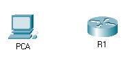

title: mod4-tp1-routeur

# M04 TP1 - Packet Tracer - Configuration des paramètres initiaux du routeur

*ENI TSSR 08 - Réseau & ToIP*

[TOC]




**Objectives**

- Partie 1 : vérifier la configuration par défaut du routeur
- Partie 2 : configurer et vérifier la configuration initiale du routeur
- Partie 3 : enregistrer le fichier de configuration en cours

**Contexte**

Au cours de cet exercice, vous allez effectuer des **configurations de base sur les routeurs**. 

Vous sécuriserez l'accès au port de console et CLI à l'aide de mots de passe chiffrés. et configurer les messages affichés lors de la connexion des utilisateurs au routeur. Ces bannières avertiront les intrus que l'accès est interdit. 

Enfin, vous allez vérifier et enregistrer votre configuration en cours.

## Partie 1 : vérifier la configuration par défaut du routeur
### Etape 1 : Établissez une connexion console avec R1.

a. Choisissez le câble bleu **Console** parmi les connexions disponibles.

b. Cliquez sur **PCA**, puis sélectionnez **RS 232**.

c. Faites glisser le câble, cliquez sur **R1**, puis sélectionnez **Console**.

d. Cliquez sur **PCA** > onglet **Desktop** > **Terminal**.

e. Cliquez sur **OK**, puis appuyez sur <kbd>Entrée</kbd>. Vous êtes maintenant en mesure de configurer **R1**.

### Etape 2 : Accédez au mode privilégié, puis examinez la configuration actuelle.

Vous pouvez accéder à l'ensemble des commandes du routeur en mode d'exécution privilégié. 

Toutefois, comme un grand nombre de commandes du mode privilégié permettent de configurer des paramètres système, l'accès privilégié doit être protégé par mot de passe pour empêcher toute utilisation non autorisée.

a. Accédez au **mode d'exécution privilégié** en entrant la commande `enable`.

```
Router> enable
Router#
```

b. Saisissez la commande `show running-config` :

```
Router# show running-config
```

c. Répondez aux questions suivantes :

**Q: Quel est le nom d'hôte du routeur ?** Router

**Q: Combien d'interfaces Fast Ethernet le routeur possède-t-il ?** 4

**Q: Combien d'interfaces Gigabit Ethernet le routeur possède-t-il ?** 2

**Q: Combien d'interfaces série le routeur possède-t-il ?** 2

**Q: Quelle est la plage de valeurs affichée pour les lignes vty ?** 0 à 4

d. Examinez le contenu actuel de la mémoire vive non volatile (NVRAM).

```
Router# show startup-config
startup-config is not present
```

**Q: Pourquoi le routeur répond-il avec le message startup-config is not present ?** Parce qu'on a encore rien enregistré dedans. 

## Partie 2 : configurer et vérifier la configuration initiale du routeur
### Etape 1 :Configurez les paramètres initiaux du routeur R1.

a. Configurez **R1** comme nom d'hôte.

```
Router# conf t
Router(config)# hostname R1
```

b. Configurez **letmein** comme mot de passe console, puis activez la connexion.

```
R1(config)# line console 0 
R1(config-line)# password letmein
R1(config-line)# login
R1(config-line)# exit
```

c. Configurez **itsasecret** comme mot de passe du mode d'exécution privilégié chiffré.

```
R1(config)# enable secret itsasecret
```

d. Chiffrez tous les mots de passe en clair.


```
R1(config)# service password-encryption
```


e. Configurez une bannière **MOTD** (message of the day, ou message du jour) pour avertir les utilisateurs en cas d'accès non autorisé.

Un exemple de bannière peut afficher le message Unauthorized access is strictly prohibited (Tout accès non autorisé est strictement interdit).


```
R1(config)# banner motd 'Router R1'
```

### Etape 2 :Vérifiez les paramètres initiaux du routeur R1.

a. Vérifiez les paramètres initiaux en affichant la configuration de **R1**. 

**Q: Quelle commande utilisez-vous ?** 

```
R1# show startup-config
```

b. Quittez la session actuelle en mode console jusqu'à ce que le message suivant apparaisse :

```
R1 con0 is now available
Press RETURN to get started.
```

c. Appuyez sur <kbd>Entrée</kbd> pour obtenir le message suivant :

```
Unauthorized access is strictly prohibited. (Accès sans autorisation strictement interdit.)

User Access Verification

Password:
```

**Q: Pourquoi chaque routeur doit-il avoir une bannière de message du jour (MOTD) ?**

Question de securité. Permet de donner des info sur le routeur.


**Q: Si vous n'êtes pas invité à entrer un mot de passe, quelle commande de ligne de console avez-vous oublié de configurer ?**

La commande `login`

d. Entrez les mots de passe requis pour revenir au mode d'exécution privilégié.

**Q: Si vous configurez d'autres mots de passe sur le routeur, s'affichent-ils dans le fichier de configuration en texte clair ou chiffrés ? Expliquez votre réponse.**

Oui.

Test :
```
conf t 
line vty 1
password testttttt
exit
sh run 
```

## Partie 3 : enregistrer le fichier de configuration en cours
### Etape 1 : Enregistrez le fichier de configuration dans la mémoire NVRAM.

a. Vous avez configuré les paramètres initiaux du routeur **R1**. 
Sauvegardez le fichier de configuration en cours dans la mémoire vive non volatile pour vous assurer que les modifications apportées seront conservées en cas de redémarrage du système ou de coupure de courant.

**Q: Quelle commande avez-vous exécutée pour enregistrer la configuration dans la mémoire NVRAM ?**

```
R1# copy running-config startup-config
```

**Q: Quelle est la version la plus courte et non ambiguë de cette commande ?**

```
R1# cop run start
```

**Q: Quelle commande affiche le contenu de la mémoire NVRAM ?**

```
R1# show startup-config
```


### Etape 2 (bonus facultatif) : Enregistrez le fichier de configuration initiale dans la mémoire Flash.

Vous en apprendrez plus sur la gestion du stockage Flash d'un routeur dans les chapitres ultérieurs. 
Toutefois, sachez qu'en guise de procédure de sauvegarde supplémentaire, vous pouvez enregistrer votre fichier de configuration initiale dans la mémoire **Flash**. 

Par défaut, le routeur continue à charger la configuration initiale à partir de la mémoire **NVRAM**, mais si cette mémoire est endommagée, vous pouvez restaurer la configuration initiale en la copiant à partir de la mémoire **Flash**.

Procédez comme suit pour enregistrer la configuration initiale dans la mémoire **Flash**.

a. Examinez le contenu de la mémoire **Flash** à l'aide de la commande `show flash` :

```
R1# show flash
```

**Q: Combien de fichiers sont actuellement stockés dans la mémoire Flash ?** 3

**Q: Selon vous, lequel de ces fichiers est le fichier d'image IOS ?**

**Q: Pourquoi pensez-vous que ce fichier est le fichier d'image IOS ?**

b. Enregistrez le fichier de configuration initiale dans la mémoire Flash à l'aide des commandes suivantes :

```
R1# copy startup-config flash
Destination filename [startup-config]
```

Le routeur vous invite à stocker le fichier dans la mémoire Flash avec le nom entre parenthèses. 
Si le nom vous convient, appuyez sur Entrée, sinon, tapez un nom approprié et appuyez sur Entrée.

c. Utilisez la commande `show flash` pour vérifier que le fichier de configuration initiale est à présent stocké dans la mémoire Flash.

 
<link rel="stylesheet" href="../.ressources/css/style.css">
 