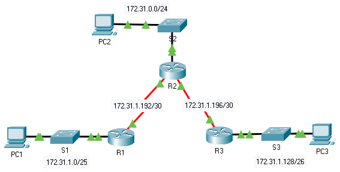

title: mod4-tp4-routage

# M04 TP4 - Packet Tracer - Configuring IPv4 Static and Default Routes
*ENI TSSR 08 - Réseau & ToIP*

[TOC]




**Addressing Table**

| Device | Interface | IP Address | Subnet Mask | Default Gateway |
|:--|:--|:--|:--|:--|
| **R1** | G0/0 | 172.31.1.1 | 255.255.255.128 | N/A |
| **R1** | S0/0/0 | 172.31.1.194 | 255.255.255.252 | N/A |
| **R2** | G0/0 | 172.31.0.1 | 255.255.255.0 | N/A |
| **R2** | S0/0/0 | 172.31.1.193 | 255.255.255.252 | N/A |
| **R2** | S0/0/1 | 172.31.1.197 | 255.255.255.252 | N/A |
| **R3** | G0/0 | 172.31.1.129 | 255.255.255.192 | N/A |
| **R3** | S0/0/1 | 172.31.1.198 | 255.255.255.252 | N/A |
| **PC1** | NIC | 172.31.1.126 | 255.255.255.128 | N/A |
| **PC2** | NIC | 172.31.0.254 | 255.255.255.0 | N/A |
| **PC3** | NIC | 172.31.1.190 | 255.255.255.192 | N/A |

**Objectives**

- Part 1: Examine the Network and Evaluate the Need for Static Routing
- Part 2: Configure Static and Default Routes
- Part 3: Verify Connectivity

**Background**

In this activity, you will configure static and default routes. 

A static route is a route that is entered manually by the network administrator to create a reliable and safe route. 

There are four different static routes that are used in this activity:

- a **recursive static route**, 
- a **directly attached static route**, 
- a **fully specified static route**, and 
- a **default route**.

## Part 1: Examine the Network and Evaluate the Need for Static Routing

a. Looking at the topology diagram, how many networks are there in total? 

5

b. How many networks are directly connected to **R1**, **R2**, and **R3**? 

- R1 : 2
- R2 : 3
- R3 : 2

c. How many static routes are required by each router to reach networks that are not directly connected?


<div class="answer">
	<ul>
		<li>R1 needs 3 static routes</li>
		<li>R2 needs 2 static routes </li>
		<li>R3 needs 3 static routes </li>
	</ul>
</div>

d. Test connectivity to the **R2** and **R3** LANs by pinging **PC2** and **PC3** from **PC1**.

**Q: Why were you unsuccessful?** <span class="answer">Because there are no routes to these networks on **R1**.</span>

## Part 2: Configure Static and Default Routes
### Step 1: Configure recursive static routes on R1.

a. What is recursive static route?

<div class="answer">
<p>
	A recursive static route relies on the next hop router in order for packets to be sent to its destination.<br>
	A recursive static route requires 2 routing table lookups.
</p>
<p>
	A recursive route occurs when a route either static or dynamically learned has a next-hop that is not directly connected to the local router.
</p>
<p>
	When a router needs to perform a second lookup in the routing table is called <strong>recursion</strong>.
</p>
</div>

b. Why does a recursive static route require two routing table lookups?

<span class="answer">It must first look in the routing table for the <b>destination network</b> and then look up the <b>exit interface</b> / <b>direction of the network</b> for the next hop router.</span>

c. Configure a recursive static route to every network not directly connected to **R1**, including the WAN link between **R2** and **R3**.

```
R1(config)#ip route 172.31.0.0 255.255.255.0 172.31.1.193
R1(config)#ip route 172.31.1.196 255.255.255.252 172.31.1.193
R1(config)#ip route 172.31.1.128 255.255.255.192 172.31.1.193
```

d. Test connectivity to the **R2** LAN and ping the IP addresses of **PC2** and **PC3**.

<span class="answer">Pings failed. Because R1 has a route to R2 and R3 LANs, but R2 and R3 do not have a route to R1.</span>

### Step 2: Why were you unsuccessful? Configure directly attached static routes on R2.

a. How does a directly attached static route differ from a recursive static route? 

<span class="answer">A directly attached static route relies on its exit interface in order for packets to be sent to its destination, while a recursive static route uses the IP address of the next hop router.</span>

b. Configure a directly attached static route from **R2** to every network not directly connected.

```
R2(config)#ip route 172.31.1.0 255.255.255.128 Serial0/0/0
R2(config)#ip route 172.31.1.128 255.255.255.192 Serial0/0/1

R2(config)#ip route 172.31.1.0 255.255.255.128 172.31.1.194
R2(config)#ip route 172.31.1.128 255.255.255.192 172.31.1.198
```

c. Which command only displays **directly connected networks**?

```
R1#sh ip route connected
 C   172.31.1.0/25    is directly connected, GigabitEthernet0/0
 C   172.31.1.192/30  is directly connected, Serial0/0/0
```

d. Which command only displays the **static routes listed in the routing table**?

```
R1#sh ip route static
     172.31.0.0/16 is variably subnetted, 7 subnets, 5 masks
S       172.31.0.0/24   [1/0] via 172.31.1.193
S       172.31.1.128/26 [1/0] via 172.31.1.193
S       172.31.1.196/30 [1/0] via 172.31.1.193
```

e. When viewing the entire routing table, how can you distinguish between a **directly attached static route** and a **directly connected network**?

<span class="answer">The static route has an <strong>S</strong> and a directly connected network has a <strong>C</strong>.</span>


### Step 3: Configure a default route on R3.

a. How does a default route differ from a regular static route? 

<span class="answer">A <b>default route</b>, also known as the gateway of last resort, is the network route used by a router when no other known route exists for a destination network. A <b>static route</b> is used to route traffic to a specific network.</span>

b. Configure a default route on **R3** so that every network not directly connected is reachable.

```
R3(config)#ip route 0.0.0.0 0.0.0.0 s0/0/1
%Default route without gateway, if not a point-to-point interface, may impact performance
```


c. How is a static route displayed in the routing table?

```
R3#sh ip route
Codes: L - local, C - connected, S - static, R - RIP, M - mobile, B - BGP
       D - EIGRP, EX - EIGRP external, O - OSPF, IA - OSPF inter area
       N1 - OSPF NSSA external type 1, N2 - OSPF NSSA external type 2
       E1 - OSPF external type 1, E2 - OSPF external type 2, E - EGP
       i - IS-IS, L1 - IS-IS level-1, L2 - IS-IS level-2, ia - IS-IS inter area
       * - candidate default, U - per-user static route, o - ODR
       P - periodic downloaded static route

Gateway of last resort is 0.0.0.0 to network 0.0.0.0

     172.31.0.0/16 is variably subnetted, 5 subnets, 4 masks
S       172.31.0.0/24 is directly connected, Serial0/0/1
C       172.31.1.128/26 is directly connected, GigabitEthernet0/0
L       172.31.1.129/32 is directly connected, GigabitEthernet0/0
C       172.31.1.196/30 is directly connected, Serial0/0/1
L       172.31.1.198/32 is directly connected, Serial0/0/1
S*   0.0.0.0/0 is directly connected, Serial0/0/1
```

<span class="answer">S* 0.0.0.0/0</span>

### Step 4: Document the commands for fully specified routes.

**Note**: Packet Tracer does not currently support configuring fully specified static routes. Therefore, in this step, document the configuration for fully specified routes.

a. Explain a fully specified route. 

<span class="answer">A fully specified route is a <b>static route with an exit interface and the next hop address</b>. </span>

b. Which command provides a fully specified static route from **R3** to the **R2** LAN?

<span class="answer">R3(config)# ip route 172.31.0.0 255.255.255.0 s0/0/1 172.31.1.197</span>

b. Write a fully specified route from **R3** to the network between **R2** and **R1**. Do not configure the route; just calculate it.

<span class="answer">R3(config)# ip route 172.31.1.192 255.255.255.252 s0/0/1 172.31.1.197</span>

c. Write a fully specified static route from **R3** to the **R1** LAN. Do not configure the route; just calculate it.

<span class="answer">R3(config)# ip route 172.31.1.0 255.255.255.128 s0/0/1 172.31.1.197</span>

### Step 5: Verify static route configurations.

Use the appropriate **show** commands to verify correct configurations.

Which **show** commands can you use to verify that the static routes are configured correctly?

<div class="answer">
	<ul>
	    <li><code>show ip route</code></li>
	    <li><code>show ip route static</code></li>
	    <li><code>show ip route [NETWORK]</code></li>
	</ul>
</div>

## Part 3: Verify Connectivity

Every device should now be able to ping every other device. If not, review your static and default route configurations.

 
<link rel="stylesheet" href="../.ressources/css/style.css">
 