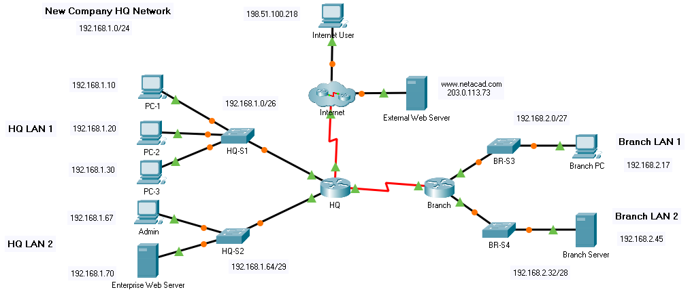

title: mod5-tp4-acls-implementation

# M05 TP4 - Packet Tracer - IPv4 ACL Implementation Challenge
*ENI TSSR 08 - Réseau & ToIP*

[TOC]



**Addressing Table**

|Device|Interface|IPAddress|
|:--|:--|:--|
|HQ|G0/0/0|192.168.1.1/26|
|HQ|G0/0/1|192.168.1.65/29|
|HQ|S0/1/0|192.0.2.1/30|
|HQ|S0/1/1|192.168.3.1/30|
|Branch|G0/0/0|192.168.2.1/27|
|Branch|G0/0/1|192.168.2.33/28|
|Branch|S0/1/1|192.168.3.2/30|
|PC-1|NIC|192.168.1.10/26|
|PC-2|NIC|192.168.1.20/26|
|PC-3|NIC|192.168.1.30/26|
|Admin|NIC|192.168.1.67/29|
|Enterprise Web Server|NIC|192.168.1.70/29|
|Branch PC|NIC|192.168.2.17/27|
|Branch Server|NIC|192.168.2.45/28|
|Internet User|NIC|198.51.100.218/24|
|External Web Server|NIC|203.0.113.73/24|

**Objectives**

- Configure a router with standard named ACLs.
- Configure a router with extended named ACLs.
- Configure a router with extended ACLs to meet specific communication requirements.
- Configure an ACL to control access to network device terminal lines.
- Configure the appropriate router interfaces with ACLs in the appropriate direction.
- Verify the operation of the configured ACLs.

**Background / Scenario**

In this activity you will configure extended, standard named, and extended named ACLs to meet specified communication requirements.


## Part 1: Verify Connectivity in the New Company Network
First, test connectivity on the network as it is before configuring the ACLs. All hosts should be able to ping all other hosts.

## Part 2: Configure Standard and Extended ACLs per Requirements.
Configure ACLs to meet the following requirements:

**Important guidelines**:

- Do not use explicit deny any statements at the end of your ACLs.
- Use shorthand (**host** and **any**) whenever possible.
- Write your ACL statements to address the requirements in the order that they are specified here.
- Place your ACLs in the most efficient location and direction.

**ACL 1: Requirements**

- Create ACL 101.
- Explicitly block FTP access to the **Entreprise Web Server** from the internet.
- No ICMP traffic from the internet should be allowed to any hosts on **HQ LAN 1**
- Allow all other traffic.

ACL étendue. 
Source : Internet  R HQ s0/1/0
Destination : Entreprise Web Server 
Protocole : icmp 


```
HQ(config)#access-list 101 deny tcp any 192.168.1.0 0.0.0.63 eq ftp
HQ(config)#access-list 101 deny icmp any 192.168.1.0 0.0.0.63
HQ(config)#access
HQ(config)#access-list 101 permit ip any any
HQ(config)#int s0/1/0
HQ(config-if)#ip access-group 101 in
``` 

Check 

```
# sh run 
[...]
interface Serial0/1/0
 ip address 192.0.2.1 255.255.255.252
 ip access-group 101 in
[...]
access-list 101 deny tcp any 192.168.1.0 0.0.0.63 eq ftp
access-list 101 deny icmp any 192.168.1.0 0.0.0.63
access-list 101 permit ip any any
[...]
```

```
HQ#sh access-lists 
Extended IP access list 101
    10 deny tcp any 192.168.1.0 0.0.0.63 eq ftp
    20 deny icmp any 192.168.1.0 0.0.0.63
    30 permit ip any any (20 match(es))
```
Erreur ! On ne doit pas acceder en ftp sur le serveur web, on s'est trompé de LAN.

**Suppression d'une ligne** :
```
HQ(config)#ip access-list extended 101
HQ(config-ext-nacl)#no 10
HQ(config-ext-nacl)#10 deny tcp any 192.168.1.70 0.0.0.0 eq ftp
HQ(config-ext-nacl)#end

HQ#sh access-lists 
Extended IP access list 101
    10 deny tcp any host 192.168.1.70 eq ftp
    20 deny icmp any 192.168.1.0 0.0.0.63
    30 permit ip any any (20 match(es))
```


**ACL 2: Requirements**

- Use ACL number 111
- No hosts on **HQ LAN 1** should be able to access the **Branch Server**.
- All other traffic should be permitted.

```
HQ(config)#access-list 111 deny ip any host 192.168.2.45
HQ(config)#access-list 111 permit ip any any
HQ(config)#int g0/0/0
HQ(config-if)#ip access-group 111 in

HQ(config-if)#end
HQ#
%SYS-5-CONFIG_I: Configured from console by console
 
HQ#sh r
[...]
interface GigabitEthernet0/0/0
 ip address 192.168.1.1 255.255.255.192
 ip access-group 111 in
 duplex auto
 speed auto
[...]
interface Serial0/1/0
 ip address 192.0.2.1 255.255.255.252
 ip access-group 101 in
[...]
access-list 101 deny tcp any host 192.168.1.70 eq ftp
access-list 101 deny icmp any 192.168.1.0 0.0.0.63
access-list 101 permit ip any any
access-list 111 deny ip any host 192.168.2.45
access-list 111 permit ip any any
[...]
HQ#
```


**ACL 3: Requirements**

- Create a named standard ACL. Use the name **vty_block**. The name of your ACL must match this name exactly.
- Only addresses from the **HQ LAN 2** network should be able to access the VTY lines of the HQ router.

```
HQ(config)#ip access-list standard vty_block
HQ(config-std-nacl)#permit ?
  A.B.C.D  Address to match
  any      Any source host
  host     A single host address
HQ(config-std-nacl)#permit 192.168.1.64 0.0.0.7
HQ(config-std-nacl)#ex

HQ(config)#line vty 0 4
HQ(config-line)#ip access-class vty_block ?
  in   
  out  
HQ(config-line)#access-class vty_block in
```

**ACL 4: Requirements**

- Create a named extended ACL called **branch_to_hq**. The name of your ACL must match this name exactly.
- No hosts on either of the **Branch** LANs should be allowed to access **HQ LAN 1**. Use one access list statement for each of the **Branch** LANs.
- All other traffic should be allowed.

```
HQ(config)#ip access-list ?
  extended  Extended Access List
  standard  Standard Access List
HQ(config)#ip access-list extended ?
  <100-199>  Extended IP access-list number
  WORD        name
HQ(config)#ip access-list extended branch_to_hq

HQ(config-ext-nacl)#deny ip ?
  A.B.C.D  Source address
  any      Any source host
  host     A single source host
HQ(config-ext-nacl)#deny ip 192.168.2.0 0.0.0.31 ?
  A.B.C.D  Destination address
  any      Any destination host
  host     A single destination host
HQ(config-ext-nacl)#deny ip 192.168.2.0 0.0.0.31 192.168.1.0 0.0.0.63
HQ(config-ext-nacl)#deny ip 192.168.2.32 0.0.0.15 192.168.1.0 0.0.0.63
```

A faire sur BRANCH !! 


ip access-list extended branch_to_hq
deny ip 192.168.2.0 0.0.0.31 192.168.1.0 0.0.0.63
deny ip 192.168.2.32 0.0.0.15 192.168.1.0 0.0.0.63
interface s0/1/1
ip access-group branch_to_hq


## Part 3: Verify ACL Operation.
a. Perform the following connectivity tests between devices in the topology. Note whether or not they are successful.

**Note**: Use the `show ip access-lists` command to verify ACL operation. Use the clear access list counters command to reset the match counters.

_**Questions**:_

Send a ping request from **Branch PC** to the **Entreprise Web Server**. Was it successful? Explain.

Which ACL statement permitted or denied the ping between these two devices? List the access list name or number, the router on which it was applied, and the specific line that the traffic matched.

Attempt to ping from **PC-1** on the **HQ LAN 1** to the **Branch Server**. Was it successful? Explain.

Which ACL statement permitted or denied the ping between these two devices?

Open a web browser on the **External Server** and attempt to bring up a web page stored on the **Entreprise Web Server**. Is it successful? Explain.

Which ACL statement permitted or denied the ping between these two devices?


b. Test connections to an internal server from the internet.

_**Questions**:_

From the command line on the **Internet User PC**, attempt to make an FTP connection to the **Branch Server**. Is the FTP connection successful?

Which access list should be modified to prevent users from the Internet to make FTP connections to the **Branch Server**?

Which statement(s) should be added to the access list to deny this traffic?


<link rel="stylesheet" href="../.ressources/css/style.css">