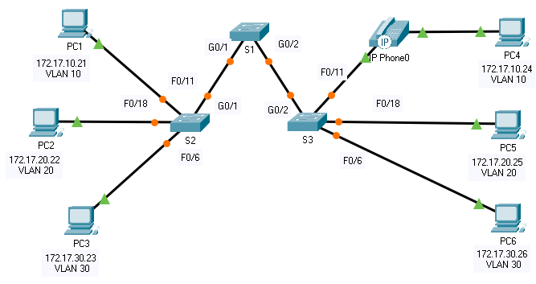

title: mod3-tp1-vlan

# M03 TP 1 - Packet Tracer - VLAN Configuration
*ENI TSSR 08 - Réseau & Téléphonie sur IP (ToIP)*

[TOC]





**Addressing Table**

| Device | Interface | IP Address   | Subnet Mask   | VLAN |
|:-------|:----------|:-------------|:--------------|:-----|
| PC1    | NIC       | 172.17.10.21 | 255.255.255.0 |   10 | 
| PC2    | NIC       | 172.17.10.22 | 255.255.255.0 |   20 | 
| PC3    | NIC       | 172.17.10.23 | 255.255.255.0 |   30 | 
| PC4    | NIC       | 172.17.10.24 | 255.255.255.0 |   10 | 
| PC5    | NIC       | 172.17.10.25 | 255.255.255.0 |   20 | 
| PC6    | NIC       | 172.17.10.26 | 255.255.255.0 |   30 | 


**Objectives**

- Part 1: Verify the Default VLAN Configuration
- Part 2: Configure VLANs
- Part 3: Assign VLANs to Ports

**Background**

VLANs are helpful in the administration of logical groups, allowing members of a group to be easily moved, changed, or added. This activity focuses on creating and naming VLANs, and assigning access ports to specific VLANs.


## Part 1: View the Default VLAN Configuration
### Step 1: Display the current VLANs.
On S1, issue the command that displays all VLANs configured. By default, all interfaces are assigned to **VLAN 1**.

```cisco
S1# show vlan brief

VLAN Name                             Status    Ports
---- -------------------------------- --------- -------------------------------
1    default                          active    Fa0/1, Fa0/2, Fa0/3, Fa0/4
                                                Fa0/5, Fa0/6, Fa0/7, Fa0/8
                                                Fa0/9, Fa0/10, Fa0/11, Fa0/12
                                                Fa0/13, Fa0/14, Fa0/15, Fa0/16
                                                Fa0/17, Fa0/18, Fa0/19, Fa0/20
                                                Fa0/21, Fa0/22, Fa0/23, Fa0/24
                                                Gig0/1, Gig0/2
1002 fddi-default                     active    
1003 token-ring-default               active    
1004 fddinet-default                  active    
1005 trnet-default                    active 
```

### Step 2: Verify connectivity between PCs on the same network.
Notice that each PC can ping the other PC that shares the same subnet.

- PC1 can ping PC4
- PC2 can ping PC5
- PC3 can ping PC6

Pings to hosts on other networks fail.

**Note**: ça ping ok parce que tlm est dans le même réseau, on n'a pas encore ségmenter avec les vlans.

**Q: What benefits can VLANs provide to the network?** Segmentation = securité

## Part 2: Configure VLANs
### Step 1: Create and name VLANs on S1.
1. Create the following VLANs. Names are case-sensitive and must match the requirement exactly:

- VLAN 10: Faculty/Staff
```
S1#(config)# vlan 10
S1#(config-vlan)# name Faculty/Staff
```

2. Create the remaining VLANS.

- VLAN 20: Students
- VLAN 30: Guest(Default)
- VLAN 99: Management&Native
- VLAN 150: VOICE

### Step 2: Verify the VLAN configuration.
**Q: Which command will only display the VLAN name, status, and associated ports on a switch??**

```cisco
S1# show vlan brief

VLAN Name                             Status    Ports
---- -------------------------------- --------- -------------------------------
1    default                          active    Fa0/1, Fa0/2, Fa0/3, Fa0/4
                                                Fa0/5, Fa0/6, Fa0/7, Fa0/8
                                                Fa0/9, Fa0/10, Fa0/11, Fa0/12
                                                Fa0/13, Fa0/14, Fa0/15, Fa0/16
                                                Fa0/17, Fa0/18, Fa0/19, Fa0/20
                                                Fa0/21, Fa0/22, Fa0/23, Fa0/24
                                                Gig0/1, Gig0/2
10   Faculty/Staff                    active    
20   Students                         active    
30   Guest(Default)                   active    
99   Management&Native                active    
150  VOICE                            active    
1002 fddi-default                     active    
1003 token-ring-default               active    
1004 fddinet-default                  active    
1005 trnet-default                    active 
```

### Step 3: Create the VLANs on S2 and S3.
Use the same commands from Step 1 to create and name the same VLANs on **S2** and **S3**.

### Step 4: Verify the VLAN configuration.

```cisco
S2# show vlan brief
```

## Part 3: Assign VLANs to Ports
### Step 1: Assign VLANs to the active ports on S2.
1. Configure the interfaces as access ports and assign the VLANs as follows:

- VLAN 10: FastEthernet 0/11
```
S2# conf t
S2(config)# interface f0/11
S2(config-if)# switchport mode access
S2(config-if)# switchport access vlan 10
```

2. Assign the remaining ports to the appropriate VLAN.

- VLAN 20: FastEthernet 0/18
```
S2# conf t
S2(config)# interface f0/18
S2(config-if)# switchport mode access
S2(config-if)# switchport access vlan 20
```
- VLAN 30: FastEthernet 0/6
```
S2# conf t
S2(config)# interface f0/6
S2(config-if)# switchport mode access
S2(config-if)# switchport access vlan 30
```

**Notes Correction**: on peut voir avec un show vlan brief que les port sont bien attribué à chaque interface.

### Step 2: Assign VLANs to the active ports on S3.
**S3** uses the same VLAN access port assignments as **S2**. Configure the interfaces as access ports and assign the VLANs as follows:

- VLAN 10: FastEthernet 0/11
- VLAN 20: FastEthernet 0/18
- VLAN 30: FastEthernet 0/6

```cisco
S3# conf t

S3(config)# interface f0/11
S3(config-if)# switchport mode access
S2(config-if)# switchport access vlan 10
S3(config-if)# exit

f0/11 sur schema est VOICE donc a corriger

S1(config)# interface fa0/11
S1(config-if)# switchport mode access
S1(config-if)# switchport access vlan 10
S1(config-if)# mls qos trust cos              ????
S1(config-if)# switchport voice vlan 120 

S3(config)# interface f0/18
S3(config-if)# switchport mode access
S3(config-if)# switchport access vlan 20
S3(config-if)# exit

S3(config)# interface f0/6
S3(config-if)# switchport mode access
S3(config-if)# switchport access vlan 30
S3(config-if)# exit

S3(config)# exit
S3# cop run start
```

### Step 3: Assign the VOICE VLAN to FastEthernet 0/11 on S3.
As shown in the topology, the **S3** FastEthernet 0/11 interface connects to a **Cisco IP Phone** and **PC4**. The IP phone contains an integrated three-port 10/100 switch. One port on the phone is labeled **Switch** and connects to F0/4. Another port on the phone is labeled **PC** and connects to **PC4**. The IP phone also has an internal port that connects to the IP phone functions.

The **S3** F0/11 interface must be configured to support _user traffic_ to **PC4** using **VLAN 10** and voice traffic to the IP phone using **VLAN 150**. The interface must also enable **QoS** and trust the **Class of Service (CoS)** values assigned by the IP phone. IP voice traffic requires a minimum amount of throughput to support acceptable voice communication quality. This command helps the switchport to provide this minimum amount of throughput.

```
S3(config)# interface f0/11
S3(config-if)# mls qos trust cos
S3(config-if)# switchport voice vlan 150
```

### Step 4: Verify loss of connectivity.
Previously, PCs that shared the same network could ping each other successfully.

Study the output of from the following command on **S2** and answer the following questions based on your knowledge of communication between VLANS. Pay close attention to the Gig0/1 port assignment.

```cisco
S2# show vlan brief
VLAN Name Status Ports
---- -------------------------------- --------- -------------------------------
1 default active Fa0/1, Fa0/2, Fa0/3, Fa0/4
Fa0/5, Fa0/7, Fa0/8, Fa0/9
Fa0/10, Fa0/12, Fa0/13, Fa0/14
Fa0/15, Fa0/16, Fa0/17, Fa0/19
Fa0/20, Fa0/21, Fa0/22, Fa0/23
Fa0/24, Gig0/1, Gig0/2
10 Faculty/Staff active Fa0/11
20 Students active Fa0/18
30 Guest(Default) active Fa0/6
99 Management&Native active
150 VOICE active
```

Try pinging between **PC1** and **PC4**. => Failed

**Q: Although the access ports are assigned to the appropriate VLANs, were the pings successful? Explain.**

Failed pings because ... il manque un trunk pour relier les vlan ?

**Q: What could be done to resolve this issue?**
```cisco
S1# conf t
S1(config)# interface <interface-id>
S1(config-if)# switchport mode trunk
S1(config-if)# switchport trunk native vlan <vlan-id>
S1(config-if)# switchport trunk allowed vlan <vlan-list>
S1(config-if)# end
```

**CORRECTION**
```
S2(config)# interface f0/11            (?? bonne interface ??)
S2(config-if)# switchport trunk native vlan 99
S2(config-if)# end 
```
on config trunk sur s2 seulement car le trunk est dynamiquement config sur les autres switchs. 

