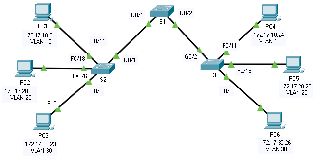

title: mod3-tp2-trunk

# M03 TP2 - Packet Tracer - Configure Trunk

*ENI TSSR 08 - Réseau & Téléphonie sur IP (ToIP)*

[TOC]





**Addressing Table**

| Device | Interface | IP Address | Subnet Mask | Switch Port | VLAN |
|:----|:----|:-------------|:--------------|:---------|:---|
| PC1 | NIC | 172.17.10.21 | 255.255.255.0 | S2 F0/11 | 10 | 
| PC2 | NIC | 172.17.10.22 | 255.255.255.0 | S2 F0/18 | 20 | 
| PC3 | NIC | 172.17.10.23 | 255.255.255.0 | S2 F0/6  | 30 | 
| PC4 | NIC | 172.17.10.24 | 255.255.255.0 | S2 F0/11 | 10 | 
| PC5 | NIC | 172.17.10.25 | 255.255.255.0 | S2 F0/18 | 20 | 
| PC6 | NIC | 172.17.10.26 | 255.255.255.0 | S2 F0/6  | 30 | 


**Objectives**

- Part 1: Verify VLANs
- Part 2: Configure Trunks

**Background**

Trunks are required to pass VLAN information between switches. A port on a switch is either an access port or a trunk port. Access ports carry traffic from a specific VLAN assigned to the port. A trunk port by default is a member of all VLANs. Therefore, it carries traffic for all VLANs. This activity focuses on creating trunk ports and assigning them to a native VLAN other than the default.


## Part 1: Verify VLANs
### Step 1: Display the current VLANs.
1. On S1, issue the command that will display all VLANs configured. There should be ten VLANs in total. Notice that all 26 access ports on the switch are assigned to VLAN 1.

```cisco
S1#show vlan brief

VLAN Name                             Status    Ports
---- -------------------------------- --------- -------------------------------
1    default                          active    Fa0/1, Fa0/2, Fa0/3, Fa0/4
                                                Fa0/5, Fa0/6, Fa0/7, Fa0/8
                                                Fa0/9, Fa0/10, Fa0/11, Fa0/12
                                                Fa0/13, Fa0/14, Fa0/15, Fa0/16
                                                Fa0/17, Fa0/18, Fa0/19, Fa0/20
                                                Fa0/21, Fa0/22, Fa0/23, Fa0/24
                                                Gig0/1, Gig0/2
10   Faculty/Staff                    active    
20   Students                         active    
30   Guest(Default)                   active    
88   Management                       active    
99   Native                           active    
1002 fddi-default                     active    
1003 token-ring-default               active    
1004 fddinet-default                  active    
1005 trnet-default                    active 
```

2. On S2 and S3, display and verify that all the VLANs are configured and assigned to the correct switch ports according to the Addressing Table.

```cisco
S2#sh vlan brie

VLAN Name                             Status    Ports
---- -------------------------------- --------- -------------------------------
1    default                          active    Fa0/1, Fa0/2, Fa0/3, Fa0/4
                                                Fa0/5, Fa0/7, Fa0/8, Fa0/9
                                                Fa0/10, Fa0/12, Fa0/13, Fa0/14
                                                Fa0/15, Fa0/16, Fa0/17, Fa0/19
                                                Fa0/20, Fa0/21, Fa0/22, Fa0/23
                                                Fa0/24, Gig0/1, Gig0/2
10   Faculty/Staff                    active    Fa0/11
20   Students                         active    Fa0/18
30   Guest(Default)                   active    Fa0/6
88   Management                       active    
99   Native                           active    
1002 fddi-default                     active    
1003 token-ring-default               active    
1004 fddinet-default                  active    
1005 trnet-default                    active    
```

```cisco
S3#sh vlan brie

VLAN Name                             Status    Ports
---- -------------------------------- --------- -------------------------------
1    default                          active    Fa0/1, Fa0/2, Fa0/3, Fa0/4
                                                Fa0/5, Fa0/7, Fa0/8, Fa0/9
                                                Fa0/10, Fa0/12, Fa0/13, Fa0/14
                                                Fa0/15, Fa0/16, Fa0/17, Fa0/19
                                                Fa0/20, Fa0/21, Fa0/22, Fa0/23
                                                Fa0/24, Gig0/1, Gig0/2
10   Faculty/Staff                    active    Fa0/11
20   Students                         active    Fa0/18
30   Guest(Default)                   active    Fa0/6
88   Management                       active    
99   Native                           active    
1002 fddi-default                     active    
1003 token-ring-default               active    
1004 fddinet-default                  active    
1005 trnet-default                    active 
```

### Step 2: Verify loss of connectivity between PCs on the same network.
Ping between hosts on the same the VLAN on the different switches. Although **PC1** and **PC4** are on the same network, **they cannot ping one another**. 

This is because the ports connecting the switches are assigned to **VLAN 1** by default. 

In order to provide connectivity between the PCs on the same network and VLAN, **trunks must be configured**.

## Part 2: Configure Trunks
### Step 1: Configure trunking on S1 and use VLAN 99 as the native VLAN.
1. Configure G0/1 and G0/2 interfaces on S1 for trunking.
```cisco
S1(config)# interface range g0/1-2
S1(config-if-range)# switchport mode trunk
```
2. Configure VLAN 99 as the native VLAN for G0/1 and G0/2 interfaces on S1.
```
S1(config-if-range)# switchport trunk native vlan 99
```

> **Notes correction** : On change le vlan natif (qui sert au trunking) pour raison de sécurité parce que tlm sait que le vlan natif par défaut est le vlan 1.

The trunk port takes about a short time to become active due to *Spanning Tree Protocol*. Click **Fast Forward Time** to speed the process. After the ports become active, you will periodically receive the following syslog messages:
```
%CDP-4-NATIVE_VLAN_MISMATCH: Native VLAN mismatch discovered on GigabitEthernet0/2 (99), with S3 GigabitEthernet0/2 (1).

%CDP-4-NATIVE_VLAN_MISMATCH: Native VLAN mismatch discovered on GigabitEthernet0/1 (99), with S2 GigabitEthernet0/1 (1).
```

You configured **VLAN 99** as the native VLAN on **S1**. However, **S2** and **S3** are using **VLAN 1** as the default native VLAN as indicated by the syslog message.

**Q: Although you have a native VLAN mismatch, pings between PCs on the same VLAN are now successful. Explain.** 

```
S1#show vlan brief 

VLAN Name                             Status    Ports
---- -------------------------------- --------- -------------------------------
1    default                          active    Fa0/1, Fa0/2, Fa0/3, Fa0/4
                                                Fa0/5, Fa0/6, Fa0/7, Fa0/8
                                                Fa0/9, Fa0/10, Fa0/11, Fa0/12
                                                Fa0/13, Fa0/14, Fa0/15, Fa0/16
                                                Fa0/17, Fa0/18, Fa0/19, Fa0/20
                                                Fa0/21, Fa0/22, Fa0/23, Fa0/24
10   Faculty/Staff                    active    
20   Students                         active    
30   Guest(Default)                   active    
88   Management                       active    
99   Native                           active    
1002 fddi-default                     active    
1003 token-ring-default               active    
1004 fddinet-default                  active    
1005 trnet-default                    active  
```

On perd le port G0/2 parce que sur un show vlan on ne voit que les **ports d'accès**, donc G0/2 étant un trunk, on ne le voit plus.

Par contre, pour l'explication, bah... ???

Pings are successful because trunking has been enabled on S1. Dynamic Trunking Protocol (DTP) has automatically negotiated the other side of the trunk links. In this case, S2 and S3 have now automatically configured the ports attached to S1 as trunking ports.

### Step 2: Verify trunking is enabled on S2 and S3.
On **S2** and **S3**, issue the `show interface trunk` command to confirm that **DTP** has successfully negotiated trunking with **S1** on **S2** and **S3**.

```
S2#show interfaces trunk
Port        Mode         Encapsulation  Status        Native vlan
Gig0/1      auto         n-802.1q       trunking      1

Port        Vlans allowed on trunk
Gig0/1      1-1005

Port        Vlans allowed and active in management domain
Gig0/1      1,10,20,30,88,99

Port        Vlans in spanning tree forwarding state and not pruned
Gig0/1      10,20,30,88
```

```
S3#show interfaces trunk
Port        Mode         Encapsulation  Status        Native vlan
Gig0/2      auto         n-802.1q       trunking      1

Port        Vlans allowed on trunk
Gig0/2      1-1005

Port        Vlans allowed and active in management domain
Gig0/2      1,10,20,30,88,99

Port        Vlans in spanning tree forwarding state and not pruned
Gig0/2      10,20,30,88
```

The output also displays information about the trunk interfaces on **S2** and **S3**. You will learn more about **DTP** later in the course.

**Q: Which active VLANs are allowed to cross the trunk?** 1, 10, 20, 30, 88, and 99.

### Step 3: Correct the native VLAN mismatch on S2 and S3.
1. Configure VLAN 99 as the native VLAN for the appropriate interfaces on S2 and S3.

```
interface g0/1
switchport mode trunk 
switchport trunk native vlan 99
```

2. Issue show interface trunk command to verify the correct native VLAN configuration.

### Step 4: Verify configurations on S2 and S3.
1. Issue the `show interface INTERFACE switchport` command to verify that the native VLAN is now 99.

2. Use the `show vlan` command to display information regarding configured VLANs.

**Q: Why is port G0/1 on S2 no longer assigned to VLAN 1?**

La commande `show interface` montre les ports d'accès. G0/1 est un port trunk. 