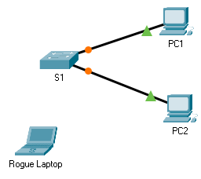

title: mod3-tp4-secu-port

# M03 TP3 - Packet Tracer - Configuring Switch Port Security
*ENI TSSR 08 - Réseau & ToIP*

[TOC]



**Addressing Table**

| Device       | Interface | IP Address  | Subnet Mask   | 
|:-------------|:----------|:------------|:--------------|
| S1           | VLAN 1    | 10.10.10.2  | 255.255.255.0 |
| PC1          | NIC       | 10.10.10.10 | 255.255.255.0 | 
| PC2          | NIC       | 10.10.10.10 | 255.255.255.0 | 
| Rogue Laptop | NIC       | 10.10.10.10 | 255.255.255.0 | 


**Objective**

- Part 1: Configure Port Security
- Part 2: Verify Port Security

**Background**

In this activity, you will configure and verify port security on a switch. Port security allows you to restrict a port's ingress traffic by limiting the MAC addresses that are allowed to send traffic into the port.

## Part 1: Configure Port Security

a. Access the command line for **S1** and **enable port security** on Fast Ethernet ports 0/1 and 0/2.

```
S1>en
S1#conf t
Enter configuration commands, one per line.  End with CNTL/Z.

S1(config)#interface range f0/1-2
S1(config-if-range)#switchport port-security
```

b. **Set the maximum** so that only one device can access the Fast Ethernet ports 0/1 and 0/2.

```
S1(config-if-range)#switchport port-security maximum 1
```

c. Secure the ports so that the MAC address of a device is **dynamically learned** and added to the running configuration.

```
S1(config-if-range)#switchport port-security mac-address sticky
```

d. **Set the violation** so that the Fast Ethernet ports 0/1 and 0/2 are **not disabled** when a violation occurs, but a **notification** of the security violation is generated and packets from the unknown source are dropped.

```
S1(config-if-range)#switchport port-security violation restrict
S1(config-if-range)#end
```

**Check** :

```
S1#sh port-security 
Secure Port MaxSecureAddr CurrentAddr SecurityViolation Security Action
               (Count)       (Count)        (Count)
--------------------------------------------------------------------
        Fa0/1        1          0                 0         Restrict
        Fa0/2        1          0                 0         Restrict
----------------------------------------------------------------------
```

e. **Disable all the remaining unused ports**. Hint: Use the `range` keyword to apply this configuration to all the ports simultaneously.

**Notes**: pour voir toutes les interfaces dispo, faire un `sh run`

```
S1(config)#interface range f0/3-24,g0/1-2
S1(config-if-range)#shutdown

%LINK-5-CHANGED: Interface FastEthernet0/3, changed state to administratively down
%LINK-5-CHANGED: Interface FastEthernet0/4, changed state to administratively down
%LINK-5-CHANGED: Interface FastEthernet0/5, changed state to administratively down
%LINK-5-CHANGED: Interface FastEthernet0/6, changed state to administratively down
%LINK-5-CHANGED: Interface FastEthernet0/7, changed state to administratively down
%LINK-5-CHANGED: Interface FastEthernet0/8, changed state to administratively down
%LINK-5-CHANGED: Interface FastEthernet0/9, changed state to administratively down
%LINK-5-CHANGED: Interface FastEthernet0/10, changed state to administratively down
%LINK-5-CHANGED: Interface FastEthernet0/11, changed state to administratively down
%LINK-5-CHANGED: Interface FastEthernet0/12, changed state to administratively down
%LINK-5-CHANGED: Interface FastEthernet0/13, changed state to administratively down
%LINK-5-CHANGED: Interface FastEthernet0/14, changed state to administratively down
%LINK-5-CHANGED: Interface FastEthernet0/15, changed state to administratively down
%LINK-5-CHANGED: Interface FastEthernet0/16, changed state to administratively down
%LINK-5-CHANGED: Interface FastEthernet0/17, changed state to administratively down
%LINK-5-CHANGED: Interface FastEthernet0/18, changed state to administratively down
%LINK-5-CHANGED: Interface FastEthernet0/19, changed state to administratively down
%LINK-5-CHANGED: Interface FastEthernet0/20, changed state to administratively down
%LINK-5-CHANGED: Interface FastEthernet0/21, changed state to administratively down
%LINK-5-CHANGED: Interface FastEthernet0/22, changed state to administratively down
%LINK-5-CHANGED: Interface FastEthernet0/23, changed state to administratively down
%LINK-5-CHANGED: Interface FastEthernet0/24, changed state to administratively down
%LINK-5-CHANGED: Interface GigabitEthernet0/1, changed state to administratively down
%LINK-5-CHANGED: Interface GigabitEthernet0/2, changed state to administratively down
```

## Part 2: Verify Port Security

a. From PC1, ping PC2. => Success !

b. **Verify port security** is enabled and the MAC addresses of **PC1** and **PC2** were added to the running configuration.

``` 
S1#show port-security interface f0/1
Port Security              : Enabled
Port Status                : Secure-up
Violation Mode             : Restrict
Aging Time                 : 0 mins
Aging Type                 : Absolute
SecureStatic Address Aging : Disabled
Maximum MAC Addresses      : 1
Total MAC Addresses        : 1
Configured MAC Addresses   : 0
Sticky MAC Addresses       : 1
Last Source Address:Vlan   : 00E0.B027.2245:1
Security Violation Count   : 0

S1#show port-security interface f0/2
Port Security              : Enabled
Port Status                : Secure-up
Violation Mode             : Restrict
Aging Time                 : 0 mins
Aging Type                 : Absolute
SecureStatic Address Aging : Disabled
Maximum MAC Addresses      : 1
Total MAC Addresses        : 1
Configured MAC Addresses   : 0
Sticky MAC Addresses       : 1
Last Source Address:Vlan   : 0001.647C.697E:1
Security Violation Count   : 0
```

**Notes**: Les adresses MAC de PC1 et PC2 sont enregistrées grâce au sticky.

c. Attach Rogue Laptop to any unused switch port and notice that the link lights are red.

Parce que les ports autres que f0/1 et f0/2 ont été désactivés... 

d. Enable the port and verify that **Rogue Laptop** can ping **PC1** and **PC2**. 
After verification, shut down the port connected to **Rogue Laptop**.

```
S1#conf t
Enter configuration commands, one per line.  End with CNTL/Z.
S1(config)#int f0/3
S1(config-if)#no shutdown 
%LINK-5-CHANGED: Interface FastEthernet0/3, changed state to up
%LINEPROTO-5-UPDOWN: Line protocol on Interface FastEthernet0/3, changed state to up
```

e. Disconnect **PC2** and connect **Rogue Laptop** to **PC2**'s port. 
Verify that **Rogue Laptop** is unable to ping **PC1**.

Parce que le switch enregistre les adresses MAC (sticky!) et pas les ports ni les ip. 

f. Display the port security violations for the port **Rogue Laptop** is connected to.

```
S1#sh port-security int f0/2
Port Security              : Enabled
Port Status                : Secure-up
Violation Mode             : Restrict
Aging Time                 : 0 mins
Aging Type                 : Absolute
SecureStatic Address Aging : Disabled
Maximum MAC Addresses      : 1
Total MAC Addresses        : 1
Configured MAC Addresses   : 0
Sticky MAC Addresses       : 1
Last Source Address:Vlan   : 0002.4A42.C51C:1
Security Violation Count   : 2
```

Le compteur de violation à augmenter de 2, ce qui correspond au nombre de paquets envoyé par l'action du ping.

g. Disconnect **Rogue Laptop** and reconnect **PC2**. Verify **PC2** can ping **PC1**.

```
S1#sh port-security int f0/2
Port Security              : Enabled
Port Status                : Secure-up
Violation Mode             : Restrict
Aging Time                 : 0 mins
Aging Type                 : Absolute
SecureStatic Address Aging : Disabled
Maximum MAC Addresses      : 1
Total MAC Addresses        : 1
Configured MAC Addresses   : 0
Sticky MAC Addresses       : 1
Last Source Address:Vlan   : 0001.647C.697E:1
Security Violation Count   : 0
```

Le compteur de violation a été remis à zéro.

h. Why is **PC2** able to ping **PC1**, but the **Rogue Laptop** is not?

Parce que la sécurité des ports enregistre les adresses MAC et non juste les noms des interfaces.


<link rel="stylesheet" href="../.ressources/css/style.css">