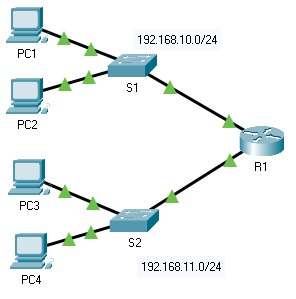

title: mod4-tp2-troubleshooting-gateway

# M04 TP2 - Packet Tracer - Troubleshooting Default Gateway Issues
*ENI TSSR 08 - Réseau & ToIP*

[TOC]

**Addressing Table**

| Device | Interface | IP Address    | Subnet Mask   | Default Gateway |
|:-------|:----------|:--------------|:--------------|:----------------|
| R1     | G0/0      | 192.168.10.1  | 255.255.255.0 | n/a             | 
| R1     | G0/1      | 192.168.11.1  | 255.255.255.0 | n/a             | 
| S1     | VLAN 1    | 192.168.10.2  | 255.255.255.0 |                 | 
| S2     | VLAN 1    | 192.168.11.2  | 255.255.255.0 |                 |
| PC1    | NIC       | 192.168.10.10 | 255.255.255.0 |                 |
| PC2    | NIC       | 192.168.10.11 | 255.255.255.0 |                 |
| PC3    | NIC       | 192.168.11.10 | 255.255.255.0 |                 |
| PC4    | NIC       | 192.168.11.11 | 255.255.255.0 |                 |

**Objectives**

- Part 1: Verify Network Documentation and Isolate Problems
- Part 2: Implement, Verify, and Document Solutions

**Background**

For a device to communicate across multiple networks, it must be configured with an IP address, subnet mask, and a default gateway. 

The default gateway is used when the host wants to send a packet to a device on another network. 
The default gateway address is generally the router interface address attached to the local network to which the host is connected. 

In this activity, you will finish documenting the network.
You will then verify the network documentation by testing end-to-end connectivity and troubleshooting issues. 

The troubleshooting method you will use consists of the following steps:

1) Verify the network documentation and use tests to isolate problems.
2) Determine an appropriate solution for a given problem.
3) Implement the solution.
4) Test to verify the problem is resolved.
5) Document the solution.

Throughout your CCNA studies, you will encounter different descriptions of the troubleshooting method, as well as different ways to test and document issues and solutions. This is intentional. There is no set standard or template for troubleshooting. Each organization develops unique processes and documentation standards (even if that process is "we don’t have one"). 

However, all effective troubleshooting methodologies generally include the above steps.

Note: If you are proficient with default gateway configurations, this activity might seem more involved than it should be. You can, most likely, quickly discover and solve all the connectivity issues faster than following these procedures. However, as you proceed in your studies, the networks and problems you encounter will become increasingly more complex.
In such situations, the only effective way to isolate and solve issues is to use a methodical approach such as the one used in this activity.

## Part 1: Verify Network Documentation and Isolate Problems

In Part 1 of this activity, complete the documentation and perform connectivity tests to discover issues. In addition, you will determine an appropriate solution for implementation in Part 2.

### Step 1: Verify the network documentation and isolate any problems.

a. Before you can effectively test a network, you must have complete documentation. Notice in the **Addressing Table** that some information is missing. Complete the **Addressing Table** by filling in the missing default gateway information for the switches and the PCs.

b. Test connectivity to devices on the same network. By isolating and correcting any local access issues, you can better test remote connectivity with the confidence that local connectivity is operational.

A verification plan can be as simple as a list of connectivity tests. Use the following tests to verify local connectivity and isolate any access issues. The first issue is already documented, but you must implement and verify the solution during Part 2.

**Testing and Verification Documentation**

| Test | Successful? | Issues | Solution | Verified | 
|:-----|:-----------:|:-------|:---------|:---------|
| PC1 to PC2 | No | IP address on PC1 | Change PC1 IP address | |
| PC1 to S1  |    | | | |
| PC1 to R1  |    | | | |
|            |    | | | |
|            |    | | | |

Note: The table is an example; you must create your own document. 

c. Test connectivity to remote devices (such as from **PC1** to **PC4**) and document any problems. This is frequently referred to as end-to-end connectivity. This means that all devices in a network have the full connectivity allowed by the network policy.

Note: Remote connectivity testing may not be possible yet, because you must first resolve local connectivity issues. After you have solved those issues, return to this step and test connectivity between networks.

### Step 2: Determine an appropriate solution for the problem.

a. Using your knowledge of the way networks operate and your device configuration skills, search for the cause of the problem. For example, **S1** is not the cause of the connectivity issue between **PC1** and **PC2**. The link lights are green and no configuration on **S1** would cause traffic to not pass between **PC1** and **PC2**. So the problem must be with **PC1**, **PC2**, or both.

b. Verify the device addressing to ensure it matches the network documentation. For example, the IP address for **PC1** is incorrect as verified with the ipconfig command.

c. Suggest a solution that you think will resolve the problem and document it. For example, change the IP address for **PC1** to match the documentation.

Note: Often there is more than one solution. However, it is a troubleshooting best practice to implement one solution at a time. Implementing more than one solution could introduce additional issues in a more complex scenario.

## Part 2: Implement, Verify, and Document Solutions

In Part 2 of this activity, you will implement the solutions you identified in Part 1. You will then verify the solution worked. You may need to return to Part 1 to finish isolating all the problems.

### Step 1: Implement solutions to connectivity problems.

Refer to your documentation in Part 1. Choose the first issue and implement your suggested solution. For example, correct the IP address on **PC1**.

### Step 2: Verify that the problem is now resolved.

a. Verify your solution has solved the problem by performing the test you used to identify the problem. For example, can **PC1** now ping **PC2**?

b. If the problem is resolved, indicate so in your documentation. For example, in the table above, a simple checkmark would suffice in the "Verified" column.

### Step 3: Verify that all issues are resolved.

a. If you still have an outstanding issue with a solution that has not yet been implemented, return to Part 2, Step 1.

b. If all your current issues are resolved, have you also resolved any remote connectivity issues (such as can **PC1** ping **PC4**)? If the answer is no, return to Part 1, Step 1c to test remote connectivity.

## Solution
### check ip

- PC1 : fa0 up @ 192.168.10.10 /24 + gateway 192.168.10.1 => ok, sauf nom interface ??
- PC2 : fa0/3 up @ 192.168.10.11 /24 + gateway 192.168.10.1 => ok 
- ping PC1 > PC2 => ok
- ping PC1 > PC3-4 => ok
- ping PC2 > PC3-4 => ok

En gros, ya 

- une ip fausse
- une gateway fausse
- manque une default gateway sur un ou deux switches 

 
<link rel="stylesheet" href="../.ressources/css/style.css">
 