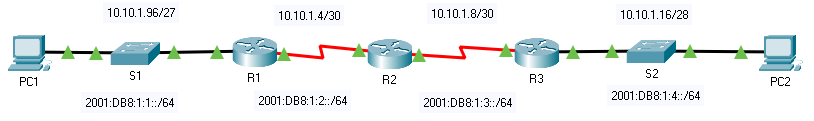

title: mod4-tp3-ipv4-ipv6

# M04 TP1 - Packet Tracer - Verify IPv4 and IPv6 Addressing
*ENI TSSR 08 - Réseau & ToIP*

[TOC]




**Addressing Table**

| Device | Interface | IP Address | Subnet Mask     | IPv6               | Default Gateway |
|:-------|:----------|:-----------|:----------------|:-------------------|:----------------|
| R1     | G0/0      | 10.10.1.97 | 255.255.255.224 | 2001:db8:1:1::1/64             | N/A |
| R1     | S0/0/1    | 10.10.1.6  | 255.255.255.252 | 2001:db8:1:2::2/64<br>fe80::1  | N/A | 
| R2     | S0/0/0    | 10.10.1.5  | 255.255.255.252 | 2001:db8:1:2::1/64             | N/A |
| R2     | S0/0/1    | 10.10.1.9  | 255.255.255.252 | 2001:db8:1:3::1/64<br>fe80::2  | N/A |
| R3     | G0/0      | 10.10.1.17 | 255.255.255.240 | 2001:db8:1:4::1/64             | N/A |
| R3     | S0/0/1    | 10.10.1.10 | 255.255.255.252 | 2001:db8:1:3::2/64<br>fe80::3  | N/A |
| PC1    | NIC    |**10.10.1.100**|**255.255.255.224**|**2001:DB8:1:1::A<br>fe80::1**|**10.10.1.97**|
| PC2    | NIC    |**10.10.1.20** |**255.255.255.240**|**2001:DB8:1:4::A<br>fe80::3**|**10.10.1.17**|

**Objectives**

- Part 1: Complete the Addressing Table Documentation
- Part 2: Test Connectivity Using Ping
- Part 3: Discover the Path by Tracing the Route

**Background**

Dual-stack allows IPv4 and IPv6 to coexist on the same network. 

In this activity, you will investigate a dual-stack implementation including documenting the IPv4 and IPv6 configuration for end devices, testing connectivity for both IPv4 and IPv6 using ping, and tracing the path from end to end for IPv4 and IPv6.

## Part 1 : Complete the Addressing Table Documentation
### Step 1: Use ipconfig to verify IPv4 addressing.
a. Click **PC1** and open the **Command Prompt**.

b. Enter the ipconfig /all command to collect the IPv4 information. Fill-in the Addressing Table with the IPv4 address, subnet mask, and default gateway.

c. Click **PC2** and open the **Command Prompt**.

d. Enter the ipconfig /all command to collect the IPv4 information. Fill-in the Addressing Table with the IPv4 address, subnet mask, and default gateway.

### Step 2: Use ipv6config to verify IPv6 addressing.
a. On **PC1**, enter the ipv6config /all command to collect the IPv6 information. Fill-in the Addressing Table with the IPv6 address, subnet prefix, and default gateway.

b. On **PC2**, enter the ipv6config /all command to collect the IPv6 information. Fill-in the Addressing Table with the IPv6 address, subnet prefix, and default gateway.

## Part 2: Test Connectivity Using Ping
### Step 1: Use ping to verify IPv4 connectivity.
a. From **PC1**, ping the IPv4 address for **PC2**.

**Q: Was the result successful?** oui

b. From **PC2**, ping the IPv4 address for **PC1**.

**Q: Was the result successful?** oui

### Step 2: Use ping to verify IPv6 connectivity.
a. From **PC1**, ping the IPv6 address for **PC2**.

**Q: Was the result successful?** Yes

From **PC2**, ping the IPv6 address of **PC1**.

**Q: Was the result successful?** Yes

## Part 3: Discover the Path by Tracing the Route
### Step 1: Use tracert to discover the IPv4 path.
a. From **PC1**, trace the route to **PC2**.

```
C:\>tracert 10.10.1.20

Tracing route to 10.10.1.20 over a maximum of 30 hops: 

  1   0 ms      0 ms      0 ms      10.10.1.97
  2   0 ms      0 ms      0 ms      10.10.1.5
  3   1 ms      1 ms      34 ms     10.10.1.10
  4   1 ms      6 ms      4 ms      10.10.1.20

Trace complete.
```

**Q: What addresses were encountered along the path? With which interfaces are the four addresses associated ?**

1. 1.97 = R1 g0/0     - passerelle
2. 1.5  = R2 s0/0/0   - serial 
3. 1.10 = R3 S0/0/1   - serial 
4. 1.20 = PC2

b. From **PC2**, trace the route to **PC1**.

```
C:\>tracert 10.10.1.100

Tracing route to 10.10.1.100 over a maximum of 30 hops: 

  1   0 ms      0 ms      0 ms      10.10.1.17
  2   0 ms      19 ms     0 ms      10.10.1.9
  3   0 ms      1 ms      1 ms      10.10.1.6
  4   0 ms      1 ms      6 ms      10.10.1.100

Trace complete.
```

**Q: What addresses were encountered along the path? With which interfaces are the four addresses associated?**

1. 1.17  = R3 g0/0     - passerelle
2. 1.9   = R2 s0/0/1   - serial
3. 1.6   = R1 s0/0/1   - serial
4. 1.100 = PC1 

### Step 2: Use tracert to discover the IPv6 path.
a. From **PC1**, trace the route to the IPv6 address for **PC2**.

```
C:\>tracert 2001:db8:1:4::a

Tracing route to 2001:db8:1:4::a over a maximum of 30 hops: 

  1   11 ms     0 ms      0 ms      2001:DB8:1:1::1
  2   3 ms      0 ms      35 ms     2001:DB8:1:2::1
  3   0 ms      0 ms      1 ms      2001:DB8:1:3::2
  4   5 ms      20 ms     4 ms      2001:DB8:1:4::A

Trace complete.
```


**Q: What addresses were encountered along the path?**

1. 1:1::1 = R1 g0/0     - passerelle 
2. 1:2::1 = R2 s0/0/0   - serial
3. 1:3::2 = R3 s0/0/1   - serial
4. 1:4::A = PC2

**Q: With which interfaces are the four addresses associated?**

b. From **PC2**, trace the route to the IPv6 address for **PC1**.

```
C:\>tracert 2001:db8:1:1::a

Tracing route to 2001:db8:1:1::a over a maximum of 30 hops: 

  1   0 ms      0 ms      0 ms      2001:DB8:1:4::1
  2   0 ms      0 ms      0 ms      2001:DB8:1:3::1
  3   19 ms     31 ms     39 ms     2001:DB8:1:2::2
  4   4 ms      1 ms      0 ms      2001:DB8:1:1::A

Trace complete.
```

**Q: What addresses were encountered along the path? With which interfaces are the four addresses associated?**

1. 1:4::1 = R3 g0/0     - passerelle
2. 1:3::1 = R2 s0/0/1   - serial
3. 1:2::2 = R1 s0/0/1   - serial
4. 1:1::A = PC1 

**Moralité**: que ce soit en IPv4 ou en IPv6, tracert trace le même chemin... 


<link rel="stylesheet" href="../.ressources/css/style.css">
 