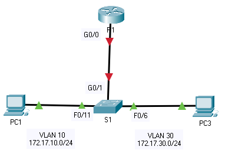

title: mod4-tp5-router-on-a-stick

# M04 TP5 - Configure Router-on-a-Stick Inter-VLAN Routing
*ENI TSSR 08 - Réseau & ToIP*

[TOC]




**Addressing Table**

| Device | Interface | IP Address | Subnet Mask | Default Gateway |
|:--|:--|:--|:--|:--|
| **R1** | G0/0.10 | 172.17.10.1 | 255.255.255.0 | N/A |
| **R1** | G0/0.30 | 172.17.30.1 | 255.255.255.0 | N/A |
| **PC1** | NIC | 172.17.10.10 | 255.255.255.0 | N/A |
| **PC2** | NIC | 172.17.30.10 | 255.255.255.0 | N/A |

**Objectives**

- Part 1: Add VLANs to a Switch
- Part 2: Configure Subinterfaces
- Part 3: Test Connectivity with Inter-VLAN Routing

**Scenario**
In this activity, you will configure VLANs and inter-VLAN routing. 

You will then enable trunk interfaces and verify connectivity between VLANs.


## Part 1: Add VLANs to a Switch
### Step 1: Create VLANs on S1.
Create VLAN 10 and VLAN 30 on S1.


### Step 2: Assign VLANs to ports.
a. Configure interfaces F0/6 and F0/11 as access ports and assign VLANs.

- Assign the port connected to **PC1** to VLAN 10.
- Assign the port connected to **PC3** to VLAN 30.

b. Issue the show vlan brief command to verify VLAN configuration.

```
S1# show vlan brief

VLAN Name Status Ports
---- -------------------------------- --------- -------------------------------
1 default active Fa0/1, Fa0/2, Fa0/3, Fa0/4
Fa0/5, Fa0/7, Fa0/8, Fa0/9
Fa0/10, Fa0/12, Fa0/13, Fa0/14
Fa0/15, Fa0/16, Fa0/17, Fa0/18
Fa0/19, Fa0/20, Fa0/21, Fa0/22
Fa0/23, Fa0/24, Gig0/1, Gig0/2
10 VLAN0010 active Fa0/11
30 VLAN0030 active Fa0/6
1002 fddi-default active
1003 token-ring-default active
1004 fddinet-default active
1005 trnet-default active
```

### Step 3: Test connectivity between **PC1** and **PC3**.
From **PC1**, ping **PC3**.

**Q: Were the pings successful? Why did you get this result?**

Nope. Parce que vlan = segmentation.

## Part 2: Configure Subinterfaces
### Step 1: Configure subinterfaces on R1 using the 802.1Q encapsulation.

a. Create the subinterface G0/0.10.

- Set the encapsulation type to 802.1Q and assign VLAN 10 to the subinterface.
- Refer to the Address Table and assign the correct IP address to the subinterface.

```
R1(config)# int g0/0.10
R1(config-subif)# encapsulation dot1Q 10
R1(config-subif)# ip address 172.17.10.1 255.255.255.0
```

b. Repeat for the G0/0.30 subinterface.

### Step 2: Verify Configuration.
a. Use the `show ip interface brief` command to verify subinterface configuration. 

Both subinterfaces are down. Subinterfaces are virtual interfaces that are associated with a physical interface. 

Therefore, in order to enable subinterfaces, you must enable the physical interface that they are associated with.

```
R1#sh ip interface  brief
Interface              IP-Address      OK? Method Status                Protocol 
GigabitEthernet0/0     unassigned      YES unset  administratively down down 
GigabitEthernet0/0.10  172.17.10.1     YES manual administratively down down 
GigabitEthernet0/0.30  172.17.30.1     YES manual administratively down down 
GigabitEthernet0/1     unassigned      YES unset  administratively down down 
Vlan1                  unassigned      YES unset  administratively down down
```

b. Enable the G0/0 interface. Verify that the subinterfaces are now active.

```
R1(config)#interface g0/0
R1(config-if)#no shutdown
R1(config-if)#end
```

```
R1#sh ip interface  brief
Interface              IP-Address      OK? Method Status                Protocol 
GigabitEthernet0/0     unassigned      YES unset  up                    up 
GigabitEthernet0/0.10  172.17.10.1     YES manual up                    up 
GigabitEthernet0/0.30  172.17.30.1     YES manual up                    up 
GigabitEthernet0/1     unassigned      YES unset  administratively down down 
Vlan1                  unassigned      YES unset  administratively down down
R1#
```

## Part 3: Test Connectivity with Inter-VLAN Routing
### Step 1: Ping between PC1 and PC3.
**Q: From PC1, ping PC3. The pings should still fail. Explain.**

Because there is no trunk ! bah oui. 

### Step 2: Enable trunking.

a. On **S1**, issue the `show vlan` command.

```
S1#sh vlan brief

VLAN Name                             Status    Ports
---- -------------------------------- --------- -------------------------------
1    default                          active    Fa0/1, Fa0/2, Fa0/3, Fa0/4
                                                Fa0/5, Fa0/7, Fa0/8, Fa0/9
                                                Fa0/10, Fa0/12, Fa0/13, Fa0/14
                                                Fa0/15, Fa0/16, Fa0/17, Fa0/18
                                                Fa0/19, Fa0/20, Fa0/21, Fa0/22
                                                Fa0/23, Fa0/24, Gig0/1, Gig0/2
10   VLAN0010                         active    Fa0/11
20   VLAN0020                         active    
30   VLAN0030                         active    Fa0/6
1002 fddi-default                     active    
1003 token-ring-default               active    
1004 fddinet-default                  active    
1005 trnet-default                    active 
```

**Q: What VLAN is G0/1 assigned to?**

b. Because the router was configured with multiple subinterfaces assigned to different VLANs, the switch port connecting to the router must be configured as a trunk. 
Enable trunking on interface G0/1.

```
S1(config)#interface g0/1
S1(config-if)#switchport mode trunk
```

```
S1#sh vlan brief

VLAN Name                             Status    Ports
---- -------------------------------- --------- -------------------------------
1    default                          active    Fa0/1, Fa0/2, Fa0/3, Fa0/4
                                                Fa0/5, Fa0/7, Fa0/8, Fa0/9
                                                Fa0/10, Fa0/12, Fa0/13, Fa0/14
                                                Fa0/15, Fa0/16, Fa0/17, Fa0/18
                                                Fa0/19, Fa0/20, Fa0/21, Fa0/22
                                                Fa0/23, Fa0/24, Gig0/2
10   VLAN0010                         active    Fa0/11
20   VLAN0020                         active    
30   VLAN0030                         active    Fa0/6
1002 fddi-default                     active    
1003 token-ring-default               active    
1004 fddinet-default                  active    
1005 trnet-default                    active    
```

**Q: How can you determine that the interface is a trunk port using the `show vlan` command?**

Il n'est pas dans la liste, n'affiche que les interfaces d'accès.


c. Issue the `show interface trunk` command to verify that the interface is configured as a trunk.

```
S1#sh interface trunk
Port        Mode         Encapsulation  Status        Native vlan
Gig0/1      on           802.1q         trunking      1

Port        Vlans allowed on trunk
Gig0/1      1-1005

Port        Vlans allowed and active in management domain
Gig0/1      1,10,20,30

Port        Vlans in spanning tree forwarding state and not pruned
Gig0/1      1,10,20,30
```

### Step 3: Test Connectivity
If the configurations are correct, **PC1** and **PC3** should be able to ping their default gateways and each other.

**Q: What addresses do PC1 and PC3 use as their default gateway addresses?**

- PC1 : 172.17.10.1 (DG), soit G0/1.10 sur R1
- PC3 : 172.17.30.1 (DG), soit G0/1.30 sur R1
 
<link rel="stylesheet" href="../.ressources/css/style.css">
 