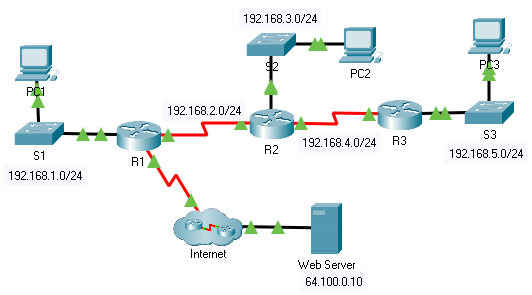

title: mod4-tp6-rip-v2

# M04 TP6 - Packet Tracer – Configuring RIPv2
*ENI TSSR 08 - Réseau & ToIP*

[TOC]




**Objectives**

- Part 1: Configure RIPv2
- Part 2: Verify Configurations

**Background**

Although RIP is rarely used in modern networks, it is useful as a foundation for understanding basic network routing. 

In this activity, you will configure a default route, RIP version 2, with appropriate network statements and passive interfaces, and verify full connectivity.

## Part 1: Configure RIPv2
### Step 1: Configure RIPv2 on R1.

a. Use the appropriate command to create a default route on **R1** for all Internet traffic to exit the network through S0/0/1.

```
R1(config)# ip route 0.0.0.0 0.0.0.0 s0/0/1
```

b. Enter RIP protocol configuration mode.

```
R1(config)# router rip
```

c. Use version 2 of the RIP protocol and disable the summarization of networks.

```
R1(config-router)# version 2
R1(config-router)# no auto-summary
```


d. Configure RIP for the networks that connect to **R1**.

```
R1(config-router)# network 192.168.1.0
R1(config-router)# network 192.168.2.0
```

e. Configure the LAN port that contains no routers so that it does not send out any routing information.

```
R1(config-router)# passive-interface gig 0/0
```

**check**

```
R1# sh ip protocols
```


f. Advertise the default route configured in step 1a with other RIP routers.

Propagation d'une route par défaut :

```
R1(config-router)# default-information originate
```


g. Save the configuration.

```
R# copy run start
```

**Voir table de routage** :

```
R# sh ip route
```

### Step 2: Configure RIPv2 on R2.

```
R2(config)#router rip
R2(config-router)#version 2
R2(config-router)#no auto-summary 
R2(config-router)#passive-interface g0/0
R2(config-router)#network 192.168.2.0
R2(config-router)#network 192.168.3.0
R2(config-router)#network 192.168.4.0
R2(config-router)#end 
R2#copy run start
```

### Step 3: Configure RIPv2 on R3

```
R3(config)#router rip
R3(config-router)#version 2
R3(config-router)#no auto-summary 
R3(config-router)#passive-interface g0/0
R3(config-router)#network 192.168.4.0
R3(config-router)#network 192.168.5.0
R3(config-router)#end 
R3#copy run start
```

## Part 2: Verify Configurations
### Step 1: View routing tables of R1, R2, and R3.

a. Use the appropriate command to show the routing table of **R1**. RIP (R) now appears with connected (C) and local (L) routes in the routing table. All networks have an entry. You also see a default route listed.

```
R1#show ip route
Codes: L - local, C - connected, S - static, R - RIP, M - mobile, B - BGP
       D - EIGRP, EX - EIGRP external, O - OSPF, IA - OSPF inter area
       N1 - OSPF NSSA external type 1, N2 - OSPF NSSA external type 2
       E1 - OSPF external type 1, E2 - OSPF external type 2, E - EGP
       i - IS-IS, L1 - IS-IS level-1, L2 - IS-IS level-2, ia - IS-IS inter area
       * - candidate default, U - per-user static route, o - ODR
       P - periodic downloaded static route

Gateway of last resort is 0.0.0.0 to network 0.0.0.0

     192.168.1.0/24 is variably subnetted, 2 subnets, 2 masks
C       192.168.1.0/24 is directly connected, GigabitEthernet0/0
L       192.168.1.1/32 is directly connected, GigabitEthernet0/0
     192.168.2.0/24 is variably subnetted, 2 subnets, 2 masks
C       192.168.2.0/24 is directly connected, Serial0/0/0
L       192.168.2.1/32 is directly connected, Serial0/0/0
R    192.168.3.0/24 [120/1] via 192.168.2.2, 00:00:18, Serial0/0/0
R    192.168.4.0/24 [120/1] via 192.168.2.2, 00:00:18, Serial0/0/0
R    192.168.5.0/24 [120/2] via 192.168.2.2, 00:00:18, Serial0/0/0
     209.165.200.0/24 is variably subnetted, 2 subnets, 2 masks
C       209.165.200.224/30 is directly connected, Serial0/0/1
L       209.165.200.225/32 is directly connected, Serial0/0/1
S*   0.0.0.0/0 is directly connected, Serial0/0/1 
```

b. View the routing tables for **R2** and **R3**. Notice that each router has a full listing of all the 192.168.x.0 networks and a default route.

```
R2#sh ip route
Codes: L - local, C - connected, S - static, R - RIP, M - mobile, B - BGP
       D - EIGRP, EX - EIGRP external, O - OSPF, IA - OSPF inter area
       N1 - OSPF NSSA external type 1, N2 - OSPF NSSA external type 2
       E1 - OSPF external type 1, E2 - OSPF external type 2, E - EGP
       i - IS-IS, L1 - IS-IS level-1, L2 - IS-IS level-2, ia - IS-IS inter area
       * - candidate default, U - per-user static route, o - ODR
       P - periodic downloaded static route

Gateway of last resort is 192.168.2.1 to network 0.0.0.0

R    192.168.1.0/24 [120/1] via 192.168.2.1, 00:00:07, Serial0/0/0
     192.168.2.0/24 is variably subnetted, 2 subnets, 2 masks
C       192.168.2.0/24 is directly connected, Serial0/0/0
L       192.168.2.2/32 is directly connected, Serial0/0/0
     192.168.3.0/24 is variably subnetted, 2 subnets, 2 masks
C       192.168.3.0/24 is directly connected, GigabitEthernet0/0
L       192.168.3.1/32 is directly connected, GigabitEthernet0/0
     192.168.4.0/24 is variably subnetted, 2 subnets, 2 masks
C       192.168.4.0/24 is directly connected, Serial0/0/1
L       192.168.4.2/32 is directly connected, Serial0/0/1
R    192.168.5.0/24 [120/1] via 192.168.4.1, 00:00:15, Serial0/0/1
R*   0.0.0.0/0 [120/1] via 192.168.2.1, 00:00:07, Serial0/0/0
```

```
R3#sh ip route
Codes: L - local, C - connected, S - static, R - RIP, M - mobile, B - BGP
       D - EIGRP, EX - EIGRP external, O - OSPF, IA - OSPF inter area
       N1 - OSPF NSSA external type 1, N2 - OSPF NSSA external type 2
       E1 - OSPF external type 1, E2 - OSPF external type 2, E - EGP
       i - IS-IS, L1 - IS-IS level-1, L2 - IS-IS level-2, ia - IS-IS inter area
       * - candidate default, U - per-user static route, o - ODR
       P - periodic downloaded static route

Gateway of last resort is 192.168.4.2 to network 0.0.0.0

R    192.168.1.0/24 [120/2] via 192.168.4.2, 00:00:12, Serial0/0/1
R    192.168.2.0/24 [120/1] via 192.168.4.2, 00:00:12, Serial0/0/1
R    192.168.3.0/24 [120/1] via 192.168.4.2, 00:00:12, Serial0/0/1
     192.168.4.0/24 is variably subnetted, 2 subnets, 2 masks
C       192.168.4.0/24 is directly connected, Serial0/0/1
L       192.168.4.1/32 is directly connected, Serial0/0/1
     192.168.5.0/24 is variably subnetted, 2 subnets, 2 masks
C       192.168.5.0/24 is directly connected, GigabitEthernet0/0
L       192.168.5.1/32 is directly connected, GigabitEthernet0/0
R*   0.0.0.0/0 [120/2] via 192.168.4.2, 00:00:12, Serial0/0/1
```

### Step 2: Verify full connectivity to all destinations.

Every device should now be able to ping every other device inside the network.<br> 
In addition, all devices should be able to ping the Web Server.

<link rel="stylesheet" href="../.ressources/css/style.css">
 