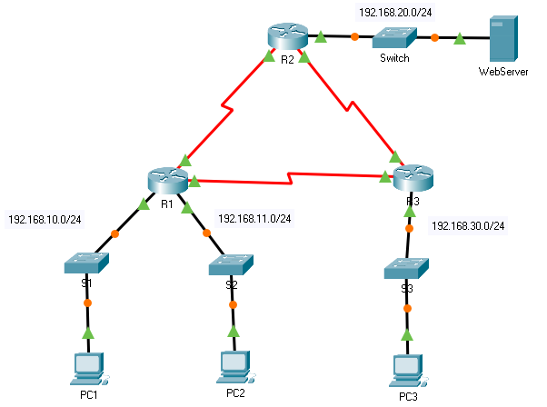

title: mod5-tp1-acls-numbered

# M05 TP1 - Packet Tracer - Configure Numbered Standard IPv4 ACLs
*ENI TSSR 08 - Réseau & ToIP*

[TOC]



**Addressing Table**

|Device | Interface | IP Address | Subnet Mask | Default Gateway |
|:------|:----------|:-----------|:------------|:----------------|
| R1  | G0/0 | 192.168.10.1 | 255.255.255.0 | N/A |
| R1   | S0/0/0 | 10.1.1.1 | 255.255.255.252 | N/A | 
| R1   | S0/0/1 | 10.3.3.1 | 255.255.255.252 | N/A | 
| R2   | G0/0 | 192.168.20.1 | 255.255.255.0 | N/A | 
| R2   | S0/0/0 | 10.1.1.2 | 255.255.255.252 | N/A | 
| R2   | S0/0/1 | 10.2.2.1 | 255.255.255.252 | N/A | 
| R3   | G0/0 | 192.168.30.1 | 255.255.255.0 | N/A | 
| R3   | S0/0/0 | 10.3.3.2 | 255.255.255.252 | N/A | 
| R3   | S0/0/1 | 10.2.2.2 | 255.255.255.252 | N/A |
| PC1  | NIC | 192.168.10.10 | 255.255.255.0 | 192.168.10.1 |
| PC2  | NIC | 192.168.11.10 | 255.255.255.0 | 192.168.11.1 | 
|PC3 | NIC | 192.168.30.10 | 255.255.255.0 | 192.168.30.1 |
| WebServer | NIC | 192.168.20.254 | 255.255.255.0 | 192.168.20.1 |

**Objectives**

- Part 1: Plan an ACL Implementation
- Part 2: Configure, Apply, and Verify a Standard ACL

**Background / Scenario**

Standard access control lists (ACLs) are router configuration scripts that control whether a router permits or denies packets based on the source address.

This activity focuses on defining filtering criteria, configuring standard ACLs, applying ACLs to router interfaces, and verifying and testing the ACL implementation. 

The routers are already configured, including IP addresses and **Enhanced Interior Gateway Routing Protocol** (EIGRP) routing.


## Part  1: Plan an ACL Implementation
### Step  1: Investigate the current network configuration.
Before applying any ACLs to a network, it is important to confirm that you have full connectivity. Verify that the network has full connectivity by choosing a PC and pinging other devices on the network. You should be able to successfully ping every device.

### Step  2: Evaluate two network policies and plan ACL implementations.
a. The following network policies are implemented on **R2**: 

- The 192.168.11.0/24 network is not allowed access to the **WebServer** on the 192.168.20.0/24 network.
- All other access is permitted.

To restrict access from the 192.168.11.0/24 network to the **WebServer** at 192.168.20.254 without interfering with other traffic, an ACL must be created on **R2**.  

The access list must be placed on the outbound interface to the **WebServer**. A second rule must be created on **R2**  to permit all other traffic.

b. The following network policies are implemented on **R3**: 

- The 192.168.10.0/24 network is not allowed to communicate with the 192.168.30.0/24 network.
- All other access is permitted.

To restrict access from the 192.168.10.0/24 network to the 192.168.30/24 network without interfering with other traffic, an access list will need to be created on **R3**.  The ACL must be placed on the outbound interface to **PC3**.  A second rule must be created on **R3**  to permit all other traffic.

## Part  2: Configure, Apply, and Verify a Standard ACL
### Step  1: Configure and apply a numbered standard ACL on **R2**. 
a. Create an ACL using the number 1 on **R2**  with a statement that denies access to the 192.168.20.0/24 network from the 192.168.11.0/24 network.

```
R2(config)# access-list 1 deny 192.168.11.0 0.0.0.255
```

b. By default, an access list denies all traffic that does not match any rules. To permit all other traffic, configure the following statement:

```
R2(config)# access-list 1 permit any
```

c. Before applying an access list to an interface to filter traffic, it is a best practice to review the contents of the access list, in order to verify that it will filter traffic as expected.

```
R2# show access-lists
Standard IP access list 1
10 deny 192.168.11.0 0.0.0.255
20 permit any
```

d. For the ACL to actually filter traffic, it must be applied to some router operation. Apply the ACL by placing it for outbound traffic on the GigabitEthernet 0/0 interface. 

Note: In an actual operational network, it is not a good practice to apply an untested access list to an active interface.

```
R2(config)# interface GigabitEthernet0/0
R2(config-if)# ip access-group 1 out
```

### Step  2: Configure and apply a numbered standard ACL on **R3**.
a. Create an ACL using the number 1 on **R3**  with a statement that denies access to the 192.168.30.0/24 network from the **PC1**  (192.168.10.0/24) network.

```
R3(config)# access-list 1 deny 192.168.10.0 0.0.0.255
```

b. By default, an ACL denies all traffic that does not match any rules. To permit all other traffic, create a second rule for ACL 1.

```
R3(config)# access-list 1 permit any
```

c. Verify that the access list is configured correctly.

```
R3# show access-lists
Standard IP access list 1
10 deny 192.168.10.0 0.0.0.255
20 permit any
```

d. Apply the ACL by placing it for outbound traffic on the GigabitEthernet 0/0 interface.

```
R3(config)# interface GigabitEthernet0/0
R3(config-if)# ip access-group 1 out
```

### Step  3: Verify ACL configuration and functionality.
a. Enter the show run or show ip interface gigabitethernet 0/0 command to verify the ACL placements.

b. With the two ACLs in place, network traffic is restricted according to the policies detailed in Part 1. 
Use the following tests to verify the ACL implementations:

- A ping from 192.168.10.10 to 192.168.11.10 succeeds.
- A ping from 192.168.10.10 to 192.168.20.254 succeeds.
- A ping from 192.168.11.10 to 192.168.20.254 fails.
- A ping from 192.168.10.10 to 192.168.30.10 fails.
- A ping from 192.168.11.10 to 192.168.30.10 succeeds.
- A ping from 192.168.30.10 to 192.168.20.254 succeeds.

c. Issue the show access-lists command again on routers **R2**  and **R3**.  

You should see output that indicates the number of packets that have matched each line of the access list. 

Note: The number of matches shown for your routers may be different, due to the number of pings that are sent and received.

```
R2# show access-lists
Standard IP access list 1
10 deny 192.168.11.0 0.0.0.255 (4 match(es))
20 permit any (8 match(es))
```
```
R3# show access-lists
Standard IP access list 1
10 deny 192.168.10.0 0.0.0.255 (4 match(es))
20 permit any (8 match(es))
```

## A noter ailleurs

- A quoi servent les ACL ?
- Quelle est la différence entre les ACL étendues et les ACL standards?
- Comment configurer les ACL sur un routeur Cisco?

#### Rappel sur les ACL (access control list)
Les ACL permettent de filtrer les accès entre les différents réseaux ou de filtrer les accès au routeur lui même.
Les paramètres controlés sont:

- Adresse source
- Adresse destination
- Protocole utilisé
- Numéro de port

Les acls peuvent être appliquées sur le traffic entrant ou sortant. Il y a deux actions: soit le traffic est interdit, soit le traffic est autorisé.

Les acls sont prises en compte de façon séquentielle. Il faut donc placer les instructions les plus précises en premier et l'instruction la plus générique en dernier.

Par défaut, tout le traffic est interdit.

#### Différence entre les acls standards et étendues
L'ACL standard filtre uniquement sur les adresses IP sources. Elle est de la forme:
`access-list numéro-de-la-liste {permit|deny} {host|source source-wildcard|any}`

Le numéro de l'acl standard est compris entre 1 et 99 ou entre 1300 et 1999.

L'ACL étendue filtre sur les adresses source et destination, sur le protocole et le numéro de port.
Elle est de la forme:
`access-list numéro de la liste {deny|permit} protocole source masque-source [operateur [port]] destination masque-destination [operateur [port]][established][log]`

Quelques opérateurs:

- eq : égal
- neq : différent
- gt : plus grand que
- lt : moins grand que

Le numéro de l'acl étendue est compris entre 100 et 199 ou entre 2000 et 2699.

Il est possible de nommer les acls. Dans ce cas, on précisera dans la commande si ce sont des acls standards ou étendues.

#### Notion de maque générique (wildcard mask)
Les acls utilisent un masque permettant de selectionner des plages d'adresses.

**Fonctionnement**:

En binaire, seuls les bits de l'adresse qui correspondent au bit à 0 du masque sont vérifiés.

Par exemple, avec 172.16.2.0 0.0.255.255, la partie vérifiée par le routeur sera 172.16
Sur le couple suivant: 0.0.0.0 0.0.0.0, toutes les adresses sont concernées (any). Sur ce couple: 192.168.2.3 255.255.255.255, on vérifie uniquement l'hote ayant l'IP 192.168.2.3 (host)

#### Comment appliquer les ACL?
On crée l'ACL puis ensuite on applique l'ACL à une interface en entrée ou en sortie (in ou out).

Si l'ACL doit être mofifiée, il sera nécessaire de supprimer celle ci puis de la recréer entièrement.
Une façon pratique de faire est de conserver l'acl dans un fichier texte puis de faire un copier/coller.


#### Exemple de configuration
##### Création d'une entrée d'une access-list
Dans l'exemple:

- On autorise la machine 192.168.2.12 à se connecter via ssh à toutes les machines du réseau 192.168.3.0/24,
- On autorise les réponses DNS en provenance de la machine 192.168.2.30,
- On autorise les paquets entrants pour les connexions tcp établies,
- Enfin on supprime le reste du traffic qui va apparaitre dans les logs.

```
R2(config)#ip access-list extended reseau-secretariat
R2(config-ext-nacl)#permit tcp host 192.168.2.12 gt 1023 192.168.3.0 0.0.0.255 eq 22
R2(config-ext-nacl)#permit udp host 192.168.2.30 eq 53 192.168.3.0 0.0.0.255 gt 1023
R2(config-ext-nacl)#permit tcp any any established
R2(config-ext-nacl)#deny ip any any log
```

##### Application de la liste d'accès à une interface
```
R2(config)#int fa1/1
R2(config-if)#ip access-group reseau-secretariat out
R2(config-if)#
```

##### Affichage de la configuration de l'interface
```
R2#sh run int fa1/1
Building configuration...

Current configuration : 136 bytes
!
interface FastEthernet1/1
ip address 192.168.3.2 255.255.255.0
ip access-group reseau-secretariat out
duplex auto
speed auto
end

R2#
```

##### Affichage de la liste de contrôle

```
R2#show access-lists reseau-secretariat
Extended IP access list reseau-secretariat
10 permit tcp host 192.168.2.1 gt 1023 192.168.3.0 0.0.0.255 eq 22
20 permit tcp any any established
30 deny ip any any log
R2#
```

##### Suppression d'une acl
```
R2(config)#no ip access-list extended reseau-secretariat
R2(config)#end
```

##### Suppression de l'association de la liste de contrôle à une interface
```
R2(config)#int fa1/1
R2(config-if)#no ip access-group reseau-secretariat out
R2(config-if)#
```

<link rel="stylesheet" href="../.ressources/css/style.css">
 