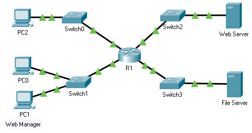

title: mod5-tp2-acls-named

# M05 TP2 - Packet Tracer - Configure Named Standard IPv4 ACLs
*ENI TSSR 08 - Réseau & ToIP*

[TOC]




**Addressing Table**

|Device | Interface | IP Address | Subnet Mask | Default Gateway |
|:------|:----------|:-----------|:------------|:----------------|
| R1 | F0/0 | 192.168.10.1 | 255.255.255.0 | N/A |
| R1 | F0/1 | 192.168.20.1 | 255.255.255.0 | N/A |
| R1 | E0/0/0 | 192.168.100.1 | 255.255.255.0 | N/A |
| R1 | E0/1/0 | 192.168.200.1 | 255.255.255.0 | N/A |
| File Server | NIC | 192.168.200.100 | 255.255.255.0 | 192.168.200.1 |
| Web Server | NIC | 192.168.100.100 | 255.255.255.0 | 192.168.100.1 |
| PC0 | NIC | 192.168.20.3 | 255.255.255.0 | 192.168.20.1 | 
| PC1 | NIC | 192.168.20.4 | 255.255.255.0 | 192.168.20.1 |
| PC2 | NIC | 192.168.10.3 | 255.255.255.0 | 192.168.10.1 | 

**Objectives**

- Part 1: Configure and Apply a Named Standard ACL
- Part 2: Verify the ACL Implementation

**Background / Scenario**

The senior network administrator has asked you to create a standard named ACL to prevent access to a **File Server**. 

- The **File Server** contains the data base for the web applications. 
- Only the Web Manager workstation **PC1** and the **Web Server** need to access the **File Server**. 
- All other traffic to the **File Server** should be denied.


## Part 1: Configure and Apply a Named Standard ACL
### Step 1: Verify connectivity before the ACL is configured and applied.

All three workstations should be able to ping both the **Web Server** and **File Server**.

### Step 2: Configure a named standard ACL.
a. Configure the following named ACL on **R1**.

```
R1(config)# ip access-list standard File_Server_Restrictions
R1(config-std-nacl)# permit host 192.168.20.4
R1(config-std-nacl)# permit host 192.168.100.100
R1(config-std-nacl)# deny any
```

**Note**: For scoring purposes, the ACL name is case-sensitive, and the statements must be in the same order as shown.

b. Use the `show access-lists` command to verify the contents of the access list before applying it to an interface. Make sure you have not mistyped any IP addresses and that the statements are in the correct order.

```
R1# show access-lists
Standard IP access list File_Server_Restrictions

10 permit host 192.168.20.4
20 permit host 192.168.100.100
30 deny any
```

### Step 3: Apply the named ACL.
a. Apply the ACL outbound on the Fast Ethernet 0/1 interface.

**Note**: In an actual operational network, applying an access list to an active interface is not a good practice and should be avoided if possible.

```
R1(config)# int f0/1
R1(config-if)# ip access-group File_Server_Restrictions out
```

b. Save the configuration.


## Part 2: Verify the ACL Implementation
### Step 1: Verify the ACL configuration and application to the interface.

Use the `show access-lists` command to verify the ACL configuration. Use the `show run` or `show ip interface fastethernet 0/1` command to verify that the ACL is applied correctly to the interface.

```
R1#sh access-lists 
Standard IP access list File_Server_Restrictions
    10 permit host 192.168.20.4
    20 permit host 192.168.100.100
    30 deny any


R1#sh run
[...]
!
interface FastEthernet0/0
 ip address 192.168.100.1 255.255.255.0
 duplex auto
 speed auto
!
interface FastEthernet0/1
 ip address 192.168.200.1 255.255.255.0
 ip access-group File_Server_Restrictions out
 duplex auto
 speed auto
!
interface Ethernet0/0/0
 ip address 192.168.10.1 255.255.255.0
 duplex auto
 speed auto
!
interface Ethernet0/1/0
 ip address 192.168.20.1 255.255.255.0
 duplex auto
 speed auto
!
interface Vlan1
 no ip address
 shutdown
!
ip classless
!
ip flow-export version 9
!
!
ip access-list standard File_Server_Restrictions
 permit host 192.168.20.4
 permit host 192.168.100.100
 deny any
! 
[...]
!
end


R1#sh ip int f0/1
FastEthernet0/1 is up, line protocol is up (connected)
  Internet address is 192.168.200.1/24
  Broadcast address is 255.255.255.255
  Address determined by setup command
  MTU is 1500 bytes
  Helper address is not set
  Directed broadcast forwarding is disabled
  ===> Outgoing access list is File_Server_Restrictions <===
  Inbound  access list is not set
  Proxy ARP is enabled
  Security level is default
  Split horizon is enabled
  ICMP redirects are always sent
  ICMP unreachables are always sent
  ICMP mask replies are never sent
  IP fast switching is disabled
  IP fast switching on the same interface is disabled
  IP Flow switching is disabled
  IP Fast switching turbo vector
  IP multicast fast switching is disabled
  IP multicast distributed fast switching is disabled
  Router Discovery is disabled
```

### Step 2: Verify that the ACL is working properly.
All three workstations should be able to ping the **Web Server**, but only **PC1** and the **Web Server** should be able to ping the **File Server**. 

Repeat the `show access-lists` command to see the number of packets that matched each statement.


<link rel="stylesheet" href="../.ressources/css/style.css">