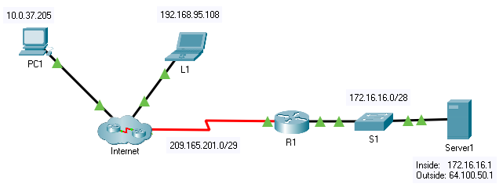

title: mod5-tp5-nat-static

# M05 TP5 - Packet Tracer - Configure static NAT 
*ENI TSSR 08 - Réseau & ToIP*

[TOC]



#### Détails

- View routing table and running-config

```
R1# sh ip route
```

=> ya 2 routes connectées, et il n'y a pas de route par défaut 


- Verify that NAT is not being used by R1

```
R1# sh ip nat translations
```

- Configure static NAT statements

```
R1(config)# ip nat inside source static 172.16.16.1 64.10.500.1
```
(ip serveur + ip externe)


- Configure inside/outside interfaces

```
R1(config)# interface g0/0
R1(config-if)# ip nat inside

R1(config)# interface s0/0/0
R1(config-if)# ip nat outside
```

- Test access with NAT: 
  + Ping entre PC1 et adr publique du serveur (64.100.50.1) = success 
  + open Server1 ip in web browser from PC1 or L1 = success

- View NAT translations 

```
R1# sh running-config
R1# sh run 
R1# sh ip nat translations 
R1# sh ip nat statistics
```

=> comme il s'agit d'une translation statique, elle est directement mise dans la table.
On voit que inside globale est matché avec l'adr local (vu de l'interieur).

**sh ip nat translation** == suivi des conversations

**sh ip nat statistics** : nous redonne l'ens des elements de la nat   

#### Script

```cisco
sh ip route
sh ip nat translations
conf t
ip nat inside source static 172.16.16.1 64.100.50.1
interface g0/0
ip nat inside
interface s0/0/0
ip nat outside
end 
sh ip nat translations
```

```
R1#sh ip route
Codes: L - local, C - connected, S - static, R - RIP, M - mobile, B - BGP
       D - EIGRP, EX - EIGRP external, O - OSPF, IA - OSPF inter area
       N1 - OSPF NSSA external type 1, N2 - OSPF NSSA external type 2
       E1 - OSPF external type 1, E2 - OSPF external type 2, E - EGP
       i - IS-IS, L1 - IS-IS level-1, L2 - IS-IS level-2, ia - IS-IS inter area
       * - candidate default, U - per-user static route, o - ODR
       P - periodic downloaded static route

Gateway of last resort is not set

     172.16.0.0/16 is variably subnetted, 2 subnets, 2 masks
C       172.16.16.0/28 is directly connected, GigabitEthernet0/0
L       172.16.16.14/32 is directly connected, GigabitEthernet0/0
     209.165.201.0/24 is variably subnetted, 2 subnets, 2 masks
C       209.165.201.0/29 is directly connected, Serial0/0/0
L       209.165.201.2/32 is directly connected, Serial0/0/0

R1#sh ip nat translations
R1#conf t
Enter configuration commands, one per line.  End with CNTL/Z.
R1(config)#ip nat inside source static 172.16.16.1 64.100.50.1
R1(config)#interface g0/0
R1(config-if)#ip nat inside
R1(config-if)#interface s0/0/0
R1(config-if)#ip nat outside
R1(config-if)#end 
R1#sh ip nat translations
%SYS-5-CONFIG_I: Configured from console by console

Pro  Inside global     Inside local       Outside local      Outside global
---  64.100.50.1       172.16.16.1        ---                ---
```


<link rel="stylesheet" href="../.ressources/css/style.css">