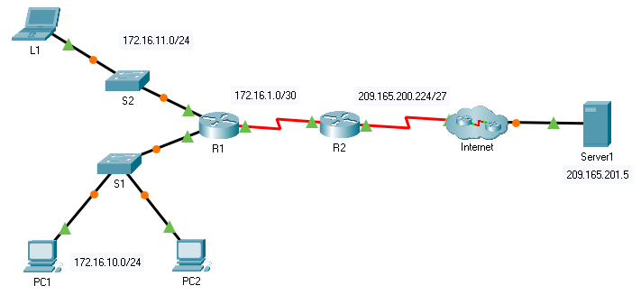

title: mod6-tp6-nat-dynamique

# M05 TP6 - Packet Tracer - Configure Dynamic NAT 
*ENI TSSR 08 - Réseau & ToIP*

[TOC]



#### Résumé

1. Définir le pool d'adresses à utiliser pour la traduction
2. Configurer un ACL standard pour autoriser uniquement les adresses qui doivent être traduites
3. Lier l'ACL au pool
4. Identifier quelles interfaces sont à l'intérieur
5. Identifier quelles interfaces sont à l'extérieur

#### Détails

1. Définir le pool d'adresses à utiliser pour la traduction
```cisco
R2(config)#ip nat pool NAT-POOL1 209.165.200.229 209.165.200.230 netmask 255.255.255.252
```

2. Configurer un ACL standard pour autoriser uniquement les adresses qui doivent être traduites
```cisco
R2(config)#access-list 1 permit 172.16.0.0 0.0.255.255
```

3. Lier l'ACL au pool
```cisco
R2(config)#ip nat inside source list 1 pool NAT-POOL1
```

4. Identifier quelles interfaces sont à l'intérieur
```cisco
R2(config)#interface serial 0/0/1
R2(config-if)#ip nat inside
```

5. Identifier quelles interfaces sont à l'extérieur
```cisco
R2(config)#interface serial 0/0/0
R2(config-if)#ip nat outside
```

6. Vérification
```cisco
R2#sh ip nat translations 
Pro  Inside global     Inside local       Outside local      Outside global
tcp 209.165.200.229:1025172.16.11.1:1025   209.165.201.5:80   209.165.201.5:80
```

**Notes**: 

- `sh ip nat translations` n'affiche rien tant qu'on a pas fait de traduction.
- Ici, on voit qqch parce qu'on consulté le server via le web browser de L1.


#### Script

```cisco
R2(config)#access-list 1 permit ?
  A.B.C.D  Address to match
  any      Any source host
  host     A single host address
R2(config)#access-list 1 permit 172.16.0.0 ?
  A.B.C.D  Wildcard bits
  <cr>
R2(config)#access-list 1 permit 172.16.0.0 0.0.255.255

R2(config)#ip nat pool NAT-POOL1 209.165.200.229 209.165.200.230 netmask 255.255.255.252

R2(config)#ip nat inside source list 1 pool NAT-POOL1

R2(config)#interface serial 0/0/1
R2(config-if)#ip nat inside
R2(config)#interface serial 0/0/0
R2(config-if)#ip nat outside

R2#sh ip nat translations 
Pro  Inside global     Inside local       Outside local      Outside global
tcp 209.165.200.229:1025172.16.11.1:1025   209.165.201.5:80   209.165.201.5:80
```


<link rel="stylesheet" href="../.ressources/css/style.css">