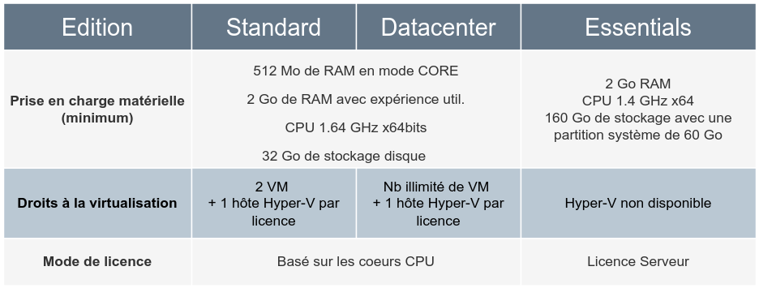
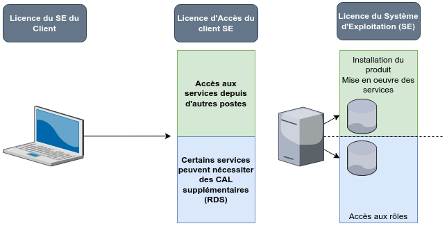
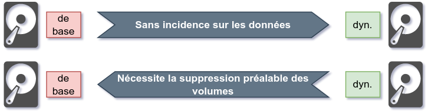
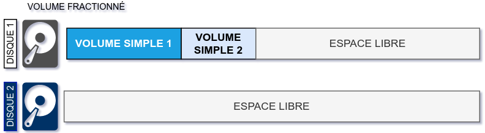
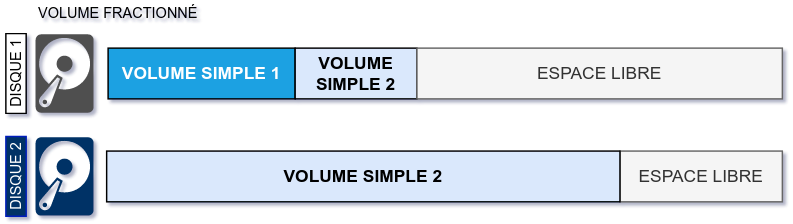
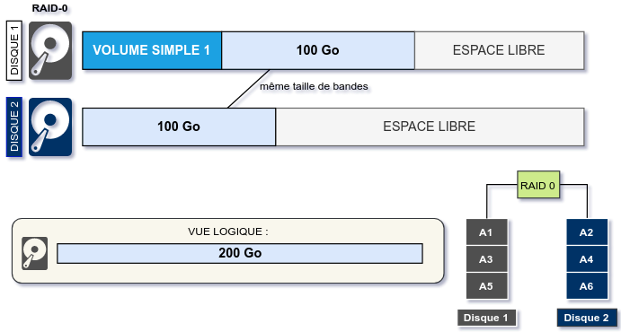
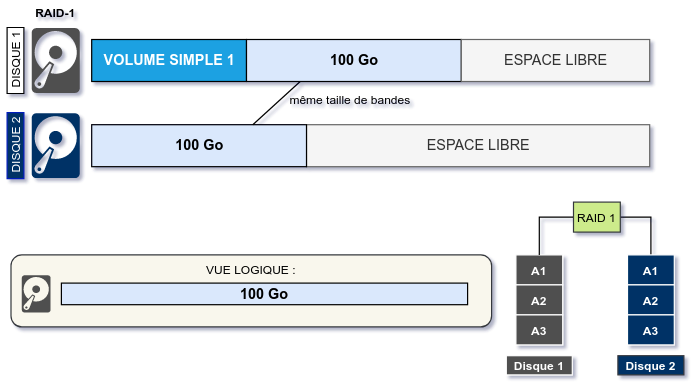
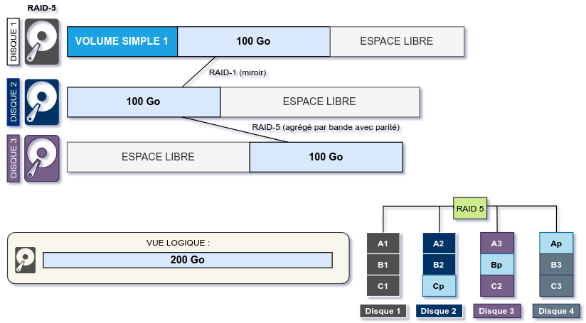

title: notes-01-sysadmin

# ENI TSSR 09 - Services Réseau Microsoft

<table class="formateur">
	<tbody>
		<tr>
			<th scope="row">Cours ENI </th>
			<td>du 25/07 au 06/08/2022</td>
		</tr>
		<tr>
			<th scope="row">Formateur</th>
			<td>Matthieu LE MASSON</td>
		</tr>
	</tbody>
</table>

## Notes
<ul>
    <li><a target="_blank" href="notes-01-sysadmin.html">Notes 01. Sysadmin</a></li>
    <li><a target="_blank" href="notes-02-ad.html"      >Notes 02. AD</a></li>
    <li><a target="_blank" href="notes-03-gpo.html"     >Notes 03. GPO</a></li>
    <li><a target="_blank" href="notes-04-routage.html" >Notes 04. Routage</a></li>
    <li><a target="_blank" href="notes-05-dhcp.html"    >Notes 05. DHCP</a></li>
    <li><a target="_blank" href="notes-06-dns.html"     >Notes 06. DNS</a></li>
</ul>

## TP
<ul>
	<li><a target="_blank" href="tp01-install-vm.html">tp01-install-vm</a></li>
	<li><a target="_blank" href="tp02-raid.html">tp02-raid</a></li>
	<li><a target="_blank" href="tp03-ad-creation.html">tp03-ad-creation</a></li>
	<li><a target="_blank" href="tp04-ad-util-groupes.html">tp04-ad-util-groupes</a></li>
	<li><a target="_blank" href="tp05-partage.html">tp05-partage</a></li>
	<li><a target="_blank" href="tp07-gpo.html">tp07-gpo</a></li>
	<li><a target="_blank" href="tp08.1-routage.html">tp08.1-routage</a></li>
	<li><a target="_blank" href="tp08.2-routage.html">tp08.2-routage</a></li>
	<li><a target="_blank" href="tp09.1-dhcp.html">tp09.1-dhcp</a></li>
	<li><a target="_blank" href="tp09.2-dhcp-relay.html">tp09.2-dhcp-relay</a></li>
	<li><a target="_blank" href="tp10.1-dns-resolver.html">tp10.1-dns-resolver</a></li>
	<li><a target="_blank" href="tp10.2-dns-hebergeur.html">tp10.2-dns-hebergeur</a></li>
	<li><a target="_blank" href="tp10.3-dns-hebergeur-redondance.html">tp10.3-dns-hebergeur-redondance</a></li>
</ul>

## Sommaire

1. Module 1 - Administration windows
	+ Microsoft Server
	+ Gestion du stockage

[TOC]

## Mod 1 - Admin Windows

**Objectifs** 

- Connaître Microsoft Server et son biotope
- Gérer le stockage du serveur et le RAID 

### Microsoft Server
#### Version des systèmes d'exploitation Microsoft
Les 2 familles osnt la version **serveur** et la version **client**.

**Serveur** 

- Ont la capacité de fournir un ensemble de services au sein d'une infrastructure. 
- OS: Windows 2019, Windows 2016, Windows 2012 R2, Windows 2012, Windows 2008 R2, Windows 2008

**Client**

- Sont destinés à être utilisés en tant que station de travail.
- Windows 10, Windows 8.1, Windows 8, Windows 7, Windows Vista

##### Les différentes éditions Windows Server

{:target="_blank"} 

Quelques rappels sur les licences :

{:target="_blank"} 

#### Les services pris en charge par Windows Server
- L'ajout d'un serveur dans un contexte d'entreprise permet de fournir des services spécifiques.
- Un ensemble de services est nativement pris en charge par les systèmes d'exploitation Windows Server.
- Bien d'autres solutions, outils, applications, etc. peuvent être mis en oeuvre sur les systèmes d'exploitation serveur : serveur de messagerie Exchange, serveur de base de données Microsoft SQL, etc.

##### Les services de domaine

Les OS prennent en charge les composantes de services **Active Directory** suivants :

| Services | Description |
|:--|:--|
| Services de domaine Active Directory (**AD DS**) | Rôle qui fournit la gestion de contextes de domaine Active Directory. |
| Service de fédération AD (**AD FS**) | Services fédérés de gestion des identités. |
| Service de gestion des droits Active Directory (**AD RMS**) | Protection des ressources contre une utilisation non autorisée, basée sur l'utilisation de certificats (pemet notamment d'interdire la copie ou l'impression d'un fichier). |
| Service de certificat Active Directory (**AD CS**) | Service de gestion d'une autorité de certification (fournit une infrastructure à clé publique) |

Autres services pris en charge :

| Services | Description |
|:--|:--|
| **DNS** | Service de résolution de noms d'hôtes. |
| **DHCP** | Service de gestion de l'adressage IP. |
| **Hyper-V** | Permet de créer un environnement informatique virtualisé dans lequel vous pouvez créer et gérer des VM. |
| **WDS** | Service de déploiement d'OS Windows à travers le réseau. |
| **WSUS** | Fournit une prise en charge centralisée des mises à jour des produits Microsoft. |
| **Service d'impression et de numérisation de document** | Permet d'avoir une gestion centralisée de vos périphériques d'impression. |

#### Installation du système et composants
##### Les modes d'installation
- Installation minimale / Server Core 
	+ Sans environnement graphique
	+ Depuis Windows Server 2008
	+ Mode d'installation par défaut
	+ Les commandes PowerShell peuvent être utilisées pour gérer un serveur Core

- Installation graphique
	+ avec environnement graphique GUI 

##### Les rôles et fonctionnalités
- Des composants peuvent être ajoutés par :
	+ le gestionnaire de serveur 
	+ des commandes PowerShell
- 2 types de composants 
	+ les rôles : correspond généralement à un **service que l'on fournit à des clients**.
	+ les fonctionnalités : correspond généralement à un outil/composant **utile sur l'élément sur lequel on l'ajoute**.

##### Les outils de gestion de Windows Server
- Le gestionnaire de serveur : élément central d'administration du ou des serveurs.
- Les consoles de gestion des services (**mmc**) : Disponible suite à l'ajout d'un rôle sur un serveur. Peuvent être ajoutées sur un poste d'administration ne disposant pas du rôle à gérer.
- Ligne de commande (**cmd**)
- PowerShell 

### TP 01 - Installation et configuration initiale
<a href="tp01-install-vm.html">Voir TP 1</a>.

### Gestion du stockage
#### Les tables de partitionnement
Détermine les caractéristiques des partitions créées sur un disque

##### MBR (historique)
- Cette table faisait partie des information stockées sur le premier secteur adressable du disque.
- Le BIOS recherche un secteur d'amorçage sur les médias bootables.

##### GPT
- A ce jour, la majorité des machines disposent d'un UEFI
- Les SSD sont préconfigurés de cette manière
- Meilleure performance avec les cartes-mère UEFI 
- Optimiser pour les systèmes d'exploitation 64 bits 

#### Les formats de tables de partition
##### Caractéristiques de formats de partitionnement
- **partitionnement MBR** 
	+ plus faible tolérance aux pannes
	+ nom donné au premier secteur physique d'un disque

- **partitionnement GPT** 
	+ Meilleure tolérance aux pannes
	+ Les données sont dupliquées sur plusieurs secteurs (possibilité de reconstruction)

- Conversion possible de MBR vers GPT mais avant que le disque ne contienne des données.
{:target="_blank"}

#### Les types de configuration des disques
Il y a 2 types de configurations de disques :

- Configuration de base 
	+ Simplifie la gestion du disque 
	+ Toutes les données sont inscrites dans des partitions 
	+ Sur un seul disque physique
	
- Configuration dynamique (nécessite la suppression préalable des données)
	+ La gestion se fait par ensemble de disques
	+ Les données sont inscrites dans des volumes 
	+ Nécessaire pour le RAID logiciel 

- La conversion de base vers dynamique est sans incidence pour les données
{:target="_blank"}

#### Partitionnement et RAID
##### Partitionnement d'un disque de base

{:target="_blank"}

{:target="_blank"}

Sur un disque de base, on peut créer au maximum soit :

- 4 partitions principales
- 3 partitions principales et 1 partition étendue dans laquelle on crée des disques logique (les lecteurs logiques seront formatés).

- Les partitions peuvent être étendues ou réduites sur l'espace contigu du même disque.
- Le lancement d'un OS à partir d'un lecteur logique n'est pas possible.

##### Partitionnement d'un disque dynamique
Un disque dynamique est composé de volumes qui peuvent être de plusieurs types :

- Volume simple 
- Volume fractionné
- Volume agrégé par bandes 
- Volume en miroir 
- Volume agrégé par bandes avec parité 

On peut le partitionner en **RAID** (*Redundancy Array of Inexpensive Disk*).

##### Le volume simple
On parlera d'**espace disque**.

- C'est le seul type de volume qui utilise un seul disque physique.
{:target="_blank"}
- Il peut être étendu au sein du même disque. 
{:target="_blank"}

##### Le volume fractionné
Un volume fractionné utilise plusieurs espaces sur plusieurs disques physiques

- Situation initiale :
{:target="_blank"}

- Extension du **volume simple 2** sur le **disque dynamique 2**
{:target="_blank"}

##### Le volume agrégé par bandes, ou RAID-0
Le volume agrégé par bandes, ou **RAID-0** est un type de volume fractionné. 

- La taille des bandes doit être identiques sur chaque disque
- Réparti sur 2 à *n* disques
- **Rapidité d'écriture** accrue 
- **Aucune tolérance de panne**
- Tout l'espace disque alloué est utilisable.

{:target="_blank"}

##### Le volume en miroir RAID-1
Le volume en miroir, ou **RAID-1**, est un type de volume fractionné. 

- Réparti sur 2 disques.
- L'espace alloué sur les 2 disques doit être identique.
- Les mêmes données sont écrites simultanément sur les 2 disques.
- **Tolérance aux pannes accrues** : un des disques peut être perdu sans impact sur les données.
- La moitié de l'espace disque alloué n'est pas directement utilisable.

{:target="_blank"}

##### Le volume agrégé par bandes avec parité RAID-5
Le volume agrégé par bandes avec parité, ou **RAID-5**, est un type de volume fractionné :

- 3 disques minimum
- 1 disque (espace d'une bande) est alloué à la tolérance de panne 
- RAID offrant un compromis tolérance panne / coûts

{:target="_blank"}

#### Formatage et outils
**Formatage**

- Les partitions principales, lecteurs logiques et volumes doivent être formatés avant d'être utilisables.
- Le formatage est l'installation d'un système de fichiers (hébergement de données).
- Les systèmes de fichiers disponibles sont :
	+ FAT32 : Windows 9x
	+ NTFS : depuis Windows NT
	+ ReFS : depuis Windows 2012 (pour les espaces de stockage)

**Outils**

- La console de gestion des disques (**diskmgmt.msc**)
- La commande **diskpart**
- Les commandes **PowerShell**

### TP02

[Voir le TP2 - RAID](tp02-raid.html){:target = "_blank"}

**Notes TP** (p14)

1. diskmgmt 
2. changer lettre lecteur optique (libérer "D:")
3. clic droit sur chaque disque > **En ligne** 
4. clic droit > **Initialiser le disque**
5. clic droit > **Nouveau volume RAID-5**
6. Sélectionner le disque dans partie disponible et ajouter
7. Donner taille de 3 Go pour avoir un total de 6 Go

-FIN-

<link rel="stylesheet" type="text/css" href=".ressources/css/bootstrap.min.css">
<link rel="stylesheet" type="text/css" href=".ressources/css/style.css">
<link rel="stylesheet" type="text/css" href=".ressources/css/headings.css">