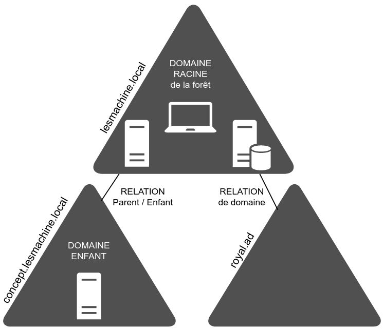
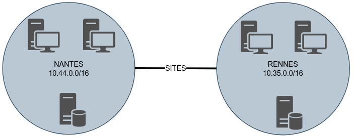
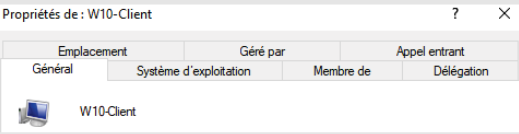
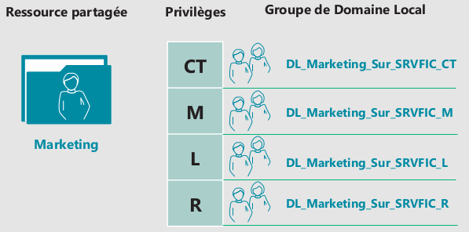
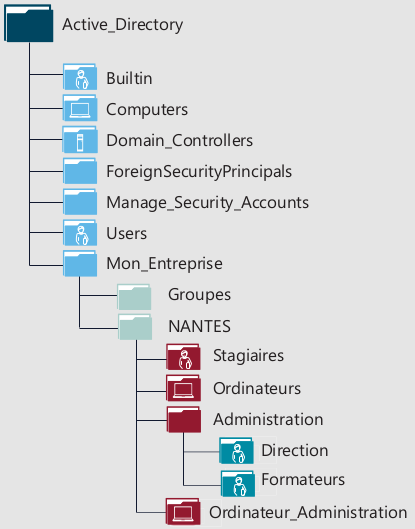
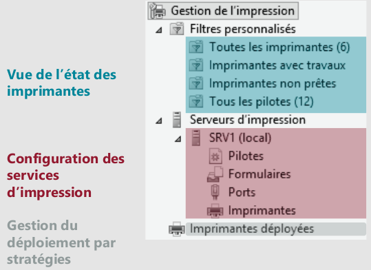

title: notes-02-AD

# ENI TSSR<br>09 - Services Réseau Microsoft

<table class="formateur">
	<tbody>
		<tr>
			<th scope="row">Cours ENI </th>
			<td>du 25/07 au 06/08/2022</td>
		</tr>
		<tr>
			<th scope="row">Formateur</th>
			<td>Matthieu LE MASSON</td>
		</tr>
	</tbody>
</table>

## Notes
<ul>
    <li><a href="notes-01-sysadmin.html">Notes 01. Sysadmin</a></li>
    <li><a href="notes-02-ad.html" >Notes 02. AD</a></li>
    <li><a href="notes-03-gpo.html">Notes 03. GPO</a></li>
    <li></li>
</ul>

## TP
<ul>
<li><a href="../tp/tp01-install-vm.html">tp01-install-vm</a></li>
<li><a href="../tp/tp02-raid.html">tp02-raid</a></li>
<li><a href="../tp/tp03-ad-creation.html">tp03-ad-creation</a></li>
<li><a href="../tp/tp04-ad-util-groupes.html">tp04-ad-util-groupes</a></li>
<li><a href="../tp/tp05-partage.html">tp05-partage</a></li>
<li><a href="../tp/tp07-gpo.html">tp07-gpo</a></li>
<li><a href="../tp/tp08.1-routage.html">tp08.1-routage</a></li>
<li><a href="../tp/tp08.2-routage.html">tp08.2-routage</a></li>
<li><a href="../tp/tp09.1-dhcp.html">tp09.1-dhcp</a></li>
<li><a href="../tp/tp09.2-dhcp-relay.html">tp09.2-dhcp-relay</a></li>
<li><a href="../tp/tp10.1-dns-resolver.html">tp10.1-dns-resolver</a></li>
<li><a href="../tp/tp10.2-dns-hebergeur.html">tp10.2-dns-hebergeur</a></li>
<li><a href="../tp/tp10.3-dns-hebergeur-redondance.html">tp10.3-dns-hebergeur-redondance</a></li>
</ul>

## Sommaire

2. Module 2 - Active Directory
	+ Les services d'annuaire (présentation et installation)
	+ Les bases de gestion d'un domaine
	+ L'accès aux ressources
	+ La gestion des impressions

[TOC]

## Module 2 - Active Directory
**Objectifs** :

- Appréhender le rôle Active Directory
- Gérer les ressources partagées avec AGDLP 
- Connaître la gestion des imprimantes 

### Les services d'annuaire : présentation
#### Domaine Active Directory
- Pour quoi faire ?
	+ Centraliser la gestion de l'authentification.
	+ Centraliser les informations relatives aux utilisateurs et ressources.
	+ Centraliser la gestion des paramètres utilisateurs et ordinateurs.
	+ Fournir une base de fonctionnement aux services et outils Microsoft.

- Utilisation de protocoles standardisés : **DNS** / **LDAP** / **Kerberos** 
	+ **DNS** : résolution des noms de machines et localisation de services.
	+ **LDAP** : norme pour les systèmes d'annuaires avec une structure de bdd arborescente.
	+ **Kerberos** : Protocole d'authentification reposant sur un mécanisme de clés secrètes et l'utilisation de tickets.

#### La forêt Active Directory

Une forêt comprend un ou plusieurs domaine AD partageant le même schéma, les mêmes informations de configuration et de recherche. 

Les domaines d'une même forêt sont liés par une relation d'approbation transitive bidirectionnelle.

[](../.ressources/img/foret.png){:target="_blank"}


#### Les composantes d'un domaine
##### Le domaine 

- Un **domaine Active Directory** est un ensemble d'ordinateurs en réseau qui partagent une bdd commune. 
	+ Un domaine est administré comme un ensemble, régi par des règles et procédures communes.
- Les **contrôleurs de domaine** sont les serveurs qui assurent la gestion du domaine.
	+ Ils assurent les tâches d'hébergement et de gestion de la base AD, ainsi que l'authentification.
	
##### Les sites
Un **site Active Directory** est une composante **logique** du domaine utilisée afin d'optimiser la **réplication** et l'**accès aux sources**. 

Il est composé d'un ou plusieurs sous-réseaux TCP/IP. 

[](../.ressources/img/sites.png){:target="_blank"}


#### Les prérequis pour un contexte de domaine
Avant de **promouvoir un serveur en Contrôleur de Domaine**, ces prérequis doivent être respectés :

| Prérequis | Description |
|:--|:--|
| **Nom d'hôte du poste**                  | Le nom d'hôte et le suffixe DNS doivent être correctement définis. |
| **Configuration réseau et adressage IP** | Ces paramètres doivent être opérationnels.                         |
| **Composants Windows**                   | Les composants relatifs aux services ADDS doivent être installés.  | 
| **Prise en compte de l'existant**  | Analyser l'infrastructure existante et déterminer les points essentiels. |
| **Préparation de l'AD**                  | La forêt ou le domaine peut être préparé lors de l'ajout d'un DC.  | 


#### Versions Active Directory
Pour une forêt ou un domain eciblé, les **niveaux fonctionnels** déterminent les **fonctionnalités** fournies au sein de la forêt et du domaine (ex. depuis W2008 R2 : Corbeille AD).

Le choix des niveaux est **contraint** par les versions des **contrôleurs** présents au sein du dimaine et de la forêt.

<table>
	<caption style="text-align: center">Tab. Choix des niveaux</caption>
	<tr>
		<th style="background: #000000;color: white;font-weight: bold;">NF de domaine</th>
		<th style="background: #000000;color: white;font-weight: bold;">2008 R2</th>
		<th style="background: #000000;color: white;font-weight: bold;">2012 R2</th>
		<th style="background: #000000;color: white;font-weight: bold;">2016</th>
	</tr>
	<tr>
		<td rowspan="4" style="vertical-align: middle;background:lightgrey"><b>Versions des CD</b></td>
		<td>2008 R2</td>
		<td style="background: grey;"></td>
		<td style="background: grey;"></td>
	</tr>
	<tr>
		<td>2012 R2</td>
		<td>2012 R2</td>
		<td style="background: grey;"></td>
	</tr>
	<tr>
		<td>2016</td>
		<td>2016</td>
		<td>2016</td>
	</tr>
	<tr>
		<td>2019</td>
		<td>2019</td>
		<td>2019</td>
	</tr>
	<tr>
		<th style="background: #000000;color: white;font-weight: bold;">NF de la forêt</th>
		<th style="background: #000000;color: white;font-weight: bold;">2008 R2</th>
		<th style="background: #000000;color: white;font-weight: bold;">2012 R2</th>
		<th style="background: #000000;color: white;font-weight: bold;">2016</th>
	</tr>
</table>

#### Rétrograder / Promouvoir un Contrôleur de Domaine (CD)
- L'ajout et la suppression d'un contrôleur de domaine sont des actions qui impactent tous les contrôleurs de domaine de la forêt.
- Avant de rétrograder un CD, on s'assurera qu'il ne dispose plus de **rôles FSMO** (voir plus loin).
- Sous W2016 et ultérieur, afin de rétrograder un CD, on utilise la commande suivante :
```
PS> Uninstall-AddsDomainController
```

#### Les composants de domaines : les 5 rôles FSMO
<table>
	<caption style="text-align: center">Tab. Les 5 rôles FSMO</caption>
	<thead>
		<tr>
			<th></th>
			<th>Rôles</th>
			<th>Description</th>
		</tr>
	</thead>
	<tbody>
		<tr>
			<th rowspan="2" style="vertical-align: middle;border-left:2px solid black;border-bottom:2px solid black;border-top: 2px solid black"><b>Forêt</b></th>
			<th style="vertical-align: middle;border-top:2px solid black;"><b>1. Maître de nom de domaine</b></th>
			<td style="border-top:2px solid black;border-right:2px solid black;">Contacté : <ul>
				<li>Lors de l'ajout de la suppression d'un domaine dans une forêt.</li>
				<li><b>En cas de renommage de domaine (Attention)</b></li>
			</ul></td>
		</tr>
		<tr>
			<th style="vertical-align: middle;border-bottom:2px solid black;"><b>2. Maître de schéma</b></th>
			<td style="border-bottom:2px solid black;border-right:2px solid black;">Peut modifier le schéma.<br>Dans le schéma sont stockées les caractéristiques des objets.<br>Les autres ont accès en lecture au schéma.</td>
		</tr>
		<tr>
			<th rowspan="3" style="vertical-align: middle;border-left:2px solid black;border-bottom:2px solid black;border-top: 2px solid black"><b>Domaine</b></th>
			<th style="vertical-align: middle;"><b>3. Maître RID</b></th>
			<td style="border-right:2px solid black;">Alloue les "bloc d'identificateurs relatifs" aux autres CD.<br>Ces derniers puisent dans le bloc pour attribuer les SID aux objets.</td>
		</tr>
		<tr>
			<th style="vertical-align: middle;"><b>4. Maître d'infrastructure</b></th>
			<td style="border-right:2px solid black;">Responsable des objets des autres domaines de la forêt qui sont membres d'objets de son domaine.</td>
		</tr>
		<tr>
			<th style="vertical-align: middle;border-bottom:2px solid black;"><b>5. Maître émulateur PDC</b></th>
			<td style="border-bottom:2px solid black;border-right:2px solid black;">Il gère : 
			<table style="border:none;">
				<tr><td style="border:none;">- MàJ des mdp</td>
					<td style="border:none;">- MàJ des GPO</td></tr>
				<tr><td style="border:none;">- Synchronisation des horloges</td>
					<td style="border:none;">- Explorateur principal de domaine</td></tr>
			</table></td>
		</tr>
	</tbody>
</table>

### TP 03 - Création d'un AD
[Voir le TP 03 - Mise en place d’un domaine Active Directory](../tp/tp03-ad-creation.html){:target = "_blank"}

### Les bases de gestion d'un domaine
#### Objets de l'annuaire et outils de gestion
- Dans un contexte de domaine AD, les tâches courantes de gestion sont liées à l'administration des **principaux objets de l'annuaire**.
	+ Entités de sécurité : **Utilisateur**, **Ordinateur**, **Groupe**
	+ Conteneurs : **Unité d'organisation** (OU), **conteneur système**

- La gestion de ces objets peut se faire :
	+ Depuis la console **Utilisateurs et Ordinateurs Active Directory**.
	+ Depuis le **Centre d'administration Active Directory**.
	+ En PowerShell.

#### Les caractéristiques de l'objet utilisateur
- Ces caractéristiques sont accessibles via **Propriétés** de l'utilisateur, et sont regroupées graphiquement avec un ensemble de catégories.

- Elles sont relatives :
	+ aux paramètres de l'utilisateur pour utiliser des **services de bureau distant**
		* Contrôle à distance 
		* Environnement
		* Profil des service de bureau à distance
		* Sessions 
	+ aux informations générales **concernant l'utilisateur** 
		* Adresse 
		* Général 
		* Organisation 
		* Téléphones 
	+ aux informations nécessaires à sa **connection**
		* Compte
		* Profil 
	+ à l'appartenance aux groupes et aux paramètres utilisateur des **connections entrantes**
		* Membre de 
		* Appel Entrant 

#### Les modèles utilisateur
Il est conseillé d'utiliser des **modèles** de comptes pour simplifier la création de nouveaux comptes utilisateurs.

On crée un compte modèle ayant un nom clair, le plus grand nombre de caractéristiques. On rend ce compte **inactif** par défaut. 
Il suffit ensuite de le **dupliquer** pour créer un compte utilisateur.

#### Les profils utilisateurs
Par défaut, les utilisateurs du domaine peuvent ouvrir une session sur les ordinateurs du domaine.

Un utilisateur AD possède :

- ses propres fichiers et répertoires,
- des fichiers de configuration logiciels personnalisés,
- un environnement de travail personnalisé
- des dossiers personnels

Tout ça est stocké dans le répertoire de **profil** **%systemdrive%\\Utilisateurs\\%username%** (alias **%USERPROFIL%**).

#### Les profils itinérants
Les profils itinérants sont utilisés pour les utilisateurs ayant besoin d'un accès à leur profil depuis n'importe quel ordinateur. C'est ici qu'interviennent les **profils itinérants**.

- Le profil est copié du partage vers l'ordinateur.
- Le profil est chargé sur l'ordinateur à l'ouverture de session.
- Il est ensuite synchronisé à chaque fermeture de session.

#### Les ordinateurs
Dans un contexte de domaine, les membres s'authentifient afin de disposer d'un **jeton d'accès** permettant l'accès aux ressources du domaine.

Ce processus est commun aux utilisateurs et aux ordinateurs. Ceux-ci doivent donc disposer d'un **compte** dans le domaine.

#### Les caractéristiques de l'objet Ordinateur
Au même titre que l'objet Utilisateur, l'objet Ordinateur dispose de caractéristiques qui lui sont propres.

Les principales caractéristiques d'un objet Ordinateur sont :

- son nom et sa description
- La version de l'OS 
- Ses groupes d'appartenance
- etc.

[](../.ressources/img/proprietes.png){:target="_blank"}

#### Les groupes
- Les groupes sont des objets de l'annuaire.
- Tout groupe est caractérisé par un **type** et une **étendue**.

| Type de sécurité | Type de distribution | 
|:--|:--|
| Dispose d'un identifiant de sécurité (SID) | Ne dispose pas de ... |
| Peut-être utilisé pour répondre à un ensemble de besoins | N'est utilisable qu'à des fins de messagerie |


L'étendue du groupe détermine le périmètre d'appartenance des membres ainsi que celui d'utilisation. Elle peut être globale, universelle, de domaine local, ou local. 

##### Groupes Globaux vs. Groupes de Domaines Locaux
<table>
	<thead>
		<tr>
			<th></th>
			<th colspan="2" style="text-align: center;">Caractéristiques des DL</th>
		</tr>
		<tr>
			<th></th>
			<th>Groupes Globaux</th>
			<th>Groupes de Domaines Locaux</th>
		</tr>
	</thead>
	<tbody>
		<tr>
			<th>Utilité</th>
			<td>Regrouper des objets qui possèdent des caractéristiques communes.</td>
			<td>Regrouper des objets qui requièrent un même privilège d'accès pour une ressource donnée.</td>
		</tr>
		<tr>
			<th>Contraintes d'appartenance</th>
			<td>Ne peuvent contenir que des objets Utilisateur, Ordinateur ou Groupe Global <b>du même domaine</b>.</td>
			<td>Peuvent contenir des objet Utilisateur, Ordinateur ou Groupe <b>de tout domaine de la forêt</b>.</td>
		</tr>
		<tr>
			<th>Contrainte d'utilisation</th>
			<td>Peuvent être utilisés <b>sur toute ressource du domaine ou approuvée (forêt)</b></td>
			<td>Peuvent être utilisés <b>uniquement sur les ressources de leur domaine de création</b>.</td>
		</tr>
		<tr>
			<th>Exemple de nom</th>
			<td><i>GG_Commerciaux_Nantes</i></td>
			<td><i>DL_Compta_sur_SRVFIC_L</td>
		</tr>
	</tbody>
</table>

<div class="img-row">
  	<div class="img-col">
  		<a href="../.ressources/img/ad-groupes-globaux.png" target="_blank">
	  		
	  	</a>
	</div>
	<div class="img-col">
  		<a href="../.ressources/img/ad-domaine-local.png" target="_blank">
			
		</a>
	</div>
</div>

##### Les Groupes Locaux
- Ils peuvent être utilisés. Les membres du domaine **conservent leur base SAM**.
- L'utilisation de ce type de groupe est **limitée et limitante**. Ils ne peuvent être utilisés que sur leur poste d'appartenance. 
- Cette limite peut être un atout pour certains besoins en termes de sécurité.
- C'est le **seul** type de groupe qui peut être utilisé **hors domaine**.


#### Les conteneurs système
Les objets de l'annuaire AD sont stockés dans des conteneurs.

Ces conteneurs système sont définis par défaut dans tout domaine AD

| Nom de l'objet | Fonction |
|:---------------|:---------|
| Builtin        | Eléments (Utilisateur et Groupes Locaux) présents dans la base SAM des CD avant leur promotion. Une fois la promotion faite, ces derniers sont déplacés dans ce conteneur. |
| Computers      | Emplacement de stockage par défaut des comptes Ordinateurs |
| System         | Emplacement de stockage des éléments nécessaires au fonctionnement de l'AD et aux composants associés. |
| Users          | Emplacement de stockage des groupes et utilisateurs existant par défaut dans un AD. |

**ATTENTION** : Il n'est pas conseillé de conserver les comptes **Ordinateurs du Domaine** dans le conteneur **Computer**, il en va de même pour les comptes **Utilisateurs** dans le conteneur **Users**.


#### Les unités d'organisation

Des conteneurs supplémentaires peuvent être créés. On les appelle des **Unités d'Organisation** (**UO**) ou **Organizational Units** (**OU**).

L'élaboration d'une structure organisationnelle doit prendre en considération les besoins suivants :

- Les stratégies de groupe (**GPO** *Group Policy Object*)
- Les délégations administratives
- L'organisation des objets dans l'arborescence 

Tout objet de l'annuaire ne peut être positionné directement que dans un seul conteneur. 

**ATTENTION**: sur les Contrôleurs de Domaine (CD), les UO sont protégées par défaut contre toute suppression accidentelle (c'est possible de modifier cela).

[](../.ressources/img/unite-organisationnelle.png){:target="_blank"}

#### Importation / Exportation de comptes
Lorsqu'un nombre important de comptes utilisateurs doit être créé, l'utilisation d'outils (ex. PowerShell ou **csvde**) permet de **fiabiliser** et **réduire la durée de la tâche**.

### TP 04 - AD : Gestion des utilisateurs & groupes
[Voir TP 04 - Gestion des utilisateurs et groupes dans un contexte de domaine AD](../tp/tp04-ad-util-groupes.html){:target="_blank"}

### L'accès aux ressources
Le partage de ressource est un service nécessaire aux utilisateurs. Sa mise en oeuvre et sa gestion incombent au sysadmin qui doit respecter les exigences de **disponibilité** et de **sécurité**.

Nous parlerons d'**espace disque partagé**.

#### Utilité des autorisations NTFS
Sur un espace disque formaté en NTFS ou ReFS : 

- Les autorisations NTFS permettent de définir quels sont les **privilèges d'accès**
- **Tous les dossiers et fichiers** d'un volume formaté y sont soumis 
- Elles sont accessibles depuis l'onglet **Sécurité** du menu **Propriétés** des éléments.

#### Les caractéristiques des autorisations NTFS
- Deux niveaux de gestion sont disponibles : les **autorisations de base** et les **autorisations avancées**
- La gestion des permissions est basée sur des **règles explicites**.
- Plusieurs règles d'accès peuvent s'appliquer à un même utilisateur.
- Chaque règle peut accorder des privilèges ou les ôter.
- Le mécanisme d'**héritage** s'applique aux autorisations positionnées sur des dossiers et s'appliquent aux objets enfants. 
- Une règle de **refus** peut être explicite ou implicite.

#### Les autorisations NTFS de base et avancées
- Pour répondre aux besoins courants, les autorisations de base permettent d'accorder les privilèges suivant : **Lecture**, **Liste de contenu**, **Lecture + execution**, **Ecriture**, **Modification**, **Contrôle Total**
- Les privilèges complémentaires suivants peuvent être attribués, par les **autorisations avancées**.
	+ **Appropriation**       : lecture des attributs étendus
	+ **Création de fichier** : modifier les autorisations
	+ **Création de dossier** : suppression 
	+ **Ecriture des attributs étendus** : suppression de sous-dossiers et fichiers 

#### Cumul d'autorisations
- Chaque autorisation s'applique à un objet **Utilisateur** ou **Groupe de Sécurité**. Il est cependant préférable de n'appliquer des autorisations qu'aux groupes.
- Pour chaque entrée de contrôle d'accès, l'autorisation peut être appliquée :
	+ **Autoriser** 
	+ **Refuser** afin d'**ôter le privilège** correspondant 
- A defaut de règle d'autorisation (explicite) le concernant, l'utilisateur est soumis à un **refus implicite**.
- Les autorisations sont **cumulatives**, la résultante des autorisations affectant un utilisateur correspond au cumul des autorisations le concernant.
- En cas de conflit, **le refus l'emporte**.

#### Héritage des autorisations NTFS
- L'héritage s'applique par défaut aux autorisations NTFS positionnées sur des dossiers.
- Il est conseillé d'affecter ces autorisations **en partant de la racine** d'une arborescence afin de bénéficier de l'héritage.
- L'héritage peut être rompu sur un point d'arborescence ou repropagé à partir d'un élément.
- Il y a néanmoins des contraintes 

| | Au sein d'une même partition | Entre 2 partitions ou disques |
|:--:|:--:|:--:|
| **Déplacement** | **Conservation** | Héritage |
| **Copie**       | Héritage         | Héritage |

 
#### Le partage de fichiers
Le partage vient en complément des autorisations NTFS.

Un poste disposant de partage joue le rôle de serveur de fichiers. 

[](../.ressources/img/partage-fichiers.png){:target="_blank"}


#### Les autorisations de partage
Les autorisations de partage permettent de définir quels seront les privilèges, s'ils autoriseront ou interdiront et pour qui.

- 3 types de privilèges partage : 
	+ Lecture
	+ Modification 
	+ Contrôle Total
- Pour chaque niveau, les privilèges correspondant peuvent être **Autorisé** ou **Refusé**
- Chaque règle cible une ou plusieurs entités.
- Les règles de contrôles d'accès sont cumulatives et les **refus prioritaires**.


#### Autorisations résultantes

Quand l'utilisateur accède depuis son poste de travail à une ressource partagée, il est d'abord soumis aux autorisations du partage, puis aux autorisations NTFS. 

Les privilèges les plus restrictifs prévalent.

[](../.ressources/img/autorisations-partage.png){:target="_blank"}

#### Les publications de partage
Un fois créé, il est possible de **publier le partage dans l'AD**.

- L'objet **Partage** est soit lié à :
	+ L'objet **Ordinateur** auquel il est associé.
	+ **Indépendant** et peut être déplacé dans un UO dédié.

- La publication de partage facilite la recherche pour les utilisateurs depuis leur poste client avec la fonction **Rechercher dans Active Directory**.

#### Stratégie d'imbrification des groupes
Afin de gérer efficacement l'accès aux ressources, Microsoft préconise l'imbrication des **Groupes Globaux** et de **Domaines Locaux**.

| Gestion des utilisateurs | Gestion de la ressource |
|:-------------------------|:------------------------|
| **A** : le compte utilisateur est créé.    | **DL** : un groupe de Domaine Local est créé par type de privilège pour chaque ressource. |
| **G** : il est affecté aux Groupes Locaux. | **P** : des permissions NTFS sont attribuées pour ce groupe de domaine local sur la ressource. |

### TP 05 - Partage de dossier dans l'AD

[Voir "TP 05 - Gestion des ressources dans un contexte de domaine AD"](../tp/tp05-partage.html)

### La gestion des impressions
#### Le service d'impression
L'ajout du service de rôle **Serveur d'impression** permet de partager des imprimantes et centraliser la gestion de l'impression.

Les imprimantes sont des ressources généralement raccordées au réseau de l'entreprise. Cependant, la mise en place d'un serveur d'impression permet de centraliser et d'en simplifier la gestion.

| Vocabulaire             | Définition |
|:------------------------|:-----------|
| **Port d'impression**   | Lien qui permet la communication entre le périphérique d'impression et le serveur (ou à un poste client). |
| **File d'attente**      | Liste des documents en attente de traitement par l'imprimante. |
| **Imprimante locale**   | Imprimante directement (physiquement) connectée à un serveur ou à un serveur ou à un poste client. |
| **Imprimante partagée** | Imprimante accessible sur le réseau. Elle peut être de type "imprimante réseau" ou du type "imprimante locale" mais il faut alors que le poste ou le serveur qui la partage soit allumé pour qu'elle soit accessible. |
| **Imprimante réseau**   | Imprimante indépendante qui possède sa propre carte réseau, parfois un écran de configuration ou/et un petit serveur web embarqué pour l'administration à distance. |

#### Les tâches de gestion et outils
L'ajout du service de rôle **Serveur d'impression** fournit la console de gestion **Gestionnaire d'impression**.

Cette console rassemble les composants de gestion nécessaires : 

- Vue de l'état des imprimantes 
- Configuration des services d'impression 
- Gestion du déploiement par stratégies

[](../.ressources/img/imprimantes.png){:target="_blank"}

#### La gestion des périphériques
Comme pour les ressources disque, une imprimante doit être partagée pour être accessible via le réseau. 

L'attribution des privilèges se configure depuis les paramètres de sécurité :

- **Imprimer** : Autorisation de base + autorisation étendue
- **Gérer l'imprimante** : Autorisation de base + autorisation étendue
- **Gérer les documents** : Autorisation de base + autorisation étendue
- **Autorisation de lecture** : Autorisation étendue
- **Modifier les autorisations** : Autorisation étendue

#### La gestion du déploiement
Plusieurs méthodes peuvent être utilisées pour déployer des imprimantes.

- Le déploiement manuel
- L'utilisation de script 
- Le déploiement par stratégies de groupe

### TP 06 - Gestion d'imprimante

TP 06 n'a pas été donné en cours.


<div style="align-items:center;font-style:italic;text-align:center;font-size:20px;font-weight:bold;">
-Fin-
</div>

<link rel="stylesheet" type="text/css" href=".ressources/css/bootstrap.min.css">
<link rel="stylesheet" type="text/css" href=".ressources/css/style.css">
<link rel="stylesheet" type="text/css" href=".ressources/css/headings.css">