title: notes-03-GPO

# ENI TSSR 09 - Services Réseau Microsoft

<table class="formateur">
	<tbody>
		<tr>
			<th scope="row">Cours ENI </th>
			<td>du 25/07 au 06/08/2022</td>
		</tr>
		<tr>
			<th scope="row">Formateur</th>
			<td>Matthieu LE MASSON</td>
		</tr>
	</tbody>
</table>

## Notes
<ul>
    <li><a target="_blank" href="notes-01-sysadmin.html">Notes 01. Sysadmin</a></li>
    <li><a target="_blank" href="notes-02-ad.html"      >Notes 02. AD</a></li>
    <li><a target="_blank" href="notes-03-gpo.html"     >Notes 03. GPO</a></li>
    <li><a target="_blank" href="notes-04-routage.html" >Notes 04. Routage</a></li>
    <li><a target="_blank" href="notes-05-dhcp.html"    >Notes 05. DHCP</a></li>
    <li><a target="_blank" href="notes-06-dns.html"     >Notes 06. DNS</a></li>
</ul>

## TP
<ul>
	<li><a target="_blank" href="../tp/tp01-install-vm.html">tp01-install-vm</a></li>
	<li><a target="_blank" href="../tp/tp02-raid.html">tp02-raid</a></li>
	<li><a target="_blank" href="../tp/tp03-ad-creation.html">tp03-ad-creation</a></li>
	<li><a target="_blank" href="../tp/tp04-ad-util-groupes.html">tp04-ad-util-groupes</a></li>
	<li><a target="_blank" href="../tp/tp05-partage.html">tp05-partage</a></li>
	<li><a target="_blank" href="../tp/tp07-gpo.html">tp07-gpo</a></li>
	<li><a target="_blank" href="../tp/tp08.1-routage.html">tp08.1-routage</a></li>
	<li><a target="_blank" href="../tp/tp08.2-routage.html">tp08.2-routage</a></li>
	<li><a target="_blank" href="../tp/tp09.1-dhcp.html">tp09.1-dhcp</a></li>
	<li><a target="_blank" href="../tp/tp09.2-dhcp-relay.html">tp09.2-dhcp-relay</a></li>
	<li><a target="_blank" href="../tp/tp10.1-dns-resolver.html">tp10.1-dns-resolver</a></li>
	<li><a target="_blank" href="../tp/tp10.2-dns-hebergeur.html">tp10.2-dns-hebergeur</a></li>
	<li><a target="_blank" href="../tp/tp10.3-dns-hebergeur-redondance.html">tp10.3-dns-hebergeur-redondance</a></li>
</ul>

## Sommaire

3. Module 3 - Les stratégies de groupe
	+ Le fonctionnement des GPO
	+ Le ciblage des stratégies
	+ La mise en oeuvre des stratégies
	+ La redirection des dossiers
	+ Le déploiement d'imprimantes par GPO

[TOC]

## Module 3 - Les stratégies de groupes (GPO)

**Objectifs** 

- Appréhender les stratégies de groupes (GPO)

### Le fonctionnement des GPO
#### Description
Les **GPO** (Group Policy Object) ou **stratégies de groupes** sont utilisées dans un domaine AD pour paramètrer les **ordinateurs** et les **utilisateurs**.

**Avantages** 

- Ajoute de la sécurité dans l'entreprise
- Automatisation des actions
- Réduction des tâches d'administration

**Inconvénients**

- La configuration peut être complexe
- Le nombre de paramètres est élevé
- Dépendant des versions du système 

#### Les types de stratégies
Les conditions d'utilisation et d'application varient selon le type de stratégie.

- **Stratégie de GROUPE**
	+ nécessite un contexte de **domaine**
	+ s'applique sur un ou plusieurs éléments 
	+ en cas de conflits, elle l'emporte sur la stratégie locale 

- **Stratégie LOCALE**
	+ est utilisable dans et hors contexte de domaine 
	+ **se configure poste par poste**

#### Du registre aux stratégies
Chaque paramètres modifié va impacter les machines du domaine. 

Deux méthodes : 

1. via le registre (*regedit*) 
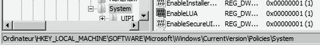
2. via la console MMC traitant des stratégies de groupes 
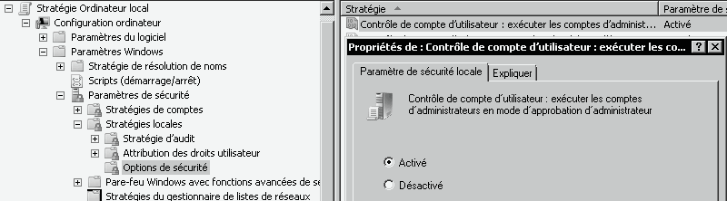

#### Application des stratégies
Comment sont appliquées les GPO : 

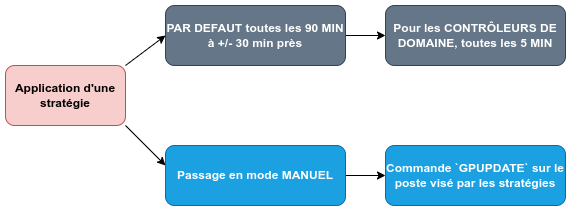

Les extensions côté client (**CSE**) sont les composants du poste client qui :

- récupèrent les stratégies mises à disposition par le contrôleur de domaine 
- intègrent et appliquent les paramètrages qui s'y trouvent

#### Les stratégies par défaut
Après l'installation d'un domaine, 2 stratégies sont configurées par défaut :

1. **Default Domain Policy** (DDP) 
	+ liée à la racine du domaine 
	+ définit les paramètres de sécurité pour les utilisateurs du domaine 
2. **Default Domain Controller Policy** (DDCP) 
    + liée à l'UO *Domain Controller*
    + définit les paramètres de sécurité pour les contrôleurs de domaine 

### Le ciblage des stratégies

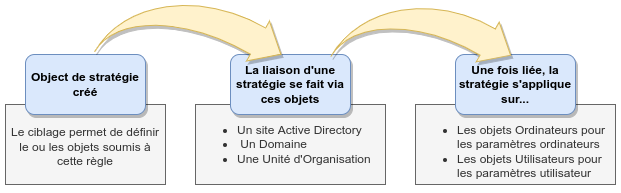

**ATTENTION** ! Les GPO ne s'appliquent pas aux membres des groupes présents sur un conteneur auquel elles sont liées. **Une GPO ne peut pas être appliquée à un groupe**.

#### La console de gestion

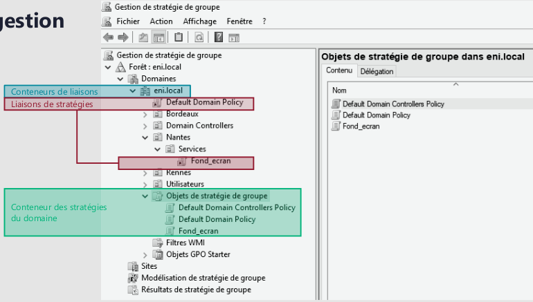

#### Ordre de traitement

1. **Priorités et héritage**
	+ Les stratégies sont héritées du parent vers l'enfant.
	+ Les stratégies héritées sont appliquées avant celles du conteneur courant. 
	+ Les stratégies dont le numéro d'ordre est le plus élevé sont d'abord appliquées (au sein du même conteneur).
	+ Les stratégies marquées **Appliqué** deviennent prioritaires.

2. **Valeurs conflictuelles / Paramètres complémentaires**
	+ Un objet peut être soumis à plusieurs stratégies.
	+ Si les stratégies définissent des paramètres distincts, la résultante est le cumul de ces paramètres.
	+ Si plusieurs stratégies définissent des valeurs distinctes d'un même paramètre, c'est l'ordre d'application qui définira la valeur prise en compte.
	+ La dernière stratégie appliquée l'emporte. La plus proche de l'objet. 

#### Les possibilités de restrictions de liaison
Il y a plusieurs possibilités de restrictions de liaison :

- **Le blocage d'héritage** :
	+ S'active sur un conteneur.
	+ Annule la prise en compte des stratégies héritées de conteneurs parents.
	+ Impacte toutes les stratégies héritées.

- **Le paramètre Appliqué** :
	+ Permet d'outrepasser le blocage d'héritage.
	+ Rend la GPO prioritaire.

- **Les filtres** :
	+ Filtre de sécurité :
		* restreint la lecture et l'application de GPO 
		* des règles de contrôle d'accès pour accorder ou ôter des privilèges
	+ Filtre WMI :
		* Limiter l'application grâce aux requêtes WMI 

### La mise en oeuvre des stratégies
#### Les domaines impactés
Les domaines impactés sont représentés ci-dessous :

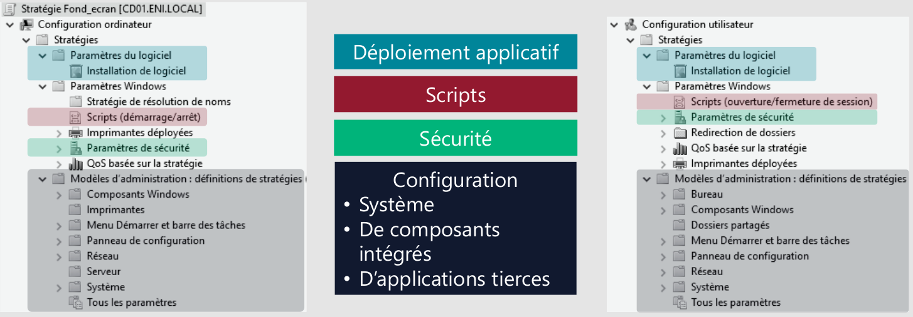

#### Les paramètres de stratégies de groupe

Un point de configuration est associé à un paramètre de GPO et dispose des caractéristiques suivantes : Nom, Etat, Support, Description, Commentaire.

  	

		<a href="../.ressources/img/notes-08.png" target="_blank">
			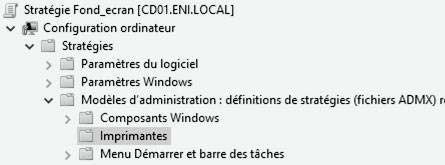
		</a>
		 
		<a href="../.ressources/img/notes-09.png" target="_blank">
			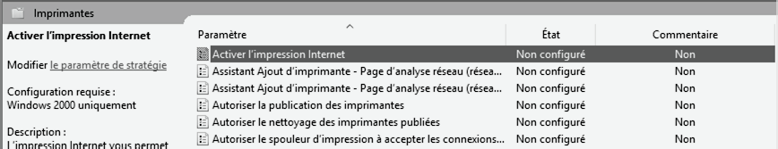
		</a>
	

  	

  		<a href="../.ressources/img/notes-10.png" target="_blank">
  			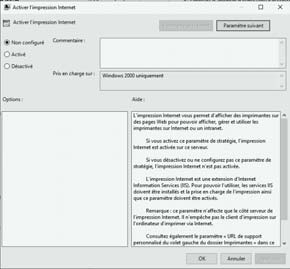
  		</a>
	

#### Les modèles d'administration

  	

		<a href="../.ressources/img/notes-11.png" target="_blank">
			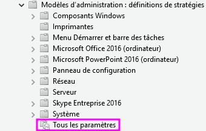
		</a>
	

  	

  		
Les modèles d'administration permettent de configurer l'<b>OS</b>, des <b>composants système</b> ou des <b>outils Microsoft</b>.

  		
Les fichiers relatifs aux paramètres sont stockés dans le partage <b>SYSVOL</b>.

	

### La redirection des dossiers
#### Principe de redirection
Les dossiers du profil utilisateur sont stockés sur un emplacement réseau. 

**Paramètres du dossier partagé** :

- **Partage** : contrôle total pour les utilisateurs redirigés.
- **Permissions NTFS** : liste du dossier et création de dossier dans ce dossier seulement.

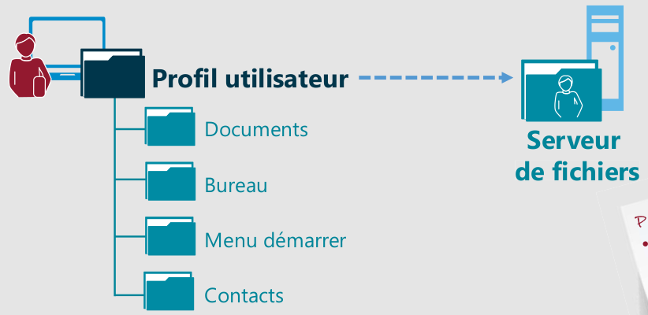

#### Stratégie de redirection des dossiers
Les redirections s'appliquent aux objets **Utilisateurs**.

**Paramètres** :

- **De base** : les dossiers redirigés de l'ensemble des utilisateurs seront stockés dans un **même emplacement réseau**.
- **Avancé** : en fonction de leur **appartenance à des groupes**, les dossiers des utilisateurs seront stockés dans des **emplacements réseau différents**.

**Options**

- Redirection vers le répertoire d'accueil de l'utilisateur 
	+ Les nouveaux utilisateurs ne bénéficieront pas de redirection de dossiers.
- Créer un dossier pour chaque utilisateur sous le chemin d'accès racine 
	+ Chaque utilisateur disposera de son propre sous-dossier 
- Rediriger vers l'emplacement suivant 
	+ Les dossiers redirigés des utilisateurs se trouveront dans le même sous-dossier.
- Redirection vers l'emplacement du profil local 
	+ Arrêt de la redirection

### Le déploiement d'imprimantes par GPO

Depuis le **Gestionnaire d'impression**, il est possible de déployer des imprimantes par GPO.

Les informations à renseigner seront :

- La **stratégie** existante ou nouvelle à utiliser 
- Le **type d'objet** ciblé par le déploiement

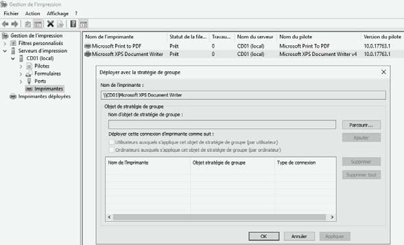

## TP

Voir [Atelier 7 - Stratégie de groupe](../tp/tp07-gpo.html){:target="_blank"}

Objectif : identifier et configurer des paramètres de GPO ciblés. 

-Fin-

<link rel="stylesheet" type="text/css" href="../.ressources/css/bootstrap.min.css">
<link rel="stylesheet" type="text/css" href="../.ressources/css/style.css">
<link rel="stylesheet" type="text/css" href="../.ressources/css/headings.css">