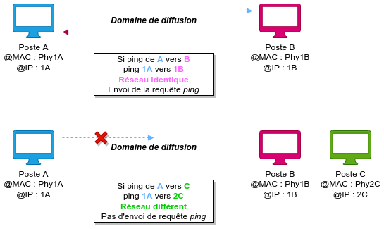

title: notes-04-routage

# ENI TSSR 09 - Services Réseau Microsoft

<table class="formateur">
	<tbody>
		<tr>
			<th scope="row">Cours ENI </th>
			<td>du 25/07 au 06/08/2022</td>
		</tr>
		<tr>
			<th scope="row">Formateur</th>
			<td>Matthieu LE MASSON</td>
		</tr>
	</tbody>
</table>

## Notes
<ul>
    <li><a target="_blank" href="notes-01-sysadmin.html">Notes 01. Sysadmin</a></li>
    <li><a target="_blank" href="notes-02-ad.html"      >Notes 02. AD</a></li>
    <li><a target="_blank" href="notes-03-gpo.html"     >Notes 03. GPO</a></li>
    <li><a target="_blank" href="notes-04-routage.html" >Notes 04. Routage</a></li>
    <li><a target="_blank" href="notes-05-dhcp.html"    >Notes 05. DHCP</a></li>
    <li><a target="_blank" href="notes-06-dns.html"     >Notes 06. DNS</a></li>
</ul>

## TP
<ul>
	<li><a target="_blank" href="tp01-install-vm.html">tp01-install-vm</a></li>
	<li><a target="_blank" href="tp02-raid.html">tp02-raid</a></li>
	<li><a target="_blank" href="tp03-ad-creation.html">tp03-ad-creation</a></li>
	<li><a target="_blank" href="tp04-ad-util-groupes.html">tp04-ad-util-groupes</a></li>
	<li><a target="_blank" href="tp05-partage.html">tp05-partage</a></li>
	<li><a target="_blank" href="tp07-gpo.html">tp07-gpo</a></li>
	<li><a target="_blank" href="tp08.1-routage.html">tp08.1-routage</a></li>
	<li><a target="_blank" href="tp08.2-routage.html">tp08.2-routage</a></li>
	<li><a target="_blank" href="tp09.1-dhcp.html">tp09.1-dhcp</a></li>
	<li><a target="_blank" href="tp09.2-dhcp-relay.html">tp09.2-dhcp-relay</a></li>
	<li><a target="_blank" href="tp10.1-dns-resolver.html">tp10.1-dns-resolver</a></li>
	<li><a target="_blank" href="tp10.2-dns-hebergeur.html">tp10.2-dns-hebergeur</a></li>
	<li><a target="_blank" href="tp10.3-dns-hebergeur-redondance.html">tp10.3-dns-hebergeur-redondance</a></li>
</ul>

## Sommaire

4. Module 4 - Le routage
	+ Concept du routage
	+ Concept de la traduction d'adresse

[TOC]

## Module 4 - Le routage

**Objectifs** 

- Comprendre et configurer le routage

### Concept du routage
#### Le mécanisme du routage
Le mécanisme de routage permet la communication entre différents réseaux logiques.

- **Type de routage**
	+ statique 
	+ dynamique
- **Constitution d'une route**
	+ Adresse de réseau de destination
	+ Masque de sous-réseau du réseau de destination 
	+ Adresse de passerelle 

#### Communication au sein d'un même réseau logique
{:target="_blank"}

**Exemple : 'Poste A' ping 'Poste B'**

{:target="_blank"}

#### Communication au sein de réseaux logiques différents
{:target="_blank"}

{:target="_blank"}

{:target="_blank"}

#### Principe de fonctionnement du routage

> "Chaque paquet à chaque saut est vérifié"

- **Chaque paquet** est traité de manière indépendante dans chaque routeur le long du chemin.
- **À chaque saut**, le routeur examine l'adresse IP de destination pour chaque paquet.
- Le routeur **vérifie** les informations de transfert dans la table de routage.

**Note** : Le routeur peut effectuer 3 opérations avec le paquet :

- Le transférer au tronçon suivant ;
- Le transférer à l'hôte de destination ;
- L'abandonner.

### Concept de la traduction d'adresse
#### La traduction d'adresse sans NAT

{:target="_blank"}

#### La traduction d'adresse avec NAT

{:target="_blank"}

### TP 08.1 - Le routeur et la traduction d'adresse

**Objectifs**:

- Définition et configuration des paramètres TCP/IPv4
- Mise en place et configuration des mécanismes de routage et NAT.

### TP 08.2 - Le réseau global

**Objectifs**:

- Mise en place d'une carte réseau supplémentaire.

-Fin-

<link rel="stylesheet" type="text/css" href=".ressources/css/bootstrap.min.css">
<link rel="stylesheet" type="text/css" href=".ressources/css/style.css">
<link rel="stylesheet" type="text/css" href=".ressources/css/headings.css">