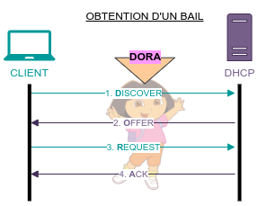
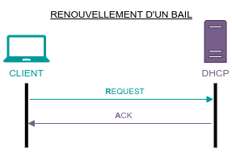
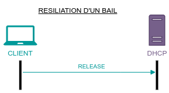

title: notes-05-dhcp

# ENI TSSR 09 - Services Réseau Microsoft

<table class="formateur">
	<tbody>
		<tr>
			<th scope="row">Cours ENI </th>
			<td>du 25/07 au 06/08/2022</td>
		</tr>
		<tr>
			<th scope="row">Formateur</th>
			<td>Matthieu LE MASSON</td>
		</tr>
	</tbody>
</table>

## Notes
<ul>
    <li><a target="_blank" href="notes-01-sysadmin.html">Notes 01. Sysadmin</a></li>
    <li><a target="_blank" href="notes-02-ad.html"      >Notes 02. AD</a></li>
    <li><a target="_blank" href="notes-03-gpo.html"     >Notes 03. GPO</a></li>
    <li><a target="_blank" href="notes-04-routage.html" >Notes 04. Routage</a></li>
    <li><a target="_blank" href="notes-05-dhcp.html"    >Notes 05. DHCP</a></li>
    <li><a target="_blank" href="notes-06-dns.html"     >Notes 06. DNS</a></li>
</ul>

## TP
<ul>
	<li><a target="_blank" href="tp01-install-vm.html">tp01-install-vm</a></li>
	<li><a target="_blank" href="tp02-raid.html">tp02-raid</a></li>
	<li><a target="_blank" href="tp03-ad-creation.html">tp03-ad-creation</a></li>
	<li><a target="_blank" href="tp04-ad-util-groupes.html">tp04-ad-util-groupes</a></li>
	<li><a target="_blank" href="tp05-partage.html">tp05-partage</a></li>
	<li><a target="_blank" href="tp07-gpo.html">tp07-gpo</a></li>
	<li><a target="_blank" href="tp08.1-routage.html">tp08.1-routage</a></li>
	<li><a target="_blank" href="tp08.2-routage.html">tp08.2-routage</a></li>
	<li><a target="_blank" href="tp09.1-dhcp.html">tp09.1-dhcp</a></li>
	<li><a target="_blank" href="tp09.2-dhcp-relay.html">tp09.2-dhcp-relay</a></li>
	<li><a target="_blank" href="tp10.1-dns-resolver.html">tp10.1-dns-resolver</a></li>
	<li><a target="_blank" href="tp10.2-dns-hebergeur.html">tp10.2-dns-hebergeur</a></li>
	<li><a target="_blank" href="tp10.3-dns-hebergeur-redondance.html">tp10.3-dns-hebergeur-redondance</a></li>
</ul>

## Sommaire

5. Module 5 - Le service DHCP
	+ Définition du service DHCP
	+ Notion de Bail
	+ Les conteneurs
	+ La gestion des options
	+ Le service DHCP et les Réseaux
	+ La gestion du DHCP

[TOC]

## Module 5 - Le service DHCP
**Objectifs** : comprendre et configurer le rôle DHCP

### Definition du service DHCP
**DHCP** signifie *Dynamic Host Configuration Protocol*.

**Avantages** :

- **Propagation rapide des informations** d'adressage. 
	+ Ex. modification de l'adresse du 2nd serveur DNS, 
	+ On n'a pas à reconfigurer manuellement les postes clients. 
	+ La modification sera effective au plus tard après la durée du bail. 
- **Optimiser l'utilisation d'une plage d'adresse** 
	+ Ex. 100 postes clients itinérants, 30 bureaux physiques, étendue de 35 adresses.
- **Réduction des erreurs**
- **Centralisation du réseau**
	+ Utiliser avec d'autres outils de déploiement, permet une gestion simplifiée du déploiement de postes (Boot PXE)

**Inconvénients**

- **Vulnérabilité** accrue aux attaques DDOS
	+ Pour résoudre cette problématique, on pourra par ex. configurer le filtrage d'adresse MAC sur ses switchs, ou mettre en oeuvre le DHCP snooping sur ces mêmes équipements. 
- **Ouvert à toute demande**.

### Notion de bail
Le **bail** est l'ensemble des informations qu'un serveur DHCP transmet à son client. 

Il contient :

- une durée
- une adresse IP
- un masque 
- d'autres paramètres 

#### Obtention d'un bail (DORA)
{:target="_blank"}

1. DHCP DISCOVER : le client demande des informations d'adressage.
2. DHCP OFFER : un serveur DHCP lui propose un bail.
3. DHCP REQUEST : le client sélectionne l'offre et la demande. Le REQUEST du client sert aussi à informer les autres serveurs DHCP que leur offre n'a pas été retenue, ils peuvent donc la retirer.
4. DHCP ACK : le serveur valide la demande du client.

#### Renouvellement du bail
{:target="_blank"}

Le renouvellement du bail intervient :

- au démarrage du client 
- à 50% de la durée du bail (par défaut) 
- à 87.5% du bail (seconde tentative par défaut)
- à 100% du bail 

1. DHCP REQUEST : le client fait une requête au serveur pour conserver son bail.
2. DHCP ACK : le serveur lui répond.

#### Résiliation du bail
{:target="_blank"}

Le client peut renoncer au bail en renvoyant un DHCP RELEASE au serveur.

Attention : lors de l'arrêt du poste, le **bail N'EST PAS résilié**. La résiliation du bail peut par exemple être liée à la demande de l'utilisateur pour libérer son adressage (lors d'un changement de réseau par exemple).

### Les conteneurs
Les conteneurs de gestion du serveur DHCP sont l'étendue et la réservation. (?!)

- A la base : l'**étendue**. Elle est caractérisée par :
	+ un nom (ex. *LAN_Serveurs*)
	+ une plage d'adresses (ex. *192.168.0.1 à 192.168.0.254 /24*)
	+ une durée de bail (ex.*2 jours)
	+ des exclusions (ex. *192.168.0.5 à 192.168.0.10*)

- Le plus ciblé : la **réservation**. Elle est caractérisée par :
	+ un nom (ex. *SRVFIC*)
	+ l'adresse ip à réserver (ex. *192.168.0.1*)
	+ l'adresse matérielle de l'équipement (ex. *MAC 00:15:5d:6e:6e:03*)
	+ le conteneur parent ie. l'étendue (ex. *LAN_Serveurs*)
	
### La gestion des options
#### Les options de configuration
Les options de configuration complètent la configuration ip des clients DHCP. 

<table class="table">
	<caption class="caption">Quelques exemples d'options de configuration</caption>
	<tr>
		<th>Nom</th><th>Code</th><th>Utilité</th>
	</tr>
	<tr>
		<th>Routeur</th><td>3</td><td>Définit la passerelle par défaut</td>
    </tr>
    <tr>
    	<th>Serveur de noms de domaine</th><td>6</td><td>Définit le ou les serveurs DNS</td>
    </tr>
    <tr>
    	<th>Nom de domaine DNS</th><td>12</td><td>Définit le suffixe DNS</td>
    </tr>
</table>

##### Le positionnement des options DHCP
Les options peuvent être définies :

- Au niveau du **serveur** : elles concerneront tous les baux distribués par le serveur DHCP. 
- Pour une **étendue** : elles concerneront les baux de l'étendue.
- Pour une **réservation** : elles ne concerneront que la ou les réservations ciblées.

### TP 9.1 Le service DHCP

[Voir TP 9.1 - Mise en place du service DHCP](tp09.1-dhcp.html){:target="_blank"}

### Le DHCP et les réseaux
#### Un serveur DHCP pour plusieurs réseaux
Dans le cas d'un serveur DHCP pour plusieurs réseaux, on tombe sur la problématique suivante : les trames sont envoyées en **diffusion**. 

Solution : l'agent **relais DHCP**

Un agent relais DHCP transmet les messages DHCP provenant des clients vers un serveur DHCP d'un autre réseau. Il effectue l'opération inverse pour les messages provenant du serveur. 

Ces trames ne peuvent franchir les routeurs, il faut donc utiliser un agent de relais DHCP qui se chargera d'acheminer les trames en unicast vers le serveur DHCP désigné. Certains routeurs disposent de cette fonctionnalité.

Client <-----> Relais en BROADCAST 
Relais <-----> Serveur DHCP en UNICAST 

Le serveur constitue le message que doit recevoir le client et, faut de pouvoir le joindre, il constitue un message DHCP pour relais qui contiendra le message DHCP du client. 

### TP 9.2 DHCP Relay

[Voir TP 9.2 : DHCP Relay](tp09.2-dhcp-relay.html){:target="_blank"}

### La gestion du DHCP
#### DHCP dans un contexte de domaine
- La notion d'**autorisation** :
	+ Le ou les serveurs DHCP doivent être **autorisés** pour **démarrer** les services et **fournir** le service.
	
- Incidence de la **non-autorisation** :
	+ Le service DHCP d'un serveur membre non autorisé **ne démarrera pas**.
	+ Le service DHCP d'un serveur autonome présent dans le domaine de diffusion d'un serveur autorisé **s'arrêtera**.

A noter : les serveurs DHCP autres que Microsoft ne prennent pas en compte cette autorisation. 

#### Les opérations de gestion de la base DHCP

- L'ensemble des données de configuration est **stocké dans une base**.
- Un certain nombre d'opérations peuvent être effectuées :
	+ sauvegardes (synchrones ou asynchrones)
	+ restaurations
	+ contrôle de la cohérence de la base 
	+ déplacement de la base 
	
##### La sauvegarde automatique (synchrone)

- Les informations de configuration du service DHCP sont très volatiles dans le temps. 
- Par défaut, une sauvegarde automatique est effectuée toutes les heures. 
- Le chemin de sauvegarde automatique est paramétrables depuis les propriétés du serveur. 

##### La sauvegarde manuelle (asynchrone)
- Depuis les propriétés du serveur, choisir "**Sauvegarder**"
- A l'invite de saisie, spécifier le répertoire de destination de la sauvegarde.

##### La restauration
Après avoir remis en service le rôle DHCP, les actions suivantes seront à réaliser :

- Depuis les propriétés du serveur DHCP > choisir "**Restaurer**" > fournir le chemin du répertoire de restauration.
- Une fois la restauration achevée, le service DHCP redémarre automatiquement afin que la configuration soit appliquée.

#### Le fractionnement d'étendues

<table class="table table-borderless">
	<tr>
		<td width="35%">
			
Il permet d'automatiser la création d'une étendue sur 2 serveurs ayant la charge de la plage correspondante.

			
Les modifications pouvant être apportées après création ne sont pas répliquées entre les 2 serveurs ayant la charge de l'étendue. Elles sont à faire sur les deux.

		</td>
		<td></td>
	</tr>
</table>

Attention, cette fonctionnalité simplifie la mise en place initiale de la solution. Une fois les étendues créées, il n'y a plus d'échange entre les serveurs.

#### Pour aller plus loin

- Pour les **problématiques de panne et de disponibilité** :
	+ Configurer un serveur DHCP "*de secours*" : opérationnel mais non démarré
	+ La solution **DHCP failover**
	
- Pour améliorer la **sécurité** :
	+ mettre en place des stratégies de **filtrage** (sur les adresses MAC)
	
- Pour la **surveillance** et le **diagnostic** :
	+ Consulter les journux d'évènements (source **DHCP-Server**)
	+ Consulter le journal d'audit : 1 fichier **.log** par jour dans le répertoire de la base. 
	
### TP 09.3 Disponibilité du service DHCP

[Voir TP09.3 Disponibilité du service DHCP](tp09.3-dhcp-failover.html){:target="_blank"}

Notes: pas fait. Le DHCP Failover est dans le bonus du tp. Le reste du tp est bateau.

-Fin-

<link rel="stylesheet" type="text/css" href=".ressources/css/bootstrap.min.css">
<link rel="stylesheet" type="text/css" href=".ressources/css/style.css">
<link rel="stylesheet" type="text/css" href=".ressources/css/headings.css">

