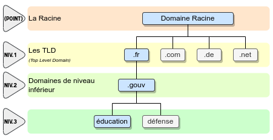
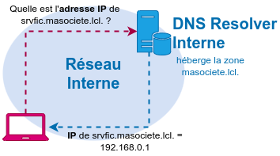
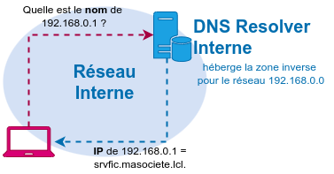
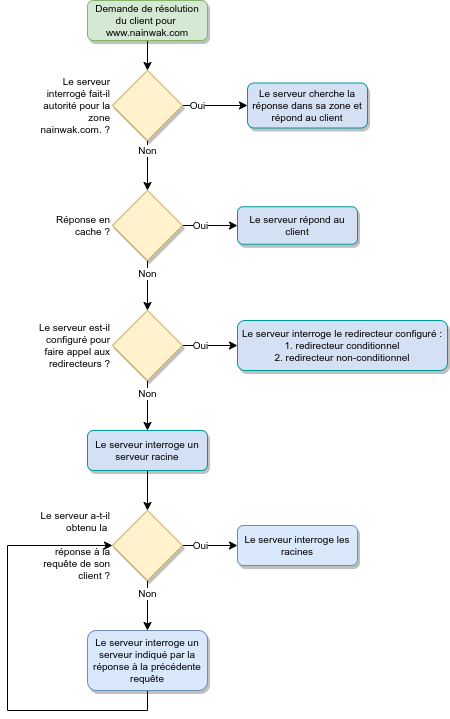

title: notes-06-DNS

# ENI TSSR<br>09 - Services Réseau Microsoft

<table class="formateur">
	<tbody>
		<tr>
			<th scope="row">Cours ENI </th>
			<td>du 25/07 au 06/08/2022</td>
		</tr>
		<tr>
			<th scope="row">Formateur</th>
			<td>Matthieu LE MASSON</td>
		</tr>
	</tbody>
</table>


## Notes
<ul>
    <li><a target="_blank" href="notes-01-sysadmin.html">Notes 01. Sysadmin</a></li>
    <li><a target="_blank" href="notes-02-ad.html"      >Notes 02. AD</a></li>
    <li><a target="_blank" href="notes-03-gpo.html"     >Notes 03. GPO</a></li>
    <li><a target="_blank" href="notes-04-routage.html" >Notes 04. Routage</a></li>
    <li><a target="_blank" href="notes-05-dhcp.html"    >Notes 05. DHCP</a></li>
    <li><a target="_blank" href="notes-06-dns.html"     >Notes 06. DNS</a></li>
</ul>

## TP
<ul>
	<li><a target="_blank" href="tp01-install-vm.html">tp01-install-vm</a></li>
	<li><a target="_blank" href="tp02-raid.html">tp02-raid</a></li>
	<li><a target="_blank" href="tp03-ad-creation.html">tp03-ad-creation</a></li>
	<li><a target="_blank" href="tp04-ad-util-groupes.html">tp04-ad-util-groupes</a></li>
	<li><a target="_blank" href="tp05-partage.html">tp05-partage</a></li>
	<li><a target="_blank" href="tp07-gpo.html">tp07-gpo</a></li>
	<li><a target="_blank" href="tp08.1-routage.html">tp08.1-routage</a></li>
	<li><a target="_blank" href="tp08.2-routage.html">tp08.2-routage</a></li>
	<li><a target="_blank" href="tp09.1-dhcp.html">tp09.1-dhcp</a></li>
	<li><a target="_blank" href="tp09.2-dhcp-relay.html">tp09.2-dhcp-relay</a></li>
	<li><a target="_blank" href="tp10.1-dns-resolver.html">tp10.1-dns-resolver</a></li>
	<li><a target="_blank" href="tp10.2-dns-hebergeur.html">tp10.2-dns-hebergeur</a></li>
	<li><a target="_blank" href="tp10.3-dns-hebergeur-redondance.html">tp10.3-dns-hebergeur-redondance</a></li>
</ul>

## Sommaire

6. Module 6 - Le service DNS 
    + La résolution de nom 
    + Le service DNS
    + La hiérarchisation des espaces de noms 
    + Le rôle du serveur hébergeur 
    + Le DNS hébergeur 
    + Les zones 
    + Les mises à jour et le transfert de zone 
    + Les sous-domaines 

[TOC]

## Module 6 - Le service DNS
**Objectifs** : Comprendre et configurer le rôle DNS.


### La résolution des noms
#### La machine et l'humain, les chiffres ou les lettres
Quand nous sollicitons un service ou une ressource, nous indiquons :

- le service sollicité
- le nom de la machine qui fournit le service.

Les communications réseau sont toujours **établies avec des adresses réseau**. Le système fait appel à des mécanismes de résolution de nom.


#### La résolution de noms d'hôtes
Afin de résoudre les noms d'hôtes en adresse IP, plusieurs mécanismes peuvent être utilisés.

<table class="table">
	<tr>
		<th class="table-dark">Mécanisme</th>
		<th class="table-dark">Utilité</th>
	</tr>
	<tr>
		<th class="table-secondary">Le cache DNS</th>
		<td>Il contient les correspondances entre des noms de d'hôtes déjà résolus et les adresses IP correspondantes.
			<br>Il conserve aussi les réponses négatives aux requêtes du client.
			<br>Il se gére avec la commande <code>ipconfig</code> : <ul><li><code>ipconfig /displaydns</code> : affichage du cache</li><li><code>ipconfig /flushdns</code> : vide le cache</li></ul></td>
	</tr>
	<tr>
		<th class="table-secondary">Le service DNS</th>
		<td>Les clients DNS interrogent leur(s) serveur(s) DNS pour leurs requêtes de résolution.</td>
	</tr>
	<tr>
		<th class="table-secondary">Le fichier <i>hosts</i></th>
		<td>Les modifications effectuées dans ce fichier (ajout et suppression d'entrées) sont reportées dans le cache DNS dès l'enregistrement du fichier.</td>
	</tr>
</table>


#### Structure du fichier hosts
Le fichier de configuration local **C:\\Windows\\System32\\drivers\\etc\\hosts** permet de renseigner des correspondances entre des noms et les adresses IP correspondantes.

La syntaxe de ce fichier est la suivante :

```
Adresse_IP      Nom 
172.16.255.254  rtsiege.monentreprise.local 
172.17.0.0      srv01,srv01.monentreprise.local 
```

**Notes**: Les informations contenues dans le fichier *hosts* sont prioritaires à l'interrogation du service DNS, s'il trouve une correspondance pour un nom donné dans ce fichier, le poste n'ira pas requêter le service. 

**Remarques** :

- Dans un fichier hosts, plusieurs noms peuvents être définis à la suite.
- Préchargement dans le cache NetBIOS possible de certains hôtes présents dans le fichier lmhosts en spécifiant sur chaque ligne le paramètre `#PRE` (accélère la résolution du coup pour ces hôtes).

### Le service DNS

Le DNS, ou **Domain Name System**, est un service de résolution de noms. 

Il permet de **résoudre** :

- Une **adresse IP** en nom 
- Un **service** pour un espace de noms en nom de serveur l'hébergeant
- Un **nom** en adresse IP

Il est défini par des RFC. Ses **principales caractéristiques** sont :

- Il est le mécanisme de résolution de noms d'**Internet** 
- L'espace de nom qu'il couvre est ***hiérarchique***.
- La gestion de son espace de nom est **distribué**.

#### Noms d'hôtes et de domaine
##### Noms d'hôtes

- DNS permet la résolution de **noms d'hôtes pleinement qualifiés** (**FQDN** pour *Fully Qualified Domain Name*) en adresse IP.

Ex. FQDN : http://www.nainwak.com 

{:height="300px"}

Le point sert de séparateur hôte/domaine. 

- La 1er partie du nom identifie le poste au sein de son espace de nom. On parlera de **partie hôte du nom**.
- La 2nd partie du nom identifie l'espace de nom auquel appartient l'hôte. On parlera de **partie domaine du nom**.

##### Nom de domaines
Le **domaine DNS** est la **partie commune** à plusieurs hôtes d'un espace de noms. 

Pour être résolvable, tout hôte doit être identifiable par d'autres postes appartenant à d'autres espaces de noms. Pour cela, il dispose d'un nom pleinement qualifié à l'échelle mondiale. 

Il y a 2 manières d'utiliser les espaces de noms :

- **Usage privé** : pour un espace de nom interne uniquement.
- **Usage public**: référencé sur Internet.

**Remarques** :

- Il est déconseillé d'utiliser des espaces de noms privés déjà référencés sur Internet.
- DNS = domaine de nom différent de domaine d'authentification.


#### La hiérarchisation des espaces de noms
L'espace des noms est **hiérarchique** et cette hiérarchisation est respéctée par **chaque espace de nom**.

{:height="400px"}

La **racine** est constituée de **13 adresses IP** joignables à l'échelle mondiale.

Gestion de ces serveurs :

1. A. VeriSign Global Registry Services
2. B. Information Sciences Institute
3. C. Cogent Communications 
4. D. University of Maryland 
5. E. NASA Ames Research Center 
6. F. Internet Systems Consortium Inc. 
7. G. US DoD Network Information Center 
8. H. US Army Research Lab 
9. I. Autonomica/NORDUnet 
10. J. VeriSign Global Registry Services 
11. K. RIPE NNC
12. L. ICANN
13. M. WIDE Project

**Remarques** :

- La liste exhaustive des TLD est disponible ici : http://www.iana.org/domains/root/db/
- C’est l’IANA qui gère la zone. Le contenu de cette zone est visible ici : http://www.isoc.org/briefings/020/zonefile.shtml
- C’est l’AFNIC qui gère la zone fr. En savoir plus sur cette zone : http://www.iana.org/domains/root/db/fr.html

**Notes** : Les serveurs racines ne répondent qu’aux requêtes itératives ; ils ne disposent pas de cache.

**Un serveur DNS, comment ? pour quoi faire ?**

- Fournir des correspondances entre noms d'hôtes et adresses IP associées.
- En premier lieu, il faut identifier les besoins de résolutions de noms. 
- La mise en place d'un service de nommage interne (ex. un AD) nécessite un **serveur DNS Hébergeur**.
- La résolution de noms externes à l'entreprise nécessite un **serveur DNS résolveur**.
- Le Resolver et l'Hébergeur peuvent être assurés par un seul serveur ou par 2 serveurs distincts.

#### Le rôle du DNS Resolver

Le DNS Résolveur effectue des requêtes auprès d'autres serveurs DNS afin de résoudre les requêtes de ses clients. C'est le partenaire désigné des équipements clients du service de résolution de noms.

**Il ne gère pas d'espace de noms**.


#### Les mécanismes d'interrogation des serveurs DNS

Deux types de requêtes peuvent être adressés à un serveur DNS :

- Les **requêtes récursives** 
	+ Le serveur répondant doit fournir une **réponse complète** à la question posée. 
	+ Ce type de requête est fréquemment utilisé par un client pour son serveur DNS. 
	
- Les **requêtes itératives** 
	+ Le serveur qui envoie la requête accepte une **réponse partielle** à la question posée. 
	+ La réponse sera une **indication** lui permettant d'avancer dans son processus de résolution.
	+ Ce type de requête est fréquemment utilisé lors de l'exploration de l'arborescence DNS à partir de la racine.


**Notes mnémotechniques**: 

- **Ré**cursive = **Ré**ponse aux clients. 
- **I**térative = **I**ndication, indice.


##### Requêtes récursives

[](../.ressources/img/notes-28.png){:target="_blank"}

1. Le client fait une requête récursive au serveur pour obtenir l'adresse IP d'un hôte.
2. Le serveur fournit l'adresse demandée au client.


##### Requêtes itératives

[](../.ressources/img/notes-29.png){:target="_blank"}

1. Le client demande à son **serveur DNS résolveur** de résoudre **www.amendes.gouv.fr**
2. Le serveur n'héberge pas l'espace de noms *amendes.gouv.fr.*
3. Le **DNS Résolveur** fait une requête itérative à un des serveurs racines. 
4. En réponse, le serveur racine lui indique les adresses des NS de la zone *fr.*
5. Le **DNS résolveur** interroge un NS de la zone *fr.*. Celui-ci gère les domaines *fr.* et *gouv.fr.* mais il ne gère pas *amendes.gouv.fr.*
6. En réponse, le serveur *fr.* requêté fournit l'adresse des NS de la zone *amendes.gouv.fr.*
7. Le **DNS Résolveur** interroge un NS de la zone *amendes.gouv.fr.*
8. Le serveur lui transmet l'adresse IP de l'hôte **www.amendes.gouv.fr**

**Attention**, l'échange de requêtes est consommatrice de ressources CPU pour le serveur et de bande passante pour le réseau. Afin de limiter ces échanges, deux mécanismes existent :

- L'utilisation de serveurs redirecteurs
- La mise en cache

#### Les redirections
##### La redirection non conditionnelle
- Sans configuration particulière, un serveur DNS ira interroger les serveurs **racine** afin de résoudre les requêtes de ses clients
- Si un serveur est configuré de telle sorte à utiliser la redirection, il demandera à son serveur redirecteur de trouver les réponses aux requêtes de ses clients. 

[](../.ressources/img/notes-30.png){:target="_blank"}


##### Le redirecteur conditionnel
- Un serveur DNS peut être configuré pour faire appel à des **redirecteurs ciblés** pour des **espaces de noms identifiés**. Il s'agit de **redirecteurs conditionnels**. 

- Cette configuration permet de :
	+ Résoudre des espaces de noms privés non référencés et non résolvables dans l'arborescence d'espaces de noms publics.
	+ D'optimiser la résolution d'espaces de noms qui sont souvent sollicités. 

[](../.ressources/img/notes-31.png){:target="_blank"}

##### La mise en cache
- Chaque fois qu'un serveur DNS faire appel à d'autres serveurs pour ses demandes de résolutions, il enregistre dans **le cache DNS** les résultats obtenus. 
- La durée de conservation en cache est propre à chaque enregistrement (**TTL**).
- Les réponses **négatives** (enregistrement inexistant par exemple) sont aussi conservées en cache.
- Lorsque le serveur reçoit une requête d'un client, il détermine si cette dernière est relatives à une zone pour laquelle il fait autorité. Si ce n'est pas le cas, il consulte son cache.

**Notes**: le serveur et le client disposent de cache différents.

#### TP10.1 - DNS Resolver
Voir [TP 10.1 - DNS Resolver](../tp/tp10.1-dns-resolver.html){:target="_blank"}

### Le DNS hébergeur
#### Son rôle
Le rôle du DNS hébergeur est de :
- Gérer un ou plusieurs espaces de noms. 
- Répondre aux requêtes relatives à l'espaces de nom qu'il gère.
- Faire autorité pour le ou les espaces de noms qu'il gère.

#### Les zones
Les zones correspondent au conteneur de l'ensemble des données d'un espace de nom.

- Elle contient un ensemble d'**enregistrements**.
- Le contenu de chaque **zone** est stocké dans un **fichier de zone** qui lui est propre, habituellement stocké dans **%windir%/System32/dns**. C'est le chemin par défaut, excepté pour les zones intégrées dans un AD.

##### Zone directe
- A chaque espace de nom correspond une zone. 
- Un serveur faisant autorité est en mesure de répondre **directement** aux requêtes concernant l'espace de noms correspondant. 
- S'il fait autorité sur une **zone directe**, il peut résoudre **un nom en adresse IP**.

[](../.ressources/img/notes-32.png){:target="_blank"}


##### Zone inverse

S'il fait autorité sur une **zone inverse**, il peut résoudre une **adresse ip en nom**

[](../.ressources/img/notes-33.png){:target="_blank"}


##### Zone principale et zone secondaire

<table class="table-hover">
	<tr>
		<td></td><th>Serveur maître</th><th>Serveur esclave</th>
	</tr>
	<tr>
		<th>Type de zone hébergée</th><td>Zone principale</td><td>Zone secondaire</td>
	</tr>
	<tr>
		<th>Autorisation d'accès</th><td>Lecture/Ecriture</td><td>Lecture</td>
	</tr>
	<tr>
		<th>Fait autorité pour la zone</th><td>Oui</td><td>Oui</td>
	</tr>
</table>

##### Contenu d'une zone
- Une **zone** contient un ensemble d'enregistrements
- Dans une **zone directe ou inverse** il y a :
	+ un **SOA** (**Start Of Authority**) : nom FQDN du serveur DNS disposant de la zone en écriture.
	+ un ou des **NS** (**Name Server**) : serveurs **faisant autorité** pour la zone.


Les enregistrements présents dans des **zones directes** :

<table>
	<tr>
		<th>Type d'enregistrements</th><th>Contenu</th>
	</tr>
	<tr>
		<th>SOA</th><td>nom FQDN du serveur DNS disposant de la zone <b>en écriture</b></td>
	</tr>
	<tr>
		<th>NS</th><td>serveur(s) <b>faisant autorité</b> pour la zone</td>
	</tr>
	<tr>
		<th>A</th><td>(<i><b>A</b>dresse record</i>) hôte IPv4. Fait correspondre un nom d'hôte ou un nom de domaine/sous-domaine à une adresse IPv4 (32 bits/4 octets).</td>
	</tr>
	<tr>
		<th>AAAA</th><td>hôte IPv6 (<i>IPv6 addresse record</i>). Fait correspondre un nom d'hôte à une adresse IPv6 (128 bits/16 octets)</td>
	</tr>
	<tr>
		<th>CNAME</th><td>alias (<i><b>Canonical Name Record</b></i>). Permet de faire un alias d'un domaine vers un autre. Cet alias hérite de tous les sous-domaines de l'original.</td>
	</tr>
	<tr>
		<th>MX</th><td>serveur de messagerie (<i><b>Mail Exchange Record</b></i>). Définit les serveurs de courriel pour ce domaine.</td>
	</tr>
	<tr>
		<th>SRV</th><td>services qui généralise la notion de <b>MX Record</b>, mais qui propose aussi des fonctionnalités avancées comme le taux de répartition de charge pour un service donné, standardisé dans la RFC 2782.</td>
	</tr>
</table>


Les enregistrements présent dans des **zones inverses** :

<table>
	<tr>
		<th>Type d'enregistrements</th><th>Contenu</th>
	</tr>
	<tr>
		<th>SOA</th><td>nom FQDN du serveur DNS disposant de la zone <b>en écriture</b></td>
	</tr>
	<tr>
		<th>NS</th><td>serveur(s) <b>faisant autorité</b> pour la zone</td>
	</tr>
	<tr>
		<th>PTR</th><td><b>Pointer Record</b> qui associe une adresse IP avec un enregistrement de nom de domaine, aussi dit "<i>reverse</i>" car fait le contraire du <b>A record</b></td>
	</tr>
</table>

##### Récapitulatif des étapes de résolution

[](../.ressources/img/notes-34.png){:target="_blank"}

[](../.ressources/img/notes-34-2.png){:target="_blank"}


#### TP10.2 - DNS hébergeur
Voir [TP 10.2 - DNS Hébergeur](../tp/tp10.2-dns-hebergeur.html){:target="_blank"}


### Les mises à jour
#### Les enregistrements dynamiques
Dans une zone sont inscrites des correspondances entre des noms et des adresses IP.

- Parfois ces enregistrements doivent être maintenus statiquement. 
- Dans d'autre cas, pour une zone principale, l'enregistrement dynamique sera autorisé.

(?)


#### Le transfert de zone
Le transfert de zone est le processus d'échange de données d'une zone entre un serveur maître et un serveur esclave.


**TODO: A REFAIRE**

1. Le serveur DNS esclave interroge le maître pour obtenir le numéro de version de la zone.
2. Le serveur DNS maître fournit en retour le numéro de version de la zone.
3. Si le numéro de version reçu est supérieur au numéro de version connu, le serveur esclave initie alors une requête **IXFR** (incrémentale) ou **AXFR** (complet).
4. Si le transfert de zone est autorisé vers celui qui lui a adressé la requête, le serveur DNS maître répond alors en fournissant les mises à jour de la zone ou toute celle-ci.


L'intervalle de transfert de zone est défini dans l'enregistrement SOA de la zone.

Détail du traitement d'une demande de transfert incrémentale :

1. le client (secondaire) effectue une requête QTYPE IXFR (value 251). Le délai entre 2 requêtes fait partie des caractéristiques du SOA.
2. Dans sa requête, le client fournit le SOA de la version de la zone dont il dispose.
3. Le serveur peut alors soit faire le choix de répondre en initiant un transfert de zone complet (AXFR) ou incrémentale (IXFR). S'il initie un transfert de zone incrémentiel, celui-ci contiendra 2 listes : 1) la liste des enregistrements supprimés, 2) la liste des enregistrements ajoutés.<br>
Ces listes partiront des MàJ les plus anciennes vers les plus récentes. Une modification d'enregistrement correspond à un ajout ou une suppression.

En savoir plus : http://en.wikipedia.org/wiki/DNS_zone_transfer

**Notes** :

- C'est au serveur esclave d'aller interroger son serveur maître afin d'obtenir les màj.
- Néanmoins, le serveur maître a la possibilité de prévenir le ou les serveurs esclaves.
- Qd une modification est effectuée dans sa zone, le numéro de série de celle-ci est incrémenté et le serveur maître émet une requête DNS de type **Notify** à destination des serveurs esclaves.
- Suite à la réception de cette requête, le serveur esclave initiera le processus de transfert de zone précédemment décrit.


#### TP10.3 - DNS hébergeur et redondance
Voir [TP 10.3 - DNS Hébergeur & Redondance](../tp/tp10.3-dns-hebergeur-redondance.html){:target="_blank"}


### Les sous-domaines
Les sous-domaines permettent d'organiser un espace de noms en regroupant des enregistrements par leur appartenance à une même entité (site, service).

[](../.ressources/img/notes-35.png){:target="_blank"}


#### Les délégations
La gestion des espaces de noms enfants peut être assurée par d'autres serveurs DNS si une **délégation de zone** est faite. 

[](../.ressources/img/notes-36.png){:target="_blank"}


#### TP10.4 - DNS délégations et redirections
Voir TP10.4 - DNS délégations et redirections (pas eu) 

<div class="fin">~Fin~</div>


<link rel="stylesheet" type="text/css" href="../.ressources/css/bootstrap.min.css">
<link rel="stylesheet" type="text/css" href="../.ressources/css/style.css">
<link rel="stylesheet" type="text/css" href="../.ressources/css/headings.css">