title: tp01 - install & config VM

# ENI TSSR 09 - Services Réseaux Windows

[TOC]

## TP 01 - Installation et configuration initiale

### Prérequis
Copier les fichiers iso Windows Server 2019 et Windows 10 localement.

### Résumé des paramètres

| Machine    | Utilisateur    | mdp       | ip          | OS | CPU | RAM | NIC | HDD |
|:-----------|:---------------|:----------|:------------|:---|:----|:----|:----|:----|
| Modele_SRV | Administrateur | !Admin123 | 172.23.17.1 | Win Srv 2019 Std | 1x1 | 4 Go | Host-Only | 1x 32 Go |
| CD01       | Admin          | !Admin123 | 172.23.17.1 | clone Modele_SRV | 1x1 | 4 Go | Host-Only | 1x 32 Go |
| SRV01      | Admin          | !Admin123 | 172.23.17.2 | clone Modele_SRV | 1x1 | 4 Go | Host-Only | 1x 32 Go |
| W10        | Admin          | !Admin123 | 172.23.17.11| Win 10 Pro       | 2x1 | 2 Go | Host-Only | 1x 32 Go |

\*ATTENTION <u>NE PAS REDEMARRER</u> LES MODELES UNE FOIS CLONÉS ! 

### Création d’un modèle de serveur

<table class="table">
	<tbody>
<tr>
	<th scope="col">Hostname</th>
	<td>Modele_SRV</td>
</tr>
<tr>
	<th scope="col">OS</th>
	<td>Windows Server 2019 Standard</td>
</tr>
<tr>
	<th scope="col">HDD</th>
	<td>1x 32 Go</td>
</tr>
<tr>
	<th scope="col">RAM</th>
	<td>4 Go</td>
</tr>
<tr>
	<th scope="col">Networking</th>
	<td>Host-only</td>
</tr>
</tbody>
</table>

1. Créer cette VM dans Workstation.
2. Installer **vmware tools**.
3. Activer **Bureau à Distance**
4. Désactiver la **protection de sécurité renforcée d’Internet Explorer**
5. Faites un **sysprep** généralisé du serveur. Eteignez le serveur à l’issue du sysprep
6. Exporter le serveur vers **D:\machine virtuelles\Modele_SRV**

#### Notes installation VM Tools
Pour installer **vmware tools**, il faut d’abord éjecter le contenu du disque optique :

- clic droit sur le lecteur > **Ejecter**
[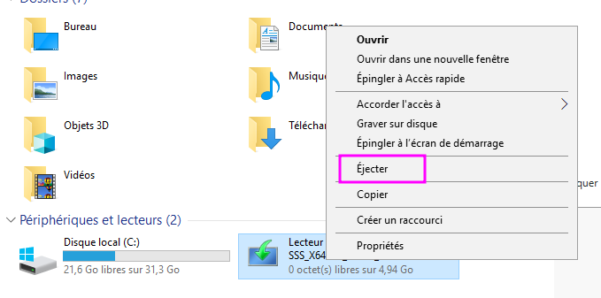](../.ressources/img/tp01-01.png)
- Puis menu **VM Ware** > **VM** > **Install VM Tools**
- Double-cliquer sur **Lecteur** > suivre les instructions (choisir **Installation Typique** ou **Complète**)
[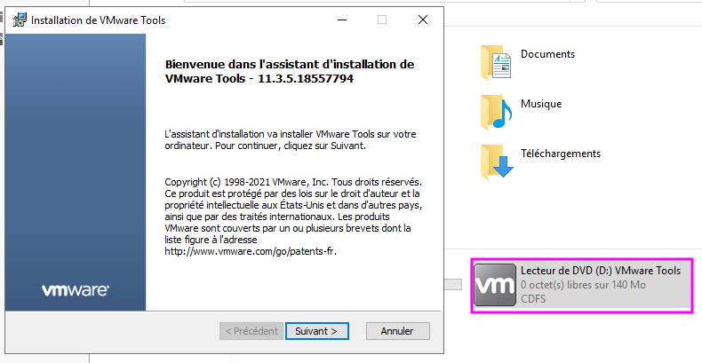](../.ressources/img/tp01-02.png)
- Cliquer Terminer à la fin de l’installation, puis Redémarrer.

#### Notes Activation Bureau à Distance
1. Touche <kbd>WIN</kbd> + <kbd>R</kbd> > exécuter la commande **sysdm.cpl**
2. Onglet **Utilisation à distance** > cocher **Autoriser les connexions à distance**
3. **Ok**

[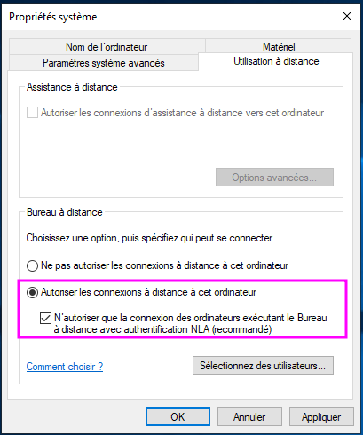](../.ressources/img/tp01-03.png)

#### Notes protection de sécurité renforcée d’IE

1. Dans le **Gestionnaire de serveur** > clic sur **protection de sécurité renforcée d’Internet Explorer** 
2. Sélectionner **Désactivé** pour Administrateurs et utilisateurs
3. **OK**

#### Notes sysprep & copie

[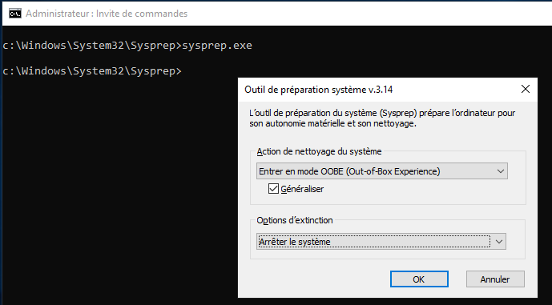](../.ressources/img/tp01-05.png)

1. Une des méthodes possibles consiste à ouvrir une invite de commandes et exécuter la commande "**C:\Windows\System32\Sysprep\sysprep.exe**"
2. Sélectionner les paramètres "**mode OOBE**", "**généraliser**" et  "**arrêter le système**".
3. Patienter

Pour exporter la VM, il faut en faire un **clone** avec la méthode suivante :

1. Clic droit sur la VM éteinte dans **VM Ware** > **Manage** > **Clone...**
2. Suivre les instructions du wizard

  	

		
	

  	

  		
	

3. Indiquer le chemin de l’emplacement où l’on souhaite exporter le clone, et le nom de la VM.
4. OK.

### Création de serveurs à partir du modèle
1. Clic droit sur le modèle > **clone** > donner le nom voulu
2. Si prompt, choisir "*I copied it*".

#### Paramétrage des adresses IP

1. <kbd>WIN</kbd> + <kbd>R</kbd> > **netcpa.cpl**
2. Clic droit > **Propriétés**
3. **Protocole IPv4** > **Propriétés**
4. Entrer les ip correspondant aux machines. Le masque de sous-réseau se remplit tout seul, donc vérifier qu’il n’y a pas d’erreur.

  	

		
	

  	

  		
	

[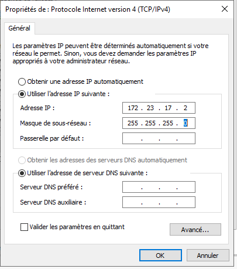](../.ressources/img/tp01-10.png)

**Remarque** : on peut également passer par le **Gestionnaire de Serveur**. D’ailleurs, beaucoup d’options sont directement accessibles depuis le **Gestionnaire de serveur**.

[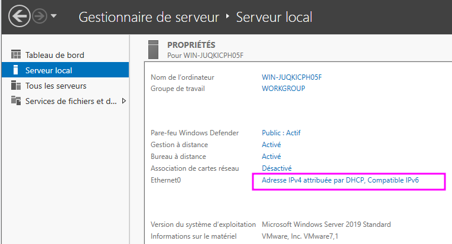](../.ressources/img/tp01-11.png)

### Création d’une VM poste client

<table class="table">
	<tbody>
	<tr>
		<th colspan="1" rowspan="1" headers="Hostname" scope="col">Host</th>
		<td colspan="1" rowspan="1" headers="Info">W10</td>
	</tr>
	<tr>
		<th colspan="1" rowspan="1" headers="OS" scope="col">OS</th>
		<td colspan="1" rowspan="1" headers="Info">Win 10 Pro</td>
	</tr>
	<tr>
		<th colspan="1" rowspan="1" headers="HDD" scope="col">HDD</th>
		<td colspan="1" rowspan="1" headers="Info">1x 32 Go</td>
	</tr>
	<tr>
		<th colspan="1" rowspan="1" headers="RAM" scope="col">RAM</th>
		<td colspan="1" rowspan="1" headers="Info">2 Go</td>
	</tr>
	<tr>
		<th colspan="1" rowspan="1" headers="NIC" scope="col">Carte réseau</th>
		<td colspan="1" rowspan="1" headers="Info">Host-Only</td>
	</tr>
	<tr>
		<th colspan="1" rowspan="1" headers="IP" scope="col">IP</th>
		<td colspan="1" rowspan="1" headers="Info">172.23.17.11</td>
	</tr>
	<tr>
		<th colspan="1" rowspan="1" headers="Utilisateur" scope="col">Util. local</th>
		<td colspan="1" rowspan="1" headers="Info">Admin</td>
	</tr>
	<tr>
		<th colspan="1" rowspan="1" headers="Mdp util." scope="col">Mot de passe</th>
		<td colspan="1" rowspan="1" headers="Info">!Admin123</td>
	</tr>
</table>

1. Paramétrer VM Ware avec les infos ci-dessus (HDD, RAM, Réseau)
2. Monter l’iso de Win10 dans le lecteur optique de la VM
3. Lancer la VM
4. Cliquer dans la fenetre rapidement et appuyer sur n’importe quelle touche pour lancer l’installation
5. Suivre les instructions
6. Indiquer l’utilisateur local quand demandé.
7. Une fois l’OS démarré, changer le nom de la machine
8. Attribuer l’ip via la commande netcpa.cpl
9. Redémarrer pour que les changements prennent effet.

### Configuration des systèmes d’exploitation

1. Les OS porteront le même nom que nos VM
2. Reporter les mises à jour Windows Update
3. Faire en sorte que l’ensemble des VM puissent communiquer

#### Notes Paramétrage Nom de machine

1. <kbd>WIN</kbd> + <kbd>X</kbd> > **Système** > **Renommer ce PC**
2. Donner nouveau nom > OK 
3. Accepter de redémarrer pour que les changements prennent effet

#### Notes Paramétrage Windows Update

1. Dans menu **Démarrer**, chercher **Windows Update**
2. Cliquer **options avancées** > **Interrompre les mises à jour**
3. Choisir la dernière date dans la liste

  	

		
	

  	

  		
	

#### Notes Paramétrage IP

1. **Panneau de configuration** > **Réseau** > **Modifier Paramètre Adaptateur**
2. Clic droit sur **adaptateur** > **propriété** 
3. Clic sur **Protocole IPv4** > **propriétés**
4. Entrer l’ip et le masque de sous-réseau.

  	

		
	

  	

  		
	

#### Notes Communication (ping) inter-VM
- ~~Leur attribuer la même passerelle et s’assurer qu’elles sont dans le même réseau.~~  
**IMPORTANT** : Une passerelle est **_nécessaire seulement pour sortir du réseau_**. Ici elles sont toutes sur le même réseau.
- Désactiver les pare-feu sur chaque machine

[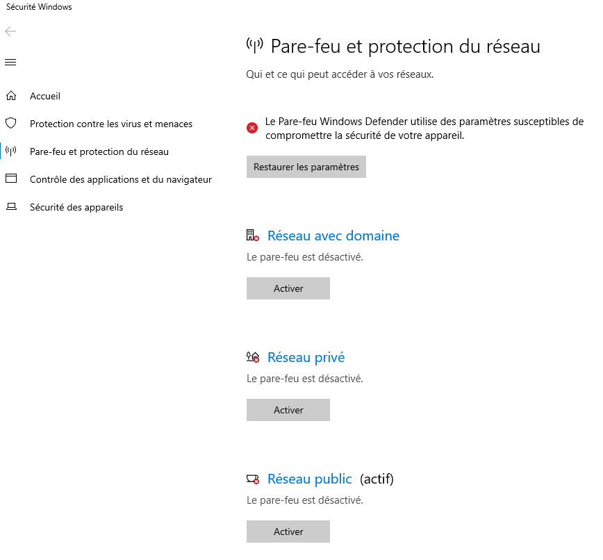](../.ressources/img/tp01-17.png)

**Résultat** : ping ok depuis machine W10 :

[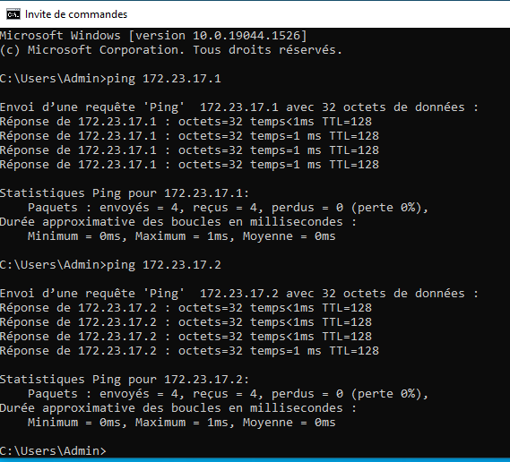](../.ressources/img/tp01-18.png)

### Rôles et fonctionnalités
#### Installation
1. Installer sur le serveur **CD01** le **service Web IIS** et l’outil de **Sauvegarde Windows Server**. Depuis le Gestionnaire de Serveur :

[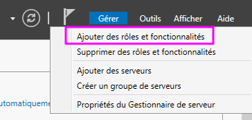](../.ressources/img/tp01-19.png)

[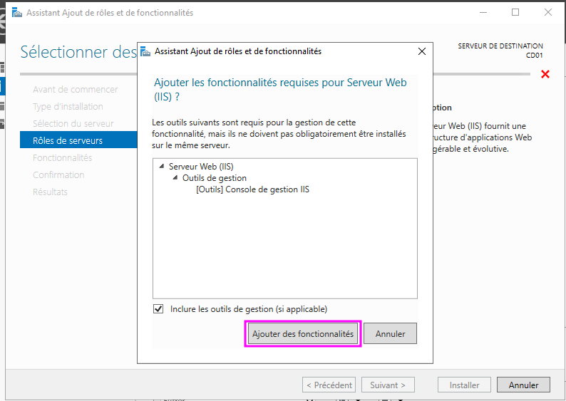](../.ressources/img/tp01-21.png)

[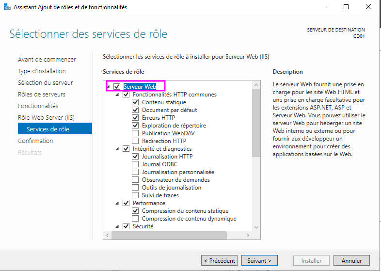](../.ressources/img/tp01-23.png)

#### Test (depuis le serveur) :
1. Aller sur le localhost dans un navigateur web, une page d'accueil IIS devrait s'afficher.
[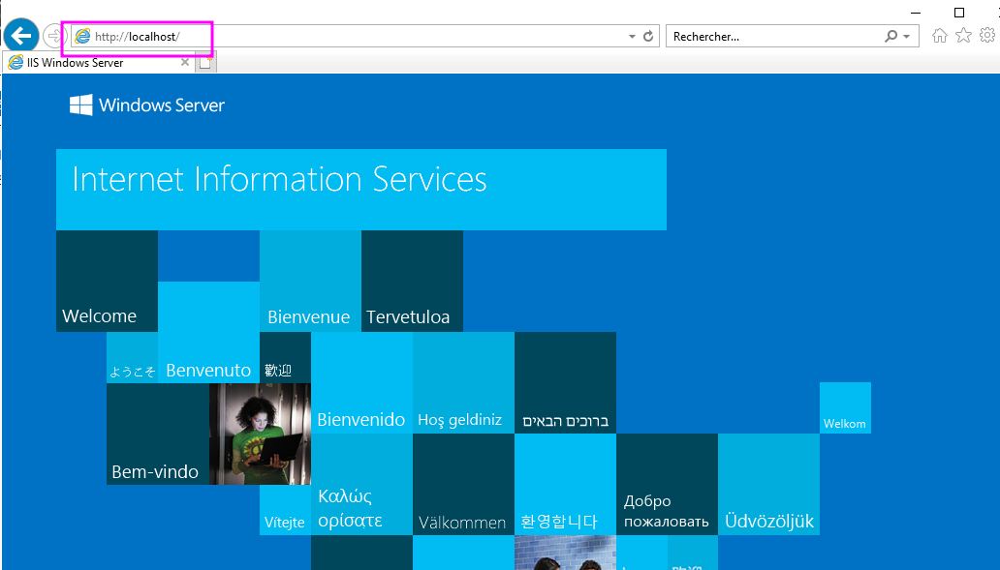](../.ressources/img/tp01-24.png)

2. Tester la connexion RDP depuis W10 vers les serveurs avec l’outil graphique. Ouvrir l’outil "Connexion en Bureau à Distance" (chercher dans menu Démarrer), et accepter le certificat.
[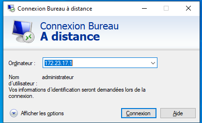](../.ressources/img/tp01-25.png)

3. Tester la connexion RDP avec la commande mstsc (aide : mstsc /?)

### Bonus

1. Faire un sysprep de W10 et exporter la VM sous le nom modele_W10.
2. Importer une seconde machine W10 nommée W10-2 ayant pour ip 172.23.17.22
3. Rallumer W10.

<link rel="stylesheet" type="text/css" href="../.ressources/css/bootstrap.min.css">
<link rel="stylesheet" type="text/css" href="../.ressources/css/style.css">

