title: tp02 - raid

# ENI TSSR 09 - Services Réseaux Windows

[TOC]

## TP 02 - Gestion du stockage (RAID)

**Objectifs** 

Gérer l'ajout d'espace disque et le partitionnement sous Windows.

**Prérequis**

disposer des VM installées dans le TP1. 

### Résumé des paramètres

| Machine    | Utilisateur    | mdp       | ip          | OS | CPU | RAM | NIC | HDD |
|:-----------|:---------------|:----------|:------------|:---|:----|:----|:----|:----|
| Modele_SRV | Administrateur | !Admin123 | 172.23.17.1 | Win Srv 2019 Std | 1x1 | 4 Go | Host-Only | 1x 32 Go |
| CD01       | Admin          | !Admin123 | 172.23.17.1 | clone Modele_SRV | 1x1 | 4 Go | Host-Only | 1x 32 Go |
| SRV01      | Admin          | !Admin123 | 172.23.17.2 | clone Modele_SRV | 1x1 | 4 Go | Host-Only | 1x 32 Go |
| W10        | Admin          | !Admin123 | 172.23.17.11| Win 10 Pro       | 2x1 | 2 Go | Host-Only | 1x 32 Go |

\*ATTENTION <u>NE PAS REDEMARRER</u> LES MODELES UNE FOIS CLONÉS ! 

### Ajout de disques "physiques" au serveur
#### Instructions
Ajouter **3x disques SCSI** de **taille dynamique** de **10 Go chacun** sur le serveur **SRV01**.

#### Mode opératoire

1. Dans **VMWare Workstation**, sélectionner la VM **SRV01**, clic sur **Edit Virtual Machine Settings**
2. Cliquer sur le bouton **Add** pour ajouter des disques durs

[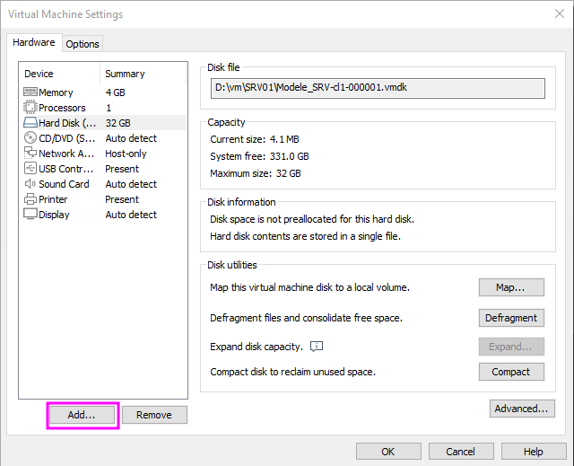](../.ressources/img/tp02-01.png)

3. Sélectionner **Hard drive** puis l'option **SCSI**

  	

		<a href="../.ressources/img/tp02-02.png" target="_blank">
			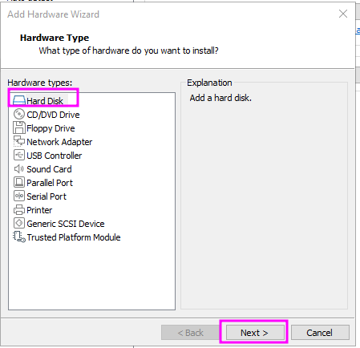
		</a>
	

  	

  		<a href="../.ressources/img/tp02-03.png" target="_blank">
  			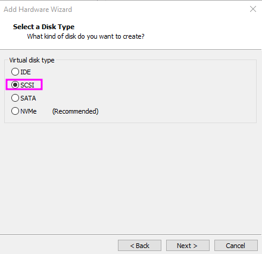
  		</a>
	

4. Créer un disque entier **Create a new virtual disk**
[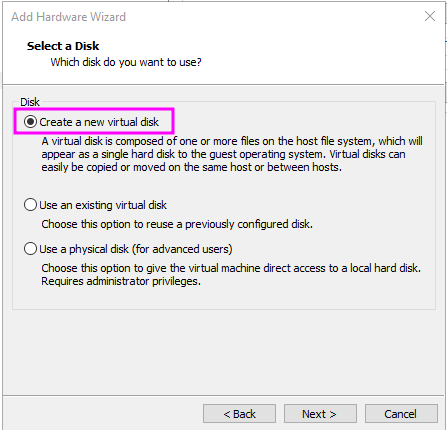](../.ressources/img/tp02-04.png)

5. Sélectionner la taille
[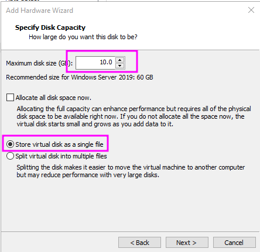](../.ressources/img/tp02-05.png)

6. Laisser l’emplacement par défaut pour enregistrer dans le répertoire de la VM
[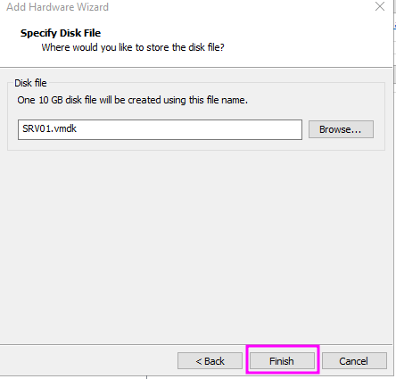](../.ressources/img/tp02-06.png)

7. Répéter l’opération jusqu’à avoir 3 disques supplémentaires 

### Expression des besoins de stockage
#### RAID-5
##### Instructions
En vue de stocker les documents de travail des utilisateurs, créer un **volume en RAID-5** pouvant héberger environ **6 Go** de données appelé **Données** et accessible depuis le lecteur **D:\\**

##### Mode opératoire

1. Sur **SRV01**, executer **diskmgmt.msc**, le Gestionnaire de disque. 
2. Au démarrage, une pop-up s'affiche, demandant d'initialiser les 3 disques ajoutés. Sélectionner **Partition GPT** puis **OK**. **Remarque**: si rien ne s'est affiché, clic-droit sur un des nouveaux disque > **Initialiser le disque**.

[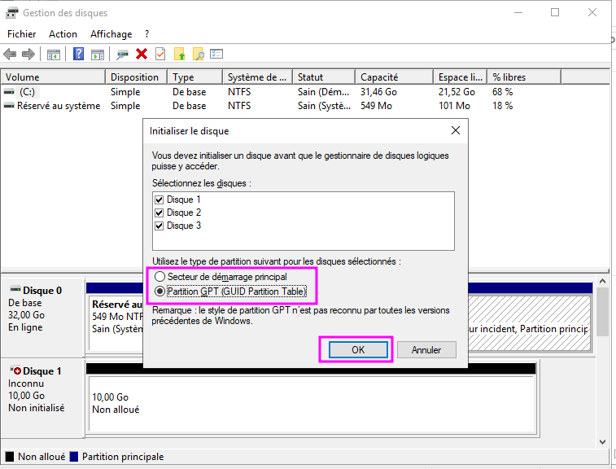](../.ressources/img/tp02-071.png){:target="_blank"}  

3. Modifier la lettre du lecteur optique (actuellement D:) pour pouvoir l'affecter ailleurs. Clic droit sur le lecteur > **Modifier la lettre** > Choisir une lettre au pif (ex. Z).

  	

  		<a href="../.ressources/img/tp02-070.png" target="_blank">
			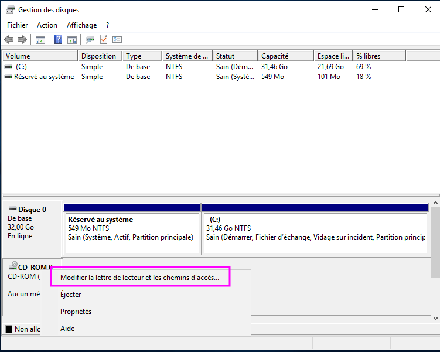
		</a>
	

  	

  		<a href="../.ressources/img/tp02-07.png" target="_blank">
	  		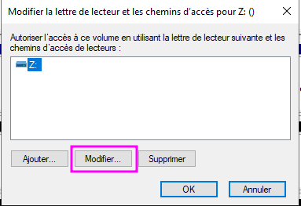
	  	</a>
	

4. Clic droit sur un des nouveau disque > sélectionner **Nouveau volume RAID-5**
5. Selectionner les 3 disques dans la partie **Disponible** > cliquer sur le bouton **Ajouter** 
6. Indiquer l'espace souhaité en Mo. Ici, nous voulons une taille totale d'environ 6 Go, donc, en tenant compte de la nature du RAID-5 (2 disques + 1 miroir), nous devons indiquer **3000** Mo.
[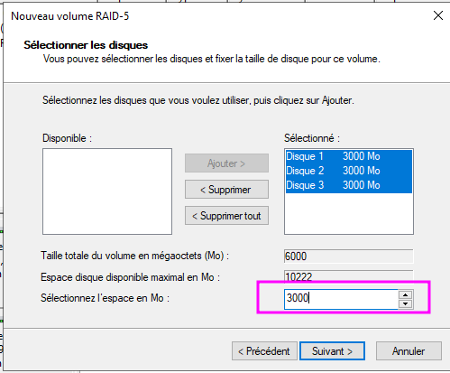](../.ressources/img/tp02-10.png)

7. Attribuer une lettre au lecteur et un nom de volume. 

  	

		<a href="../.ressources/img/tp02-11.png" target="_blank">
			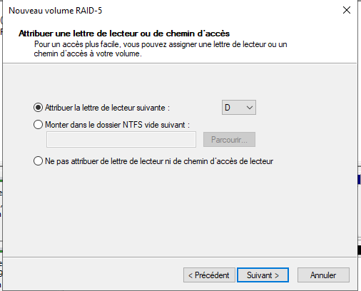
		</a>
	

  	

  		<a href="../.ressources/img/tp02-12.png" target="_blank">
  			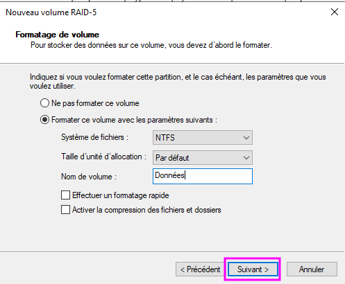
  		</a>
	

8. clic **Suivant** > **Terminer** > Répondre **Oui** au message d'avertissement

  	

		
	

  	

  		<a href="../.ressources/img/tp02-14.png" target="_blank">
  			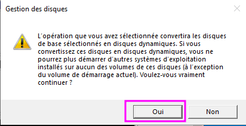
  		</a>
	

#### RAID-1
##### Instructions
- Les membres du service **Informatique** doivent pouvoir accéder à tout moment aux outils d’administration système.
- Créer un **volume miroir de 4 Go** monté dans **C:\\INFO-TOOLS** et reposant sur les disques 1 et 3.

##### Mode opératoire

1. Dans le **Gestionnaire de disques** (diskmgmt.msc)
2. Clic droit sur un des espaces non-alloué > **Nouveau volume en miroir**
[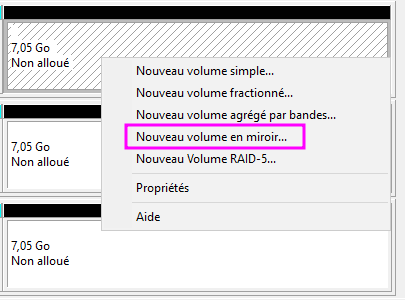](../.ressources/img/tp02-15.png)

3. Dans la partie **Disponible**, selectionner les disques 1 et 3 puis clic **Ajouter**
4. Leur attribuer **4000 Mo** d'espace.

5. Selectionner **Monter le dossier NTFS...** et parcourir jusqu’à l'emplacement voulu. 
6. Créer le dossier si besoin.
7. Formater.

  	

		<a href="../.ressources/img/tp02-17.png" target="_blank">
			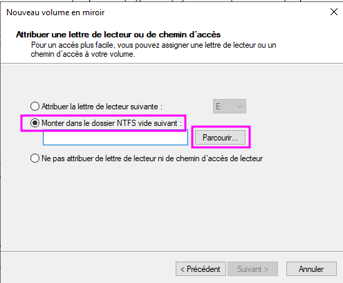
		</a>
	

  	

  		<a href="../.ressources/img/tp02-18.png" target="_blank">
  			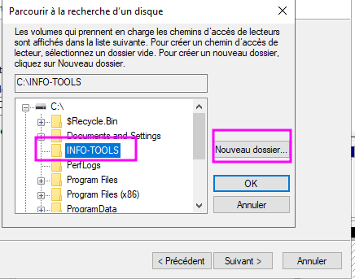
  		</a>
	

  	

		<a href="../.ressources/img/tp02-19.png" target="_blank">
			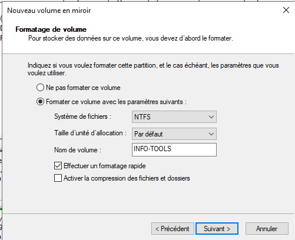
		</a>
	

  	

  		<a href="../.ressources/img/tp02-20.png" target="_blank">
  			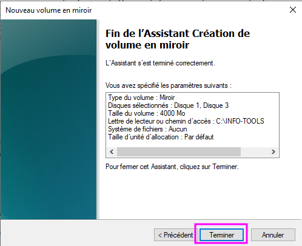
  		</a>
	

#### RAID-0
##### Instructions
- Une base de données **SQL Server** d'une taille maximale de **8 Go** sera hébergée sur le serveur.
- Créer un **volume optimisé pour les performances** en lecture/écriture, nommé **Database** et accessible via le **Lecteur E:\\**

##### Mode opératoire

1. Dans le **Gestionnaire de disques** (diskmgmt.msc)
2. Clic droit sur un des espaces non-alloué > **Nouveau volume agrégé par bandes**
3. Selectionner les 3 espaces non-alloués restants
4. Attribuer **3222 Mo** (la totalité dispo)
5. Sur l'écran suivant, attribuer la lettre **E:**
6. Sur l'écran suivant, sélectionner **Formater...** en précisant le nom de volume **Database**.
7. Cliquer **Terminer**

  	

		<a href="../.ressources/img/tp02-21.png" target="_blank">
			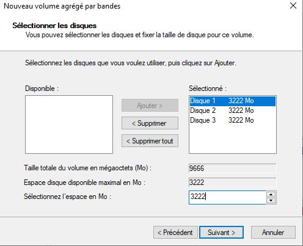
		</a>
	

  	

  		<a href="../.ressources/img/tp02-22.png" target="_blank">
  			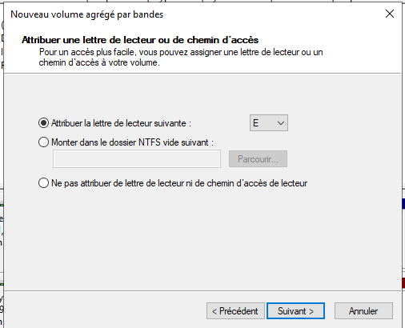
  		</a>
	

  	

		<a href="../.ressources/img/tp02-23.png" target="_blank">
			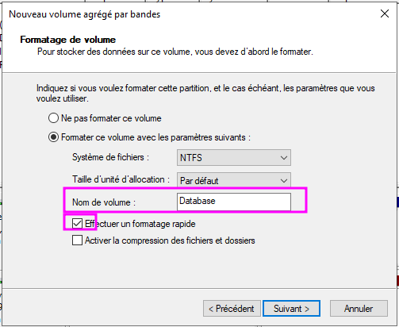
		</a>
	

  	

  		<a href="../.ressources/img/tp02-24.png" target="_blank">
  			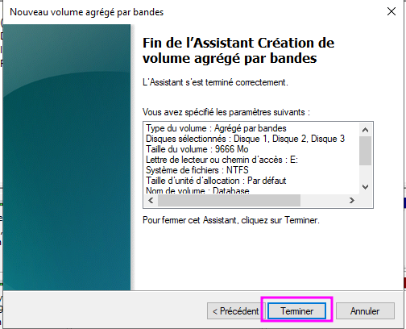
  		</a>
	

**Résultat final** :

[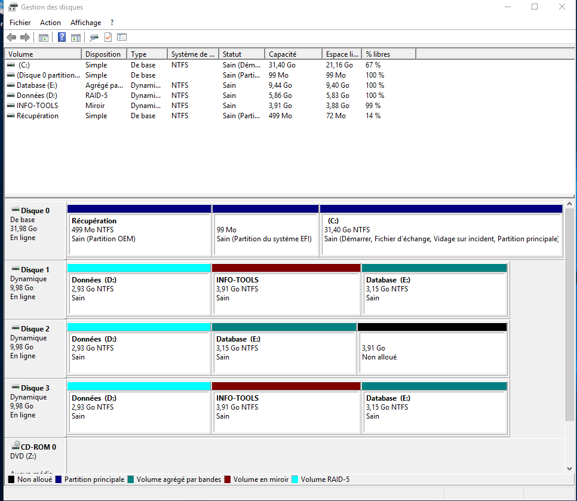](../.ressources/img/tp02-25.png)

### Configuration du stockage sur le serveur
- Créer les volumes correspondants aux besoins via la console de **Gestion des disques**.
- Stocker des fichiers quelconques sur l'ensemble de vos lecteurs.

### Simulation de panne
#### Instructions
Depuis les paramètres de la VM, supprimer le disque SCSI no. 3 puis observer les changements dans la console de **Gestion des disques**, ainsi que dans le **Gestionnaire du serveur**.

#### Questions

**Q: Peut-on accéder aux données stockées sur Données ?** Apparemment oui mais je suis pas sûr d'avoir supprimé le bon disque... 

**Q: Peut-on accéder aux données contenues dans C:\INFO-TOOLS ?** Pareil...

### Réparation des volumes défectueux
#### Instructions
Ajouter un disque supplémentaire depuis le Gestionnaire de ma VM puis réparer les volumes défectueux depuis la console de Gestion des disques.

#### Mode opératoire

1. Supprimer le miroir car l’autre disque est tombé. (clic droit > supprimer le miroir)
2. Puis recréer en RAID-0 (miroir)

### Bonus Powershell
Créer les volumes avec PowerShell (pour cela, supprimez puis recréez de nouveau les trois disques SCSI).

<i>**Note** : c'est pas avec PS mais avec **DISKPART** donc non, merci.</i>

- Initialisez les disques
- Créez les volumes
- Formatez les volumes
- Peuplez vos volumes avec des données quelconques via l’explorateur Windows par exemple
- Simulez une panne en retirant un disque depuis le gestionnaire Hyper-V
- Testez l’accès à vos fichiers hébergés sur vos volumes
- Réparez les volumes défectueux

#### Remarque Powershell : réflexe "update-help" !
Mettez à jour l'aide PowerShell. La MAJ est disponible sur `\\10.X.0.6\Distrib\Depot\PowerShell`

Pour atteindre Distrib depuis SRV01, changez temporairement de vSwitch :

- Branchez votre VM sur le vSwitch Bridged
- Configurez votre VM en DHCP
- Une fois l'update effectuée, rebranchez votre VM sur le vSwitch Host-Only
- Reconfigurez l'adresse fixe IPv4 de SRV01 (172.23.X.2/24)

<link rel="stylesheet" type="text/css" href="../.ressources/css/bootstrap.min.css">
<link rel="stylesheet" type="text/css" href="../.ressources/css/style.css">

