title: tp03 - AD création

# ENI TSSR 09 - Services Réseaux Windows

[TOC]

## TP 03 - Mise en place d'un domaine Active Directory

### Objectifs

Mettre en place un contexte de domaine Active Directory et y intégrer des membres.

### Prérequis

Copier les fichiers iso Windows Server 2019 et Windows 10 localement.

### Résumé des paramètres

<table>
  <thead>
    <tr>
      <th class="header_nom_vm">Nom VM :</th>
      <th>Modele_SRV*</th>
      <th>CD01</th>
      <th>SRV01</th>
      <th>W10</th>
    </tr>
  </thead>
  <tbody>
    <tr>
      <th>Type</th>
      <td> Template </td>
      <td> Ctlr de domaine </td>
      <td> Serveur </td>
      <td> Poste client </td>
    </tr>
    <tr>
      <th>Utilisateur</th>
      <td> Administrateur </td>
      <td> Admin </td>
      <td> Admin </td>
      <td> Admin </td>
    </tr>
    <tr>
      <th>mdp</th>
      <td> !Admin123 </td>
      <td> !Admin123 </td>
      <td> !Admin123 </td>
      <td> !Admin123 </td>
    </tr>
    <tr>
      <th>ip</th>
      <td> 172.23.17.1 </td>
      <td> 172.23.17.1 </td>
      <td> 172.23.17.2 </td>
      <td> 172.23.17.11</td>
    </tr>
    <tr>
      <th>OS</th>
      <td> Win Srv 2019 Std </td>
      <td> clone Modele_SRV </td>
      <td> clone Modele_SRV </td>
      <td> Win 10 Pro </td>
    </tr>
    <tr>
      <th>CPU</th>
      <td> 1x1 </td>
      <td> 1x1 </td>
      <td> 1x1 </td>
      <td> 2x1 </td>
    </tr>
    <tr>
      <th>RAM</th>
      <td> 4 Go </td>
      <td> 4 Go </td>
      <td> 4 Go </td>
      <td> 2 Go </td>
    </tr>
    <tr>
      <th>NIC</th>
      <td> Host-Only </td>
      <td> Host-Only </td>
      <td> Host-Only </td>
      <td> Host-Only </td>
    </tr>
    <tr>
      <th>HDD</th>
      <td> 1x 32 Go </td>
      <td> 1x 32 Go </td>
      <td> 1x 32 Go </td>
      <td> 1x 32 Go </td>
    </tr>
</tbody>
</table>

\*ATTENTION <u>NE PAS REDEMARRER</u> LES MODELES UNE FOIS CLONÉS ! 

### Création d’un contexte de domaine Active Directory
#### Instructions

[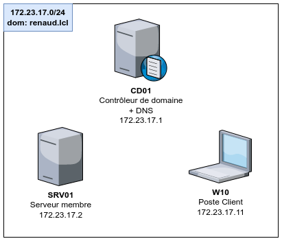](../.ressources/img/tp03-00.png){:target="_blank"} 

- Créer un domaine AD appelé **renaud.lcl** sur la machine **CD01** (CD pour *Contrôleur de Domaine*).
- Y intégrer le poste client **W10** et le serveur **SRV01**
- S'assurer que les 3 hôtes communiquent entre eux.

#### Mode opératoire

1. Sur le serveur **CD01** > **Gestionnaire de Serveur**

2. Dans le menu **Gérer** (en haut à droite) > **Ajouter des rôle et fonctionnalités** 
[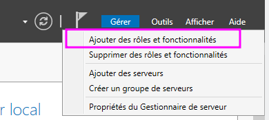](../.ressources/img/tp03-010.png){:target="_blank"} 
3. Onglet **Rôles des serveurs** > Sélectionner **Service AD DS** et **Service DNS**

4. Clic sur le **drapeau** > sélectionner **Promouvoir ce serveur en Contrôleur de Domaine**
[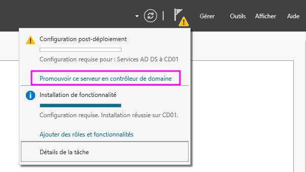](../.ressources/img/tp031-01.png){:target="_blank"} 

5. Ajouter une nouvelle forêt > la nommer **renaud.local**
[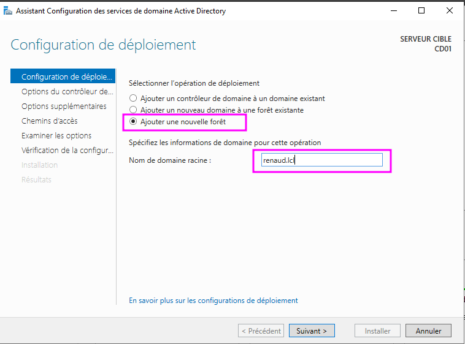](../.ressources/img/tp031-02.png){:target="_blank"}  

6. Entrer un mot de passe de restauration des services d'annuaire (DSRM). Ne sera demandé qu'en cas de restauration de l'AD.
[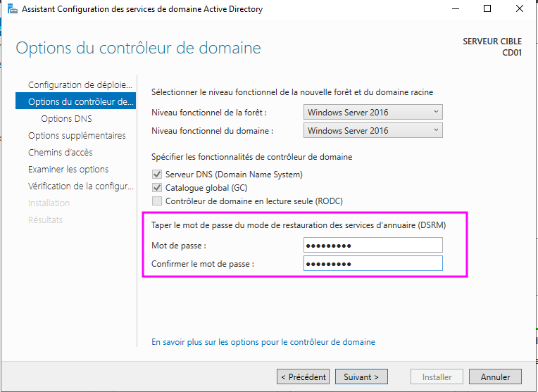](../.ressources/img/tp03-03.png){:target="_blank"}  

7. Laisser les options suivantes à leur valeur par défaut

  	

		<a href="../.ressources/img/tp03-04.png" target="_blank">
			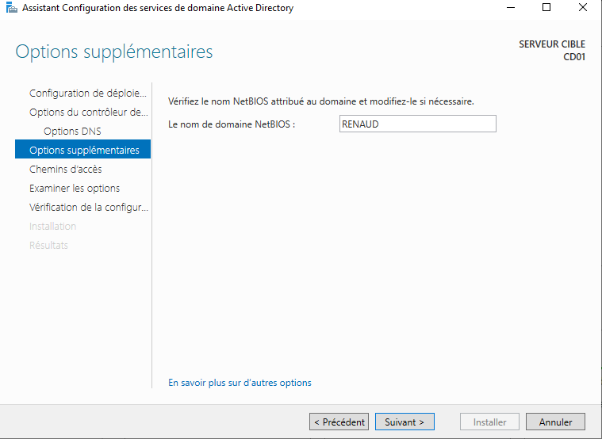
		</a>
	

  	

  		<a href="../.ressources/img/tp03-05.png" target="_blank">
  			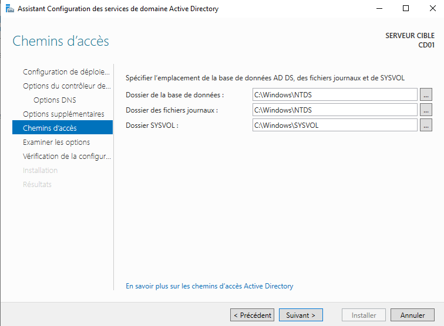
  		</a>
	

  	

  		<a href="../.ressources/img/tp03-06.png" target="_blank">
			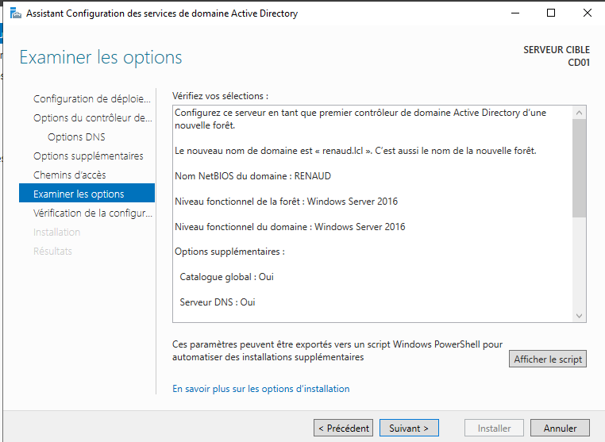
		</a>
	

  	

  		<a href="../.ressources/img/tp03-07.png" target="_blank">
	  		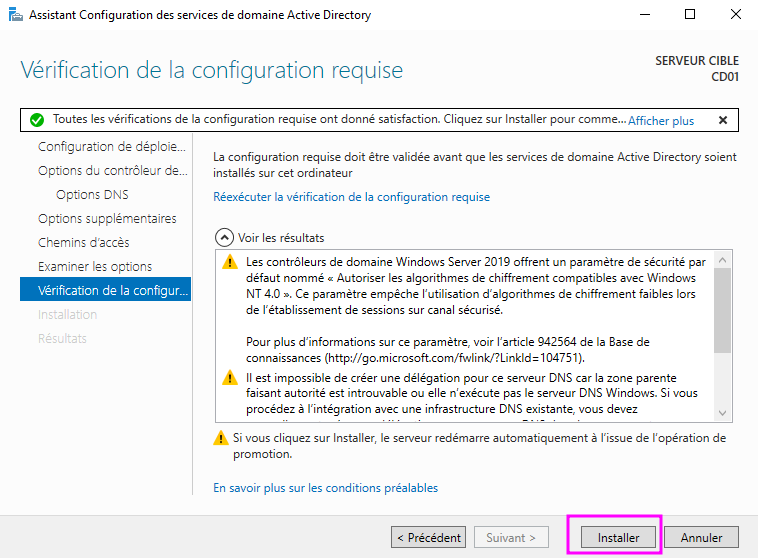
	  	</a>
	

7. Mettre les machines hôtes dans le domaine.
	+ sur chaque hôtes, executer **sysdm.cpl** (*"Propriétés système"*)
	+ clic **Modifier**
	+ Entrer le nom du domaine (**renaud.lcl**)
	+ Entrer le login et mdp d'un utilisateur du domaine, ex. **Administrateur** (*!Admin123*)
	+ Redémarrer la machine

  	

  		<a href="../.ressources/img/tp03-08.png" target="_blank">
			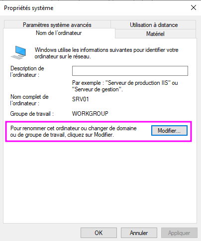
		</a>
	

  	

  		<a href="../.ressources/img/tp03-09.png" target="_blank">
	  		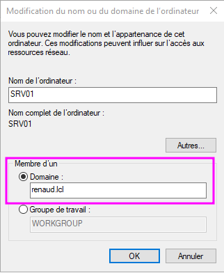
	  	</a>
	

	

[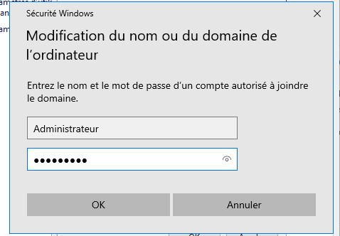](../.ressources/img/tp03-10.png){:target="_blank"} 

8. Se connecter une fois à **W10** et **SRV01** avec un utilisateur de l'AD ex. **Administrateur** (*!Admin123*) 
9. Sur **CD01**, dans l'AD > dans la forêt **renaud.lcl** > sous-dossier **Computers** > on y trouve les machines ayant déjà été connectées au domaine. 
10. Les faire glisser respectivement dans *SLF > ORDINATEURS > POSTE CLIENT* (pour **W10**) et *SLF > ORDINATEURS > SERVEUR MEMBRE* (pour **SRV01**)

[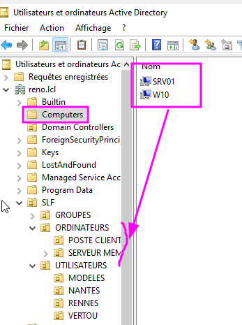](../.ressources/img/tp03-13.png){:target="_blank"} 

#### Mode opératoire v2 *"Fast and Furious"*
1. Dans le **Gestionnaire de serveur** > **Gérer** > **Rôles et fonctionnalités** 
2. Séléctionner **Service AD DS** et **Service DNS** (ip: 172.23.17.1)
3. Installer DNS (menu en haut à droite, via le drapeau : "**Promouvoir...**")
4. Suivre instruction (nom forêt, mdp restauration, etc.)
5. Sur les machines hôtes, indiquer l'ip du DNS (**172.23.17.1**) dans les **réglages de la carte réseau** (*netcpa.cpl*)
6. Ajouter les hôtes dans le domaine "renaud.lcl". Donner l'utilisateur **Administrateur@renaud.lcl** (*!Admin123*) qd demandé.
7. Redémarrer les hôtes et se connecter au domaine au moins une fois.
8. Dans l'AD, dans le dossier **Computers**, faire glisser les machines connectées au domaine dans leur sous-dossier respectif dans la forêt (W10 dans "Poste Client", SRV01 dans "Serveur Membre")

### Analyse des différents cas d'ouverture de session

- **Q: W10 - Peut-on ouvrir une session avec un compte local ?** Oui, avec admin@w10.local 

- **Q: W10 - Peut-on ouvrir une session avec un compte du domaine ?**  Oui avec Administrateur@renaud.lcl 

- **Q: CD01 - Peut-on ouvrir une session sur le contrôleur de domaine ?** Oui, avec Administrateur@renaud.lcl ou Admin@cd01.local 

- **Q: Dans quelle console et dans quel emplacement peut-on visualiser les machines hôtes membres du domaine ?** *Gestionnaire de Serveur* > *Outils* > *Util. Domaine*

### Bonus

Repérer toutes les consoles MMC en lien avec l'Active Directory et pour chacune d'elles, déterminer quelles sont leurs fonctions.

### Preuve de fin

[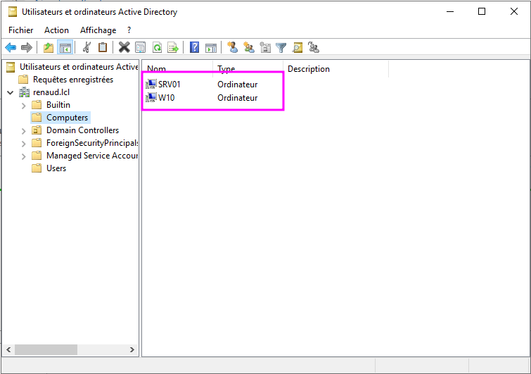](../.ressources/img/tp03-12.png){:target="_blank"} 

<link rel="stylesheet" type="text/css" href="../.ressources/css/bootstrap.min.css">
<link rel="stylesheet" type="text/css" href="../.ressources/css/style.css">
