title: tp05 - AD partages & permissions

# ENI TSSR 09 - Services Réseaux Windows

[TOC]

## TP 05 - Gestion des ressources dans un contexte de domaine AD

**Objectifs** 

Configurer le partage de dossiers et leur sécurisation au moyen de groupes de sécurité et d'ACL.

**Prérequis**

Avoir réaliser l'atelier 4 (*"Gestion Util. & Groupes d'un AD"*).

### Résumé des paramètres

<table>
  <thead>
    <tr>
      <th class="header_nom_vm">Nom VM :</th>
      <th>Modele_SRV*</th>
      <th>CD01</th>
      <th>SRV01</th>
      <th>W10</th>
    </tr>
  </thead>
  <tbody>
    <tr>
      <th>ip</th>
      <td> n/a </td>
      <td> 172.23.17.1 </td>
      <td> 172.23.17.2 </td>
      <td> 172.23.17.11</td>
    </tr>
    <tr>
      <th>Utilisateur</th>
      <td> Administrateur </td>
      <td> Admin </td>
      <td> Admin </td>
      <td> Admin </td>
    </tr>
    <tr>
      <th>mdp</th>
      <td> !Admin123 </td>
      <td> !Admin123 </td>
      <td> !Admin123 </td>
      <td> !Admin123 </td>
    </tr>
    <tr>
      <th>Type</th>
      <td> Template </td>
      <td> Ctlr de domaine </td>
      <td> Serveur </td>
      <td> Poste client </td>
    </tr>
    <tr>
      <th>OS</th>
      <td> Win Srv 2019 Std </td>
      <td> clone Modele_SRV </td>
      <td> clone Modele_SRV </td>
      <td> Win 10 Pro </td>
    </tr>
    <tr>
      <th>CPU</th>
      <td> 1x1 </td>
      <td> 1x1 </td>
      <td> 1x1 </td>
      <td> 2x1 </td>
    </tr>
    <tr>
      <th>RAM</th>
      <td> 4 Go </td>
      <td> 4 Go </td>
      <td> 4 Go </td>
      <td> 2 Go </td>
    </tr>
    <tr>
      <th>NIC</th>
      <td> Host-Only </td>
      <td> Host-Only </td>
      <td> Host-Only </td>
      <td> Host-Only </td>
    </tr>
    <tr>
      <th>HDD</th>
      <td> 1x 32 Go </td>
      <td> 1x 32 Go </td>
      <td> 1x 32 Go </td>
      <td> 1x 32 Go </td>
    </tr>
</tbody>
</table>

\*ATTENTION <u>NE PAS REDEMARRER</u> LES MODELES UNE FOIS CLONÉS ! 

<table>
  <thead>
    <tr>
      <th>Service</th>
      <th>Utilisateur</th>
      <th>Fonction</th>
      <th>login</th>
      <th>mdp</th>
    </tr>
  </thead>
  <tbody>
    <tr>
        <td scope="row" rowspan="4" class="vert-align-mid td-commercial">Commercial</td>    
        <td class="td-commercial-light">Camille</td>
        <td class="td-commercial-light">Secrétaire</td>
        <td class="td-commercial-light">camille / camille@renaud.lcl</td>
        <td class="td-commercial-light">!User123</td>
    </tr>
    <tr>
        <td class="td-commercial-light">Inès</td>  
        <td class="td-commercial-light">Intérimaire</td>  
        <td class="td-commercial-light">ines / ines@renaud.lcl</td>
        <td class="td-commercial-light">!User123</td>
    </tr>
    <tr>
        <td class="td-commercial-light">Claude</td>  
        <td class="td-commercial-light"></td>  
        <td class="td-commercial-light">claude / claude@renaud.lcl</td>
        <td class="td-commercial-light">!User123</td>
    </tr>
    <tr>
        <td class="td-commercial-light">Corentin</td>  
        <td class="td-commercial-light"></td>  
        <td class="td-commercial-light">corentin / corentin@renaud.lcl</td>
        <td class="td-commercial-light">!User123</td>
    </tr>
    <tr>
        <td scope="row" rowspan="4" class="vert-align-mid td-informatique">Informatique</td>    
        <td class="td-informatique-light">Sophie</td>
        <td class="td-informatique-light">Secrétaire</td>
        <td class="td-informatique-light">sophie / sophie@renaud.lcl</td>
        <td class="td-informatique-light">!User123</td>
    </tr>
        <tr>
        <td class="td-informatique-light">Reno</td>  
        <td class="td-informatique-light"></td>  
        <td class="td-informatique-light">Reno / Reno@renaud.lcl</td>
        <td class="td-informatique-light">!User123</td>
    </tr>
    <tr>
        <td class="td-informatique-light">Samir</td>  
        <td class="td-informatique-light"></td>  
        <td class="td-informatique-light">samir / samir@renaud.lcl</td>
        <td class="td-informatique-light">!User123</td>
    </tr>
    <tr>
        <td class="td-informatique-light">Stéphane</td>  
        <td class="td-informatique-light"></td>  
        <td class="td-informatique-light">stephane / stephane@renaud.lcl</td>
        <td class="td-informatique-light">!User123</td>
    </tr>
       <tr>
        <td scope="row" rowspan="4" class="vert-align-mid td-production">Production</td>    
        <td class="td-production-light">Isabelle</td>
        <td class="td-production-light">Intérimaire</td>
        <td class="td-production-light">Isabelle / Isabelle@renaud.lcl</td>
        <td class="td-production-light">!User123</td>
    </tr>
        <tr>
        <td class="td-production-light">Pascal</td>  
        <td class="td-production-light"></td>  
        <td class="td-production-light">Pascal / Pascal@renaud.lcl</td>
        <td class="td-production-light">!User123</td>
    </tr>
    <tr>
        <td class="td-production-light">Paul</td>  
        <td class="td-production-light"></td>  
        <td class="td-production-light">Paul / Paul@renaud.lcl</td>
        <td class="td-production-light">!User123</td>
    </tr>
    <tr>
        <td class="td-production-light">Philippe</td>  
        <td class="td-production-light"></td>  
        <td class="td-production-light">Philippe / Philippe@renaud.lcl</td>
        <td class="td-production-light">!User123</td>
    </tr>
  </tbody>
</table>

### Instructions Partage des ressources

Les partages seront configurés sur les volumes que nous avons créés lors de l'atelier 2.

**Tester les accès aux partages au fur et à mesure de leur mise en place**

- [ ] Configurer les partages de ressources suivantes en respectant les contraintes indiquées.

| Nom du partage | Localisation sur SRV01 | 
|----------------|------------------------|
| Production     | D:\\DocEntreprise\\prod |
| Applications   | C:\\INFO-TOOLS\\Appli   |
| Prospects      | D:\\DocEntreprise\\client\\en_cours |

- [x] Le partage **Production** sera accessible **uniquement par les membres du service Production** et aux administrateurs (les admin auront tous les privilèges sur cette ressource)
- [x] Le partage **Application** sera accessible **en lecture seule** par tous les membres de la société, et **en écriture** par les membres du **SI**. Cependant, les secrétaires n'auront aucun accès à ce partage.
- [x] Le partage **Prospects** ne sera accessible que par les **commerciaux**.
- [x] Ajouter un partage **Public** qui donnera accès aux données se trouvant sur le **E:\\** de **SRV01**. Ce partage sera **accessible à tous en lecture seule**.

**Faire un snapshot**

### Mode opératoire
#### Résumé
##### 1. Dans l'AD
1. Sur **CD01**, ouvrir l'**Active Directory**
2. Créer les groupes globaux (préfixés **GG_**) correspondant aux services & fonctions des utilisateurs (ex. **GG_INFORMATIQUE_SECRETAIRES**, **GG_COMMERCIAL**, etc.)

<table>
  <thead>
    <tr>
      <th>Service</th>
      <th>Groupe AD</th>
      <th>Utilisateurs</th>
      <th>Partages</th>
    </tr>
  </thead>
  <tbody>
    <tr>
        <td scope="row" rowspan="3" class="vert-align-mid td-commercial">Commercial</td>  
        <td class="td-commercial-light">GG_COMMERCIAL</td>  
        <td class="td-commercial-light">Claude, Corentin, Inés</td>  
        <td class="td-commercial-light">Prod_R, Appli_L, Prospects_CT</td>  
    </tr>
    <tr>
        <td class="td-commercial-light">GG_COMMERCIAL_INTERIMAIRES</td>  
        <td class="td-commercial-light">Inés</td>  
        <td class="td-commercial-light">Prod_R, Appli_L, Prospects_CT</td> 
    </tr>
    <tr>
        <td class="td-commercial-light">GG_COMMERCIAL_SECRETAIRES</td>
        <td class="td-commercial-light">Camille</td>
        <td class="td-commercial-light">Prod_R, Appli_R, Prospects_CT</td> 
    </tr>
    <tr>
        <td scope="row" rowspan="2" class="vert-align-mid td-informatique">Informatique</td>   
        <td class="td-informatique-light">GG_INFORMATIQUE</td>
        <td class="td-informatique-light">Reno, Samir, Stéphane</td>  
        <td class="td-informatique-light">Prod_CT, Appli_M, Prospects_R</td> 
    </tr> 
    <tr>
        <td class="td-informatique-light">GG_INFORMATIQUE_SECRETAIRES</td>
        <td class="td-informatique-light">Sophie</td>
        <td class="td-informatique-light">Prod_R, Appli_L, Prospects_R</td> 
    </tr>
    <tr>
        <td scope="row" rowspan="3" class="vert-align-mid td-production">Production</td> 
        <td class="td-production-light">GG_PRODUCTION_INTERIMAIRES</td>
        <td class="td-production-light">Isabelle</td>
        <td class="td-production-light">Prod_CT, Appli_L, Prospects_R</td>
    </tr>   
    <tr>
        <td class="td-production-light">GG_PRODUCTION_MATIN</td>
        <td class="td-production-light">Pascal, Philippe</td> 
        <td class="td-production-light">Prod_CT, Appli_L, Prospects_R</td> 
    </tr>
    <tr>
        <td class="td-production-light">GG_PRODUCTION_SOIR</td>
        <td class="td-production-light">Paul, Isabelle</td>  
        <td class="td-production-light">Prod_CT, Appli_L, Prospects_R</td>
    </tr>        
    <tr>
        <td scope="row" rowspan="5" class="vert-align-mid td-all-stars">All-Stars</td>    
        <td class="td-all-stars-light">GG_ALL_COMMERCIAL</td>  
        <td class="td-all-stars-light">GG_COMMERCIAL GG_COMMERCIAL_INTERIMAIRES GG_COMMERCIAL_SECRETAIRES</td>
        <td class="td-all-stars-light"> </td>
    </tr>
    <tr>
        <td class="td-all-stars-light">GG_ALL_INFORMATIQUE</td>  
        <td class="td-all-stars-light">GG_INFORMATIQUE GG_INFORMATIQUE_SECRETAIRES</td>
        <td class="td-all-stars-light"> </td>
    </tr>
    <tr>
        <td class="td-all-stars-light">GG_ALL_INTERIMAIRES</td>  
        <td class="td-all-stars-light">GG_COMMERCIAL_INTERIMAIRES GG_PRODUCTION_INTERIMAIRES</td>
        <td class="td-all-stars-light"> </td>
    </tr>
    <tr>
        <td class="td-all-stars-light">GG_ALL_PRODUCTION</td>
        <td class="td-all-stars-light">GG_PRODUCTION_INTERIMAIRES GG_PRODUCTION_SOIR GG_PRODUCTION_MATIN</td>
        <td class="td-all-stars-light"> </td>
    </tr>
    <tr>
        <td class="td-all-stars-light">GG_ALL_SECRETAIRES</td>  
        <td class="td-all-stars-light">GG_COMMERCIAL_SECRETAIRES GG_INFORMATIQUE_SECRETAIRES</td>
        <td class="td-all-stars-light"></td>
    </tr>
  </tbody>
</table>

3. Créer les groupes locaux (préfixés **DL_** pour *domaine local*) correspondant aux noms de partages et à leur permission (ex. **DL_PROSPECTS_CT**, **DL_PRODUCTION_L**, etc.), avec CT=Controle Total, M=Modification, L=Lecture, R=Refus.
[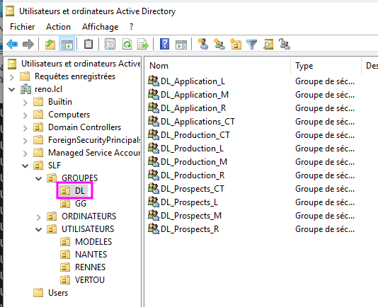](../.ressources/img/tp05-20.png){:target="_blank"} 

##### 2. Sur SRV de partage
1. Sur **SRV01**, avec l'explorateur de fichier
2. Créer les répertoires que l'on souhaite partager
3. clic droit sur chaque dossier > **Propriétés** > onglet **Membres** > bouton **Ajouter**
4. Ajouter tous les **groupes du DL** nécessaires (**DL_..._{CT|M|L|R}**)
5. Attribuer à ces groupes les permissions correspondant à leur nom (CT=Controle Total, M=Modification, L=Lecture, R=Refus)

    

      <a href="../.ressources/img/tp05-24.png" target="_blank">
      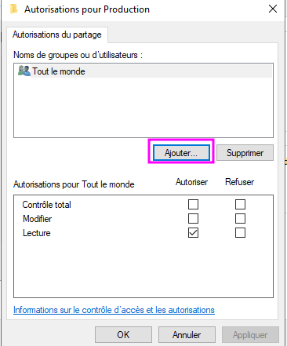
    </a>
  

    

      <a href="../.ressources/img/tp05-28.png" target="_blank">
        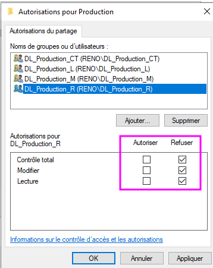
      </a>
  

##### 3. Retour dans l'AD
1. Sur **CD01**, ouvrir l'**Active Directory**
2. Ajouter les groupes en **GG** dans les groupes en **DL** (en tant que membres) selon les permissions de chacun. Par ex. GG_ALL_SECRETAIRES doit être membre de DL_APPLICATIONS_R car aucunes secretaires ne doivent pas avoir accès au partage "Applications".

**Notes**: Si un utilisateur a besoin d'un accès particulier, il vaut mieux lui créer une permission spéciale type "DL_..." plutôt que l'ajouter nominativement aux autorisations d'un partage. 

[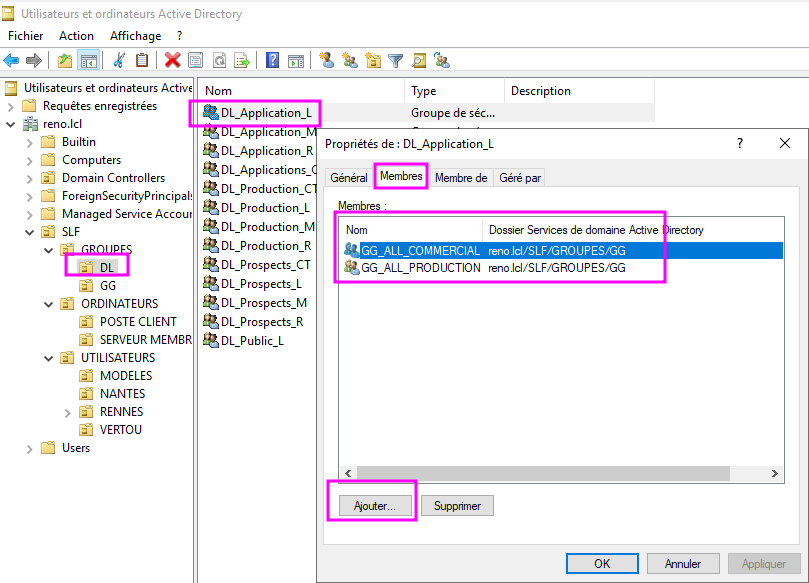](../.ressources/img/tp05-38.png){:target="_blank"} 

#### Détails
##### Création des groupes d'étendue locale "*DL_...*" dans l'AD 

1. Sur **CD01**, ouvrir l'**Active Directory**
2. Clic droit sur l'Unité Organisationnelle (**OU**) > **Nouveau groupe** 
3. Créer un groupe pour chaque partage et chaque type de permission (CT, L, M, R)

4. Dans chaque groupe créé, ajouter les groupes **GG_...** membres. 

| Groupe | Production | Appli | Prospects | 
|--------|:----------:|:-----:|:---------:|
| GG_ALL_SECRETAIRES  | Prod_R | Appli_R    | vide | 
| GG_ALL_COMMERCIAL   | Prod_R | Appli_L | Prospects_CT | 
| GG_ALL_INFORMATIQUE | Prod_CT | Appli_M | Prospects_R | 
| GG_ALL_PRODUCTION   | Prod_CT | Appli_L | Prospects_R | 

**Exemples à tester**

| Util. | Fonction | Production | Appli | Prospects | 
|----------|--------------|:----------:|:-----:|:---------:|
| Camille | Secr Comm | Prod_R | Appli_R | Prospects_CT | 
| Ines | Interim Comm | Prod_R | Appli_L | Prospects_CT | 
| Claude | Commercial | Prod_R | Appli_L | Prospects_CT | 
| Sophie | Secr Info | Prod_R | Appli_L | Prospects_R | 
| Reno | Informatique | Prod_CT | Appli_M | Prospects_R | 
| Isabelle | Prod Soir | Prod_CT | Appli_L | Prospects_R | 
| Pascal | Prod Matin | Prod_CT | Appli_L | Prospects_R |   

##### Création des groupes d'étendue locale
- [x] Sur **CD01**, dans l'AD, on va créer des **groupes d'étendue locale** pour chaque partage et chaque type de permission.
{:target="_blank"} 

##### Création des dossiers partagés
**Partage "Production"**

- [x] Sur **SRV01**, avec l'explorateur de fichier > lecteur **D:** > créer les répertoires souhaités 
- [x] Clic droit sur **D:\\DocEntreprise\\prod** > **Propriétés** > onglet **Partage** > **Partage avancé...**
- [x] Cocher **Partager ce dossier** > lui donner un nom (ici **Production**)

    

      <a href="../.ressources/img/tp05-22.png" target="_blank">
      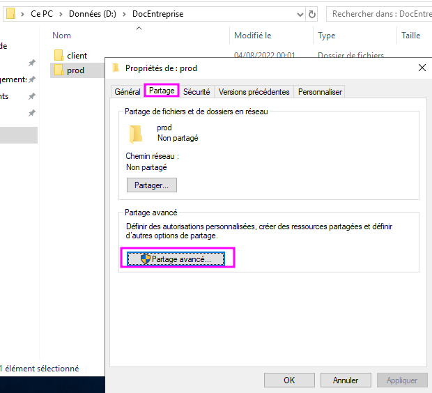
    </a>
  

    

      <a href="../.ressources/img/tp05-23.png" target="_blank">
        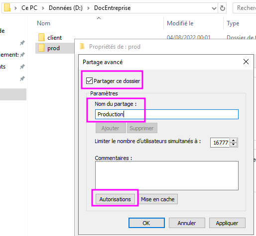
      </a>
  

- [x] Clic **Autorisations** et ajouter chaque groupe **DL_...** qu'on a crée, en leur attribuant les autorisations respectives.

    

      
  

    

      <a href="../.ressources/img/tp05-25.png" target="_blank">
        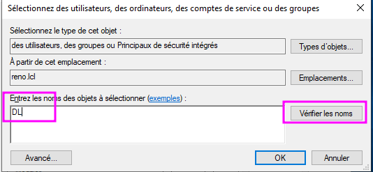
      </a>
  

    

      <a href="../.ressources/img/tp05-26.png" target="_blank">
      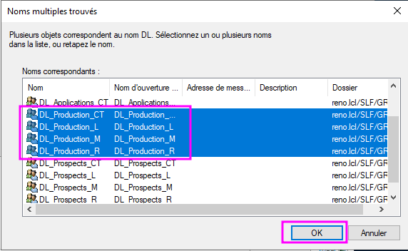
    </a>
  

    

      <a href="../.ressources/img/tp05-27.png" target="_blank">
        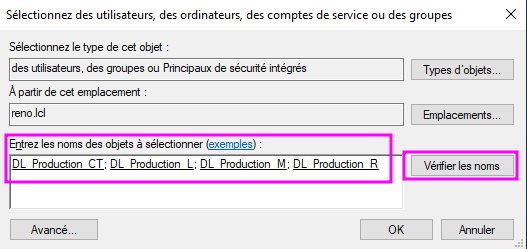
      </a>
  

    

      
  

    

      <a href="../.ressources/img/tp05-29.png" target="_blank">
        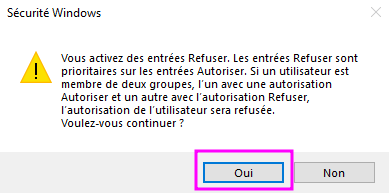
      </a>
  

**Partage "Prospects"**

- [x] Penser à supprimer le groupe *"Tout le monde"*
- [x] Faire pareil avec **D:\\DocEntreprise\\client\\en_cours**, nom de partage : **Prospects**

**Partage "Applications"**

- [x] Sur **SRV01** > Créer le répertoire **C:\\INFO_TOOLS\\Appli**
- [x] Répéter cette procédure et partager ce dossier sous le nom **Applications**

    

      <a href="../.ressources/img/tp05-31.png" target="_blank">
      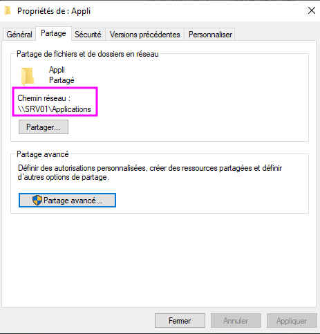
    </a>
  

    

      <a href="../.ressources/img/tp05-30.png" target="_blank">
        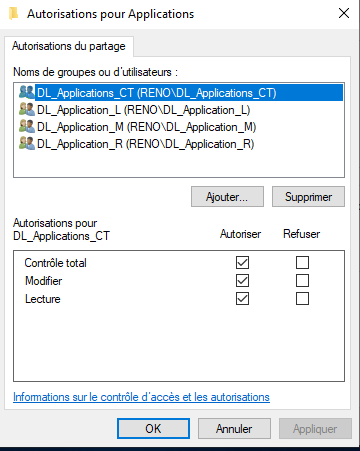
      </a>
  

**Résultat** :

[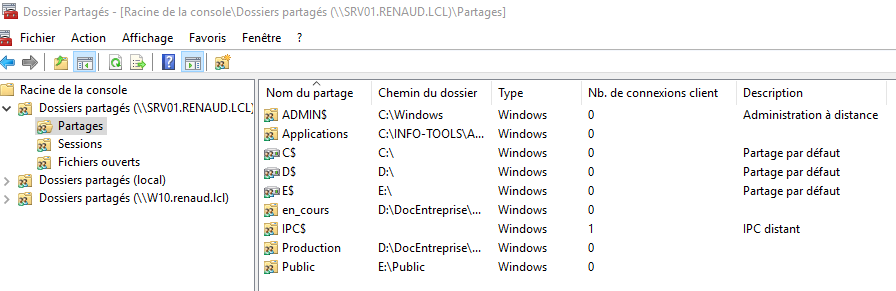](../.ressources/img/tp05-8.png){:target="_blank"} 

##### Associer Utilisateur et Permissions
- [x] Sur le contrôleur de domaine, **CD01**, dans l'**Active Directory**
- [x] Ajouter chaque utilisateur à leur(s) groupe(s) respectif(s).

- Sur le serveur de partage **SRV01**, dans les propriétés de chaque dossier partagés
- \**dossier partagé*\* > **Propriétés** > onglet **Sécurité** > **Autorisations**
- [x] Ajouter les groupes **DL_...** qui vont bien (voir tableau)

    

      <a href="../.ressources/img/tp05-33.png" target="_blank">
      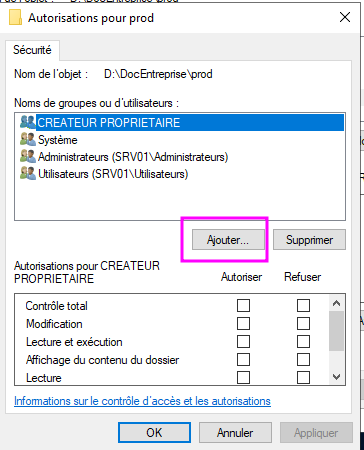
    </a>
  

    

      <a href="../.ressources/img/tp05-34.png" target="_blank">
        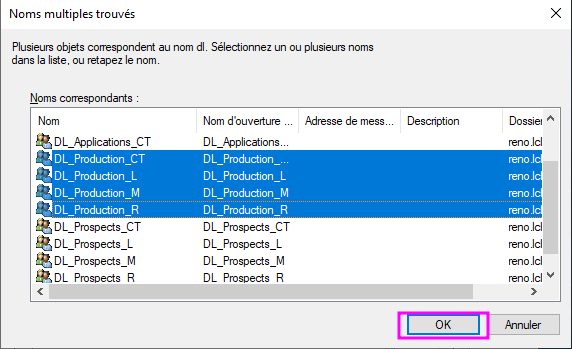
      </a>
  

    

      <a href="../.ressources/img/tp05-35.png" target="_blank">
      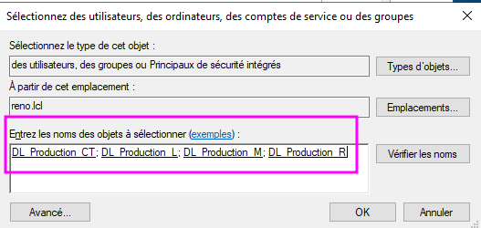
    </a>
  

    

      <a href="../.ressources/img/tp05-36.png" target="_blank">
        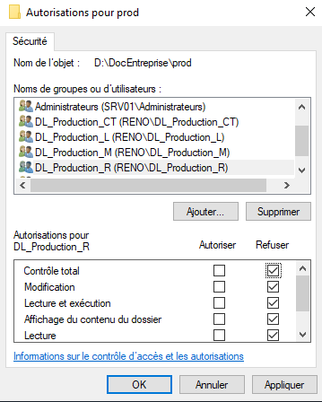
      </a>
  

- Sur **CD01**, ouvrir l'AD
- Pour chaque groupe **DL_...** :
- Clic droit sur le groupe > **Propriétés** > onglet **Membres** > **Ajouter**
- Ajouter les utilisateurs concernés. 

<a href="#tester"><b>Voir Exemples à tester</b></a>

#### Notes

1. Partage => on enlève "Tous" et on ajoute "Utilisateurs authentifiés".
2. Dans Sécurité, faire des groupes (ex. DL_Production_L, DL_Production_R, etc.) et on ajoute des utilisations.
3. Rajout des 4 groupes.
4. Puis attribuer les droits en fonction.
5. Désactiver l'héritage.

<link rel="stylesheet" type="text/css" href="../.ressources/css/bootstrap.min.css">
<link rel="stylesheet" type="text/css" href="../.ressources/css/style.css">

