title: tp07 - GPO

# ENI TSSR 09 - Services Réseaux Windows

[TOC]

## TP 07 - Stratégie de groupe

**Objectifs**

Identifier et configurer des paramètres de stratégies de groupe ciblés.

**Prérequis**

Avoir réalisé l'atelier 6.

### Résumé des paramètres

<table>
  <thead>
    <tr>
      <th class="header_nom_vm">Nom VM :</th>
      <th>Modele_SRV*</th>
      <th>CD01</th>
      <th>SRV01</th>
      <th>W10</th>
    </tr>
  </thead>
  <tbody>
    <tr>
      <th>ip</th>
      <td> n/a </td>
      <td> 172.23.17.1 </td>
      <td> 172.23.17.2 </td>
      <td> 172.23.17.11</td>
    </tr>
    <tr>
      <th>Utilisateur</th>
      <td> Administrateur </td>
      <td> Admin </td>
      <td> Admin </td>
      <td> Admin </td>
    </tr>
    <tr>
      <th>mdp</th>
      <td> !Admin123 </td>
      <td> !Admin123 </td>
      <td> !Admin123 </td>
      <td> !Admin123 </td>
    </tr>
    <tr>
      <th>Type</th>
      <td> Template </td>
      <td> Ctlr de domaine </td>
      <td> Serveur </td>
      <td> Poste client </td>
    </tr>
    <tr>
      <th>OS</th>
      <td> Win Srv 2019 Std </td>
      <td> clone Modele_SRV </td>
      <td> clone Modele_SRV </td>
      <td> Win 10 Pro </td>
    </tr>
    <tr>
      <th>CPU</th>
      <td> 1x1 </td>
      <td> 1x1 </td>
      <td> 1x1 </td>
      <td> 2x1 </td>
    </tr>
    <tr>
      <th>RAM</th>
      <td> 4 Go </td>
      <td> 4 Go </td>
      <td> 4 Go </td>
      <td> 2 Go </td>
    </tr>
    <tr>
      <th>NIC</th>
      <td> Host-Only </td>
      <td> Host-Only </td>
      <td> Host-Only </td>
      <td> Host-Only </td>
    </tr>
    <tr>
      <th>HDD</th>
      <td> 1x 32 Go </td>
      <td> 1x 32 Go </td>
      <td> 1x 32 Go </td>
      <td> 1x 32 Go </td>
    </tr>
</tbody>
</table>

\*ATTENTION <u>NE PAS REDEMARRER</u> LES MODELES UNE FOIS CLONÉS ! 

<table>
  <thead>
    <tr>
      <th>Service</th>
      <th>Utilisateur</th>
      <th>Fonction</th>
      <th>login</th>
      <th>mdp</th>
    </tr>
  </thead>
  <tbody>
    <tr>
        <td scope="row" rowspan="4" class="vert-align-mid td-commercial">Commercial</td>    
        <td class="td-commercial-light">Camille</td>
        <td class="td-commercial-light">Secrétaire</td>
        <td class="td-commercial-light">camille / camille@renaud.lcl</td>
        <td class="td-commercial-light">!User123</td>
    </tr>
    <tr>
        <td class="td-commercial-light">Inès</td>  
        <td class="td-commercial-light">Intérimaire</td>  
        <td class="td-commercial-light">ines / ines@renaud.lcl</td>
        <td class="td-commercial-light">!User123</td>
    </tr>
    <tr>
        <td class="td-commercial-light">Claude</td>  
        <td class="td-commercial-light"></td>  
        <td class="td-commercial-light">claude / claude@renaud.lcl</td>
        <td class="td-commercial-light">!User123</td>
    </tr>
    <tr>
        <td class="td-commercial-light">Corentin</td>  
        <td class="td-commercial-light"></td>  
        <td class="td-commercial-light">corentin / corentin@renaud.lcl</td>
        <td class="td-commercial-light">!User123</td>
    </tr>
    <tr>
        <td scope="row" rowspan="4" class="vert-align-mid td-informatique">Informatique</td>    
        <td class="td-informatique-light">Sophie</td>
        <td class="td-informatique-light">Secrétaire</td>
        <td class="td-informatique-light">sophie / sophie@renaud.lcl</td>
        <td class="td-informatique-light">!User123</td>
    </tr>
        <tr>
        <td class="td-informatique-light">Reno</td>  
        <td class="td-informatique-light"></td>  
        <td class="td-informatique-light">Reno / Reno@renaud.lcl</td>
        <td class="td-informatique-light">!User123</td>
    </tr>
    <tr>
        <td class="td-informatique-light">Samir</td>  
        <td class="td-informatique-light"></td>  
        <td class="td-informatique-light">samir / samir@renaud.lcl</td>
        <td class="td-informatique-light">!User123</td>
    </tr>
    <tr>
        <td class="td-informatique-light">Stéphane</td>  
        <td class="td-informatique-light"></td>  
        <td class="td-informatique-light">stephane / stephane@renaud.lcl</td>
        <td class="td-informatique-light">!User123</td>
    </tr>
       <tr>
        <td scope="row" rowspan="4" class="vert-align-mid td-production">Production</td>    
        <td class="td-production-light">Isabelle</td>
        <td class="td-production-light">Intérimaire</td>
        <td class="td-production-light">Isabelle / Isabelle@renaud.lcl</td>
        <td class="td-production-light">!User123</td>
    </tr>
        <tr>
        <td class="td-production-light">Pascal</td>  
        <td class="td-production-light"></td>  
        <td class="td-production-light">Pascal / Pascal@renaud.lcl</td>
        <td class="td-production-light">!User123</td>
    </tr>
    <tr>
        <td class="td-production-light">Paul</td>  
        <td class="td-production-light"></td>  
        <td class="td-production-light">Paul / Paul@renaud.lcl</td>
        <td class="td-production-light">!User123</td>
    </tr>
    <tr>
        <td class="td-production-light">Philippe</td>  
        <td class="td-production-light"></td>  
        <td class="td-production-light">Philippe / Philippe@renaud.lcl</td>
        <td class="td-production-light">!User123</td>
    </tr>
  </tbody>
</table>

### Consignes

Mettre en place les paramètres de configuration suivants à l'aide des stratégies de groupe :

- Trouver et valider le paramètre adapté (ordinateur ou utilisateur).
- Définir les stratégies de groupes nécessaires et le point de liaison (UO) pour leur application.
- Tester le bon fonctionnement des GPO au fur et à mesure de leur mise en place.

#### pour tous les utilisateurs du domaine

- [x] Désactiver le pare-feu système 
- [x] Internet Explorer sera client proxy du serveur ayant l'ip **10.x.0.248:8080** (x=35)
- [x] Le mot de passe devra faire au moins 5 caractères et il sera changer tous les 5 jours. Aucune exigence de complexité de mot de passe n'est souhaitée.

#### pour les commerciaux

- [x] Le partage **Prospects** doit automatiquement être disponible dans l'explorateur de fichier dès l'ouverture de session d'un utilisateur faisant partie du service commercial.

#### [PAS FAIRE POUR l'INSTANT]pour les membres du service Production

- [ ] L'imprimante **Imp-BL-44USINE** sera automatiquement installée pour les membres du services.

#### pour l'environnement de travail des secrétaires

- [ ] Fond d'écran commun (logo de l'entreprise).

FAIRE UN SNAPSHOT

### Bonus

- [ ] Automatiser l'install de Acrobat Reader (paquet msi) pour les secrétaires.
- [ ] Le répertoire **Documents** des utilisateurs sera déporté sur SRV01, sauf pour les membres du SI.
- [ ] Ouverture de session limitée de 9h à 18h et fermeture de session obligatoire après 18h pour les intérimaires.

### Mode opératoire

#### Désactiver le pare-feu

1. Sur **CD01**, le contrôleur de domaine, executer **mmc** > Ajouter **Gestion de stratégies de groupe**
2. Descendre dans le sous-dossier "**Objets de stratégie de groupe**" > clic droit > **Nouvel objet GPO**
3. Entrer le nom de la GPO voulue, ex. "Pare-feu"
[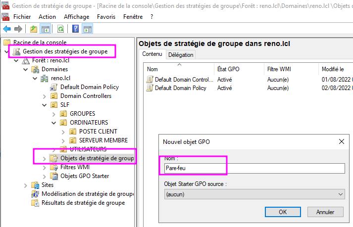](../.ressources/img/tp07-01.png)
4. Clic droit sur la GPO nouvellement créée > **Modifier**
[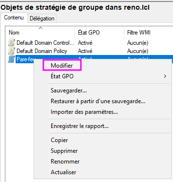](../.ressources/img/tp07-02.png)
5. Descendre dans **Configuration ordinateur** > **Paramètres de sécurité** > **Pare-feu Windows**
6. Cliquer sur **Propriété du pare-feu...**
[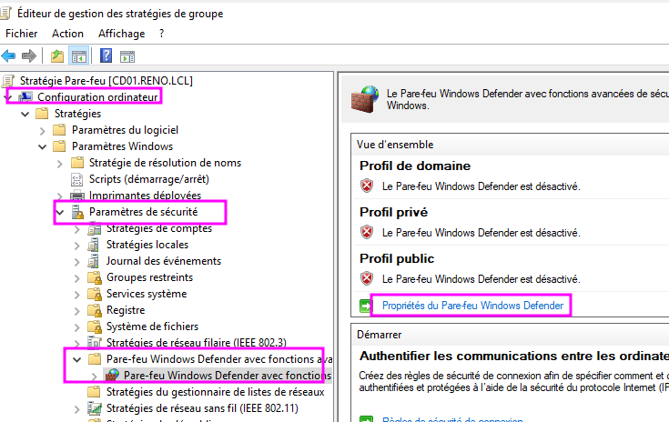](../.ressources/img/tp07-03.png)
7. ATTENTION ! Bien penser à désactiver le pare-feu dans les 3 onglets (Domaine, Privé, Public) ! 
[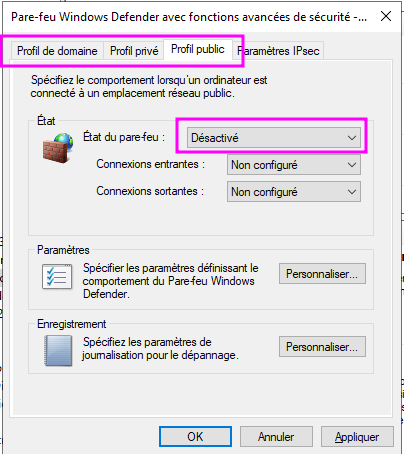](../.ressources/img/tp07-04.png)
8. Dans la console de Gestion, déplacer la GPO dans l'UO (glisser-déposer ou clic droit > **Lier la GPO...**)
[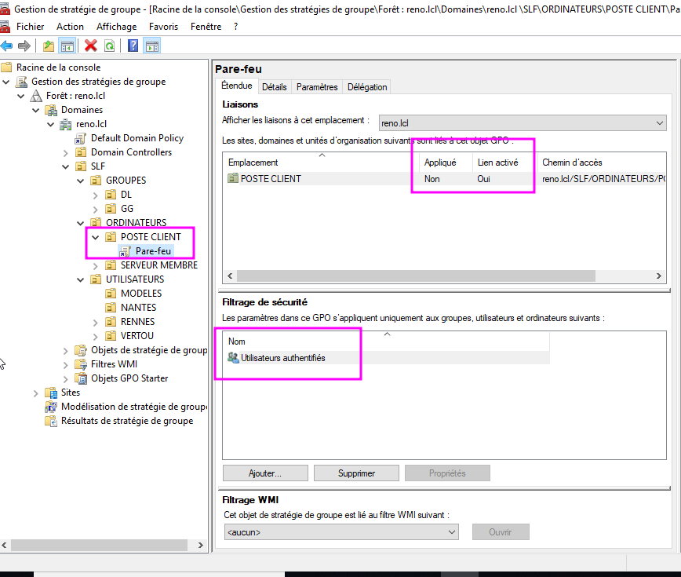](../.ressources/img/tp07-05.png)
9. Pour tester, se connecter à un poste client et vérifier que le pare-feu est désactivé.
[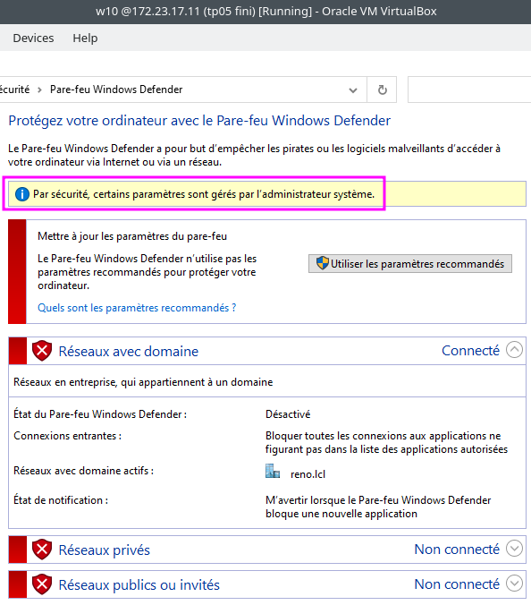](../.ressources/img/tp07-06.png)

#### IExplore sera client proxy

1. Sur **CD01**, ouvrir la console MMC **Gestion de stratégies de groupe**
2. Dans "**Objets de stratégie de groupe**" > clic droit dans le volet de droite > **Nouvel objet GPO**
3. Entrer le nom de la GPO voulue, ex. "Proxy"
4. Clic droit sur la nouvelle GPO > **Modifier**
5. Descendre dans **Configuration Utilisateur** > **Préférences** > **Paramètres du Panneau de Configuration** 
6. clic droit sur **Paramètres Internet** > **Nouveau** > **Internet Explorer 10**
[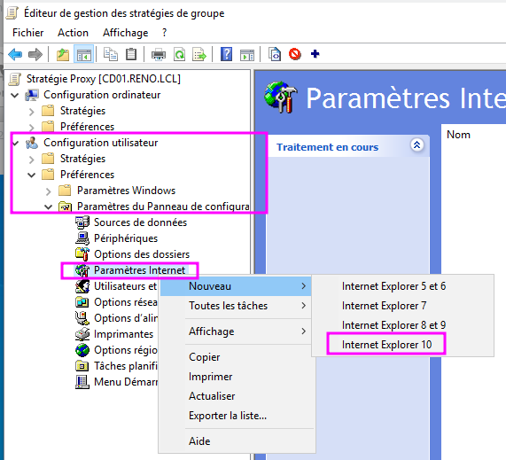](../.ressources/img/tp07-07.png) 
7. Onglet **Connections** > bouton **Paramètres réseau** 
8. Entrer les détails de connection du proxy ENI (?)

    

    <a href="../.ressources/img/tp07-08.png" target="_blank">
      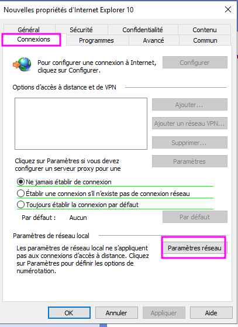
    </a>
  

    

      <a href="../.ressources/img/tp07-09.png" target="_blank">
        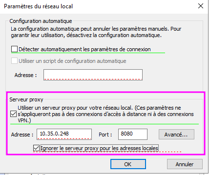
      </a>
  

**Remarque** : Faire F5 pour prendre en compte les nouveaux réglages.

**Placement dans les UO**

9. Dans l'interface de **Gestion des stratégies de groupes**, glisser-déposer la GPO à la racine de **SLF** > **Utilisateurs**
[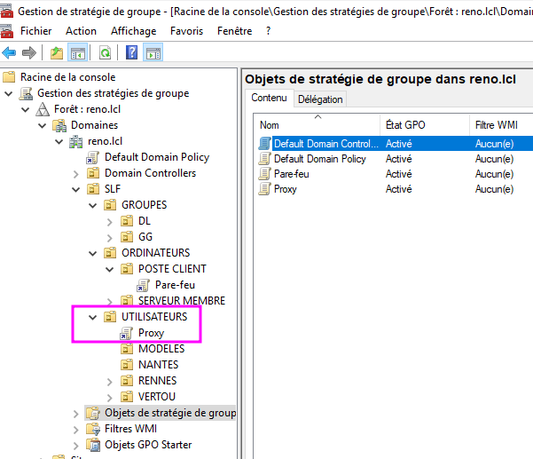](../.ressources/img/tp07-10.png) 

**Vérification**

10. Ouvrir une session sur le poste client, vérifier le paramétrage du proxy (menu Démarrer > "Proxy")

#### Exigences de Mot de passe

1. Sur **CD01**, ouvrir la console MMC **Gestion de stratégies de groupe**
2. Dans "**Objets de stratégie de groupe**" > clic droit dans le volet de droite > **Nouvel objet GPO**
3. Entrer le nom de la GPO voulue, ex. "Mot de passe"
4. Clic droit sur la nouvelle GPO > **Modifier**
5. Descendre dans **Configuration ordinateur** > **Paramètres Windows** > **Paramètres de sécurité** > **Stratégie de comptes** > **Stratégie de mot de passe**
[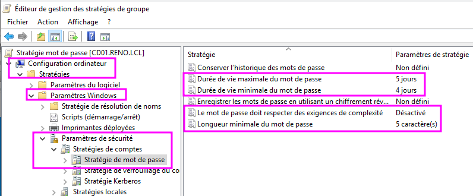](../.ressources/img/tp07-12.png) 
6. Modifier les paramètres selon les goûts
[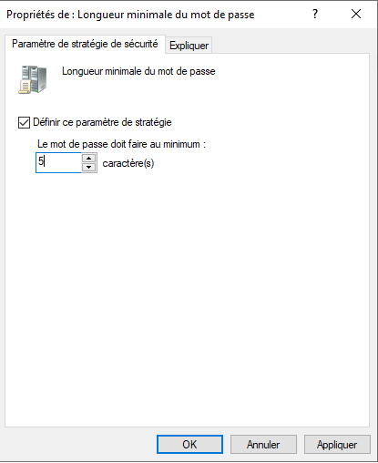](../.ressources/img/tp07-11.png) 

7. **Placement GPO dans UO** : à la racine du domaine **reno.lcl**. Plutôt que de créer une GPO pour ça, on peut ajouter la politique de mot de passe directement dans la GPO **Default Domain Policy**.
[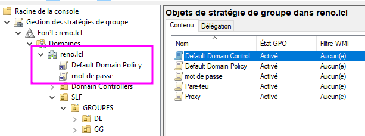](../.ressources/img/tp07-13.png) 

#### Mappage lecteur "Prospects"

1. Sur **CD01**, ouvrir la console MMC **Gestion de stratégies de groupe**
2. Dans "**Objets de stratégie de groupe**" > clic droit dans le volet de droite > **Nouvel objet GPO**
3. Entrer le nom de la GPO voulue, ex. "Partage Prospects"
4. Clic droit sur la nouvelle GPO > **Modifier**
5. Descendre dans **Configuration utilisateur** > **Préférences** > **Paramètres Windows** > **Mappage de lecteurs**
6. Clic droit > Nouveau > Lecteur mappé
[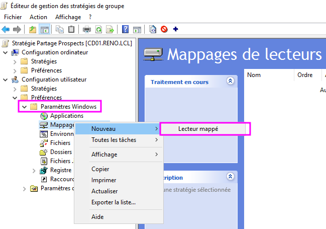](../.ressources/img/tp07-14.png)

[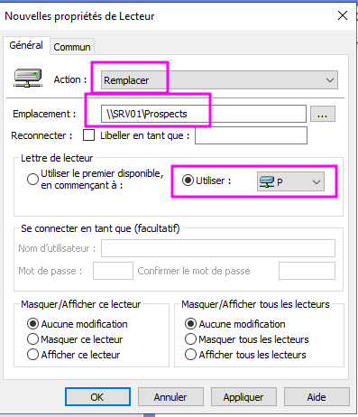](../.ressources/img/tp07-16.png)
[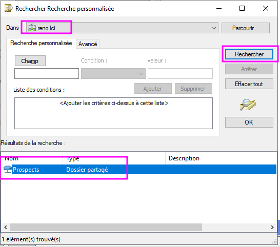](../.ressources/img/tp07-15.png)
[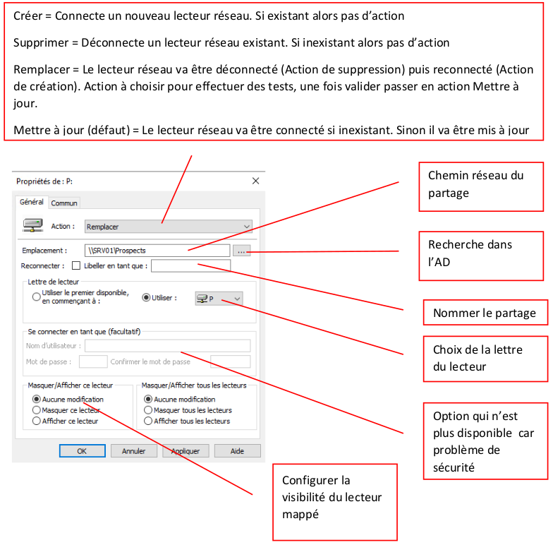](../.ressources/img/tp07-17.png)

**Notes** : Privilégier "**Remplacer**" pour effectuer les tests et basculer ensuite avec "**Mise à jour**".

7. **Placement GPO dans UO** : à la racine d'**Utilisateurs**
[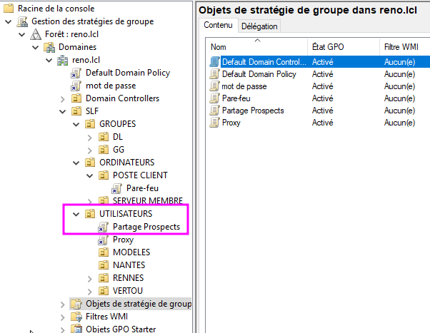](../.ressources/img/tp07-18.png)

8. **Vérification** avec utilisateur Corentin sur W10
[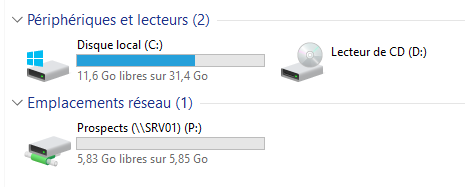](../.ressources/img/tp07-19.png)

#### Fond d'écran partagé

<link rel="stylesheet" type="text/css" href="../.ressources/css/bootstrap.min.css">
<link rel="stylesheet" type="text/css" href="../.ressources/css/style.css">
