title: tp10.1 - DNS Resolver

# ENI TSSR 09 - Services Réseaux Windows

[TOC]

## TP 10.1 - DNS Resolver

### Objectifs

- Configuration du service DNS en tant que résolveur
- Paramétrage DNS sur les postes client
- Utilisation des outils de diagnostic

### Résumé des paramètres

<table>
  <thead>
    <tr>
      <th class="header_nom_vm">Nom VM :</th>
      <th>Modele_SRV<sup class="red-star">*</sup></th>
      <th>Modele_client<sup class="red-star">*</sup></th>
      <th>CD01 (AD DNS)</th>
      <th>SRV01 (DHCP)</th>
      <th>W10</th>
      <th>client2</th>
      <th>rtr17 (routeur)</th>
    </tr>
  </thead>
  <tbody>
    <tr>
      <th>Type</th>
      <td> Template srv</td>
      <td> Template client</td>
      <td> Ctlr de domaine </td>
      <td> Serveur </td>
      <td> Poste client </td>
      <td> Poste client </td>
      <td> pfsense </td>
    </tr>
    <tr>
      <th>Utilisateur</th>
      <td> Administrateur </td>
      <td> Admin </td>
      <td> Admininstrateur </td>
      <td> Admin </td>
      <td> Admin </td>
      <td> Admin </td>
      <td> Admin </td>
    </tr>
    <tr>
      <th>mdp</th>
      <td colspan="7" style="text-align: center;"> !Admin123 </td>
    </tr>
    <tr>
      <th>ip</th>
      <td>n/a </td>
      <td>n/a </td>
      <td> 172.23.17.1 </td>
      <td> 172.23.17.2 </td>
      <td> 172.23.17.11 (dhcp)</td>
      <td> 172.23.17.20 (dhcp)</td>
      <td> 172.23.17.254</td>
    </tr>
    <tr>
      <th>OS</th>
      <td> WinSrv2019</td>
      <td> Win10 Pro</td>
      <td> WinSrv2019</td>
      <td> WinSrv2019</td>
      <td> Win10 Pro</td>
      <td> Win10 Pro</td>
      <td> pfsense </td>
    </tr>
    <tr>
      <th>CPU</th>
      <td> 1x1 </td>
      <td> 2x1 </td>
      <td> 1x1 </td>
      <td> 1x1 </td>
      <td> 2x1 </td>
      <td> 2x1 </td>
      <td> 1x1 </td>
    </tr>
    <tr>
      <th>RAM</th>
      <td> 4 Go </td>
      <td> 2 Go </td>
      <td> 4 Go </td>
      <td> 4 Go </td>
      <td> 2 Go </td>
      <td> 2 Go </td>
      <td> 1 Go </td>
    </tr>
    <tr>
      <th>NIC</th>
      <td> Host-Only </td>
      <td> Host-Only </td>
      <td> Host-Only </td>
      <td> Host-Only </td>
      <td> Host-Only </td>
      <td> Host-Only </td>
      <td> 2x Host-Only + 1x Bridged</td>
    </tr>
    <tr>
      <th>HDD</th>
      <td> 1x 32 Go </td>
      <td> 1x 32 Go </td>
      <td> 1x 32 Go + 3x 10 Go </td>
      <td> 1x 32 Go </td>
      <td> 1x 32 Go</td>
      <td> 1x 32 Go </td>
      <td> 1x 20 Go </td>
    </tr>
</tbody>
</table>

<span class="attention"><sup class="red-star">\*</sup>ATTENTION <u>NE PAS REDEMARRER</u> LES MODELES UNE FOIS CLONÉS ! </span>

<table>
  <thead>
    <tr>
      <th>Service</th>
      <th>Utilisateur</th>
      <th>Fonction</th>
      <th>login</th>
      <th>mdp</th>
    </tr>
  </thead>
  <tbody>
    <tr>
        <td scope="row" rowspan="4" class="vert-align-mid td-commercial">Commercial</td>    
        <td>Camille</td>
        <td>Secrétaire</td>
        <td>camille / camille@renaud.lcl</td>
        <td>!User123</td>
    </tr>
    <tr>
        <td>Inès</td>  
        <td>Intérimaire</td>  
        <td>ines / ines@renaud.lcl</td>
        <td>!User123</td>
    </tr>
    <tr>
        <td>Claude</td>  
        <td></td>  
        <td>claude / claude@renaud.lcl</td>
        <td>!User123</td>
    </tr>
    <tr>
        <td>Corentin</td>  
        <td></td>  
        <td>corentin / corentin@renaud.lcl</td>
        <td>!User123</td>
    </tr>
    <tr>
        <td scope="row" rowspan="4" class="vert-align-mid td-informatique">Informatique</td>    
        <td>Sophie</td>
        <td>Secrétaire</td>
        <td>sophie / sophie@renaud.lcl</td>
        <td>!User123</td>
    </tr>
        <tr>
        <td>Reno</td>  
        <td></td>  
        <td>Reno / Reno@renaud.lcl</td>
        <td>!User123</td>
    </tr>
    <tr>
        <td>Samir</td>  
        <td></td>  
        <td>samir / samir@renaud.lcl</td>
        <td>!User123</td>
    </tr>
    <tr>
        <td>Stéphane</td>  
        <td></td>  
        <td>stephane / stephane@renaud.lcl</td>
        <td>!User123</td>
    </tr>
       <tr>
        <td scope="row" rowspan="4" class="vert-align-mid td-production">Production</td>    
        <td>Isabelle</td>
        <td>Intérimaire</td>
        <td>Isabelle / Isabelle@renaud.lcl</td>
        <td>!User123</td>
    </tr>
        <tr>
        <td>Pascal</td>  
        <td></td>  
        <td>Pascal / Pascal@renaud.lcl</td>
        <td>!User123</td>
    </tr>
    <tr>
        <td>Paul</td>  
        <td></td>  
        <td>Paul / Paul@renaud.lcl</td>
        <td>!User123</td>
    </tr>
    <tr>
        <td>Philippe</td>  
        <td></td>  
        <td>Philippe / Philippe@renaud.lcl</td>
        <td>!User123</td>
    </tr>
  </tbody>
</table>


### Principales tâches à réaliser
#### Machines Virtuelles
##### Etape 1 : Installation du service DNS

-[x] Installer le service DNS sur **SRV01**
-[x] Configurer l'une des VM client pour qu'elle fasse appel au service DNS de son réseau
-[x] Tester la résolution depuis la VM client

**Q: Peut-on résoudre les noms DNS publics ?**

**Q: Afficher les infos contenues dans le cache du service DNS**

- [ ] Vider le cache DNS du serveur

**Q: Peut-on résoudre les noms DNS de l'ENI ci-dessous ? Est-ce normal ?**

- fic44-far.ad.campus-eni.fr
- nexus.depot-eni.fr

- [ ] Sur le serveur DNS, configurer un redirecteur vers les serveurs DNS de l'ENI.
    - [ ] depuis la VM client, peut-on résoudre les noms DNS publics ?
    - [ ] depuis la VM client, peut-on résoudre les noms DNS de l'ENI ?
    - [ ] afficher les informations contenues dans le cache DNS de la VM client
    - [ ] afficher les informations contenues dans le cache du serveur DNS
    - [ ] Que peut-on en déduire ?


###### Mode opératoire
**Activation du service DHCP**

1. Sur SRV01 > Gestionnaire de Serveur > Gérer > Ajouter des fonctionnalités 
2. Rôles de serveurs > cocher Serveur DHCP 
[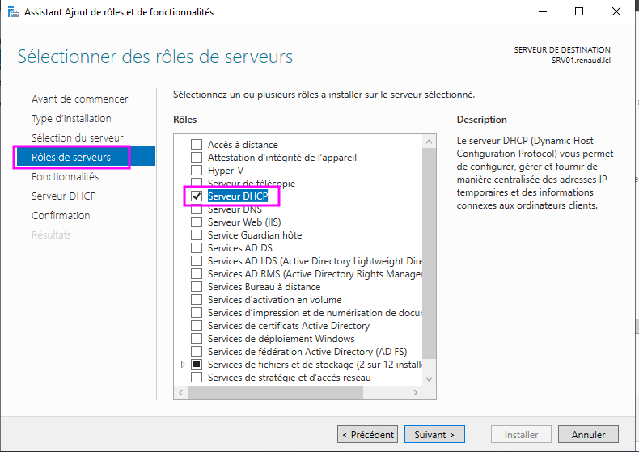](../.ressources/img/tp9-2.png){:target="_blank"} 

**Définir le plan d'adressage**

1. Sur SRV01 > Gestionnaire de Serveur > Outils > DHCP pour ouvrir le gestionnaire de DHCP
2. Selectionner IPv4 > menu Action (à droite) > Nouvelle étendue pour ouvrir le wizard de création d'étendue
[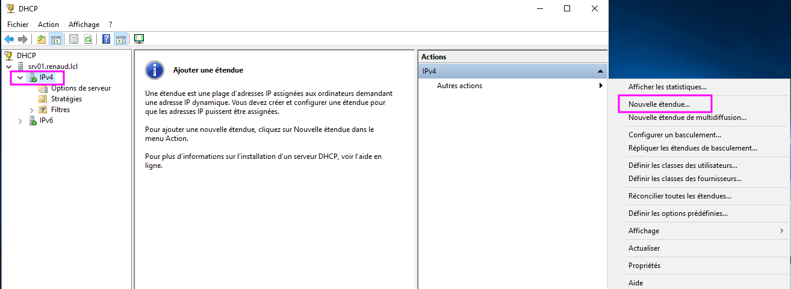](../.ressources/img/tp9-8.png){:target="_blank"} 
3. entrer un nom d'étendue (ex. TP09)
4. ~~donner une plage d'ip comprenant les ip des postes clients déjà installé~~ On s'en fout parce qu'on va passer tout le monde en DHCP plus tard...
5. Ingorer les plages d'exclusion 
6. Laisser la durée de bail par défaut (8 jours)
7. Répondre **Oui** à *voulez-vous configurer les options maintenant ?*
8. Ajouter la passerelle par défaut
[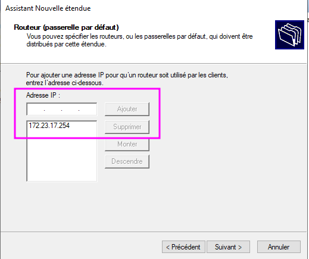](../.ressources/img/tp9-10.png){:target="_blank"} 
9. Ajouter le nom et l'ip du serveur DNS (si n'est pas déjà dans la liste)
10. Activer l'étendue 
[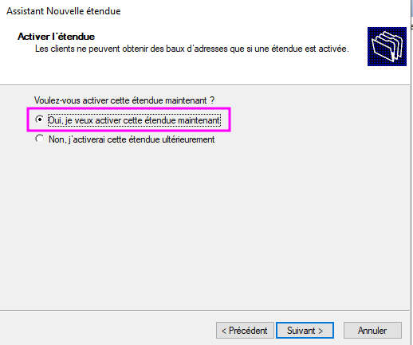](../.ressources/img/tp9-12.png){:target="_blank"} 
11. final 
[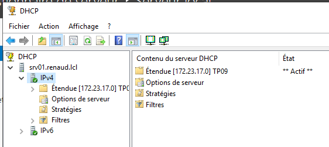](../.ressources/img/tp9-13.png){:target="_blank"} 

**Configurer DHCP sur serveur1**

1. Sur SRV01 > Gestionnaire de Serveur > Outils > DHCP
2. Etendues > Réservations > Autres actions > Nouvelle réservation
[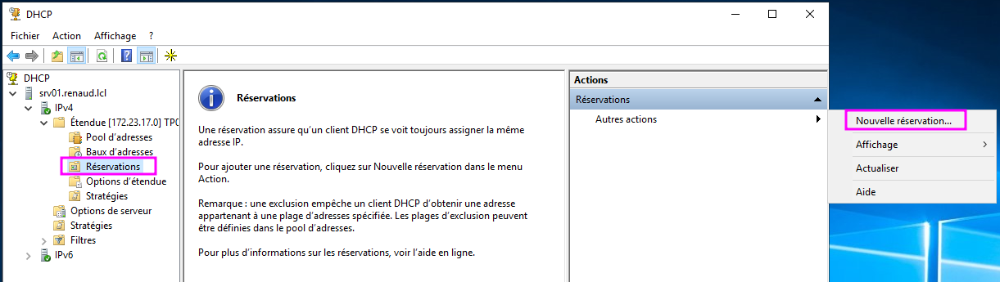](../.ressources/img/tp9-14.png){:target="_blank"} 
3. entrer nom de la réservation (au pif) + ip + MAC du serveur1 
[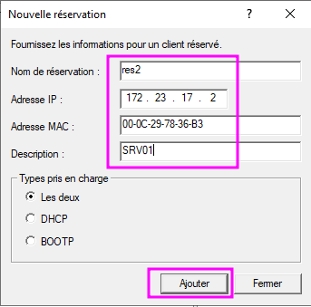](../.ressources/img/tp9-15.png){:target="_blank"} 
4. faire Ajouter puis Fermer
5. final
[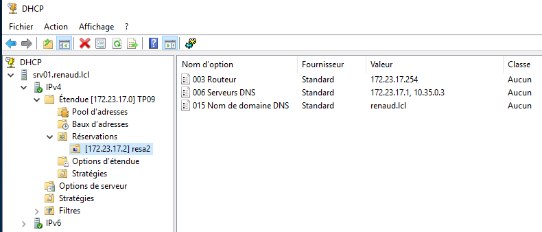](../.ressources/img/tp9-16.png){:target="_blank"} 


##### Etape 2
1. Adapter les paramètres client :
   - [x] configurer une réservation pour le 2e poste client avec la 10e adresse IP de la plage d'adresses définie dans l'étendue.

2. Sur un des postes clients, utiliser la commande **ipconfig** pour : 
   - [x] Renouveler le bail DHCP (sans perdre l'adresse IP obtenue)
   - [x] Relacher et obtenir un nouveau bail

3. Sur le serveur DHCP 
   - [x] vérifier les baux des clients et les statistiques DHCP


**Réservation client2**

1. Sur SRV01 > Gestionnaire de Serveur > Outils > DHCP
2. Etendues > Réservations > Autres actions > Nouvelle réservation
3. entrer nom de la réservation (au pif) + 10e ip (172.23.17.20) + MAC du client2
4. faire Ajouter puis Fermer
5. final
[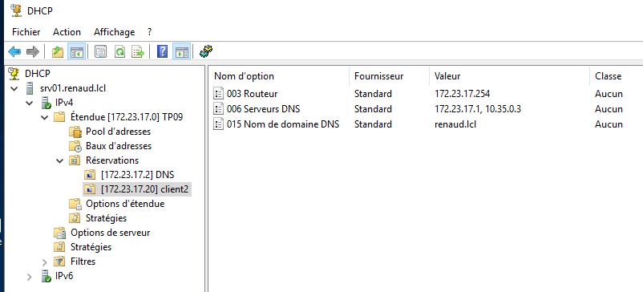](../.ressources/img/tp9-17.png){:target="_blank"} 

**Renouveler Bail**

1. Sur un client > executer **cmd**

```cmd 
cmd> ipconfig /release 
cmd> ipconfig /renew
``` 

5. final
[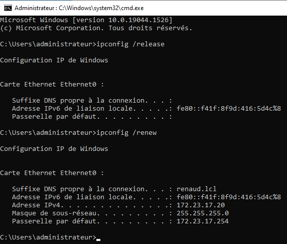](../.ressources/img/tp9-18.png){:target="_blank"} 


**Statistiques**

1. Sur SRV01 > Gestionnaire de Serveur > Outils > DHCP
2. clic droit sur Etendue > Afficher les statistiques

[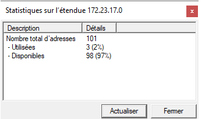](../.ressources/img/tp9-20.png){:target="_blank"} 

**Faire un snapshot**

### Bonus : Analyse de trame

A l'aide de l'outil d'analyse de trames **Wireshark**, 

- réaliser une capture des echanges entre un client et le serveur DHCP (filtrage sur *"DHCP"*) lorsque le pposte demande un bail. 
- lister les types trames DHCP échangées
- détailler les infos transmises


### Aparté

#### Configurer les nouveaux postes

##### 1. Configurer la carte réseau du poste
0. S'assurer que pfsense et le controleur de domaine tournent
1. executer **ncpa.cpl** 
2. ip : 172.23.17.13
3. masque : 255.255.255.0
4. passerelle : 172.23.17.254
4. DNS 1 : 172.23.17.1
5. DNS 2 : 10.35.0.3

[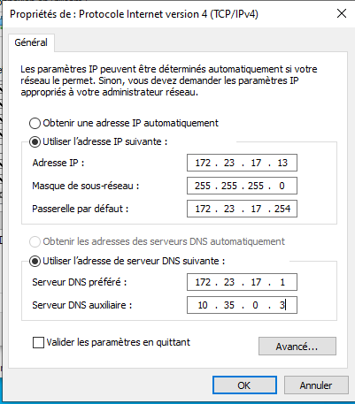](../.ressources/img/tp9-3.png){:target="_blank"} 

##### Changer hostname + ajouter dans le domaine

1. executer **sysdm.cpl**
2. clic **Modifier** > donner **nouveau nom**
3. sélectionner **Domaine** et indiquer le **nom du domaine** à joindre
4. Entrer login et mdp d'un utilisateur du domaine
5. Redémarrer

[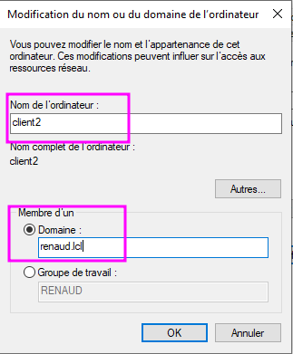](../.ressources/img/tp9-4.png){:target="_blank"}


<link rel="stylesheet" type="text/css" href="../.ressources/css/bootstrap.min.css">
<link rel="stylesheet" type="text/css" href="../.ressources/css/style.css">
