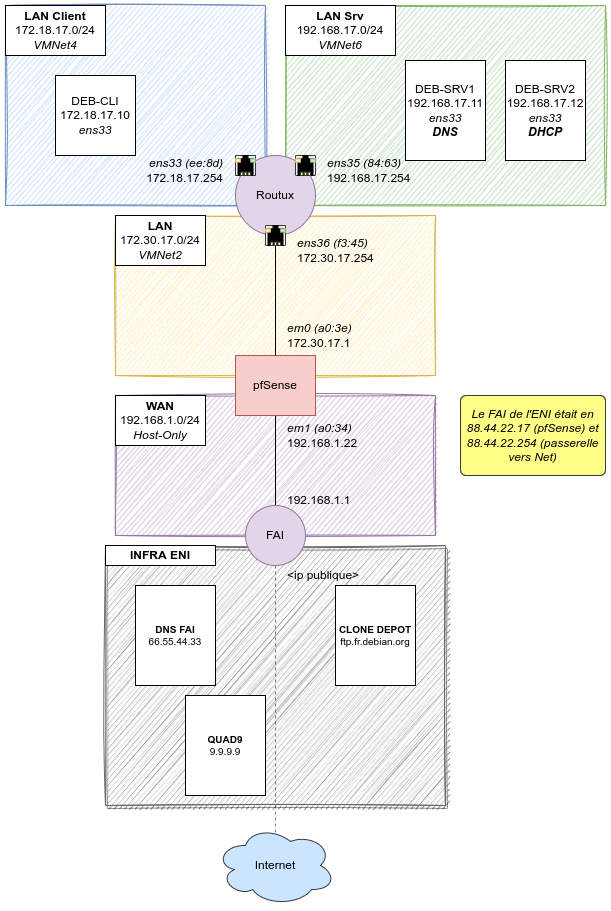

title: notes 1-4 adressage routage ssh

# ENI TSSR 10 - Services Réseaux Linux

<table class="formateur">
	<tbody>
		<tr>
			<th scope="row">Cours ENI </th>
			<td>du 08/08 au 12/08/2022</td>
		</tr>
		<tr>
			<th scope="row">Formateur</th>
			<td>François LE NALIO</td>
		</tr>
	</tbody>
</table>

[TOC]

## Sommaire

1. Contexte de mise en oeuvre
2. Configuration de l'adressage réseau 
3. Routage et traduction
4. Administration à distance 
5. Service DNS (partie 1)
6. Service DHCP
7. Service DNS (partie 2)
8. Annexes


## 1. Contexte de mise en oeuvre
### 1.1 Les besoins : de l'utilisateur au service
blabla généraliste.

### 1.2 Objectifs du cours

Appréhender la mise en oeuvre d'un ensemble de services d'une distribution GNU/Linux. Les services traités sont des services d'infrastructure réseau, leur mise en oeuvre sera réalisée sous Debian 11.

### 1.3 Maquette bac à sable

On utilisera la solution VMware Workstation pour la virtualisation. Afin d'isoler les hôtes des différents réseaux logiques, on utilisera des *réseaux de machines virtuelles* (VMNet) distincts.

### 1.4 Présentation de l'environnement de réalisation

Les serveurs et les équipements réseau prenant part à l'infrastructure sont répartis sur **4 contextes réseau** distincts :

- les postes clients sont connectés au réseau *LAN-Clients*
- les serveurs sont connectés au réseau *LAN Serveurs*
- un inter-réseau est utilisé pour la communication entre le routeur et le pare-feu
- un réseau public, commun à toutes les infrastructures, permet de fournir des services génériques

[](.ressources/img/tssr10-vue_synoptique-v5.0.png){:target="_blank"} 

Dans un contexte réel, des commutateurs distincts ou VLAN distincts seraient utilisés. Pour le maquettage, nous utiliserons des réseaux de machines virtuelles(VMNet) distincts.


## 2. Configuration de l'adressage réseau
Afin qu'une communication puisse se faire entre 2 postes, des liens physiques et logiques doivent exister.

Un réseau physique est matérialisé par l'ensemble des matériels mis en oeuvre afin de permettre le transfert de trames entre différents équipements.

Un réseau IPv4 est caractérisé par :

- une adresse de réseau 
- un masque de sous-réseau
- une adresse de diffusion 


### 2.1 Elements de paramétrage
#### 2.1.1 Paramétrage d'une carte réseau
La configuration d'un poste se traduit par la mise en oeuvre d'un ou plusieurs de spoints suivants :

- La configuration d'une adresse ip d'hôte et du masque associé (le système en déduit des adresses de réseau et de diffusion)
- La configuration d'une passerelle par défaut
- La définition d'un nom d'hôte 
- La configuration cliente DNS

#### 2.1.2 Nommage des cartes réseau
Le mécanisme de gestion des services **systemd** a introduit un schéma de nommage particulier pour les cartes réseau, il s'adapte selon les matériels détéctés pour éviter les erreurs d'interprétation.

Dans le cas des VM déployées depuis VMware, il se présente sous la forme **ens[1-n]**. Cette évolution est apparu avec Debian 9 et RedHat/CentOS 7.

Sur des systèmes plus anciens, le nommage des cartes réseau Ethernet est sous la forme **eth[0-n]**.

La carte de boucle local (*loopback*) est identifiée avec la forme spécifique **lo**.

### 2.2 Outils et méthodes de configuration du réseau
#### 2.2.1 Configuration depuis le service Network Manager
Si le service *Network Manager* est installé, il est préférable de l'utiliser pour gérer la configuration réseau du poste.

**Installation** :
```
# apt install network-manager
```

##### Méthodes de configuration de Network Manager
Les actions réalisées via Network Manager sont prises en compte immédiatement et durablement.

Le service Network Manager peut être configuré :

- En ligne de commande grâce à la commande `nmcli` (Network Manager Commande Line Interface). Cette méthode est particulièrement adaptée à l'application de modification **via des scripts**.
- En ligne de commande mais via une interface textuel grâce à la commande `nmtui` (Network Manager Text User Interface). Plus convivial que les commandes `nmcli`, c'est une méthode qui requiert l'intéraction de l'utilisateur.
- En mode graphique, à travers un composant graphique sur la machine cible. C'est la méthodes privilégiée sur les poste de travail sous GNU/Linux.


#### 2.2.2 Configuration avec la commande IP
La commande `ip` permet de gérer la configuration réseau. Le résultat d'exécution de cette commande est pris en compte immédiatement. Par contre, sans configuration complémentaire, les modifications apportées dynamiquement par cette commande **ne sont pas conservées après redémarrage du service réseau ou de la machine**.

Commandes les plus courantes :

- **Voir les interfaces réseaux** disponibles et leur états (`-c` = colorisé)
```
$ ip -c address 
$ ip -c addr 
$ ip -c a 
```

- **Voir les routes** (passerelle par défaut, passerelles et réseaux connectés)
```
$ ip -c route
$ ip -c r 
```

- **Changer le status d'une interface** en UP ou DOWN (permet d'appliquer certains paramètres s'ils ont été changés)
```
# ip link set ens33 up 
# ip link set ens33 down 
```

- **Ajouter, supprimer ou vider le cache d'une interface**. Ces modifications sont **non durables**. Flush permet de faire oublier immédiatement une configuration temporaire à une interface.
```
# ip a add 10.11.12.13/24 dev ens33
# ip a del 10.11.12.13/24 dev ens33
# ip a flush ens33
```

#### 2.2.3 Configuration durable dans le fichier /etc/network/interfaces

**ATTENTION** ! Seules les **cartes réseau non configurées via Network Manager** sont à configurer dans le fichier de configuration des interfaces présentées ci-dessous.

Sur un serveur sans environnement de bureau, la configuration des interfaces se fera via le fichier **/etc/network/interfaces**

Après toute modification de ce fichier, il est impératif de recharger / redémarrer le service **networking** pour leur prise en compte.

**Redémarrage du service networking**
```
# systemctl stop networking
# systemctl start networking

# systemctl restart networking
``` 

### 2.3 Configurer le réseau
#### 2.3.1 Configuration de l'adressage IP
##### 2.3.1.1 Configuration du Network Manager
Des commandes `nmcli` sont présentées ci-dessous pour la configuration via le Network Manager. Bien que non présentées dans ce support, des commandes `nmtui` ou le composant graphique de gestion peuvent aussi être utilisés.

- **Affichage de la configuration des interfaces**
```
$ nmcli
ens33: connecté to Wired Connection 1
	"Intel 82545EM"
	ethernet (e1000), 00:0C:29:29:08:4B:4C, hw, mtu 1500
	ip4 default 
	inet4 172.16.6.6/24 
	route4 172.16.6.0/24
	[...]

lo: non-géré
	"lo"
	loopback (unknown), 00:00:00:00:00:00, sw, mtu 65536

DNS configuration:
	servers: 10.0.0.1
	domains: demo.eni 
	interface: ens33
```

- **Modification immédiate et durable de l'adresse IP**
```
# nmcli connection modify Wired\ Connection\ 1 ipv4.addresses 192.168.66.6/24
# nmcli connection modify Wired\ Connection\ 1 ipv4.addresses 192.168.66.6/24 ipv4.method manual
# nmcli connection modify Wired\ Connection\ 1 +ipv4.addresses 192.168.1.1/24 
```

- **Modification temporaire (immédiate mais non durable) de l'adresse IP**
```
# nmcli device modify ens33 ipv4.addresses 192.168.200.150/24
```


##### 2.3.1.2 Configuration avec la commande ip
- **Affichage de la configuration des interfaces**: état d'activation, adressage physique et IP 
```
$ ip a
1: lo: <LOOPBACK,UP,LOWER_UP> mtu 65536 qdisc noqueue state UNKNOWN group default qlen 1000
    link/loopback 00:00:00:00:00:00 brd 00:00:00:00:00:00
    inet 127.0.0.1/8 scope host lo
       valid_lft forever preferred_lft forever
    inet6 ::1/128 scope host 
       valid_lft forever preferred_lft forever
2: enp5s0: <BROADCAST,MULTICAST,UP,LOWER_UP> mtu 1500 qdisc mq state UP group default qlen 1000
    link/ether f0:2f:74:d0:22:72 brd ff:ff:ff:ff:ff:ff
    inet 192.168.1.20/24 brd 192.168.1.255 scope global dynamic noprefixroute enp5s0
       valid_lft 84150sec preferred_lft 84150sec
    inet6 2a01:cb08:8e20:e600:bb7c:dbf6:ed14:be32/64 scope global dynamic noprefixroute 
       valid_lft 1801sec preferred_lft 601sec
    inet6 fe80::7da8:821a:5c4d:12a6/64 scope link noprefixroute 
       valid_lft forever preferred_lft forever
```

- **Ajout, suppression d'une adresse, suppression de toutes les adresses** d'une interface
```
# ip a add 10.11.12.13/24 dev ens33
# ip a del 10.11.12.13/24 dev ens33
# ip a flush ens33
```

- **Activer/désactiver une interface**:
```
# ip link set ens33 down 
# ip link set ens33 up
```


##### 2.3.1.3 Configuration dans le fichier interfaces
Exemple de configuration de l'adressage de 2 cartes dans le fichier de configuration des interfaces **/etc/network/interfaces** :

```bash 
source /etc/network/interfaces.d/*

# L'interface réseau de loopback => il ne faut pas la modifier
auto lo 
iface lo inet loopback 

# L'interface ens33 est configurée manuellement
auto ens33
iface ens33 inet static 
	address 192.168.66.6
	netmask 255.255.0.0

# Le allow-hotplug permet de régler des problèmes de détection sur vmware 
allow-hotplug ens35 
iface ens35 inet static 
	address 192.168.33.22/24 
	gateway 192.168.33.254

# L'interface ens37 est configurée via DHCP
auto ens37
iface ens37 inet dhcp
```

On peut aussi mettre des réglages perso dans un fichier que l'on créé dans **/etc/network/interfaces.d/**. Celui-ci est chargé au début du fichier.

Penser à relancer le service **networking** pour appliquer toute modification.
```
# systemctl restart networking.service 
```

#### 2.3.2 Configuration de la passerelle par défaut
##### 2.3.2.1 Configuration du Network Manager

- **Ajout ou modification** de l'adresse ip de la passerelle par défaut :
```
# nmcli connection modify Wired\ Connection\ 1 ipv4.gateway 192.168.66.254
```

##### 2.3.2.2 Configuration avec la commande ip
- **Afficher la table de routage**: itinéraire et passerelles
```
$ ip r
default via 192.168.0.254 dev ens37
10.11.0.0/16 dev ens333 proto kernel scope link src 10.11.12.13
192.168.0.0/24 dev ens37 proto kernel scope link src 192.168.0.1
```

- **Ajouter une route par défaut**:
```
# ip r add default via 10.11.0.254
```

- **Modifier la route par défaut**:
```
# ip r change defaut via 10.11.255.254 
```

- **Supprimer la route par défaut**:
```
# ip r del default via 192.168.0.254
```


##### 2.3.2.3 Configuration dans le fichier interfaces

la directive `gateway` permet de définir la passerelle par défaut dans le fichier **/etc/network/interfaces**.

```bash 
source /etc/network/interfaces.d/*

# L'interface réseau de loopback => il ne faut pas la modifier
auto lo 
iface lo inet loopback 

# L'interface ens33 est configurée manuellement
auto ens33
iface ens33 inet static 
	address 192.168.66.6
	netmask 255.255.0.0
	gateway 192.168.255.254

# Le allow-hotplug permet de régler des problèmes de détection sur vmware 
allow-hotplug ens35 
iface ens35 inet static 
	address 192.168.33.22/24 

# L'interface ens37 est configurée via DHCP
auto ens37
iface ens37 inet dhcp
```

**ATTENTION** on parle bien de gateway **par défaut**, donc il ne sert à rien d'en avoir 2 de paramétrées dans le même fichier. 

### 2.4 Configuration du nom d'hôte
Le nom d'hôte, ou **hostname**, est un nom court ou un nom **FQDN** (Fully Qualified Domain Name) séparé par des point. La commande `hostname` affiche le nom de la machine et permet de le modifier dynamiquement.

Celui-ci est configuré dans le fichier **/etc/hostname**, qui ne doit contenir que le nom de la machine :
```bash
# vi /etc/hostname
srv-lan.demo.eni 
``` 

Il est également possible de modifier le hostname avec la commande `nmcli` (ou `nmtui` pour le faire en mode graphique) :
```
# nmcli general hostname srv-lan.demo.eni 
```

**ATTENTION** le nom d'hôte doit être résolu localement. En cas de changement, il faut également modifier le fichier de correspondances local **/etc/hosts**

```
# vi /etc/hosts 
127.0.0.1    localhost 
127.0.0.1    srv-lan.demo.eni 
```

### 2.5 Paramétrage du client DNS
Pour que les postes soient en mesure de résoudre des noms d'hôtes en adresse ip, le service DNS est généralement utilisé. Les adresses ip des serveurs interrogés doivent être renseigner dans les paramètrages réseau du poste.

#### 2.5.1 Configuration de l'ordre de résolution
La liste ordonnancée des mécanismes utilisés pour la résolution de noms est inscrite derrière la directive **hosts** du fichier **/etc/nsswitch.conf**

```bash
$ cat /etc/nsswitch.conf 
# /etc/nsswitch.conf
#
# Example configuration of GNU Name Service Switch functionality.
# If you have the `glibc-doc-reference' and `info' packages installed, try:
# `info libc "Name Service Switch"' for information about this file.

passwd:         files
group:          files
shadow:         files
gshadow:        files

hosts:          files dns
networks:       files

protocols:      db files
services:       db files
ethers:         db files
rpc:            db files

netgroup:       nis
```

Dans l'exemple ci-dessus, les mécanismes suivants sont utilisés successivement :

1. `files` : lecture de fichier **/etc/hosts**
2. `dns`   : interrogation du serveur DNS configuré sur le poste 

Dans le cas où un environnement graphique a été installé, le paquet **avahi-daemon** est également fourni. Il fourni des méthodes pour faciliter la résolution locale et un cache DNS.

La directive **hosts** du fichier **/etc/nsswitch.conf** aura alors le contenu suivant :

```
$ grep hosts /etc/nsswitch.conf 
hosts:          files mdns4_minimal [NOTFOUND=return] dns myhostname mymachines
```

Dans ce cas, les mécanismes utilisés sont :

1. `files` : lecture du fichier **/etc/hosts**
2. `mdns4_minimal` : interrogation mDNS (*multicast DNS*) pour les noms d'hôtes IPv4 en .local
3. `dns` : interrogation du serveur DNS configuré sur le poste 
4. `myhostname` : résolution des noms locaux du poste

#### 2.5.2 Configuration du serveur DNS interrogé
Si **dns** fait partie des services référencés dans le fichier **/etc/nsswitch.conf**, le ou les serveurs DNS à interroger sont alors à configurer.

##### 2.5.2.1 Configuration du Network Manager

- **Ajout ou suppression de l'adresse du serveur DNS**
```
# nmcli connection modify Wired\ Connection\ 1 ipv4.dns 192.168.66.1
```
Pour indiquer plusieurs adresses, indiquer les ip séparées par une virgule.

##### 2.5.2.2 Configuration dans le fichier /etc/resolv.conf
En l'absence du Network Manager, on configure directement les paramètres DNS dans le fichier **/etc/resolv.conf**.

```
search demo.eni ad.campus-eni.fr 
domain ad.campus-eni.fr 
nameserver 10.0.0.3
nameserver 10.100.0.3
```

Les directives **nameserver** indiquent les adresses de serveurs DNS à requêter. Seul en cas d'indisponibilité du premier, le suivant sera sollicité. 

Les directives **search** et **domain** permettent de définir une liste de **suffixes DNS**.

Dans le cas d'une interface réseau configurée en DHCP, les paramètres sont enregistrés automatiquement à partir des informations fournies par le serveur DHCP.

**Next**: **Atelier 1. Mise en oeuvre et configuration réseau IPv4 de l'environnement**


## 3. Routage et traduction
### 3.1 Concepts du routage
Le routage est le processus permettant la communication entre des hôtes de réseaux logiques distincts.
[](.ressources/img/routage-1.png){:target="_blank"} 

Lorsqu'un hôte (**A**) cherche à communiquer avec une autre hôte (**C**):

- l'hôte **A**, au moyen de son adresse ip d'hôte et son masque de réseau, détermine si l'hôte distant **C** est sur le même réseau logique que lui.
- Dans le vas contraire, il recherche dans sa propre table de routage si une route permet de joindre le réseau de destination. Il en extrait l'adresse de passerelle (**B**)
- L'hôte (**A**) transmet ensuite le paquet à la passerelle (**B**) précédemment identifiée. 

### 3.2 Les routes: point de configuration au coeur du routage
Pour configurer le routage, il faut mettre en oeuvre l'ensemble des routes nécessaires à la communication entre les différents réseaux de l'entreprise et vers l'extérieur de celle-ci. Pour simplifier la gestion, les routes sont généralement configurées uniquement sur les équipements chargés du service de routage.

Les équipement terminaux: station de travail, serveurs, etc. sont alors configurés en client du ou des seuls routeursde leur réseau logique d'appartenance.

Il est possible de configurer les 3 étendues de routes suivantes :

- **Route d'hôte**     : route permettant d'atteindre un seul hôte ciblé.
- **Route de réseau**  : route permettant d'atteindre les hôtes d'un réseau distant concerné.
- **Route par défaut** : route utilisée en l'absence de route d'hôte ou de réseau pour joindre les hôtes de tout réseau. 

Les routes d'hôtes sont généralement peu utilisées. 
Les routes de réseau sont configurées sur des routeurs d'entreprises. 
Les routes par défaut sont utilisées sur les équipements terminaux et les routeurs.

### 3.3 Gestion dynamique des routes
La commande `ip` permet de gérer dynamiquement la configuration des routes. 

Principales actions prises en charge par cette commande :
```
$ man ip-route 
ip-route 
ip-route { add | del | change | append | replace } ROUTE 
``` 

- **Affichage des routes** actuellement configurées sur une machine:
```
$ ip route 
default via 172.16.6.254 dev ens33proto dhcp metric 100
172.16.6.0/24 dev ens33 proto kernel scope link srv 172.16.6.6 metric 100
```

- **Ajout de routes d'hôte, réseau et par défaut**
```
# ip route add 10.11.12.3 via 172.16.6.123
# ip route add 10.56.0.0/16 via 172.16.6.253
# ip route add default via 172.16.6.1
```

- **Modification d'une route par défaut**
```
# ip route change default via 10.9.0.200
``` 

- **Suppression d'une route**
```
# ip route del 10.56.0.0/16
```

### 3.4 Gestion statique des routes
Pour que les routes configurées dynamiquement soient conservées au redémarrage, choisir une des 2 possibilités de mise en oeuvre suivantes :

- Export via la commande `ip route`
- Ajout des commandes de création de routes dans le fichier **/etc/network/interfaces** (ou dans un fichier placé dans le répertoire */etc/network/interfaces.d/monFichier*) 

### 3.5 Activation / Désactivation du paramètre de routage
Le noyau Linux a la capacité de router les paquets qui lui sont remis mais non destinés.

- **Afficher l'état d'activation** du paramétrage noyau correspondant. Actif=1, Inactif=0.
```
# sysctl net.ipv4.ip_forward 
net.ipv4.ip_forward = 0 
```

- **Modifier dynamiquement l'état d'activation du routage**. Attention, cette modification est immédiate mais **temporaire**.
```
# sysctl net.ipv4.ip_forward=1
net.ipv4.ip_forward = 1
```

- Pour **modifier durablement l'état d'activation du routage**, il faut modifier le fichier de configuration **/etc/sysctl.conf** et décommenter la directive suivante :
```
# vi /etc/sysctl.conf 
net.ipv4.ip_forward=1
```

- Pour **forcer la prise en compte immédiate** des modifications apportées à ce fichier :
```
# sysctl -p
```

**Next**: **Atelier 2. Configuration d'une infrastructure réseau routée**

### 3.6 Concepts de la traduction d'adresse (NAT)
Le routage permet la **communication** entre des hôtes de **différents réseaux logiques**. Cela n'est possible que si **les adresses de réseaux sont présentes dans les tables de routages**.

Dans le cas contraire :

- Réseaux privés non routés sur Internet
- Réseaux privés non connus des routeurs de l'entreprise (maquette, etc.)
- Hôtes disposant d'adressage privé dont les services doivent être accessibles depuis le réseau Internet 

Le routage seul n'est pas suffisant et doit être complété par la mise en oeuvre de traduction d'adresse.

La **traduction d'adresses** (**NAT**), généralement associée à la **traduction de ports** (**NAPT**) peut être utile afin de :

- remplacer l'adressage source des paquets IP => **NAT de source**
- remplacer l'adressage de destination des paquets IP => **NAT de destination**

Sous GNU/Linux, sa mise en oeuvre peut être réalisée au moyen de la commande `iptables`.

### 3.7 Mise en oeuvre de la traduction d'adresse
Dans le cadre des ateliers pratiques, vous mettrez en oeuvre la traduction d'adresse au moyen d'une VM **pfSense**. 

#### 3.7.1 Paramètre NAT pfSense
LE NAT/NAPT se configure dans le menu **Firewall** > **NAT**.

[](.ressources/img/pfsense-nat.png){:target="_blank"} 

Plusieurs types de paramétrages sont disponibles :

- **Port Forward** : redirection de port (et d'adresse), principalement destiné à la gestion des paquets entrants sur l'interface WAN mais également paramétrable  pour les autres interfaces.
- **1:1** : One-to-One NAT, pour lier une adresse interne (ou un sous-réseau) spécifique à une adresse externe (ou un sous-réseau) spécifique.
- **Outbound** : traduction d'adresse sur le trafic sortant des cartes, généralement configuré sur l'interface WAN pour permettre l'accès au réseau public depuis un adressage privé.
- **NPt** : Network Prefix Translation, équivalent au 1:1 IPv4 mais destiné aux adresses IPv6. Permet le mappage d'un préfixe IPv6 vers un autre.

Pour paramétrer le **NAT de source**; les règles à configurer sont dans la section **Outbound**.

Pour paramétrer le **NAT de destination**, les règles à configurer sont dans la section **Port Forward**.


#### 3.7.2 Configuration du NAT de source
Le NAT de source (**Outbound**) est préconfiguré et activé automatiquement après l'installation de pfSense :

- Pour tous les réseaux privés auxquels appartient le routeur/pare-feu pfSense. 
- Pour tous les réseaux privés pour lesquels une route explicite est configurée.

Cela permet donc à tous les hôtes des réseaux privés derrière le routeur/pare-feu d'atteindre les ressources dans les réseaux publics.

Paramétrage par défaut du mode **Outbound** :
[](.ressources/img/pfsense-2.png){:target="_blank"} 

Règles par défaut :
[](.ressources/img/pfsense-3.png){:target="_blank"} 

Le mode **automatique** (*Automatic Outbound NAT rule generation*) est préconfiguré après l'installation du système pfSense. Dans ce mode, les règles ne sont pas configurables mais cela convient aux besoins de base. 

Pour pouvoir **éditer et/ou ajouter** des règles **Outbound**, il faut activer le mode **hybride** ou **manuel**.

Il est également possible de **désactiver** le NAT sortant avec le mode **Disable Outbound NAT rule generation**.

<table>
	<tr>
		<td width="100"></td>
		<td>La désactivation du pare-feu (option <b>Disable Firewall</b>) dans les paramètres systèmes avancés désactive toutes les règles de pare-feu AINSI QUE <b>toutes les règles NAT</b> préconfigurées.</td>
	</tr>
</table>

Vous trouverez des informations détaillées sur les paramétrages NAT dans la documentation officielle: https://docs.netgate.com/pfsense/en/latest/nat/outbound-nat.html

<table>
	<tr>
		<td width="100"></td>
		<td>NEXT : <b>Atelier 3. Intégration d'un routeur NAT sous pfSense</b></td>
	</tr>
</table>

## 4. Administration à distance
### 4.1 Les outils d'administration à distance
#### 4.1.1 Protocole SSH et accès au shell via le réseau
Pour administrer le serveur il est possible de s'y connecter (ouverture d'un shell) localement ou via le réseau.

Pour la prise en main distante, les cibles suivantes doivent être définies:

- protocole utilisé
- logiciel client utilisé
- logiciel / service utilisé sur le serveur 

Le **protocole** généralement utilisé pour l'établissement de connections sécurisées via le réseau est le protocole SSH (Secure SHell). Il est normalisé et sécurisé, les échanges d'informations circulant sur le réseau étant chiffrés.

Le **logiciel client** est l'application qui se connecte au serveur SSH. Il doit être exécuté depuis le poste sur lequel se trouve l'utilisateur qui souhaite *prendre la main* sur la machine distante. Les applications suivantes sont couramment utilisées à ces fins :

| Application | Env. | Principales caractéristiques |
|-----|------------|--------------------------|
| Putty | Windows | Logiciel libre disponible à l'origine uniquement pour Windows, porté depuis sous d'autres environnements |
| OpenSSH | Windows | Fonctionnalité optionelle, installable sur Windows 10 (1903) et Windows 2019. Fournit la commande `ssh` |
| OpenSSH | GNU/Linux | Fournit la commande `ssh`, généralement implémenté nativement sur les principales distrib GNU/Linux |

D'autres applications sont disponibles. Voir plus loin.

##### Le logiciel serveur SSH
Pour répondre aux requêtes de connection du client, un service doit être implémenté sur la machine sur laquelle l'on souhaite travailler à distance un serveur SSH. C'est généralement **OpenSSH-server** qui est utilisé.


#### 4.1.2 Protocole SSH et transfert de fichier sécurisé
Le protocole SSH peut aussi être utilisé pour sécuriser le transfert de fichier entre différentes machines.

##### Outils nécessaires à la copie de fichier (scp, winscp)
Les outils nécessaires à la copie de fichier via **scp** peuvent soit être intégrés au logiciel SSH, soit nécessiter l'installation d'un logiciel supplémentaire (winscp pour Windows).

##### Exemple d'utilisation

Commande pour récupérer un fichier présent sur un poste distant :

```
$ scp identifiant@ip_du_poste_distant:/etc/eniconf.cfg /tmp 
$ scp id@ip:/path/to/target /path/to/downloaded/file
```

### 4.2 Sécurisation de la connection SSH
La connection à un serveur SSH nécessite de s'authentifier en précisant le mot de passe à chaque connection. Il est possible d'utiliser à la place un échange de **clé cryptographique**. Cela sécurise la connection manuelle et permet l'usage automatisés via les scripts.

Il en existe plusieurs types de clés : RSA, DSA, ECDSA, etC. Dans le cadre du cours, nous utiliserons les paramétrages par défaut avec un échange de clé **RSA**.


#### 4.2.1 Génération des clés côté client
Une paire de clé doit être générée côté client pour l'utilisateur devant se connecter en SSH. On utilise pour cela la commande `ssh-keygen` fournie avec le paquet **OpenSSH-client**

- **Création de la paire de clé**:
```
$ ssh-keygen
```
```
$ ssh-keygen
Generating public/private rsa key pair.
Enter file in which to save the key (/home/reno/.ssh/id_rsa): 
Enter passphrase (empty for no passphrase): 
Enter same passphrase again: 
Your identification has been saved in /home/reno/.ssh/id_rsa
Your public key has been saved in /home/reno/.ssh/id_rsa.pub
The key fingerprint is:
SHA256:/1N6k+D5AsTm8KQ8qBK0ig2JVUY/kPmWWMqh7LDz0VI reno@debian10-TITAN
The key's randomart image is:
+---[RSA 3072]----+
|   .oo           |
|    *o.          |
| . = *o. .       |
|. = E +.. =      |
|.B + . oSO       |
|* * . . +.+ . .  |
|.* + .   ..o = . |
|o + .      .* +  |
|   .        .=.. |
+----[SHA256]-----+
```

**Note**: à chaque prompt, on peut laisser le réglage par défaut en tapant juste <kbd>ENTREE</kbd>.

Deux clés sont générées dans le répertoire **.ssh** dans l'espace personnel de l'utilisateur :

- **id_rsa** : la clé privée de l'utilisateur 
- **id_rsa.pub** : la clé publique de l'utilisateur, qui sera copiée sur le serveur SSH 

Pour simplifier la mise en oeuvre, on utilise ici les paramètres par défaut, sans indiquer de *passphrase*. Le type, le nom et la taille de la clé peuvent être précisés avec les options de `ssh-keygen`

<table class="warning-table">
	<tr>
		<td width="100"></td>
		<td>Il est vivement conseillé, dans un contexte de production, d'indiquer une <b>passphrase</b>.<br>Cette passphrase devra ensuite être fournie à chaque connection. Elle peut être gérée et mise en cache côté client avec le composant <b>ssh-agent</b></td>
	</tr>
</table>


#### 4.2.2 Copie de la clé publique sur le serveur distant
Le serveur distant SSH doit disposer de la clé publique de l'utilisateur pour initier et valider la connection. On utilise pour cela la commande `ssh-copy-id` fournie avec le paquet **OpenSSH-client**.

Dans un premier temps, la clé publique sera copiée dans l'espace personnel d'un utilisateur standard. Une fois récupérée sur le serveur distant, elle pourra être associée au compte root.

Par défaut la configuration du démon **sshd** sur le serveur SSH <u>empêche la connection</u> de **root** avec un mot de passe mais permet la connection avec les clés RSA. 

##### Copie de la clé publique vers le serveur SSH

```
reno@deb-cli:~$ ssh-copy-id admin@192.168.30.17
admin@192.168.30.17's password: 

Number of key(s) added: 1

Now try logging into the machine, with: "ssh 'admin@192.168.30.17'"
and check to make sure that only the key(s) you wanted were added.
```

Avec les paramètres par défaut, **ssh-copy-id** :

- utilise le fichier **id_rsa.pub** généré précédemment avec `ssh-keygen`
- génère un fichier **authorized_keys** dans le répertoire **$HOME/.ssh** de l'utilisateur distant avec la clé
- le mot de passe de connexion est demandé une dernière fois. 

Comme indiqué, il est maintenant possible de se connecter sans authentification sur le serveur SSH avec la commande :

```
reno@deb-cli:~$ ssh admin@192.168.30.17 
```

##### Fournir la clé publique au compte root
Pour fournir la clé publique au compte root il faut :

- Se connecter avec le compte **root** sur le serveur distant 
- Créer un répertoire **.ssh** dans son espace personnel avec les permissions adaptées (700)
- Copier le fichier **authorized_keys** de l'utilisateur standard vers le répertoire **.ssh** de root 

```
root@deb-srv:~# mkdir /root/.ssh 
root@deb-srv:~# chmod 700 /root/.ssh 
root@deb-srv:~# cp /home/admin/.ssh/authorized_keys /root/.ssh 
``` 

Il est alors possible de se connecter sans authentification avec le compte root sur le serveur SSH avec la commande :

```
reno@deb-cli:~$ ssh root@192.168.30.17
```

<table class="warning-table">
	<tr>
		<td width="100"></td>
		<td>La procédure a été simplifiée et n'est adaptée qu'à un contexte avec un <u>nombre limité</u> de serveurs et de clients. Dans une infra plus complexe, il faudra gérer un ensemble de clés et manipuler avec précaution le fichier <b>authorized_keys</b>.<br><br>Pour plus de détails, consulter <a href="https://www.ssh.com/ssh/" target="_blank">https://www.ssh.com/ssh/</a></td>
	</tr>
</table>


### 4.3 Gestion des connections multiples
Selon l'environnement utilisé pour administrer les servuers GNU/Linux à distance, plusieurs outils graphiques sont disponibles pour bénéficier d'un contexte de travail plus efficace et performant.

<table>
	<thead>
		<tr>
			<th>Application</th>
			<th>Caractéristiques</th>
		</tr>
	</thead>
	<tbody>
		<tr>
			<td><b>Putty</b> </td>
			<td>Outil de bas pour se connecter aux serveurs distants au temps des dinosaures.<br>Supporte les connections SSH, TelNet, Serial. Permet la sauvegarde des paramètres et informations de connection. Intègre la gestion des clés d'authentification (format PPK). Sous forme d'un fichier exécutable compact (moins d'1 Mo).<br>
			Logiciel Open Source sous licence MIT.</td>
		</tr>
		<tr>
			<td><b>mRemoteNG</b> </td>
			<td>Outil multifenêtres sous forme d'onglets et multiprotocoles.<br>
				Supporte les connections SSH, RDP, VNC, HTTP, etc.<br>
			Permet la sauvegarde des paramètres et une gestion avancée des informations de connection. Compatbile avec les paramètrages de Putty. Existe au format portable.<br>
			Logiciel libre sous licence GNU GPL v2, requiert le .NET Framework (donc pas multi-plateforme).
			</td>
		</tr>
		<tr>
			<td><b>MobaXTerm</b> </td>
			<td>Outil multifenêtres et multiprotocoles avec une interface graphique évoluée.<br>
				Supporte les connexions bureau et terminal à distance (RDP, VNC, XDMCP, SSH, TelNet, FTP, etc.) Prend en charge les tunnels SSH. Fournit une gestion avancée des connections et des outils complémentaires: SFTP, macros, environnement CLI de base (Cygwin), etc. Existe au format portable.<br>
				Logiciel non libre, version Home gratuite limitée à 12 sessions et 2 tunnels SSH.<br>
				Site: <a href="https://mobaxterm.mabatek.net/">https://mobaxterm.mabatek.net/</a></td>
		</tr>
	</tbody>
</table>

##### Depuis un client GNU/Linux
Toute distribution GNU/Linux incorpore un terminal permettant de gérer plusieurs connections SSH simultanées sous forme d'onglets. L'outil **Terminator** disponible dans les dépots de la plupart des distributions peut être installé pour disposer de plus de fonctionnalités :

- Affichage multifenêtres avec découpage horizontal et/ou vertical
- Connexion automatique au serveur distant (via le fichier de configuration)
- Groupement de commandes sur plusieurs fenêtres 
- etc. 

<table>
	<tr>
		<td width="100"></td>
		<td>NEXT : <b>Atelier 4. Configuration du service SSH</b></td>
	</tr>
</table>

<link rel="stylesheet" type="text/css" href=".ressources/css/bootstrap.min.css">
<link rel="stylesheet" type="text/css" href=".ressources/css/style.css">