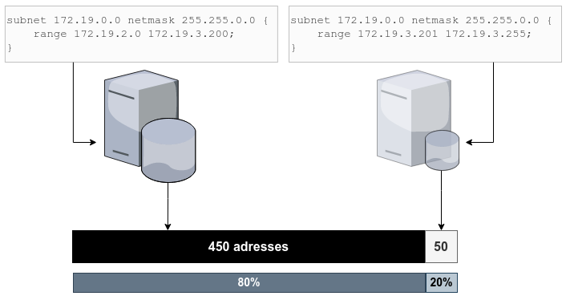

title: notes 8 annexes

# ENI TSSR 10 - Services Réseaux Linux

<table class="formateur">
	<tbody>
		<tr>
			<th scope="row">Cours ENI </th>
			<td class="vert-align-mid">du 08/08 au 12/08/2022</td>
		</tr>
		<tr>
			<th scope="row">Formateur</th>
			<td class="vert-align-mid">François LE NALIO</td>
		</tr>
	</tbody>
</table>


[TOC]

## Sommaire

1. Contexte de mise en oeuvre
2. Configuration de l'adressage réseau 
3. Routage et traduction
4. Administration à distance 
5. Service DNS (partie 1)
6. Service DHCP
7. Service DNS (partie 2)
8. Annexes


## 8. Annexes
### 8.1 Paramètres vim pour Debian
Depuis Debian 9, **vim** a un comportement désagréable :

- La sélection avec la souris bascul **vim** en mode visuel.
- La copie d'un bloc comportant des lignes commentées génère des lignes commentées après la première ligne commentée (?).

Par exemple, en copiant ce bloc :
```bash 
if [[ $machin -eq $truc ]]; then
	# alors je fais ça :
	echo coucou
fi
```

Quand on colle celui-ci, cela donne ce résultat:
```bash
if [[ $machin -eq $truc ]]; then
	# alors je fais ça :
#	echo coucou
#fi
```

Enfin, dans la version Debian 9, si on crée son propre fichier **.vimrc** dans son **$HOME**, alors tous les paramètres généraux présents dans **/etc/vim/vimrc** ne sont plus pris en charge.

Pour retrouver un comportement normal, il faut créer un fichier **/etc/vim/vimrc.local** avec les paramètres suivants :
```sh 
source /usr/share/vim/vim81/defaults.vim 
let skip_defaults_vim = 1
if has('mouse')
set mouse=r 
endif
set paste
``` 

**Notes**: `vim81` correspond à la version de vim. Adapter à la version installée.


### 8.2 Tolérance de panne avec DHCP
Pour accroître la tolérance de pannes du service, il est possible d'ajouter d'autres instances du service (autres serveurs DHCP). Il faut alors répartir la plage d'adresses entre les différentes instances du service. 

Quand on dispose d'un serveur DHCP principal et d'un second (de secours), le serveur principal dispose du plus grand nombnre d'adresses à allouer. Le serveur "de secours" ne peut distribuer qu'un nombre limité d'adresses, afin d'opérer la continuité du service en attendant le rétablissement du serveur principal.

[](.ressouces/img/dhcp-tolerance.png){:target="_blank"}

C'est généralement la règles des "80/20" que l'on applique afin de répartir entre les 2 serveurs le pourcentages d'adresses à distribuer. 

Pour privilégier le service du serveur "principal", il est possible de **retarder la délivrance de baux sur le serveur de secours** en utilisant la directive de configuration **`min-secs`**.

Exemple de configuration d'un service DHCP de secours :
```sh 
# vi /etc/dhcp/dhcpd.conf 

# Durées de baux courtes
default-lease-time 1800;
max-lease-time 3600; 

# Service ne faisant pas autorité
# et temporisation avant réponse 
not authoritative;
min-secs 5;

subnet 172.19.0.0 netmask 255.255.0.0 {
	range 172.19.10.0 172.19.10.255;
	option routers 172.19.1.1;
}
```

### 8.3 Configuration du DHCP Failover
#### 8.3.1 Utilité et principe de fonctionnement du failover
Une fonctionnalité de **Failover** du service DHCP permet à **plusieurs serveurs DHCP de distribuer des baux d'une même plage**:

- **Plusieurs serveurs** = tolérance de pannes, si un serveur n'est plus fonctionnel, le service est toujours disponible. 
- **Baux d'une même plage** = cela évite de perdre une plage d'adresse quand le serveur disposant de cette plage cesse de fonctionner. 

La configuration de la fonctionnalité DHCP Failover permet de bénéficier de tolérance de pannes tout en optimisant l'utilisation de la plage d'adresse ip distribuée.

[](.ressouces/img/dhcp-failover.png){:target="_blank"}

#### 8.3.2 Configuration
Sont présentées ci-dessous les configurations des services DHCP principal et secondaire:

<table>
	<thead>
		<tr>
			<th>Serveur principal</th>
			<th>Serveur secondaire</th>
		</tr>
	</thead>
	<tbody>
		<tr>
			<td>
<pre>
failover peer "lancli-failover" {
    <b>primary</b>

    address dhcp-1.demo.eni;
    port 647;

    peer address dhcp-2.demo.eni;
    peer port 647;

    max-response-delay 60;
    max-unacked-updates 10;
    load balance max seconds 3;

    <b>mclt 3600;</b>
    <b>split 128;</b>
}</pre></td>
			<td>
<pre>
failover peer "lancli-failover" {
    <b>secondary</b>

    address dhcp-2.demo.eni;
    port 647;

    peer address dhcp-1.demo.eni;
    peer port 647;

    max-response-delay 60;
    max-unacked-updates 10;
    load balance max seconds 3;
}</pre></td>
</tr>
		<tr >
			<td colspan="2">
<pre><span class="comment"># Commun au deux serveurs</span>
subnet 10.9.0.0 netmask 255.255.0.0 {
	option routers 10.9.255.254;
	pool {
		failover peer "lancli-failover";
		range 10.9.1.0 10.9.9.255;
	}
}</pre></td>		
		</tr>
	</tbody>
</table>

Signification des directives utilisées dans la configuration présentée :

<dl>
	<dt><b><code>max-response-delay</code></b></dt>
	<dd>
		Intervalle de temps (en secondes) au-delà duquel un serveur n'ayant pas eu de message de son partenaire considère que celui-ci est défaillant.
	</dd>
	<dt><b><code>max-unacked-updates</code></b></dt>
	<dd>
		Nombre de messages d'information de mise à jour (BNPUPD) pouvant être transmis au partenaire avant l'envoi d'un accusé de réception (BNPACK).
	</dd>
	<dt><b><code>load balance max seconds</code></b></dt>
	<dd>
		Limite du délai, depuis la dernière requête du client, au-delà duquel le serveur y répondra outrepassant la configuration du failover.
	</dd>
	<dt><b><code>mclt</code></b></dt>
	<dd>
		<i>Max Client Lead Time</i> : délai en secondes pendant lequel un serveur peut renouveler un bail obtenu auprès de l'autre serveur.
	</dd>
	<dt><b><code>split</code></b></dt>
	<dd>
		Permet de moduler la répartition de charge entre le serveur principal et le secondaire. Sa valeur doit être comprise entre 0 et 255. Plus la valeur est proche de 0, plus le serveur secondaire sera sollicité. Plus elle est proche de 255, plus grand sera le nombre de clients du serveur principal.<br>La valeur d'équilibre est 128.
	</dd>
</dl>

##### Sécurisation des échanges
En complément de la configuration présentée précédemment, il est possible de sécuriser les échanges entre les 2 serveurs DHCP prenant part au Failover. Pour ce faire, on ajoute les directives de configuration suivantes à la configuration des 2 services :

```
omapi-port 7911;
key omapi_cle {
	algorithm hmac-md5;
	secret FFD3yBBsq8F+FW1EhvEAUg==;
}
omapi-key omapi_cle;
```

La valeur renseignée pour la directive `secret` pourra être générée avec la commande `dnssec-keygen`.

### 8.4 DNS : sous-domaines et delegation
#### 8.4.1 Sous-Domaines, concept et mise en oeuvre
La hiérarchie DNS permet de **déclarer des sous-domaines** relatifs au domaine parent. Cela permet de gérer des noms dans un espace de noms dédiés tout en conservant les informations dans le même fichier zone que le domaine parent.

Cela ne nécessite aucune modification dans la configuration du service utilisé, la différenciation se fait uniquement dans les données du **fichier de zone**.

Exemple de fichier de **zone directe avec un sous-domaine** :
```
; fichier de zone du domaine eni-ecole.bzh 

$ORIGIN eni-ecole.bzh.
$TTL 86400 

[...]

@SOA dns1.eni-ecole.bzh. hostmaster.eni-ecole.bzh. (
	2019100253
)


; fichier de zone du domaine eni-ecole.bzh 

; Directives de configuration s'appliquant à
; tous les enregistrements suivants
$ORIGIN eni-ecole.bzh.
$TTL 86400

; Enregistrements SOA (who has authority) et NS (name servers) relatifs à la zone parente
@ SOA dns1.eni-ecole.bzh. hostmaster.eni-ecole.bzh. (
    2019100253 ; serial
    86400      ; refresh 1 day 
    7200       ; retry 2 hours
    3600000    ; exemplaire
    3600       ; negative TTL
);     

@ NS dns1.eni-ecole.bzh.
@ NS dns2.eni-ecole.bzh.

; Enregistrements relatifs au domaine parent eni-ecole.bzh
dns1   A      44.0.5.3
dns1   AAAA   2001:0db8::ec01:e 
dns2   AAAA   2001:0db8::ec01:e53 
www    A      44.0.0.80
rdsgw  A      35.12.13.15
smtp   A      44.0.0.25
ww     CNAME  www.eni-ecole.bzh.
wwww   CNAME  www.eni-ecole.bzh.

# Enregistrements pour les sous-domaines cdb et nrt 
www.cdb A      35.12.13.16
rds.cdb A      35.12.13.17
www.nrt A      79.21.22.23
rds.nrt A      79.21.22.24
```
Les sous-domaines ***cdb.eni-ecole.bzh** et **nrt.eni-ecole.bzh** sont configurés chacun avec 2 enregistrements *www* et *rds*.

Pourquoi ???

#### 8.4.2 Délégation, concept et mise en oeuvre
La **délégation** indique à un serveur DNS sa limite d'autorité pour un ou plusieurs espaces de noms enfant de zones hébergées.

Quand un serveur gère un domaine de noms donné mais ne gère pas toute ou partie des domaines enfants de cette zone, la délégation permet d'indiquer dans la zone parente qui fait autorité pour le ou les domaines enfants. 

La délégation est inscrite dans la zone : y sont référencés le ou les serveurs faisant autorité pour le domaine enfant ciblé. 

Cela nécessite une configuration spécifique du serveur DNS gérant la zone parente et la configuration d'un autre serveur DNS pour la gestion de la zone déléguée.

Exemple de fichier de zone du domaine *prism.lcl* contenant une délégation pour l'espace de noms enfant *fiveeye.prism.lcl*. 

```
$ORIGIN prism.lcl 
$TTL 86400
@SOA nsa.prism.lcl esnowden.prism.lcl ( 
	2019100301 86400 7200 3600000 3600
)
;
@ NS nsa.prism.lcl 
nsa      A   10.0.255.53
file01   A   10.0.0.1
; Délégation vers le serveur NS du domaine enfant 
fiveeye.prism.lcl.   NS   nsb.prism.lcl 
; Enregistrement d'hôte du NS déclaré pour le sous-domaine (glue record)
nsb      A   10.2.0.53
``` 

La configuration précédente est suffisante si le serveur DNS est uniquement hébergeur pour la zone considérée. Par contre, si ce serveur est aussi <u>serveur résolveur</u>, il faut en complément adapter la configuration <u>de la zone parente</u>. 

Configuration complémentaire apportée à la configuration de Bind9 :
```
zone "prism.lcl" {
	type master;
	file "db.prism.lcl";
	forwarders {};
};
``` 

La directive `forwarders {};` est utilisée pour désactiver - uniquement pour la sone *prism.lcl* - les paramètres globaux *forwarders* configurés dans le fichier **/etc/bind/named.conf.options**. Cela permet l'interrogation du serveur NS *nsb.prism.lcl* désigné dans le fichier de zone.
 
### 8.5 DNS : mises à jour DNS dynamiques
Par défaut sur Bind9, seule la configuration statique des enregistrements DNS est possible dans les fichiers de zone. La **mise à jour dynamique des zones**, c’est-à-dire la mise à jour des enregistrements par les clients eux-mêmes, n’est pas autorisée.

On peut permettre la mise à jour dynamique pour un ensemble de postes clients ou pour seulement des serveurs dédiés (serveurs DHCP) qui pourront agir pour le compte des clients.

INSERER SCHEMA p48

#### 8.5.1 Configuration DNS pour les mises à jour dynamiques

Dans la configuration de Bind9, la **mise à jour dynamique nécessite une configuration explicite** avec la directive `allow-update` à l’échelle de chacun des domaines concernés. On pourra délimiter le ou les clients concernés en utilisant des adresses d’hôtes ou de réseaux.

L’activation des mises à jour dynamiques pour le domaine ciblé modifie fortement le comportement du service Bind9 pour le fichier de zone concerné :

- Bind9 s’approprie totalement le fichier de zone, les modifications manuelles directement dans le fichier ne sont plus possibles sans précautions
- Le numéro de série de la zone est incrémenté automatiquement lors des modifications
- Un fichier **nom_du_fichier_de_zone.jnl** est créé au même emplacement que le fichier de zone, il sert à journaliser les demandes de mise à jour ynamique avant la fusion dans le fichier de zone

Exemple d'activation de la mise à jour dynamique DNS pour une zone directe :
```
# Fichier /etc/bind/named.conf.local
zone "eni.demo" {
    # Déclaration de la zone directe principale 
    # en chargeant le fichier db.eni.demo
    type master;
    file "db.eni.demo";

    # Autorisation des màj dynamiques exclusivement 
    # pour les clients du réseau cité et depuis les 
    # adresses locales du serveur (boucle locale comprise)
    allow-update {
        192.168.53.0/24;
        localhost;
    };
};
```

<table class="warning-table">
    <tr>
        <td width="100"></td>
        <td>La mise à jour dynamique par les clients n'a lieu que si le <u>suffixe DNS</u> du domaine ciblé est <u>correctement configuré</u> sur les postes clients.<br>Pour les postes Windows, il s'agit du paramètre <b>Suffixe DNS Principal</b> dans les propriétés du nom de la machine. Pour les postes GNU/Linux, c'est la valeur `hostname` qui devra être configurée.</td>
    </tr>
</table>


##### Modification manuelle d'un fichier de zone avec les màj dynamique
Pour effectuer une màj "manuelle" d'une zone dynamique, il est conseillé d'utiliser le client **nsupdate**, fourni avec le paquet **dnsutils**.

```
# nsupdate
> update delete cli01.demo;eni A
> update add srv01.demo.eni 86400 A 192.168.42.1
> show
> send 
> quit
```

Il est également possible de *geler* la zone afin d'effectuer une modification du fichier de zone. On utilise pour cela l'outil `rndc` fourni avec l'installation du servicec Bind9. 

- **Geler une zone pour un domaine précis** :
```
# rndc freeze eni.demo 
```

Attention, pour toute intervention manuelle dans le fichier, il faut égalementpenser à <u>incrémenter</u> le numéro de série du SOA.

- **Dégeler une zone pour un domaine précis**: 
```
# rndc unfreeze eni.demo 
```

Suite au dégel, la zone est rechargée automatiquement par le service bind9.

#### 8.5.2 Mises à jour dynamiques par le serveur DHCP

Dans un contexte GNU/Linux, il est préférable de cibler les machines autorisées à effectuer les mises à jour dynamiques. Plutôt que laisser tous les clients DNS le faire, on peut configurer le ou les serveurs DHCP comme uniques partenaires pour les mises à jour dynamiques. 

Pour cela, il fuat modifier la configuration :

- des zones principales du serveur DNS, en adaptant la directive `allow-update` pour cibler uniquement les adresses IP des serveurs DHCP (il est également possible d'utiliser une clé cryptographique)
- du ou des serveurs DHCP pour activer la mise à jour dynamique (vois ci-dessous)

Paramètres DHCP pour les mises à jour dynamiques (fichier **/etc/dehcp/dhcpd.conf**) :

```sh
# Activation de la màj dynamique DNS
ddns-updates on;
# Mode de màj dynamique "standard"
ddns-update-style standard;
# Suffixe DNS du domaine direct 
ddns-domainname "demo.eni"; 

# Force la màj par le serveur DHCP 
ignore client-updates;
# Active la màj pour les réservations
update-static-leases on;
```

Il est également nécessaire de déclarer , dans la configuration DHCP, les zones DNS à mettre à jour et le serveur associé avec des directives du type :

```
# Déclaration de la zone directe 
# avec le serveur principal sur cette zone 
zone demo.eni {
	primary 10.5.3.10;
}

# Déclaration de la zone inverse 
# avec le serveur principal sur cette zone 
zone 42.168.192.in-addr.arpa { 
	primary 10.5.3.10;
}
``` 


<link rel="stylesheet" type="text/css" href=".ressources/css/bootstrap.min.css">
<link rel="stylesheet" type="text/css" href=".ressources/css/style.css">
