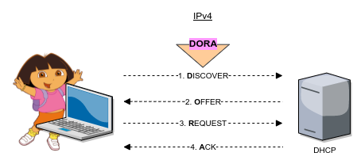

title: notes dhcp condensé

# ENI TSSR 10 - Services Réseaux Linux

<table class="formateur">
	<tbody>
		<tr>
			<th scope="row">Cours ENI </th>
			<td>du 08/08 au 12/08/2022</td>
		</tr>
		<tr>
			<th scope="row">Formateur</th>
			<td>François LE NALIO</td>
		</tr>
	</tbody>
</table>

[TOC]

## 6. Service DHCP
### 6.1 Notions
Le protocole **DHCP** (**Dynamic Host Protocol Configuration**) est normalisé par un ensemble de RFS. Le service DHCP implémente le protocole DHCP, il permet de fournis des informations de configuration IP aux équipements qui y font appel.

L'utilisation du service DHCP permet de centraliser la gestion de la configuration de l'adressage IP des postes det autres équipement réseau.

Principaux avantages liés à l'utilisation de ce service :

- Optimisation de l'utilisation de plage d'adresse réseau
- Risque d'erreur limité
- Simplifie la gestion de l'adressage d'équipements réseau 
- Simplicité / rapidité de propagation de mise à jour de configuration réseau

### 6.2 Principales requêtes DHCP

Détail des échanges du processus d'obtention d'un bail :

[](.ressources/img/dhcp-bail-process.png){:target="_blank"} 

**Note IPv6**: en IPv6, le dialogue **DORA** est remplacé par 1. **Solicit** > 2. **Advertise** > 3. **Request** > 4. **Reply** (SARR). Cela correspond à la situation où le poste client IPv6 cherche à obtenir un bail contenant une adresse IP. Sous IPv6 il est possible de ne demander que des informations de configuration complémentaires à l'adressage ; dans ce cas seul les requêtes `Information-Request` (du client au serveur) et `Reply` (du serveur au client) sont utilisées.


### 6.3 Choix du service DHCP
Sous GNU/Linux, plusieurs services DHCP peuvent être implémentés. Parmio les différentes possibilités, nous retenons les services créés et soutenus par l'**ISC** (*Internet Systems Consortium*), gage de qualité et de réspect des RFC. 

L'ISC soutient les deux implémentations suivantes :

- **isc-dhcp-server** : 
	+ _Avantages_ : Service actuellement très répandu ; pas de grande modificaiton du service à venir (version 4.4.x current & last) ; facilité de mise en oeuvre.
	+ _Inconvénient_ : Service amené à ne plus évoluer
- **kea** : 
	+ _Avantages_ : produit en devenir
	+ _Inconvénients_ : Service moins utilisé ; format du fichier de configuration plus difficile à appréhender (json)

Le service DHCP retenu dans le cadre de ce cours est le service **isc-dhcp-server**.


### 6.4 Configuration du serveur DHCP

<table>
<tr>
	<th>Nom du paquet</th>
	<td>isc-dhcp-server</td>
</tr>
<tr>
	<th>Fichier de configuration</th>
	<td>/etc/default/isc-dhcp-server<br>/etc/dhcp/dhcpd.conf</td>
</tr>
<tr>
	<th>Fichier de baux</th>
	<td>/var/lib/dhcp/dhcpd.leases</td>
</tr>
<tr>
	<th>Nom du service</th>
	<td>isc-dhcp-server</td>
</tr>
<tr>
	<th>Fichier journal</th>
	<td>/var/log/syslog</td>
</tr>
</table>

#### Configuration global du daemon DHCP
Y configurer à minima la ou les interfaces sur lesquelles le service doit être à l'écoute.

```
# vim /etc/default/isc-dhcp-server

INTERFACESv4="ens35"
INTERFACESv6=""
```

#### Configuration du service DHCP

```sh 
# vim /etc/dhcp/dhcpd.conf 

option domain-name "demo.eni";
option domain-name-servers 172.16.17.18;
# 6H 6m 6s = 21966s
default-lease-time 21966;
max-lease-time 42000;

ddns-update-style none;

authoritative;
log-facility local7;

subnet 192.168.42.0 netmask 255.255.255.0 {
}

subnet 172.19.0.0 netmask 255.255.0.0 {
	range 172.19.2.0 172.19.9.255;
	option routers 172.19.1.1;       # equiv. gateway
}

host wifi-hp-04 {
	hardware ethernet 08:00:07:26:c0:a5;
	fixed-address 172.20.0.2;
}
```

#### Contrôle syntaxique

Un outil de contrôle de la syntaxe des fichiers de configuration est disponible. 

```
root@deb-srv2# dhcpd -t 

Internet Systems Consortium DHCP Server 4.4.1
Config file: /etc/dhcp/dhcpd.conf 
Database file: /var/lib/dhcp/dhcpd.leases 
PID file: /var/run/dhcpd.pid 
``` 

### 6.5 Démarrage du service: service versus binaire
En mode de fonctionnement normal, on utilise les commandes de gestion SystemD pour gérer le service :

```
# systemctl status  isc-dhcp-server
# systemctl stop    isc-dhcp-server
# systemctl start   isc-dhcp-server
# systemctl restart isc-dhcp-server
```

A des fins de dépannage ou d'analyse, il peut être utile pour les services serveur DHCP et relais DHCP d'être appelés directement via leur fichier binaire. Cela permet notamment de spécifier des options de lancement (comme l'option de debug pour le service *isc-dhcp-server*). 

Dans ce cas, veiller à ce que le service soit en état d'arrêt pour systemd, ou l'arrêter au besoin.


**Lancement du service en mode debug**

```
# dhcpd -d
```

#### 6.6 Configuration du relais DHCP
La mise en place de relais DHCP est nécessaire si les clients sont en dehors du domaine de diffusion du ou des serveurs DHCP. Sur Debian, le paquet **isc-dhcp-relay** peut être instalé pour fournir ce service. 

Un assistant de configuration se lance automatiquement lors de l'installation du paquet. Il permet de renseigner le fichier de configuration **/etc/default/isc-dhcp-relay** avec les paramètrages nécessaires :

- La ou les adresses des serveurs DHCP ciblés par le relais 
- La ou les cartes réseau par lesquelles transitent les requêtes DHCP 
- Les options à transmettre pour démarrage du daemon 

**Exemple de configuration**

```sh
# vi /etc/default/isc-dhcp-relay

# Defaults for isc-dhcp-relay initscript

# What servers should the DHCP relay forward requests to?
SERVERS="192.168.42.2"

# On what interfaces should the DHCP relay (dhrelay) serve DHCP requests?
INTERFACES="ens33 ens35"

# Additional options that are passed to the DHCP relay daemon?
OPTIONS=""
```

<table>
	<tr>
		<td width="100"></td>
		<td>NEXT: <b>Atelier 6. Configurer le service isc-dhcp-server</b></td>
	</tr>
</table>

<link rel="stylesheet" type="text/css" href=".ressources/css/bootstrap.min.css">
<link rel="stylesheet" type="text/css" href=".ressources/css/style.css">