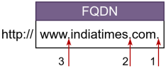
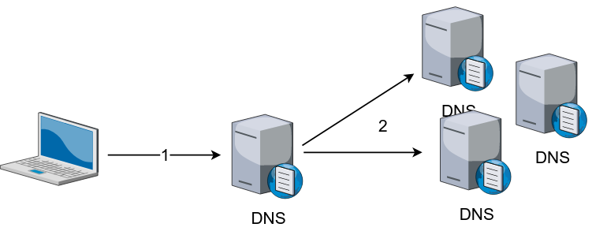
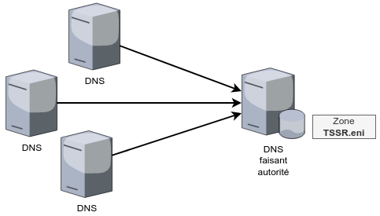
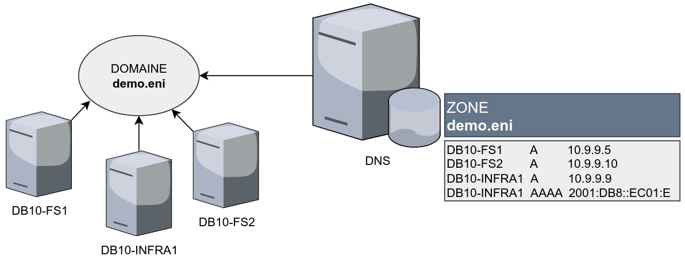
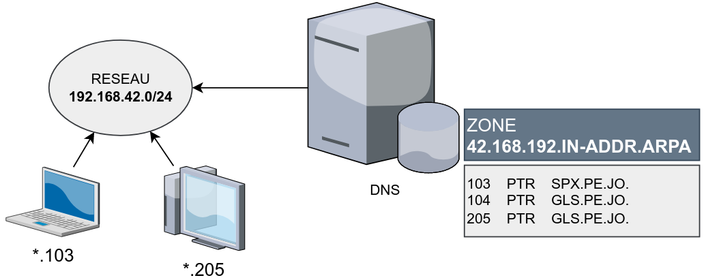

title: notes dns condensé

# ENI TSSR 10 - Services Réseaux Linux

<table class="formateur">
	<tbody>
		<tr>
			<th scope="row">Cours ENI </th>
			<td>du 08/08 au 12/08/2022</td>
		</tr>
		<tr>
			<th scope="row">Formateur</th>
			<td>François LE NALIO</td>
		</tr>
	</tbody>
</table>

[TOC]


## 5. Service DNS
### 5.1 Fonctionnement
DNS (Domain Name System) est un protocole standardisé par l'IETF (*Internet Engineering Task Force*).

#### Utilité

Son premier rôle est de donner des correspondances entre des noms d'hôtes pleinement qualifiés (FQDN Fully Qualified Domain Name) et la ou les adresses IP associées.

Le service DNS permet aussi :

- de donner le nom associé à une adresse ip connue (**résolution inverse**)
- d'indiquer quels hôtes fournissent un service donné (**résolution de services**)
- d'indiquer quels sont le ou les serveurs de messagerie d'un domaine cible.

#### Structure de nommage
La structure de nommage est arborescente.

[](.ressources/img/nommage-dns.png){:target="_blank"} 

<table>
	<thead>
		<tr><th colspan="2" class="horiz-align-middle">Structure</th></tr>
	</thead>
	<tbody>
		<tr>
			<th>. (1)</th>
			<td>Le point par lequel se termine tout nom de domaine.<br>Représente la <b>racine de l'espace de nom DNS</b></td>
		</tr>
		<tr>
			<th>com.</th>
			<td>Nom de domaine, sous-domaine du domaine racine</td>
		</tr>
		<tr>
			<th>. (2)</th>
			<td>Caractère de séparation entre domaines</td>
		</tr>
		<tr>
			<th>indiatimes.com</th>
			<td>Nom de domaine, sous-domaine du domaine "com."</td>
		</tr>
		<tr>
			<th>. (3)</th>
			<td>Caractère de séparation entre le nom du domaine et le nom d'un hôte de ce domaine</td>
		</tr>
		<tr>
			<th>www.indiatimes.com</th>
			<td>Nom d'hôte pleinement qualifié</td>
		</tr>
	</tbody>
</table>

#### Contexte et limite de résolution de nom de domaines
La résolution de nom de domaine est utilisée sur le réseau public Internet pour référencer des ressources de ce réseau. Un ensemble de domaines publics de 1er niveau sont administrés par l'IANA (*Internet Assigned Numbers Authority*) et des entités sont chargées de leur gestion.

Le protocole DNS peut aussi être utilisé pour la résolution de domaines sans suffixes publics, non résolvables par les serveurs DNS Internet mais pouvant être résolus en interne.

Lors du choix de création d'un nom de domaine pour y référencer des hôtes, on détermine si ce nom ne pourra être résolu qu'en interne (suffixe non public) ou si celui-ci doit pouvoir être résolu globalement (enregistrement d'un nom de domaine public auprès d'un bureau d'enregistrement *registrar*).

**Exemples**

- *ma-super-entreprise.bzh* : Nom de domaine utilisé pour référencer les services de mon entreprise accessibles depuis Internet.
- *enigmes.corp* : Nom de domaine propre à mon entreprise dans lequel son tréférencées les ressources hébergées et accessibles uniquement localement dans l'entreprise.

#### Besoins et types de serveurs DNS
Lors du déploiement d'un service DNS, celui-ci peut être configuré pour :
	
- Résoudre les requêtes clientes relatives à tout domaine / résolveur DNS complet
- Etre source d'information pour un ou plusieurs domaines ciblés / serveur faisant autorité

L'implémentation et la configuration du service est distincte en fonction de l'utilisation de celui-ci.

#### Le serveur DNS résolveur complet

<a href=".ressources/img/dns-resolver-complet.png" target="_blank">
	
</a>

- Le DNS résolveur est le service chargé de répondre aux requêtes des clients (1)
- Pour y répondre il fait appel à d'autres serveurs DNS (2)
- **Il n'est pas source d'information de domaine.**

Le serveur DNS faisant autorité est abordé au point 7.1 du cours.

### 5.2 Caractéristiques du serveur DNS résolveur

Un serveur DNS complet fait appel aux services d'autres serveur DNS pour résoudre les requêtes qui lui sont adressées.

Par défaut, il connaît les noms et adresses IP des **serveurs racines**. Il leur adresse des **requêtes itératives** (càd qui remontent la chaîne de serveurs DNS secondaires jusqu'à trouver celui qui saura resoudre la requête) afin de résoudre les noms qu'il doit résoudre. Ces requêtes itératives lui permettent de contacter ensuite successivement un ensemble de serveurs faisant autorité pour remonter au serveur de l'espace de noms donné.

Il est possible de configurer des **serveurs redirecteurs** afin de limiter les échanges nécessaires à la résolution de noms. Lorsqu'un **redirecteur inconditionnel** est configuré, le serveur lui adresse des **requêtes récursives** afin de résoudre les noms demandés par ses clients.

La configuration d'un **redirecteur conditionnel** permet d'indiquer pour un espace de nom donné (la condition) le serveur à qui adresser la requête récursive de résolution.

Le serveur conserve en mémoire **cache** les réponses aux requêtes de résolution qu'il a transmises à ses clients. La **durée de conservation en cache** (**TTL** Time To Live) est définie par les serveurs faisant autorité, elle est subie par les serveurs DNS résolveur.

### 5.3 Configuration d'un DNS Resolveur

<table>
	<tr><th>Nom du paquet</th><td>bind9</td></tr>
	<tr><th>Fichier de configuration</th><td>/etc/bind/named.conf</td></tr>
	<tr><th>Nom du service</th><td>bind9</td></tr>
	<tr><th class="vert-align-top">Commandes</th><td>named-checkconf<br>named-checkzone<br>rndc</td></tr>
	<tr><th>Fichier journal</th><td>/var/log/syslog</td></tr>
</table>

#### 5.3.1 Configuration initiale de bind9 sous Debian

La configuration illustrée ci-après résulte d'une installation de Bind9 sous Debian 10 depuis les dépôts officiels.
Le fichier de configuration principal renvoie vers 3 fichiers dans lesquels dsont répartis les différentes directives de configuration du service.


```sh 
# dans /etc/bind/named.conf 
# [...]

# Configuration des options
# Le fichier contient :
# 		options { directory "/vcb"/; } [...]
include /etc/bind/named.conf.options;

# Configuration des zones hébergées localement
# Le fichier contient :
# 		zone "demo.eni" { [...] }
include /etc/bind/named.conf.local;

# Configuration des zones par défaut
# Le fichier contient :
# 		zone "localhost" { [...] }
include /etc/bind/named.conf.default-zones;

# [...]
```

#### 5.3.2 Fichiers de configuration d'un service DNS Résolveur

Fichier **/etc/bind/named.conf**

```c  
// rsxclts = réseaux des postes clients de l'entreprise
// acl (or access control statement) defines groups of hosts which can then be permitted or denied access to the nameserver. 
acl rsxclts { 127.0.0.0/8; 192.168.53.0/24; 192.168.1.0/24; };

include /etc/bind/named.conf.options;
include /etc/bind/named.conf.local;
include /etc/bind/named.conf.default-zones;
```

Fichier **/etc/bind/named.conf.options**

```c 
options {
	// Répertoire de travail de Bind9 
	directory "/var/cache/bind";

	// Redirection exclusive (pas d'appel aux racines en cas d'indisponibilité)
	// vers les serveurs Quad9 
	forward only;
	forwarders { 9.9.9.9; };

	// Restriction des hôtes auxquels répond le serveur 
	allow-query { rsxclts; };
	// Restriction des hôtes autorisés à adresser des requêtes récursives au serveur 
	allow-recursion { rsxclts; };

	// Communication DNSSEC désactivée
	dnssec-enable no;
	dnssec-validation no;

	// Information de version non communiquée
	version none;
};
```

Fichier **/etc/bind/named.conf.default-zones** (préconfiguré)

```c 
// RFC 1912
zone "localhost" {
	type master;
	file "/etc/bind/db.local";
};
zone "127.in-addr.arpa" {
	type master;
	file "/etc/bind/db.127";
};
zone "0.in-addr.arpa" {
	type master;
	file "/etc/bind/db.0";
};
zone "255.in-addr.arpa" {
	type master;
	file "/etc/bind/db.255";
};
```

Les fichiers de zones ciblés dans l'exemple de configuration sont présents par défaut suite à l'installation de bind9.

#### 5.3.3 Configuration de Redirecteur Conditionnel
Pour configurer un redirecteur conditionnel, une zone typée *forward* doit être ajoutée à la configuration de Bind9 dan sle fichier **/etc/bind/named.conf.local**, comme dans l'exemple suivant :

```cs 
zone macharmantevoisine.eni {
	type forward;
	forward only;
	forwarders { 10.0.0.53; };
};
```

#### 5.3.4 Ressources Complémentaires
La documentation de référence de Bind9 fournit la liste ehaustive de ses directives et options de configuration de Bind9. 

**https://ftp.isc.org/isc/bind9/cur/9.11/doc/arm/Bv9ARM.ch06.html**

<table>
	<tr>
		<td width="100"></td>
		<td>NEXT: <b>Atelier 5. Configurer un service DNS résolveur</b></td>
	</tr>
</table>

### 7.1 Caractéristiques du serveur DNS faisant autorité
#### 7.1.1 Le serveur DNS faisant autorité
- Il est source d'information pour un ou plusieurs domaines
- A ce titre, il est interrogé par des serveurs DNS résolveurs pour résoiudre des noms de son domaine hébergé ou de domaines enfants.
- Il peut inscrire des informations dans la zone du domaine hébergé ou ne disposer que d'une copie de la zone.

<a href=".ressources/img/dns-autorite.png" target="_blank">
	
</a>

#### 7.1.2 Les notions de "zone"
Une **zone** rassemble un ensemble d'éléments ayant une caractéristique commune. Cette caractéristique peut être une partie du nom de domaine ou un réseau ip d'appartenance.

Il existe 2 types de zones: la **zone directe**, la **zone inverse**.

- Une **zone directe** référence des équipements appartenant à un **même nom de domaine**.

<a href=".ressources/img/dns-zone-directe.png" target="_blank">
	
</a>


- Une **zone inverse** référence des équipements appartenant à un **même réseau logique**.

<a href=".ressources/img/dns-zone-inverse.png" target="_blank">
	
</a>


#### 7.1.3 Les enregistrements
Les informations ou données d'une zone sont stockées sous forme d'**enregistrements**. 

Les principaux enregistrements sont :

| Type | Utilité |
|:-----|:--------|
| **A**    | Resolves hostnames to IPv4 addresses |
| **AAAA** | Resolves hostnames to IPv6 addresses |
| **MX**   | Record for the location of the mail server for that domain |
| **NS**   | List name servers for a domain.<br>Identifie par un **FQDN résolvable** les serveurs qui disposent d'un exemplaire de la zone et qui font autorité pour celle-ci.|
| **CNAME**| Creates an alias |
| **SOA**  | Displays who has authority for a domain.<br>Contient les caractéristiques de la zone, identifie par un **FQDN résolvable** le serveur qui peut y écrire. |
| **SRV**  | Service Record<br>Correspondance entre un type de service et le FQDN du serveur le fournissant |
| **PTR**  | Resolves IPv4 addresses to hostnames.<br>Enregistrement uniquement présent dans les zones inverses. |
| **RP**   | Who is responsible for administration | 
| **HINFO**| Host information | 
| **TXT**  | Simple text record may be used for comments |

#### 7.1.4 Serveur primaire ou secondaire
Un serveur faisant autorité pour une zone peut être **source d'information et de modification** de celle-ci. Il peut dans ce cas écrire dans la zone pour y ajouter des enregistrements, en modifier ou en supprimer.

Généralement un seul serveur dispose de ces privilèges sur une zone, c'est le **serveur primaire** de celle-ci. Le serveur primaire d'une zone est également appelé *serveur maître* de celle-ci.

Alternativement, un serveur faisant autorité pour une zone peut **ne disposer que d'une copie** de celle-ci. Il a récupéré cette zone et récupère ses mises à jour auprès d'un serveur primaire de celle-ci. **Il ne peut pas y apporter de modification**. Ce serveur est un **serveur secondaire** de la zone aussi dénommé *serveur esclave* de cette zone.

### 7.2 Configuration d'un service DNS faisant autorité
Un serveur **bind9** faisant autorité doit disposer de 2 éléments: la **configuration** et les **données**.

<table>
	<tr>
		<th rowspan="2" class="vert-align-top">Configuration</th>
		<td>/etc/bind/named.conf.local</td>
	</tr>
	<tr>
		<td><pre>zone eni.demo { file "db.eni.demo"; };</pre></td>
	</tr>
	<tr>
		<th rowspan="2" class="vert-align-top">Données</th>
		<td>/var/cache/bind/db.eni.demo</td>
	</tr>
	<tr>
		<td><pre>$TTL 86400<br>@ IN SOA dns1.eni.demo.<br>contact.eni.demo. (<br>    20191002 ; serial<br>[...]</pre></td>
	</tr>
</table>

Les fichiers de configuration sont présentés dans ce chapitre. Les fichiers de zone sont présentés dans le chapitre suivant.


#### 7.2.1 Configuration d'un serveur primaire
Exemple de configuration d'une **zone directe** :

```sh
# vi /etc/bind/named.conf.local 

# Déclaration de la zone directe principale
# en chargeant le fichier db.eni.demo 
zone "eni.demo" {
	type master;
	file "db.eni.demo";

	# Autorisation du transfert de zone 
	allow-transfert { 10.11.0.53; };
};
```

Exemple de configuration d'une **zone inverse** :

```sh 
# vi /etc/bind/named.conf.local

# Déclaration de la zone inverse principale
# en chargeant le fichier db.192.168.42.inv 
zone "42.168.192.in-addr.arpa" {
	type master;
	file "db.192.168.42.inv";
};
```


<table class="warning-table">
	<tr>
		<td width="100"></td>
		<td>Les fichiers de configuration de zone précédemment présentés requièrent que les fichiers de zone correspondats <i>db.eni.demo</i> et <i>db.192.168.42.inv</i> existent et qu'ils contiennent toutes les informations concernant ces zones.<br><br>
		Des exemples de ces fichiers de zone sont présentés en annexe (chap. 8)</td>
	</tr>
</table>

Des exemples de fichiers de zone sont présentés dans le prochain chapitre

#### 7.2.2 Configuration d'un serveur secondaire
Exemple de fichier de configuration d'un serveur secondaire d'une zone directe :

```sh
# vi /etc/bind/named.conf.local

# Déclaration de la zone directe secondaire 
# à partir du serveur principal 
# en chargeant le fichier db.eni.demo
zone "eni.demo" {
	type slave;
	masters { 10.5.3.10; };
	file "db.eni.demo";

	# Autorisation des requêtes par le client
	allow-query { any; };
};
```

### 7.3 Les fichiers de zone
Exemple de **fichier de zone directe**:

```
; fichier de zone du domaine eni-ecole.bzh 
; point-virgule = commentaire de debut / en cours de ligne 

; Directives de configuration s'appliquant à
; tous les enregistrements suivants
$ORIGIN eni-ecole.bzh.
$TTL 86400

; Enregistrements SOA (who has authority) et NS (name servers) relatifs à la zone
@ SOA dns1.eni-ecole.bzh. hostmaster.eni-ecole.bzh. (
	2019100253 ; serial
	86400      ; refresh 1 day 
	7200       ; retry 2 hours
	3600000    ; exemplaire
	3600       ; negative TTL
);     

@ NS dns1.eni-ecole.bzh.
@ NS dns2.eni-ecole.bzh.
 
; Autres enregistrements de la zone 
dns1   A      44.0.5.3
dns1   AAAA   2001:0db8::ec01:e 
dns2   AAAA   2001:0db8::ec01:e53 
www    A      44.0.0.80
rdsgw  A      35.12.13.15
smtp   A      44.0.0.25
ww     CNAME  www.eni-ecole.bzh.
wwww   CNAME  www.eni-ecole.bzh.
@      MX     10  smtp.eni-ecole.bzh.
@      MX     20  mc0.mail.ovh.net.
``` 

Exemple de **fichier de zone inverse** :

```
; Directives de configuration s'appliquant 
; à tous les enregistrements suivants 

; zone inverse pour le réseau 192.168.42.0/24

$TTL 86400

; Enregistrements SOA (who has authority) et NS (name servers) relatifs à la zone
@ SOA dns1.eni.demo. hostmaster.eni.demo. (
	2019100253 ; serial
	2019100253 ; serial
	86400      ; refresh 1 day 
	7200       ; retry 2 hours
	3600000    ; exemplaire
	3600       ; negative TTL
);     

@ NS dns1.eni.demo.

; Autres enregistrements de la zone
1   PTR  srv01.eni.demo.
2   PTR  srv02.eni.demo.
13  PTR  lucky.eni.demo.
254 PTR  gw42.infra.eni.
```

<table>
	<tr>
		<td></td>
		<td>NEXT: <b>Atelier 7 - Configurer un service DNS faisant autorité</b></td>
	</tr>
</table>

<link rel="stylesheet" type="text/css" href=".ressources/css/bootstrap.min.css">
<link rel="stylesheet" type="text/css" href=".ressources/css/style.css">