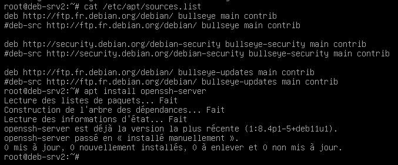
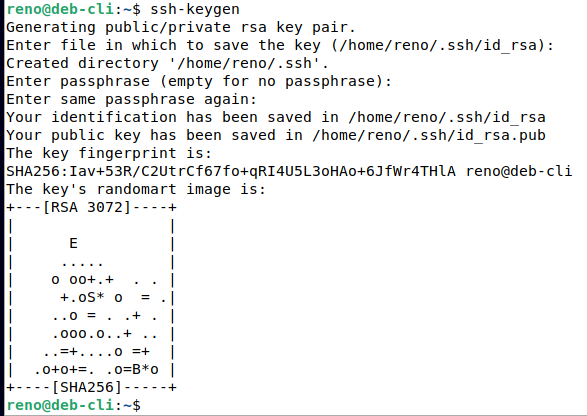
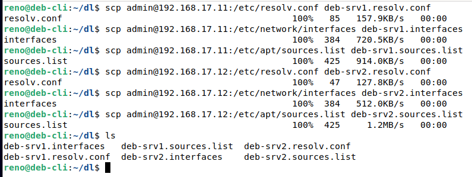
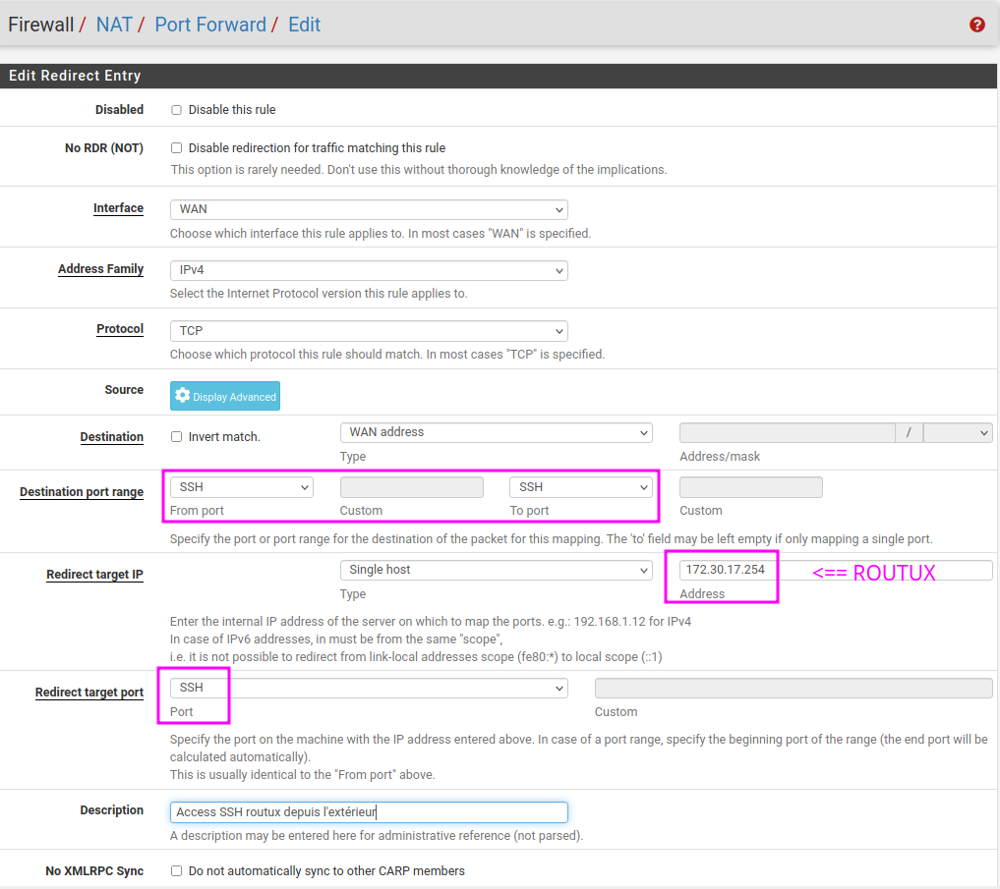

title: tp04 - ssh

# ENI TSSR 10 - Services Réseaux Linux

[TOC]

## TP 04 - Configuration du service ssh
### Objectifs

- Installer et configurer le service SSH 

### Résumé des paramètres

<table>
    <thead>
    <tr>
        <th style="background-color:grey;color:white;font-weight: bold">Nom VM :</th>
        <th>deb-cli</th>
        <th>deb-srv1</th>
        <th>deb-srv2</th>
        <th>routux</th>
        <th>pfSense</th>
    </tr>
    </thead>
    <tbody>
    <tr>
        <th>Type</th>
        <td>Poste client</td>
        <td>Serveur</td>
        <td>Serveur</td>
        <td>Routeur</td>
        <td>pfSense</td>
    </tr>
    <tr>
        <th>OS</th>
        <td>Debian 11 x64</td>
        <td>Debian 11 x64</td>
        <td>Debian 11 x64</td>
        <td>Debian 11 x64</td>
        <td>pfSense</td>
    </tr>
    <tr>
        <th>RAM</th>
        <td>2048 MB</td>
        <td>1024 MB</td>
        <td>1024 MB</td>
        <td>1024 MB</td>
        <td>1024 MB</td>
    </tr>
    <tr>
        <th>CPU</th>
        <td> 2x1</td>
        <td> 1x1</td>
        <td> 1x1</td>
        <td> 1x1</td>
        <td> 1x1</td>
    </tr>
    <tr>
        <th>HDD</th>
        <td> 1x 20 Go</td>
        <td> 1x 20 Go</td>
        <td> 1x 20 Go</td>
        <td> 1x 20 Go</td>
        <td> 1x 20 Go</td>
    </tr>
    <tr>
        <th>Carte réseau<br>(Custom)</th>
        <td><b>VMNet4</b><br>(Host-Only)</td>
        <td><b>VMNet6</b><br>(Host-Only)</td>
        <td><b>VMNet6</b><br>(Host-Only)</td>
        <td><b>VMNet4</b> (HO)<br><b>VMNet6</b> (HO)<br><b>VMNet2</b> (HO)</td>
        <td><b>Bridged</b><br><b>VMNet2</b></td>
    </tr>
    <tr>
        <th>Interface</th>
        <td>ens33 (AE:F6)</td>
        <td>ens33 (9B:32)</td>
        <td>ens33 (4D:6E)</td>
        <td>ens33 (EE:8D)<br>ens35 (84:63)<br>ens36 (F3:45)</td>
        <td>ens33 (A0:34)<br>ens35 (A0:3E)</td>
    </tr>
    <tr>
        <th>Réseau</th>
        <td>172.18.17.0 /24</td>
        <td>192.168.17.0 /24</td>
        <td>192.168.17.0 /24</td>
        <td>172.18.17.0 /24<br>192.168.17.0 /24<br>172.30.17.0 /24</td>
        <td>192.168.1.0 /24<br>(au lieu de 88.44.22.0)<br>172.30.17.0 /24</td>
    </tr>
    <tr>
        <th>IP</th>
        <td>172.18.17.10</td>
        <td>192.168.17.11</td>
        <td>192.168.17.12</td>
        <td>172.18.17.254<br>192.168.17.254<br>172.30.17.254</td>
        <td>192.168.1.22<br>(au lieu de 88.44.22.17)<br>172.30.17.1</td>
    </tr>
    <tr>
        <th>Passerelle</th>
        <td>172.18.17.254</td>
        <td>192.168.17.254</td>
        <td>192.168.17.254</td>
        <td>172.18.17.254<br>192.168.17.254<br>172.30.17.254</td>
        <td>192.168.1.1<br>(au lieu de 88.44.22.254)</td>
    </tr>
    <tr>
        <th>Utilisateurs</th>
        <td> root (toor)<br>reno (reno)</td>
        <td> root (toor)<br>reno (reno)</td>
        <td> root (toor)<br>reno (reno)</td>
        <td> root (toor)<br>reno (reno)</td>
        <td> root (toor)</td>
    </tr>
    <tr>
        <th>Env. graphique ?</th>
        <td>Oui</td>
        <td>Non</td>
        <td>Non</td>
        <td>Non</td>
        <td>Non</td>
    </tr>
    </tbody>
</table>

**Note**: _pfSense est censé être branché sur le réseau qui sert de porte d'entrée sur Internet (le modem du FAI). Pour que ce labo fonctionne chez moi, je dois remplacer les ip faisant référence au FAI de l'ENI (*88.44.22.17* et *88.44.22.254*), par les IP de mon réseau FAI (*192.168.1.22* et *192.168.1.1*)._

### Cartographie Réseau
C'est la version avec les ip du réseau FAI "maison", et non plus celles données dans le TP original (FAI ENI). 
[](.ressources/img/tp03-carto2.png){:target="_blank"} 


### Instructions
#### 1. Installation du serveur SSH sur tous les serveurs Debian

- Configurer le fichier **/etc/apt/sources.list** pour qu'il contiennent les lignes suivantes :
```
deb http://ftp.fr.debian.org/debian/ bullseye main contrib 
deb http://ftp.fr.debian.org/debian/ bullseye-updates main contrib 
deb http://security.debian.org/debian-security bullseye-security main contrib 
```

- Mettre à jour le gestionnaire de dépendances 
```sh
$ sudo apt update 
$ sudo apt upgrade
```

- Vérifier l'état d'installation du paquet **openssh-server**, l'installer au besoin.
```sh 
$ sudo apt install openssh-server
```

[](.ressources/img/tp04-01.png){:target="_blank"} 

#### 2. Configuration du service SSH
- Installer **terminator** sur le client. On utilisera cette machine pour centraliser l'administration des serveurs.
```
# apt install terminator
```

- Configurer le service SSH pour permettre la connection aux différents serveurs sans avoir à saisir de mot de passe (échange de clés). Côté client :

```
$ sudo apt install openssh-client
```

##### Création de clé

```
$ ssh-keygen
```

[](.ressources/img/tp04-02.png){:target="_blank"} 

##### Copie de la clé sur le serveur distant

Le serveur distant doit disposer de la clé publique de l'utilisateur pour initier et valider la connexion. On utilise pour cela la commande `ssh-copy-id`. Par défaut le daemon **sshd** empêche la connexion en tant que **root** avec le mot de passe mais autorise les connexions avec les clé RSA.

On va d'abord crée un utilisateur **admin** faisant partie du groupe **sudo** sur chaque serveur.

```
# apt install sudo       # si pas déjà installé
# useradd -m -g sudo -s /bin/bash admin 
# passwd admin <<< "admin
admin"
```

On copie ensuite la clé SSH:

```sh
$ ssh-copy-id admin@192.168.17.11
$ ssh-copy-id admin@192.168.17.12
```

[](.ressources/img/tp04-03.png){:target="_blank"} 

##### Vérifications
[](.ressources/img/tp04-04.png){:target="_blank"} 


#### 3. Copie sécurisée
- Sur le client, utiliser la commande `scp` pour copier les fichiers de configuration des serveurs Debian (interfaces, resolv.conf, sources.list).
```sh
$ scp admin@192.168.17.11:/etc/resolv.conf srv1-resolv.conf
$ scp admin@192.168.17.11:/etc/apt/sources.list srv1-sources.list
$ scp admin@192.168.17.11:/etc/network/interfaces srv1-interfaces
```

[](.ressources/img/tp04-05.png){:target="_blank"} 

#### Bonus
- Faire en sorte que le serveur SSH de **routux** soit accessible depuis votre poste physique en passant par votre serveur pfSense (besoin de l'ip du poste formateur: **10.53.101.37**, le login est **user17**, mdp **secret**)
- Tester : depuis une session physique, se connecter en SSH sur le serveur formateur d'où on se connectera en ssh vers la machine **routux**.

**Notes**: je ne sais pas si c'est reproductible à la maison...

1. Sur la machine hôte Windows 10, dans git bash, generer les clés ssh 
```
$ ssh-keygen.exe -t ed25519
```

2. Copier le ssh_id
```
$ ssh-copy-id user17@10.53.101.37
yes
secret
```

3. Se connecter en ssh à cette machine 
```
rlizot2019@53SE29-21XF703:~$ ssh user17@10.53.101.37
user17@srv-formateur:~$
```

4. En faisant un `ip a` on peut voir que cette machine à une interface en 88.44.22.254/24. C'est même l'interface qui permet de sortir de notre lab. 
[](.ressources/img/tp04-06.png){:target="_blank"} 

5. Il y a des chances qu'on puisse alors pinguer notre pfSense qui a une interface en 88.44.22.17 (WAN em0). Problème: pour l'instant, la machine en \*.30 est juste une machine sortante pour mon reseau. On va avoir besoin de configurer notre pfSense pour qu'il transfert le port SSH depuis son adresse publique vers mon port routux. De cette façon je pourrais me connecter à routux depuis l'extérieur.

7. Donc, dans l'interface web de pfSense, menu **Firewall** > **NAT** > **Port Forward** > ajouter une règle pour le ssh venant de l'extérieur vers routux 
[](.ressources/img/tp04-07.png){:target="_blank"} 

8. Pour vérifier, on se connecte en ssh sur le poste formateur, puis en ssh vers la passerelle routux en 88.44.22.17. On a donc fait un rebond : le poste d'origine ne connait pas le réseau cible, mais en se connectant à un réseau qui connaît la cible, on peut faire plusieurs SSH. Ici, le port forwarding permet de transferer le flux ssh vers le port 172.30.30.254 lors que c'est le 88.44.17.254 qui est demandé (?!).


#### Bonus 2000
- Faire en sorte que la connection depuis Putty vers le serveur formateur ne demande pas de mot de passes et rebondisse directement sur votre serveur routux qui est derrière votre pfSense.

Dans **git bash** :
```
rlizot2019@53SE29-21XF703:~$ ssh -J user17@10.53.101.37 reno@88.44.22.17 
reno@routux:~$
```

**man ssh**

<blockquote>
    <p><b>-J <u>destination</u></b></p>
    <p>Connect to the target host by first making a ssh connection to the
       jump host described by destination and then establishing a TCP for‐
       warding to the ultimate destination from there.  Multiple jump hops
       may be specified separated by comma characters.  This is a shortcut
       to specify a ProxyJump configuration directive.  Note that configu‐
       ration directives supplied on the command-line generally apply to
       the destination host and not any specified jump hosts.  Use
       ~/.ssh/config to specify configuration for jump hosts.</p>
</blockquote>

La commande dit qu'on se ssh en faisant des rebond (*jump*) sur le premier vers le second.

<link rel="stylesheet" type="text/css" href=".ressources/css/bootstrap.min.css">
<link rel="stylesheet" type="text/css" href=".ressources/css/style.css">
