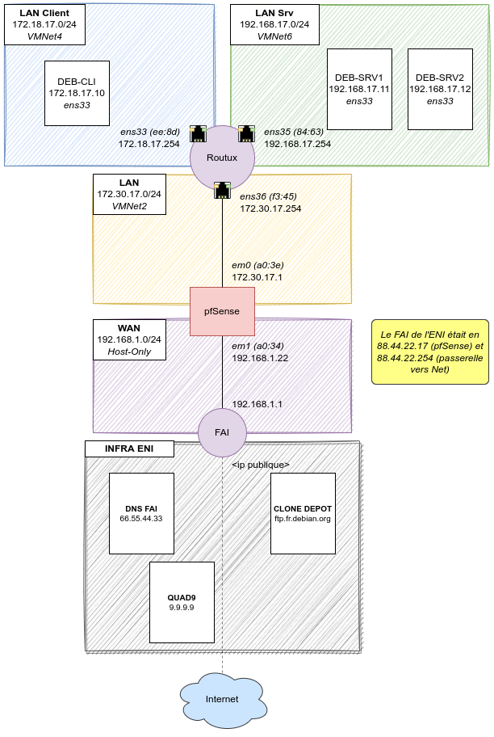
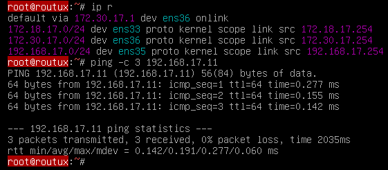
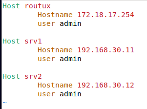

title: tp06 - DHCP

# ENI TSSR 10 - Services Réseaux Linux

[TOC]

## TP 06 - Configuration d'un service DHCP isc-dhcp-server
### Objectifs

- Installer et configurer le **service relai DHCP** de l'ISC.
- Installer et configurer le service *isc-dhcp-server*.
- Analyser les échanges entre un client DHCP, un relais DHCP et un serveur DHCP.
- Gérer le lancement des composants DHCP via leur bianire ou en tant que service. 

### Résumé des paramètres

<table>
    <thead>
    <tr>
        <th style="background-color:grey;color:white;font-weight: bold">Nom VM :</th>
        <th>deb-cli</th>
        <th>deb-srv1</th>
        <th>deb-srv2</th>
        <th>routux</th>
        <th>pfSense</th>
    </tr>
    </thead>
    <tbody>
    <tr>
        <th>Type</th>
        <td>Poste client</td>
        <td>Serveur</td>
        <td>Serveur</td>
        <td>Routeur</td>
        <td>pfSense</td>
    </tr>
    <tr>
        <th>OS</th>
        <td>Debian 11 x64</td>
        <td>Debian 11 x64</td>
        <td>Debian 11 x64</td>
        <td>Debian 11 x64</td>
        <td>pfSense</td>
    </tr>
    <tr>
        <th>RAM</th>
        <td>2048 MB</td>
        <td>1024 MB</td>
        <td>1024 MB</td>
        <td>1024 MB</td>
        <td>1024 MB</td>
    </tr>
    <tr>
        <th>CPU</th>
        <td> 2x1</td>
        <td> 1x1</td>
        <td> 1x1</td>
        <td> 1x1</td>
        <td> 1x1</td>
    </tr>
    <tr>
        <th>HDD</th>
        <td> 1x 20 Go</td>
        <td> 1x 20 Go</td>
        <td> 1x 20 Go</td>
        <td> 1x 20 Go</td>
        <td> 1x 20 Go</td>
    </tr>
    <tr>
        <th>Carte réseau<br>(Custom)</th>
        <td><b>VMNet4</b><br>(Host-Only)</td>
        <td><b>VMNet6</b><br>(Host-Only)</td>
        <td><b>VMNet6</b><br>(Host-Only)</td>
        <td><b>VMNet4</b> (HO)<br><b>VMNet6</b> (HO)<br><b>VMNet2</b> (HO)</td>
        <td><b>Bridged</b><br><b>VMNet2</b></td>
    </tr>
    <tr>
        <th>Interface</th>
        <td>ens33 (AE:F6)</td>
        <td>ens33 (9B:32)</td>
        <td>ens33 (4D:6E)</td>
        <td>ens33 (EE:8D)<br>ens35 (84:63)<br>ens36 (F3:45)</td>
        <td>ens33 (A0:34)<br>ens35 (A0:3E)</td>
    </tr>
    <tr>
        <th>Réseau</th>
        <td>172.18.17.0 /24</td>
        <td>192.168.17.0 /24</td>
        <td>192.168.17.0 /24</td>
        <td>172.18.17.0 /24<br>192.168.17.0 /24<br>172.30.17.0 /24</td>
        <td>192.168.1.0 /24<br>(au lieu de 88.44.22.0)<br>172.30.17.0 /24</td>
    </tr>
    <tr>
        <th>IP</th>
        <td>172.18.17.10</td>
        <td>192.168.17.11</td>
        <td>192.168.17.12</td>
        <td>172.18.17.254<br>192.168.17.254<br>172.30.17.254</td>
        <td>192.168.1.22<br>(au lieu de 88.44.22.17)<br>172.30.17.1</td>
    </tr>
    <tr>
        <th>Passerelle</th>
        <td>172.18.17.254</td>
        <td>192.168.17.254</td>
        <td>192.168.17.254</td>
        <td>172.18.17.254<br>192.168.17.254<br>172.30.17.254</td>
        <td>192.168.1.1<br>(au lieu de 88.44.22.254)</td>
    </tr>
    <tr>
        <th>Utilisateurs</th>
        <td> root (toor)<br>reno (reno)</td>
        <td> root (toor)<br>reno (reno)</td>
        <td> root (toor)<br>reno (reno)</td>
        <td> root (toor)<br>reno (reno)</td>
        <td> root (toor)</td>
    </tr>
    <tr>
        <th>Env. graphique ?</th>
        <td>Oui</td>
        <td>Non</td>
        <td>Non</td>
        <td>Non</td>
        <td>Non</td>
    </tr>
    </tbody>
</table>

**Note**: _pfSense est censé être branché sur le réseau qui sert de porte d'entrée sur Internet (le modem du FAI). Pour que ce labo fonctionne chez moi, je dois remplacer les ip faisant référence au FAI de l'ENI (*88.44.22.17* et *88.44.22.254*), par les IP de mon réseau FAI (*192.168.1.22* et *192.168.1.1*)._

### Cartographie Réseau
C'est la version avec les ip du réseau FAI "maison", et non plus celles données dans le TP original (FAI ENI). 
[](.ressources/img/tp06-carto.png){:target="_blank"} 


### Instructions
#### 1. Installation du relais DHCP sur ROUTUX
- Installer le package du service relais DHCP de l'ISC
- Ne pas répondre aux questions de l'assistant d'installation

- Identifier le nom des interfaces réseau de **routux** raccordées aux réseaux **LAN-CLIENTS** et **LAN-SERVEURS**
- Tester la communication entre **routux** et **deb-srv1**

- Relancer l'assistant d'installation avec la commande suivante : `# dpkg-reconfigure isc-dhcp-relay`
- Répondre aux questions concernant les interfaces de travail et saisir l'adresse ip de **deb-serv1** comme adresse du serveur DHCP. 


##### Mise en oeuvre

** Installation du paquet, sur ROUTUX**

```sh
# apt search dhcp-relay
# apt install isc-dhcp-relay
```

**Interfaces connectées**

Routux est raccordé aux LAN-CLIENTS via ens33 (ee:8d) @172.18.17.254 & LAN-SERVEURS via ens35 (84:63) @192.168.17.254. (vérif via `ip route`)

Normalement ROUTUX et DEB-SRV1 se ping sans problème.

[](.ressources/img/tp06-01.png){:target="_blank"} 

**Configuration de isc-dhcp-relay**

Sur **routux**, on relance la configuration avec la commande suivante et on lui indique les interfaces de travail (ens33, ens35) et l'ip de **DEB-SRV1** (192.168.17.11) comme adresse de serveur DHCP.

**routux** est connecté au serveur DHCP via son interface **ens35**.

<pre><b># dpkg-reconfigure isc-dhcp-relay</b>

Serveurs DHCP auxquels faire suivre les requêtes de relais DHCP : <b>192.168.17.11</b>
Interface(s) où le relais DHCP sera à l'écoute : <b>ens35</b>
Options supplémentaires pour le démon de relais DHCp : 
</pre>

**Note** là je suis pas sûr ?! Pourquoi on insiste sur le fait qu'il faille plusieurs interfaces alors que la question porte sur l'interface d'écoute de routux ?!


#### 2. Configuration du service `isc-dhcp-server` sur DEB-SRV1


<div class="img-row">
    <div class="img-col">
    <a href=".ressources/img/tp05-01.png" target="_blank">
      
    </a>
  </div>
    <div class="img-col">
      <a href=".ressources/img/tp05-02.png" target="_blank">
        
      </a>
  </div>
</div>

#### 2. Modification de la configuration cliente DNS des postes
- Installer le paquet **dnsutils** sur le poste client **DEB-CLI**.
- Modifier la configuration cliente DNS du poste client **DEB-CLI** afin qu'il interroge **DEB-SRV2**.
- Modifier la configuration cliente DNS des serveurs **DEB-SRV1**, **DEB-SRV2** et **routux** afin qu'ils interrogent **DEB-SRV2**.

##### Mise en oeuvre
- Sur **DEB-CLI**, installation de **dnsutils**
```sh
# apt install dnsutils
```

- Ajouter l'adresse ip de **deb-srv2** comme DNS de **deb-cli**. Par exemple en modifiant la connection via `nmtui` 
[](.ressources/img/tp05-03.png){:target="_blank"} 

- Faire la même chose sur les 2 serveurs et **routux**. On peut modifier directement le fichier **/etc/resolv.conf**.

- **Vérifications**

<div class="img-row">
    <div class="img-col">
    <a href=".ressources/img/tp05-04.png" target="_blank">
      
    </a>
  </div>
    <div class="img-col">
      <a href=".ressources/img/tp05-05.png" target="_blank">
        
      </a>
  </div>
</div>
<div class="img-row">
    <div class="img-col">
    <a href=".ressources/img/tp05-06.png" target="_blank">
      
    </a>
  </div>
    <div class="img-col">
      <a href=".ressources/img/tp05-07.png" target="_blank">
        
      </a>
  </div>
</div>

#### 3. Test de résolution de noms depuis les clients
- Depuis ma **machine physique**, tester la résolution des hôtes *ntp44.ad.campus-eni.fr* et *www.isc.org*. Ces tests ont-ils abouti ? Quelles sont les adresses ip des hôtes requêtés ? 

**Avec le VPN ENI activé**

```
$ host ntp35.ad.campus-eni.fr
ntp35.ad.campus-eni.fr has address 10.35.0.21

$ nslookup ntp44.ad.campus-eni.fr
Server:         10.35.0.3
Address:        10.35.0.3#53

Name:   ntp44.ad.campus-eni.fr
Address: 10.0.0.21

$ host www.isc.org
www.isc.org is an alias for dualstack.osff2.map.fastly.net.
dualstack.osff2.map.fastly.net has address 151.101.122.217
dualstack.osff2.map.fastly.net has IPv6 address 2a04:4e42:1d::729
```

- Depuis le poste client **DEB-CLI**, réitérer ces tests. Qu'indique l'erreur de résolution renvoyée pour *ntp44.ad.campus-eni.fr* et que signifie-t-elle ?

```
$ host ntp35.ad.campus-eni.fr
Host ntp35.ad.campus-eni.fr not found: 3(NXDOMAIN)

$ host www.isc.org
www.isc.org is an alias for dualstack.osff2.map.fastly.net.
dualstack.osff2.map.fastly.net has address 151.101.122.217
dualstack.osff2.map.fastly.net has IPv6 address 2a04:4e42:1d::729
```

L'erreur signifie qu'il ne trouve pas l'hôte. L'adresse fait référence à un domaine qu'il ne connait pas. On voit dans le nslookup qui a fonctionné que la réponse lui ai donné par un serveur DNS interne (10.35.0.3). Or ma VM linux ne le connait pas.

- D'après vous, quel mécanisme votre serveur utilise-t-il actuellement pour résoudre les noms d'hôtes publics ? 

Forward DNS  : when look up a hostname and get an ip in response. A record is used. 
The `host` command will automatically lookup the reverse when given an ip.

#### 4. Configuration de Bind9 pour faire appel aux services de redirecteur
- Sur **DEB-SRV2**, modifier la configuration du service **bind9** afin qu'il fasse appel au **redirecteur** FAI (ayant l'adresse ip **66.55.44.33** dans le TP, mon lab a le DNS **192.168.1.1**) pour résoudre les noms d'hôtes publics.
- Faire un test de résolution de *ntp44.ad.campus-eni.fr* pour vous assurer de la bonne prise en compte du redirecteur précédemment configuré.

**/etc/bind/named.conf.options**

```
forward only;
forwarders {
    192.168.1.1;    # le DNS de mon FAI
    # 66.55.44.33;  # dans le tp original
}
```

**Vérifications**:

Ca ne peut pas marcher dans mon labo car j'utilise mon modem et son DNS. Quoi qu'il arrive, il ne peut pas connaître le domaine cherché car il n'existe qu'à l'ENI. Il faudrait que je créé un domaine localement afin de pouvoir le trouver depuis mon DNS...

J'ai essayé de le trouver à travers le VPN de Rennes. Ca fonctionne sur ma machine physique.

#### Bonus SSH & aliases

**Note**: Concernant SSH, on peut mettre des raccourcis dans le fichier **~/.ssh/config** comme suit :

```sh
# Fichier ~/.ssh/config

Host routux
    Hostname 172.18.17.254
    user admin

Host srv1
    Hostname 192.168.30.11
    user admin

Host srv2
    Hostname 192.168.30.12
    user admin
```

[](.ressources/img/tp05-08.png){:target="_blank"} 


**Usage**

```sh
reno@deb-cli:~$ ssh routux
admin@routux:~$
```

<link rel="stylesheet" type="text/css" href=".ressources/css/bootstrap.min.css">
<link rel="stylesheet" type="text/css" href=".ressources/css/style.css">
