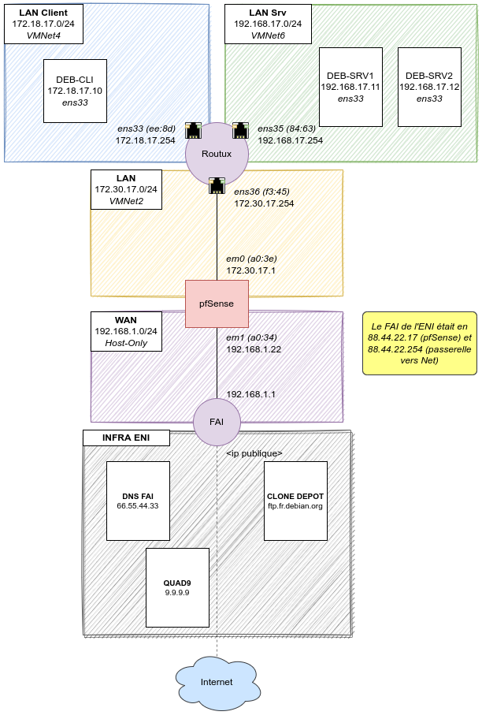

title: tp07 - DNS faisant autorité

# ENI TSSR 10 - Services Réseaux Linux

[TOC]

## TP 07 - Configuration d'un service DNS faisant autorité
### Objectifs

- Configurer un service DNS hébergeur permettant la résolution directe et inverse des zones dont il assure la gestion

**Prérequis**:

- Avoir copié la VM "*Service_reseau_srv_Apache_TSSR.7z*" et l’avoir démarrée

### Résumé des paramètres

<table>
    <thead>
    <tr>
        <th style="background-color:grey;color:white;font-weight: bold">Nom VM :</th>
        <th>deb-cli</th>
        <th>deb-srv1</th>
        <th>deb-srv2</th>
        <th>routux</th>
        <th>pfSense</th>
    </tr>
    </thead>
    <tbody>
    <tr>
        <th>Type</th>
        <td>Poste client</td>
        <td>Serveur</td>
        <td>Serveur</td>
        <td>Routeur</td>
        <td>pfSense</td>
    </tr>
    <tr>
        <th>OS</th>
        <td>Debian 11 x64</td>
        <td>Debian 11 x64</td>
        <td>Debian 11 x64</td>
        <td>Debian 11 x64</td>
        <td>pfSense</td>
    </tr>
    <tr>
        <th>RAM</th>
        <td>2048 MB</td>
        <td>1024 MB</td>
        <td>1024 MB</td>
        <td>1024 MB</td>
        <td>1024 MB</td>
    </tr>
    <tr>
        <th>CPU</th>
        <td> 2x1</td>
        <td> 1x1</td>
        <td> 1x1</td>
        <td> 1x1</td>
        <td> 1x1</td>
    </tr>
    <tr>
        <th>HDD</th>
        <td> 1x 20 Go</td>
        <td> 1x 20 Go</td>
        <td> 1x 20 Go</td>
        <td> 1x 20 Go</td>
        <td> 1x 20 Go</td>
    </tr>
    <tr>
        <th>Carte réseau (Custom)</th>
        <td><b>VMNet4</b> (Host-Only)</td>
        <td><b>VMNet6</b> (Host-Only)</td>
        <td><b>VMNet6</b> (Host-Only)</td>
        <td><b>VMNet4</b> (HO) <b>VMNet6</b> (HO) <b>VMNet2</b> (HO)</td>
        <td><b>Bridged</b> <b>VMNet2</b></td>
    </tr>
    <tr>
        <th>Interface</th>
        <td>ens33 (AE:F6)</td>
        <td>ens33 (9B:32)</td>
        <td>ens33 (4D:6E)</td>
        <td>ens33 (EE:8D) ens35 (84:63) ens36 (F3:45)</td>
        <td>ens33 (A0:34) ens35 (A0:3E)</td>
    </tr>
    <tr>
        <th>Réseau</th>
        <td>172.18.17.0 /24</td>
        <td>192.168.17.0 /24</td>
        <td>192.168.17.0 /24</td>
        <td>172.18.17.0 /24 192.168.17.0 /24 172.30.17.0 /24</td>
        <td>192.168.1.0 /24 (au lieu de 88.44.22.0) 172.30.17.0 /24</td>
    </tr>
    <tr>
        <th>IP</th>
        <td>172.18.17.10</td>
        <td>192.168.17.11</td>
        <td>192.168.17.12</td>
        <td>172.18.17.254 192.168.17.254 172.30.17.254</td>
        <td>192.168.1.22 (au lieu de 88.44.22.17) 172.30.17.1</td>
    </tr>
    <tr>
        <th>Passerelle</th>
        <td>172.18.17.254</td>
        <td>192.168.17.254</td>
        <td>192.168.17.254</td>
        <td>172.18.17.254 192.168.17.254 172.30.17.254</td>
        <td>192.168.1.1 (au lieu de 88.44.22.254)</td>
    </tr>
    <tr>
        <th>Utilisateurs</th>
        <td> root (toor) reno (reno)</td>
        <td> root (toor) reno (reno)</td>
        <td> root (toor) reno (reno)</td>
        <td> root (toor) reno (reno)</td>
        <td> root (toor)</td>
    </tr>
    <tr>
        <th>Env. graphique ?</th>
        <td>Oui</td>
        <td>Non</td>
        <td>Non</td>
        <td>Non</td>
        <td>Non</td>
    </tr>
    </tbody>
</table>

**Note**: _pfSense est censé être branché sur le réseau qui sert de porte d'entrée sur Internet (le modem du FAI). Pour que ce labo fonctionne chez moi, je dois remplacer les ip faisant référence au FAI de l'ENI (*88.44.22.17* et *88.44.22.254*), par les IP de mon réseau FAI (*192.168.1.22* et *192.168.1.1*)._

### Cartographie Réseau
C'est la version avec les ip du réseau FAI "maison", et non plus celles données dans le TP original (FAI ENI). 
{:target="_blank"} 

### Instructions
#### 1. DEB-SRV2 héberge une zone directe
Configurer le serveur DEB-SRV2 pour qu'il héberge une zone directe.

- [ ] Modifier la configuration de Bind9 mise en place à l'atelier 5 afin que votre serveur héberge la zone **tssr.eni**. 

- [ ] Dans votre zone, créer des enregistrements d'hôtes pour DEB-SRV1, DEB-SRV2 et routux (pour ses adresses sur LAN-CLIENTS et LAN-SERVEURS uniquement).

- [ ] Créer un enregistrement d'hôte pour votre appliance pfSense en référençant son adresse sur le réseau VMNet2.  

- [ ] Créer un enregistrement d'hôte pour NS1 pointant vers l'adresse de DEB-SRV2.

- [ ] Créer un enregistrement d'hôte pour www pointant vers l'adresse de votre serveur web. 

- [ ] Créer un alias pour test via NS1 

- [ ] Avant de relancer le service faire un contrôle syntaxique du fichier de zone. En l'absence d'erreur, recharger la configuration de Bind9 au moyen de la commande `rndc reload`.

#### 2. Tests de résolution depuis le poste client Debian
Utiliser la commande **dig** depuis DEB-CLI pour tous les tests de résolution demandés.

- [ ] Faire un test de résolution successivement des enregistrements SOA puis NS de la zone. Ces enregistrements sont-ils corrects ?

- [ ] Faire les tests de résolution des différents enregistrements créés précédemment 

- [ ] Faire un test de connectivité avec les serveurs DEB-S1 et DEB-S2, d’abord avec le nom FQDN puis uniquement avec le nom d’hôte 

- [ ] Si besoin adapter la configuration DHCP pour permettre la résolution des enregistrements de votre domaine sans avoir à préciser le nom de domaine

#### 3. Configuration de zones inverses

- [ ] Modifier la configuration du service DNS de DEB-S2 afin qu’il prenne en charge la résolution inverse pour les réseaux LAN Clients et LAN Serveurs.

- [ ] Pour LAN Clients, y inscrire un enregistrement inverse pour RouTux

- [ ] Pour LAN Serveurs, les adresses IP de DEB-S1, DEB-S2 et RouTux devront être résolues

- [ ] Faire les tests de résolution depuis Cli-db-10

<link rel="stylesheet" type="text/css" href=".ressources/css/bootstrap.min.css">
<link rel="stylesheet" type="text/css" href=".ressources/css/style.css">
