title: tp04 - Partage AD

# ENI TSSR 11 - MSP 2 - Services Réseaux Hétérogènes

[TOC]

## Atelier 4 - Partage en domaine AD

En partant d'une infrastructure de domaine Active Directory existante, vous allez ajouter un espace disque sécurisé que vous partagerez en respectant les préconisations Microsoft.

### Prérequis

- L'atelier 3 doit avoir été réalisé.

### Résumé des paramètres

[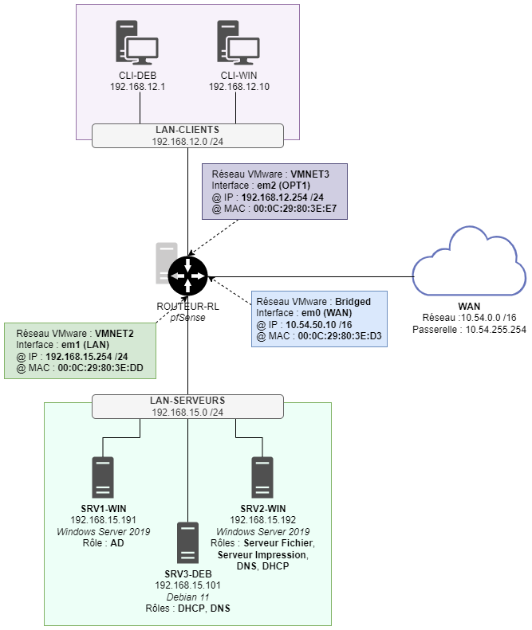](.ressources/img/carto.png){:target="_blank"}

<table class="table table-hover">
	<thead>
		<tr>
			<th>Service</th>
			<th>Membres</th>
			<th>id</th>
			<th>mdp</th>
		</tr>
	</thead>
	<tbody>
		<tr>
			<td>Direction</td>
			<td>Christian Hef Pauline Atron Pascaline Résident</td>
			<td>chef patron president</td>
			<td class="vert-align-mid">!User123</td>
		</tr>
		<tr>
			<td>Comptabilité</td>
			<td>Bruno Ilan Christelle Rédit Florence Acture</td>
			<td>bilan credit facture</td>
			<td class="vert-align-mid">!User123</td>
		</tr>
		<tr>
			<td>Secrétariat</td>
			<td>Cédric Ourrier Sandrine Tandard Aline Genda</td>
			<td>courrier standard agenda</td>
			<td class="vert-align-mid">!User123</td>
	</tr>
		<tr>
			<td>Production</td>
			<td>Chloé Haîne Ursule Sine Denis Elais</td>
			<td>chaine usine delais</td>
			<td class="vert-align-mid">!User123</td>
		</tr> 			
		<tr>
			<td>Support Informatique</td>
			<td>Clément Lavier Renaud Lizot Gwellaouen Raison</td>
			<td>clavier rlizot graison</td>
			<td class="vert-align-mid">!User123</td>
		</tr>
</table>

### Enoncé
#### 1. Ajout et configuration d'un nouvel espace disque sous Windows
- Ajouter 3 disques de 1 Go sur le serveur **SRV2-WIN** (en contexte réel, ils feraient 1 To.).
- A partir de ces disques, créer un volume **F:** tolérant aux pannes, c'est-à-dire que celui-ci devra permettre la perte d'un disque sans perte de données.

#### 2. Configuration du partage de fichier et des règles de restrictions
- A la racine du volume **F:** configuré précédemment, créer un répertoire nommé **DATA** qui contiendra un sous-dossier **SERVICES** et un sous-dossier **PUBLIC**.

- Les dossiers **SERVICES** et **PUBLIC** seront partagés.

- Les restrictions d'accès aux ressources partagées sont indiquées ci-dessous :

<table>
	<thead>
		<tr>
			<th>Chemin</th>
			<th>Privilèges d'accès</th>
		</tr>
	</thead>
	<tbody>
		<tr>
			<td><b>F:\DATA\SERVICES\Direction</b></td>
			<td>Direction & Compta : RW Secrétariat : RO</td>
		</tr>
		<tr>
			<td><b>F:\DATA\SERVICES\Comptabilité</b></td>
			<td>Direction & Compta : RO Secrétariat : RW</td>
		</tr>
		<tr>
			<td><b>F:\DATA\SERVICES\Secrétariat</b></td>
			<td>Secrétariat : RW Les Autres : REFUS </td>
		</tr>
		<tr>
			<td><b>F:\DATA\SERVICES\Support</b></td>
			<td>Support : RW Secrétariat : RW Direction : RO</td>
		</tr>
		<tr>
			<td><b>F:\DATA\PUBLIC</b></td>
			<td>Toute la société : RW</td>
		</tr>
</tbody>
</table>

<table>
	<thead>
		<tr>
			<th>SERVICES :</th>
			<th colspan="5">Membre de...</th>
		</tr>
	</thead>
	<tbody>
		<tr>
			<th>Direction</th>
			<td class="text-center green bold">DL_DIRECTION_M</td>
			<td class="text-center darkorange bold">DL_COMPTA_L</td>
			<td class="text-center red bold">DL_SECRETARIAT_R</td>
			<td class="text-center darkorange bold">DL_SUPPORT_L</td>
			<td class="text-center red bold">DL_OUTILS_R</td>
		</tr>
		<tr>
			<th>Comptabilité</th>
			<td class="text-center green bold">DL_DIRECTION_M</td>
			<td class="text-center darkorange bold">DL_COMPTA_L</td>
			<td class="text-center red bold">DL_SECRETARIAT_R</td>
			<td class="text-center red bold">DL_SUPPORT_R</td>
			<td class="text-center red bold">DL_OUTILS_R</td>
		</tr>
		<tr>
			<th>Secrétariat</th>
			<td class="text-center darkorange bold">DL_DIRECTION_L</td>
			<td class="text-center green bold">DL_COMPTA_M</td>
			<td class="text-center green bold">DL_SECRETARIAT_M</td>
			<td class="text-center green bold">DL_SUPPORT_M</td>
			<td class="text-center red bold">DL_OUTILS_R</td>
		</tr>
		<tr>
			<th>Informatique</th>
			<td class="text-center baobab bold">DL_DIRECTION_CT</td>
			<td class="text-center baobab bold">DL_COMPTA_CT</td>
			<td class="text-center baobab bold">DL_SECRETARIAT_CT</td>
			<td class="text-center baobab bold">DL_SUPPORT_CT</td>
			<td class="text-center baobab bold">DL_OUTILS_CT</td>
		</tr>
	</tbody>
</table>

- Pour des raisons de commodité de gestion, les membres du service informatique auront un accès en contrôle total sur tous les dossiers partagés.

- Respecter les préconisations Microsoft d'imbrication des groupes de domaine que vous appliquerez aux ACL des différents dossiers. Créer les groupes de domaine nécessaires à vos réalisations. 

- Mettre en place le partage suivant :

| Chemin | Privilèges d'accès |
|:-------|:-------------------|
| **F:\\DATA\\Informatique**  | Support : **CT** Les Autres: **REFUS** |

- Le dossier **F:\\DATA\\Informatique** sera partagé sous le nom **Outils**. Ce partage sera **caché**
- [ ] Tester depuis le client Windows **CLI-WIN** les accès aux différentes ressources de manière exhaustive. 

#### 3. Création de documentation de la configuration réalisée au point précédant

Documenter les aspects suivants :

- Processus de configuration du nouvel espace disque (`F:`)
- Configuration du partage et des autorisations s'appliquant au dossier du service *Comptabilité*.

### Mise en oeuvre
#### Procédure de création du volume F:

Ce document présente la procédure pour créer un disque en RAID-5 

Rappel :

file:///media/reno/Toshiba/DEV/COURS_ENI/3-tssr/09-services-reseau-windows/notes/.ressources/img/raid-5.png

##### Dans VMWare Workstation
1. Eteindre la VM
1. Dans VMWare Workstation, sélectionner la VM SRV01, clic sur Edit Virtual Machine Settings
2. Cliquer sur le bouton Add pour ajouter des disques durs
3. Sélectionner Hard drive puis l’option SCSI
4. Créer un disque entier Create a new virtual disk
5. Sélectionner la taille 
6. Laisser l’emplacement par défaut pour enregistrer dans le répertoire de la VM 
7. Répéter l’opération jusqu’à avoir 3 disques supplémentaires 
2. Redémarrer la VM

##### Dans SRV1-WIN

1. Ouvrir le Gestionnaire de disque en executant la commande "diskmgmt.msc" 
2. Clic droit sur chacun des disques ajoutés > sélectionner "En ligne" pour les activer
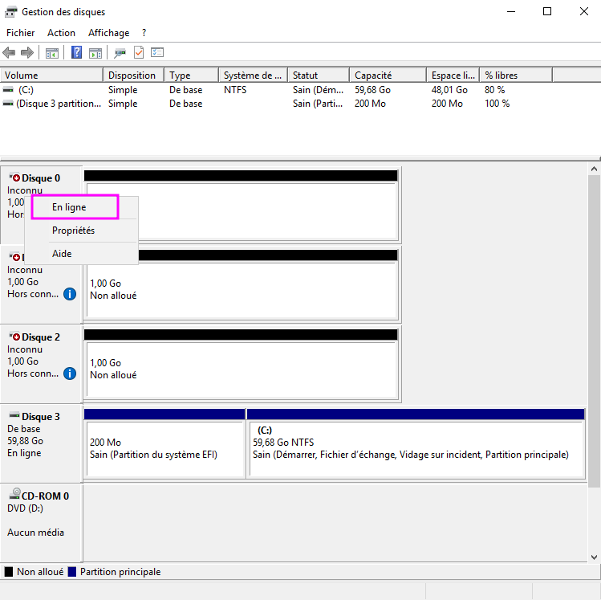
3. Clic droit à nouveau > sélectionner "Initialiser". Garder les réglages par défaut.
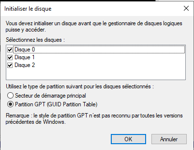
4. Clic droit un des nouveaux disques > sélectionner "Nouveau volume RAID-5..."
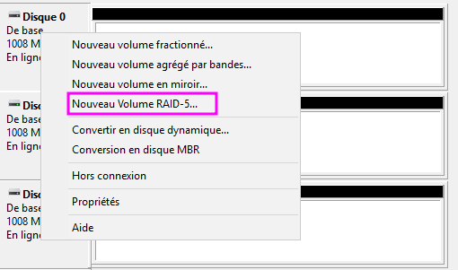
5. Sélectionner les 3 disques dans la partie "Disponible" > cliquer sur le bouton "Ajouter". On garde l'espace indiqué par défaut (1006 Mo).

7. Attribuer la lettre **F** au lecteur
9. Sélectionner "Formater ce volume..." en NTFS, sans préciser de nom de volume.
8. clic Suivant > Terminer > Répondre Oui au message d’avertissement

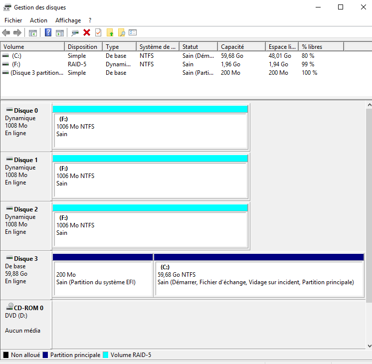

#### Procédure de configuration du partages et des autorisation

1. Sur le serveur AD **SRV1-WIN**, dans la console de Gestion de l'Active Directory, on va créer les OU pour les groupes globaux. Ils correspondent à chaque service de l'entreprise.

2. Création des domaines locaux. Un DL correspond à un type de permission. On y ajoutera les membres (Groupes Globaux) en fonction de leur droits ACL.

3. Attribution des membres
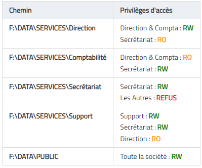

4. Attribution des permissions : dans la console **Utilisateurs et Ordinateur Active Directory**, ajouter les membres à chaque OU dans GROUPES > DL 
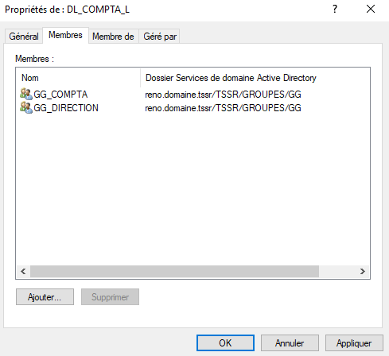

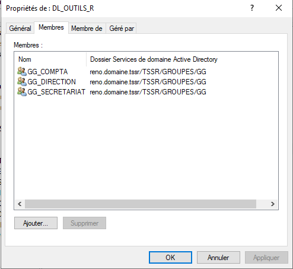

5. Ajouter les membres (utilisateurs) à leur Groupe Global respectif
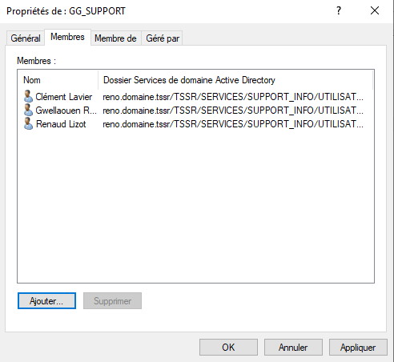

6. Partager les dossiers : dans l'explorateur de fichiers, aller à F:\DATA\SERVICES > clic droit > Propriétés > Partage Avancé
7. Cocher "Partage"
8. Retirer "Tout le monde" 
9. Ajouter "Utilisateurs authentifiés" et leur attribuer un contrôle total
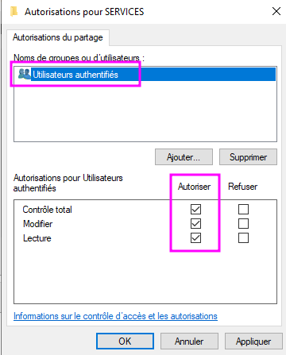
 

10. Descendre dans le répertoire SERVICES, 
11. Pour chaque dossier à partager, ouvrir les propriétés > onglet "Sécurité" > attribuer les permissions à chaque DL correspondants (bouton Modifier). Garder les utilisateurs Système, Administrateur local et Admins du domaine en contrôle total.
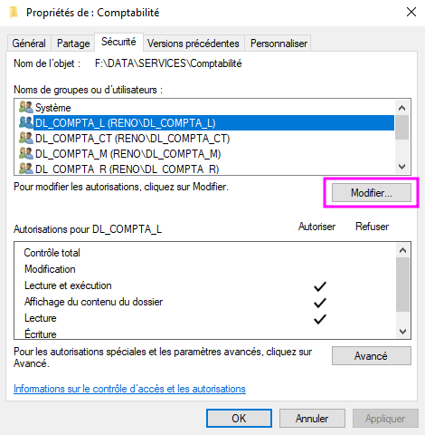

**Remarque** : Pour parvenir à modifier les autorisations, il faudra au préalable désactiver l'héritage en cliquant sur le bouton "Avancé" puis sur le bouton "Désactiver l'héritage"

12. Faire la même chose pour le dossier **F:\\DATA\\Informatique**, à la différence qu'on lui donnera un nom de partage : **"OUTILS"**. Partager avec "Tout le monde" en contrôle total. 

13. Dans les propriétés du dossier > onglet Sécurité > "Avancé" puis "Désactiver l'héritage"
14. "Modifier" les permissions. Garder Système et Administrateur local en contrôle total. Ajouter Admins du domaine (contrôle total), et les groupes DL correspondants.
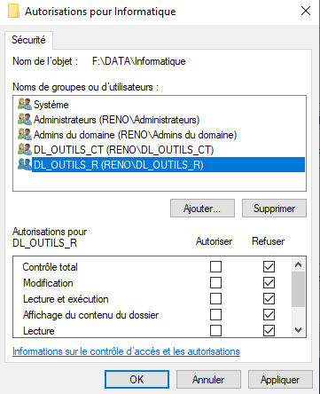

15. Partager le dossier PUBLIC. Désactiver l'héritage des ACL, ajouter "Utilisateurs authentifiés" et leur donner les droits en modification. 

**Remarque** : Le contrôle total permettrait à l'utilisateur de modifier les droits ACL sur le dossier en question, donc ce n'est pas souhaitable sur un dossier public.

### Tests Effectifs

| Utilisateur | Service | Accès "Comptabilité" |
|:--:|:--:|:--:|
| credit  | Compta      | OK (RO) |
| patron  | Direction   | OK (RO) |
| agenda  | Secrétariat | OK (RW) |
| clavier | Support     | OK (CT) |

<link rel="stylesheet" type="text/css" href=".ressources/css/bootstrap.min.css">
<link rel="stylesheet" type="text/css" href=".ressources/css/style.css">
<link rel="stylesheet" type="text/css" href=".ressources/css/headings.css">