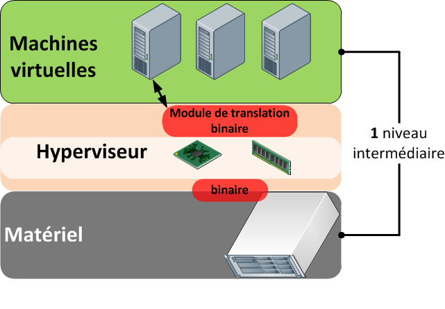
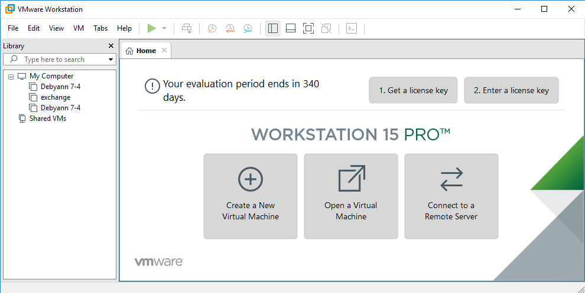
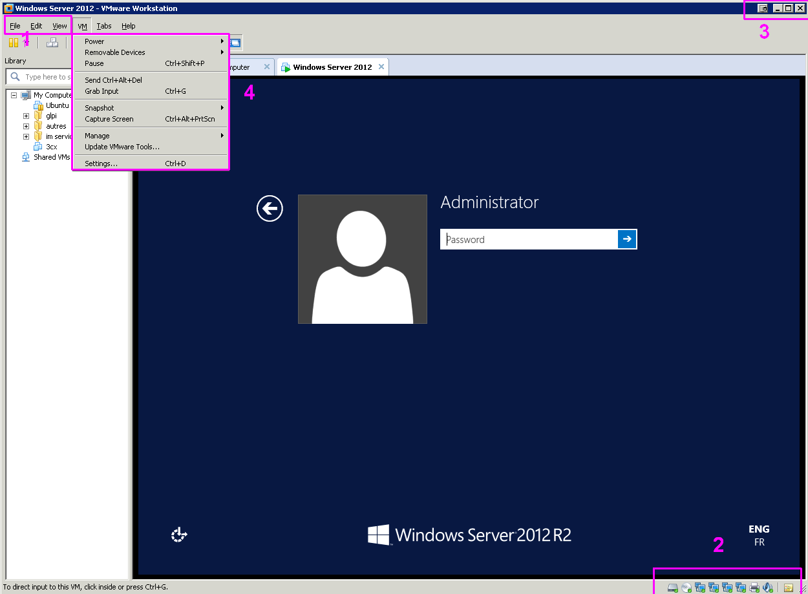
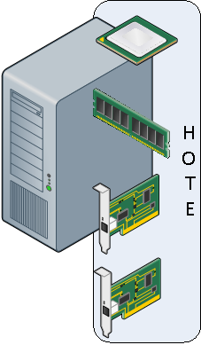
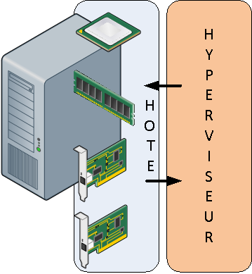
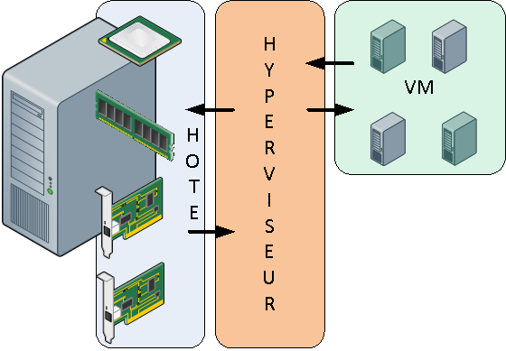
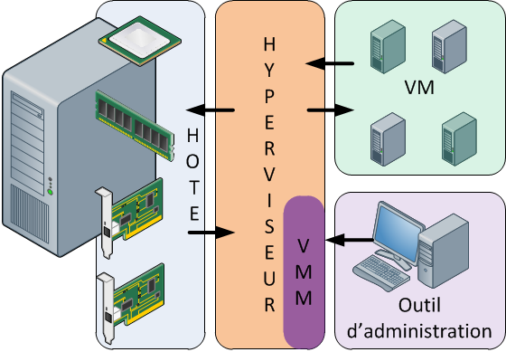

title: notes 1-3

# ENI TSSR 12 - Virtualisation

Des concepts de la virtualisation à leur mise en oeuvre.

**Sommaire**

1. **Module 1** - Présentation 
2. **Module 2** - Les applications de virtualisation d'environnements sur un poste de travail 
4. **Module 3** - La virtualisation de serveurs 
5. Module 4 - Découverte d'Hyper V 
6. Module 5 - Les composants d'une infrastructure vSphère
7. Module 6 - Gestion du réseau
8. Module 7 - Gestion du stockage 
9. Module 8 - Gestion du datacenter

[TOC]

## Objectifs

- Définir les termes de mutualisation, consolidation et rationalisation et différencier les hyperviseurs de type 1 et 2
- Enoncer les caractéristiques des offres de SaaS, PaaS et SaaS 
- Lister un ensemble de solutions de virtualisation et de services virtualisés
- Décrire les composants d'une infrastructure vSphère 
- Configurer le réseau d'un ESXi afin de répondre à des besoins ciblés
- Configurer le stockage local ou partagé 

## Module 1 - Présentation

### Un peu de réfléxion
La virtualisation, de quoi il s'agit ? 

Avec 1 seule machine on fait tourner plusieurs systèmes d'exploitation.

Dans quel contexte l'utilise-t-on ?

Pour faire des tests.

#### Consigne de l'activité

- Le domaine de la virtualisation est vaste, il englobe un ensemble de solutions très diverses.

- Faites les recherches nécessaires afin de découvrir et appréhender les solutions suivantes :
    + L'application VMware Workstation utilisée dans votre formation 
    + Les outils de virtualisation de serveurs
    + Les services dans le Cloud 

- A l'issue de vos recherches, vous complèterez les tableaux de report à suivre 
    + En y renseignant la description et l'utilité de l'élément
    + En ciblant le lien de celui-ci avec le domaine de la virtualisation
    + En établissant une définition de la virtualisation 
    
En complément (si le temps le permet), vous retracerez en 10 étapes maximum les évènements importants liés au sujet.

#### Caractéristiques de solutions

<table>
    <caption class="text-center">Caractéristiques de solutions</caption>
        <tr>
            <th>VMware Workstation</td>
            <td>est une gamme de produits d'hyperviseurs de poste de travail qui permettent aux utilisateurs d'executer des VM, des conteneurs et des clusters Kubernetes. Type de Hyperviseurs:<ul><li>type 2: VMWare. (Hosté) S’exécute à l’intérieur d'un OS.</li><li>    Type 1: (natif) S’exécute directement sur la plateforme matériel</li></ul> Entreprise = VMWare donc une des solutions est Worstation.
        </tr>
        <tr>
            <th>Les outils de virtualisation de serveurs</th>
            <td><ul><li>Virtual Box</li><li>Serveur VMWare (VSphère)</li><li>Parallels Desktop (Faire fonctionner de Windows sur Mac)</li><li>Hypr-V</li><li>VMLite Workstation</li></ul></td>
        </tr>
        <tr>
            <th>Les services dans le Cloud</th>
            <td>Avec la virtualisation, une ressource peut jouer le rôle de plusieurs ressources, tandis qu'avec le cloud computing, différents services (via un cloud privé) ou entreprises (via un cloud public) ont accès à un même ensemble de ressources qui sont approvisionnées de manière automatique. IAS comme service. => Ces sont de prestataires externes. Nous profitons uniquement des services</td>
        </tr>
</table>

#### Caractéristiques communes / définition
##### Caractéristiques communes
- Abstraction des ressources communes
- Solution des gestion centralisée et groupement de ressources. D'une seule machine on peut contrôler les serveurs distants.
- Avec 1 seule machine = plusieurs S.E
- Création d'environnements virtuelles.
- Mutualisation des ressources.

Sur le Serveur on peut monter entre 200 à 700 Go

##### Définition :
- La virtualisation est un processus qui permet de regrouper des ressources physiques afin des les gérer d'une manière centralisée.

- Les ensemble obtenus sont organisés au sein d'environnements virtuels.

- Elle permet de percevoir une ressource physique comme plusieurs ressources logiques et inversement, de percevoir plusieurs ressources physiques comme une seule ressources logique.

### La virtualisation en 8 dates
**Années 60/70**

- IBM: embryon de la virtualisation en test puis en production sur des Mainframes. 
- Un ordinateur central ou un macroordinateur (mainframe computer) est un ordinateur de grande puissance de traitement et qui sert d'unité centrale à un réseau de terminaux.

**Milieu des années 90**

- Les émulateurs font leur apparition en microinformatique. Ils rendent possible l'émulation des machines ATARI, AMIGA, AMSTRAD et des consoles.

**Début des années 2000**

- VMware développe et popularise son système propriétaire de virtualisation logicielle pour les architectures x86. 

**2006**

- Prise en charge matérielle par le CPU d'instructions de virtualisation.

**2007**

- XenSource racheté par Citrix 
- KVM est intégré au noyau Linux
- Virtual Desktop Infrastructure VMware : VDI = Bureau Virtuelle héberger, sans OS dans la machine = client léger. Là, on dépend d'un serveur qui faudra qui supporte la charge.

**2009**

- Plus de serveurs virtuels que physiques KVM est intégré au noyau Linux. KVM =Kernel-based Virtual Machine. Commutateur KVM, un dispositif qui permet de partager un clavier, une souris et un écran entre plusieurs ordinateurs

### Utilisation

**Pour quels usages ?**

- Les serveurs d'infrastructure locaux et distants (le Cloud...)
- Les environnements de test et les problématiques de comptabilité 
- Les scénarios de PRA (**Plan de Reprise d'Activité**)

**Quels avantages ?**

- Optimisation des taux d'utilisation du matériel 
- Economies sur les coûts matériels et de gestion 
- Gestion facilitée des systèmes (**granularité**)
- Economies d'énergie (**green computing**)

**Des inconvénients ?**

- Concentration et dépendance vis-à-vis d'une solution 
- Mise en oeuvre complexe avec un investissement initial important 
- Contraintes d'administration spécifiques (déploiement, sauvegarde, ...)

### Les acteurs
- Les grands éditeurs : VMware, Microsoft, Citrix, Oracle, RedHat 
- Des logiciels libres : GNU/Linux 
- D'autres solutions : Parallels, Proxmox, Docker 

### Les secteurs de la virtualisation
La virtualisation est un domaine transverse qui peut être mis en oeuvre à plusieurs niveaux au sein d'une infrastructure.

- Virtualisation d'environnements sur un poste de travail 
- Virtualisation de serveurs 
- Virtualisation d'applications 
- Virtualisation de stations de travail 

On retrouve aussi la virtualisation dans des domaines plus ciblés :

- Le réseau 
- Le stockage
- Les services 

### Les principales solutions

**Pour le poste de travail**

- VMware Player, VMWare Workstation
- Oracle VM VirtualBox
- Windows Virtual PC (Windows 7 Mode XP)
- Hyper-V Client (W8 x64 SLAT)
- QEMU

**Pour les serveurs**

- vSphère (VMware)
- Hyper-V (Windows Server)
- Xen (utilisé par Citrix avec Xenserver)
- KVM (utilisé par RedHat)

### Les outils

**Les outils**

- L'**hyperviseur**
- La **console de gestion** des VM 
- La **console d'accès** à la VM 
- Les **composants** complémentaires

**Principes de base**

- Paramétrage matériel : architecture, BIOS, processeur, mémoire, disque, etc.
- Gestion des médias amovibles : DVD au format ISO, USB "transmis" à la VM, disquette au format FLP ou IMG 
- Réseaux virtuels : interne, NAT, pont, LAN dédié 
- Format des disques : selon la solution, VHD, VMDK, VDI, etc.
- Fichier de configuration : selon la solution, XML, VMX, VBOX, etc.

### Les types d'hyperviseurs
**Hyperviseur de type 1** :

- Implémentation : fait office de système d'exploitation. 
- 1 niveau intermédiaire
- Solutions : Hyper-V, KVM, VMware ESXi, Xen Server 

**Hyperviseur de type 2**

- Implémentation: installé en tant qu'application sur un OS 
- 2 niveaux intermédiaire
- Solutions : VirtualBox, VirtualPC, VMware Player & Workstation utilisée
- Avantages : ?
- inconvénients : ?

### Virtualisation & Paravirtualisation
Dans un contexte de virtualisation, les VM s'adressent au *matériel présenté* par l'hyperviseur. Elles n'ont pas connaissance de sa présence.

La **paravirtualisation** est une technique de virtualisation dans laquelle les VM sont préparées pour faire appel directement à un hyperviseur. Les appels système sont alors redirigés et non traduits. 

<table>
	<caption class="caption">Comparaison</caption>
	<tr>
		<th style="text-align: center">Solution de virtualisation</th>
		<th style="text-align: center">Solution de paravirtualisation</th>
	</tr>
	<tr>
		<td>
			
		</td>
		<td>
			
		</td>
	</tr>
</table>

## Module 2 - Les applications de virtualisation d'environnements sur un poste de travail
### VMware Workstation
#### Prérequis et installation
**Prérequis matériel** 

- Processeur Intel VT-x ou AMD-V (attention aux réglages BIOS/UEFI)
- RAM et espace disque adaptés 

**Installation**

- Attention il n'y a pas de rétrocompatibilité : une vieille VM ne fonctionnera pas avec la version la plus récente de VMware, mais les nouvelles VM peuvent tourner sur un vieux VMware. 
- Utiliser les paramètres d'installation par défaut 

**Notes**: La dernier version est préférable mais il peut y avoir des problèmes de fonctionnement suivant les systèmes hôtes (ex. WS 2012 R2 + v15)

#### Outils et composants installés
##### La console de gestion VMware Workstation

{:max-width="300px"}

- Affiche la liste des VM 
- Permet d'ajouter ou de créer des VM 
- Lors de la sélection d'une VM, elle permet le démarrage ou le réglage des paramètres matériel

##### Gestion des VM
- Créer ou importer une nouvelle VM
- Une fois créée / importée, elle s'affiche dans la librairie 
- La console affichhera le système virtualisé une fois la VM démarrée. 

#### Interactions avec l'hôte
##### Gestion du matériel
- Les médias amovibles (USB, CD/DVD, disquette)
- Par défaut, la VM capture la souris et le clavier (<kbd>CTRL</kbd> + <kbd>ALT</kbd> pour reprendre la main)
- Des composants additionnels peuvent être installés pour améliorer l'intéraction 
- La fonction **Shared Folder** permet de mapper un dossier de l'hôte dans la VM en tant que lecteur réseau. 
- Pour faire un <kbd>CTRL</kbd> + <kbd>ALT</kbd> + <kbd>SUPPR</kbd> dans la V, taper <kbd>CTRL</kbd> + <kbd>ALT</kbd> + <kbd>INSER</kbd>

##### Gestion du réseau
VMware met en place des **cartes réseau virtuelles** pour permettre les différents modes de connexion :

- VMnet1 pour le réseau **Host-Only** (privé + accès à l'hôte)
- VMnet8 pour le réseau **NAT** (accès à internet via l'hôte)

Des services privés sont présents pour gérer l'adressage de ces réseaux : **VMware DHCP Service** pour le réseau privé et **VMware NAT Service** pour le réseau NAT.

**Notes**: il peut être nécessaire de désactiver ces services si l'on veut utiliser ces réseaux avec son propre adressage dynamique. 

### Etapes de création
- Mode d'installation : avec ou sans iso dès le départ. On peut choisir *"I will install OS later* pour ne pas laisser VMware gérer tous les paramètres d'installation.
- Choix du système : définir l'architecture matérielle selon le système
- Nom de la VM dans l'interface et choix de l'emplacement : prévoir 1 dossier par VM. 
- Taille du disque virtuel & mode de stockage
	+ Par défaut, VMware utilise l'espace au fur et à mesure des besoins 
	+ Préférer le mode **Store virtual disk in a single file** pour des besoins de performance
- Paramétrage matériel : "*Customize Hardware*"
	+ Pour ajouter ou supprimer des composants
	+ Pour régler le nombre de CPU et la quantité de RAM 
	+ Pour définir le média d'installation et le mode de connection réseau 

### Gestion de la VM - Workstation Pro
{:max-height="300px"}

1. Gestion de base 
2. Gestion directe du matériel (disque, reseau, média)
3. Gestion de la fenêtre (X = pause la VM)
4. Paramètres et fonctions complémentaires

### Paramétrages matériels
Après la création de la VM, les paramétrages sont accessibles depuis la fonction "**Virtual Machine settings**". Permet de modifier les paramètres initiaux. Certains composants sont paramétrables à chaud.

**Connection au réseau : 4 modes disponibles**

1. **Bridged** : mode pont, connecté au réseau physique.
2. **NAT** : utilise la configuration réseau de l'hôte pour accèder à internet.
3. **Host-Only** : mode interne avec connection à l'hôte. Les VM ne peuvent communiquer qu'entre elles et avec l'hôte.
4. **LAN Segment** : permet d'utiliser des segments réseau spécifiques et indépendant, à condition de les déclarer avec le bouton LAN Segments.

Chacun de ces modes est indépendant des autres. Ils agissent comme des commutateurs permettant d'isoler les VM dans des réseaux spécifiques.

### Problèmes courants

**Démarrer sur un média CD/DVD une fois le système installé**

- s'assurer que la VM a bien capturé le clavier et redémarrer 
- Appuyer 1 fois sur la touche <kbd>ECHAP</kbd> dès l'apparition du logo VMware s'affiche
- VM éteint, il est possible de démarrer directement dans le BIOS: clic droit sur VM éteinte > **Power** > **Power on Firmware**
- Il est possible de paramétrer la séquence de démarrage dans le BIOS de la VM

**Fonctionnement du réseau aléatoire**

- Le fonctionnement du réseau est un point sensible, notamment lors de paramétrages fréquents
- Désactiver puis réactiver les cartes réseau de la machine physique

**Espace disque hôte insuffisant**

- Vérifier l'emplacement du dossier de la VM et le déplacer si nécessaire.
- Surveiller l'espace disponible dans le volume de données 

**Espace disque invité insuffisant**

- Ajouter un disque depuis les paramétrages de la VM ou redimensionner (plus fastidieux)
- Le dimensionnement initial est important !

### Atelier 1 - Workstation

Voir TP1

## Module 3 - La virtualisation de serveurs
### Type de serveurs et concentration
Choix du type de serveur et volume occupé.

Tour (serveur) > Rack (contient des serveurs) > Lame (contient des racks)

### Les fournisseurs de solutions de virtualisation

VMware, KVM, Xen, Windows Server Hyper-V 

### Discussion

La virtualisation des serveurs : solution et contexte.

Un ensemble de solutions sont disponibles, d'après vous quels sont les critères justifiant le choix d'une solution ?

### Les composantes d'une infrastructure de virtualisation
#### La machine hôte
C'est le serveur physique qui dispose des ressources matérielles. 

<table>
	<caption class="caption">Processeurs et technologies de virtualisation</caption>
	<thead>
		<tr>
			<td></td>
			<th>Intel</th>
			<th>AMD</th>
		</tr>
	</thead>
	<tbody>
		<tr>
			<th>Mécanisme de prise en charge de la virtualisation</th>
			<td>VT-x</td>
			<td>AMD-v</td>
		</tr>
		<tr>
			<th>Mécanisme de prise en charge de SLAT</th>
			<td>EPT</td>
			<td>NPT/RVI</td>
		</tr>
	</tbody>
</table>

#### Au coeur de la solution : l'hyperviseur
L'hyperviseur correspond à la solution logicielle installée sur la machine hôte et sur lequel seront hébergées des machines virtuelles. 

Il est chargé de la gestion du matériel de l'hôte et de l'hébergement des machines virtuelles.

| Solution Microsoft | Solution VMware |
|:------------------:|:---------------:|
| Hyper-V            | ESX / ESXi      |

#### L'outil de gestion de la solution

Le composant de gestion intégré à un hyperviseur est nommé **Virtual Machine Manager** (VMM).

Le **VMM** permet notamment :

- La création / gestion / suppression de VM 
- La gestion du matériel, des pilotes
- La gestion des réseaux et de l'espace disque pour les VM 
- La configuration des fonctionnalités de l'hyperviseur L'hyperviseur

Les actions de gestion associées sont réalisées au moyen d'outils. 

- Solution : Outil de gestion
- Hyper-V : Gestionnaire Hyper-V 
- vSphere : client vSphere 

#### Les machines virtuelles
Les VM sont créées et hébergées sur l'hyperviseur. 

Les éléments de constitution d'une VM :

- un fichier de caractéristiques matérielles 
- un fichier d'image disque par disque dur dans la VM 
- des ressources RAM et une image en RAM 
- des ressources CPU 
- Une ou plusieurs cartes réseau virtuelles 

#### La solution de gestion globale d'hyperviseurs
Les hyperviseurs peuvent être gérés de manière autonome ou peuvent être regroupés au sein d'un même contexte de gestion.

Ce regroupement, qui en simplifie l'administration, se traduit par :

- l'intégration à un contexte de domaine AD des serveurs sur lesquels le rôle Hyper-V est installé (en environnement Microsoft).
- L'ajout du composant vCenter (en environnement vSphere)

  	

		
	

  	

  		
	

#### Récapitulatif visuel des éléments

Le schéma suivant illustre les principaux éléments nécessaires à une infrastructure de virtualisation.

*Next : Module 4 - Découverte d'HYPER-V* (p47/156)

<link rel="stylesheet" type="text/css" href=".ressources/css/bootstrap.min.css">
<link rel="stylesheet" type="text/css" href=".ressources/css/style.css">
<link rel="stylesheet" type="text/css" href=".ressources/css/headings.css">
