title: notes 6-8

# ENI TSSR 12 - Virtualisation

Des concepts de la virtualisation à leur mise en oeuvre.

**Sommaire**

1. Module 1 - Présentation 
2. Module 2 - Les applications de virtualisation d'environnements sur un poste de travail 
4. Module 3 - La virtualisation de serveurs 
5. Module 4 - Découverte d'Hyper V
6. Module 5 - Les composants d'une infrastructure vSphère
7. **Module 6 - Gestion du réseau**
8. **Module 7 - Gestion du stockage** 
9. **Module 8 - Gestion du datacenter**

[TOC]

## Objectifs

- Définir les termes de mutualisation, consolidation et rationalisation et différencier les hyperviseurs de type 1 et 2
- Enoncer les caractéristiques des offres de SaaS, PaaS et SaaS 
- Lister un ensemble de solutions de virtualisation et de services virtualisés
- Décrire les composants d'une infrastructure vSphère 
- Configurer le réseau d'un ESXi afin de répondre à des besoins ciblés
- Configurer le stockage local ou partagé 

## Module 6 - Gestion du Réseau
### Les VLANS
#### Définition
Un VLAN (Virtual LAN) est un réseau logique indépendant.

Les commutateurs (*switches*) permettent l'interconnection réseau d'un ensemble d'éléments. Tous les éléments raccordés à un même switch peuvent ainsi communiquer entre eux. 

La mise en oeuvre de VLAN permet de définir des contextes isolés afin que seuls les éléments d'un même VLAN puissent communiquer ensemble. 

#### Intérêt de mise en oeuvre

La segmentation du réseau au moyen de VLAN permet :

- d'accroître la sécurité 
- d'accroître les performances en limitant les domaines de diffusion 
- de prioriser certains flux
- d'optimiser l'utilisation du matériel 

Les limites :

- nécessite une prise en charge par les commutateurs 
- nécessite une configuration

#### Prise en charge 802.1Q

Les VLANs peuvent être mis en oeuvre à différents niveaux du modèle OSI :

- **VLAN de niveau 1** : l'affectation à un VLAN est liée au port de raccordement du switch 
- **VLAN de niveau 2** : l'affectation du VLAN est liée à l'adresse MAC de l'équipement
- **VLAN de niveau 3** : l'affectation du VLAN est liée à l'adresse IP de l'équipement 

Leur affectation peut être réalisée par :

- Les équipements d'interconnection : les **switch** 
- Les équipements terminaux (postes de travail, serveurs, Téléphones IP)

La norme 802.1Q correspond au standard de prise en charge

#### Intégration d'un identifiant de VLAN
L'ajout d'informations d'identification de VLAN se matérialise par la modification de l'en-tête Ethernet des trames IP.

Parmi les informations ajoutées figurent :

- Une priorité (valeur de 0 à 7) permettant de mettre en place de la qualité de service 802.1P 
- L'identifiant de VLAN (valeur de 1 à 4094)

#### Propagation des flux entre commutateurs
- Généralement, les réseaux d'entreprises intègrent une multitude de switches. Les ports utilisés pour le raccordement entre les switchs doivent être identifiés comme "port trunk".
- Lors de la configuration d'un port en "port trunk", on indique les trames de quels VLANS doivent se propager. 

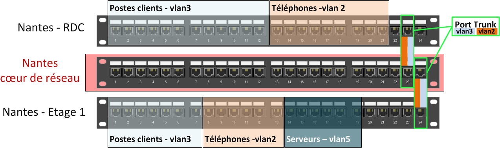

#### Critères de configuration sur les switchs
Sur les commutateurs, la configuration à mettre en oeuvre doit prendre en considération les aspects suivants :

- **Le type d'utilisation du port** :
	+ **Port Access** : port utilisé pour communiquer avec un équipement terminal, un seul VLAN peut lui être affecté. 
	+ **Port Trunk** : port utilisé pour la liaison vers d'autres commutateurs, un ensemble de VLAN peut lui être affecté. 
- **L'état d'activation du marquage** :
	+ **Marquage actif** : le marquage des paquets (champ TAG VLAN) est propagé à leur sortie de la trame. 
	+ **Marquage inactif** : le champs TAG VLAN est supprimé avant la remise de la trame.
- **Le(s) VLAN(s) à affecter aux ports** : à chaque port sera associé
	+ **Le VLAN par défaut** : VLAN1
	+ **D'autre(s) VLAN(s)** : le ou les VLANs choisis

#### Configuration sur les équipements terminaux
- Certains équipements terminaux sont compatibles avec la norme 802.1Q, leur affectation à un VLAN est gérée depuis leur configuration. Ces équipements doivent être connectés à des ports configurés en mode trunk du switch. 

- Quelques exemples de type d'équipements terminaux pouvant prendre en charge la norme 802.1Q:
	+ Des pilotes de carte réseau 
	+ Des systèmes d'exploitation 
	+ Des téléphones IP 

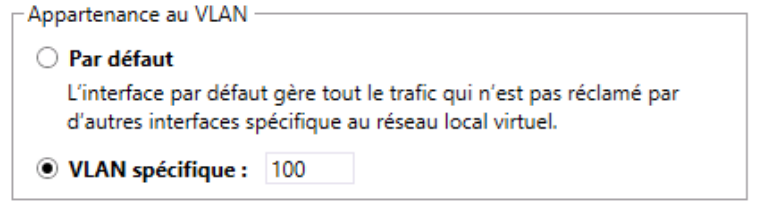{:width="500px"}

### Les composantes vSphere du réseau
#### Le vSphere Standard Switch (vSS)
<table class="table-borderless">
	<tr>
		<td>
C'est le composant centre de <b>gestion du réseau</b> de l'ESXi. 
		Il est géré indépendamment pour chaque ESXi de l'infrastructure.

		<h5>Liaison</h5>
		<ul>
			<li>Un vSS est <b>lié à un ou plusieurs groupement de ports</b>.</li>
			<li>Un vSS peut être <b>raccordé à une ou plusieurs cartes réseau</b>.</li>
		</ul>
		
Par défault, le <strong>vSwitch0</strong> est créé, il est utilisable :

			<ul>
			    <li>pour les tâches de gestion de l'ESXi</li>
			    <li>pour les VM</li>
			</ul>
		
Il est lié à la carte réseau de l'ESXi présente à l'installation.
</td>
		<td>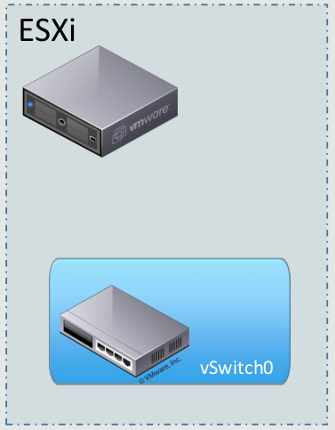</td>
		</tr>
	</tbody>
</table>

#### Le vSphere Distribué (vDS)
A la différence des vSwitch standards, le **vSwitch Distribué** est un **objet commun** aux éléments d'une même infrastructure vSphere. 

- **Un même vDS est utilisable par un ensemble d'hôtes**.
- Sa gestion se réalise depuis le **vCenter** de l'infrastructure.
- L'utilisation de vDS permet d'éviter toute interruption de service en cas de migration de VM.

**Remarque**: Cette fonctionnalité requiert le niveau de licence **Entreprise Plus**.

#### Les groupements de ports

<table class="table table-borderless">
	<tr>
		<td>
Ils <strong>définissent un type d'utilisation du réseau pour l'ESXi</strong> parmi les suivants :

			<table class="table-hover">
				<tr>
					<th>Type</th>
					<th>Utilisation</th>
				</tr>
				<tr>
					<td>VM Network</td><td>Création de réseau à destination des VM.</td>
				</tr>
				<tr>
					<td>VM Kernel</td><td>Création de réseau à destination des besoins de l'infrastructure de virtualisation</td>
				</tr>
			</table>
			
Des machines liées à des groupements de ports distincts d'un même vSwitch ne peuvent pas communiquer entre elles.

		</td>
		<td width="300px">
			
		</td>
	</tr>
</table>

**Remarque**: La segmentation en VLAN peut être configurée depuis les groupements de ports.

#### Les vmNIC ou pNIC

<table class="table table-borderless">
	<tr>
		<td>
Ce sont les <b>cartes réseau physiques de l'ESXi</b>.

			
Deux dénominations s'appliquent aux cartes réseau physiques des hôtes :
				<ul><li>Object vSphere associé à une pNIC: <b>vmNIC</b></li>
					<li>Carte physique de l'hôte: <b>pNIC</b></li>
				</ul>
			

			
<b>Les contraintes de liaison vmNIC <=> vSwitch</b> :
				<ul><li>Chaque carte peut être liée à un seul vSwitch.</li>
					<li>Plusieurs cartes peuvent être liées au même vSwitch.</li>
				</ul>
			

		</td>
		<td width="300px">
			
		</td>
	</tr>
</table>

#### Le regroupement de carte réseau (Teaming)
Il est possible de regrouper un ensemble de cartes réseau d'un ESXi.

Cela se traduit par :

| Un adressage unique            | Si les cartes sont liées à un groupement de port typé VM Kernel |
|:------------------------------:|:------------------------------------:|
| Un débit cumulé                | Mode de configuration actif - actif  |
| Un gain de tolérance de pannes | Mode de configuration actif - passif |

**Prérequis de mise en oeuvre** : 

- Disposer au minimum de 2 VMNIC raccordés à un switch virtuel.

**Mise en oeuvre, la configuration peut se faire** :

- Par la sélection d'un ensemble de cartes, lors de la création d'un switch virtuel.
- Par l'ajout de carte(s) au groupement de ports d'un switch virtuel existant.

#### Teaming - Répartition de charge

La configuration du **teaming** permet de déterminer le mode de fonctionnement de la **répartition de charge** :

- **Par VM** : chaque port de vSwith (soit indirectement chaque carte réseau de VM) est lié à un vmNIC.
- **Par adresse matérielle** (MAC) de la source du paquet 
- **Par paquet** : en fonction des adressages de source et destination, un algorithme détermine la nmNIC à utiliser.
- **Par ordonnancement des cartes** : pas de répartition de charge, seule défaillance d'une carte entraine l'utilisation de la suivante

#### Les vNIC

<table class="table table-borderless">
	<tr>
		<td>
			
Ce sont les <b>cartes réseau présentées aux VM.</b>.

			
Elles peuvent être connectées ou non à un groupement de ports de type *Virtual Machine* existant.

			
**La ségmentation en VLAN peut être configurée au niveau des vNIC**.

		</td>
		<td width="300px">
			<a href=".ressources/img/notes-27.png" target="_blank">
				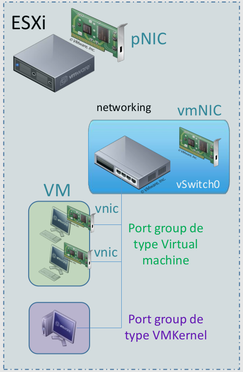
			</a>
		</td>
	</tr>
</table>

#### Liens entre les vmNIC et les besoins réseau
Un hôte dispose généralement d'un ensemble de cartes réseau. Ces cartes permettent de couvrir les multiples besoins réseau de l'infrastructure vSphere : Réseau pour les VM, Gestion de l'infrastructure, Déplacement de VM, Flux iSCSI, Très haute disponibilité.

Il est important de recenser les besoins, d'identifier ceux que l'on souhaite regrouper et ceux que l'on souhaite isoler.

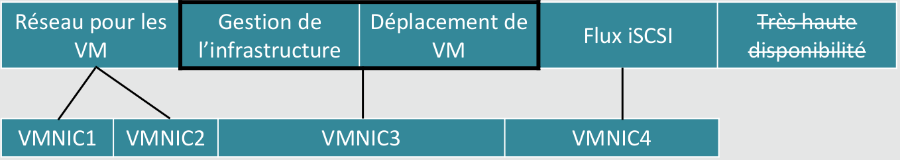

#### Illustration de raccordement réseau global

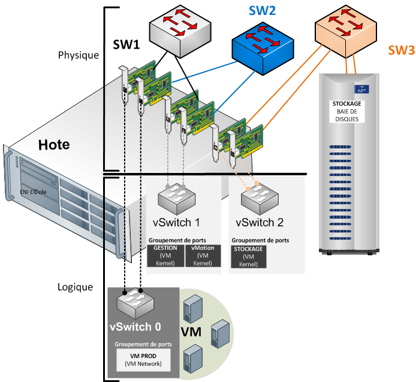

#### Les VLAN en environnement virtualisé

<table class="table table-borderless">
	<tr>
		<td>
			
En environnement vSphere, les VLAN peuvent être affectés :
				<ul><li>Au niveau du switch : un seul VLAN ciblera alors tout le trafic</li>
					<li>Sur des groupements de ports</li>
					<li>Sur des NIC</li>
				</ul>
			

			
Si les VLAN sont affectés par l'hyperviseur, le switch doit être configuré en mode trunk et lié à tous les VLAN nécessaires aux composantes d'infrastructure vSphere et aux VM.

		</td>
		<td width="300px">
			<a href=".ressources/img/notes-30.png" target="_blank">
				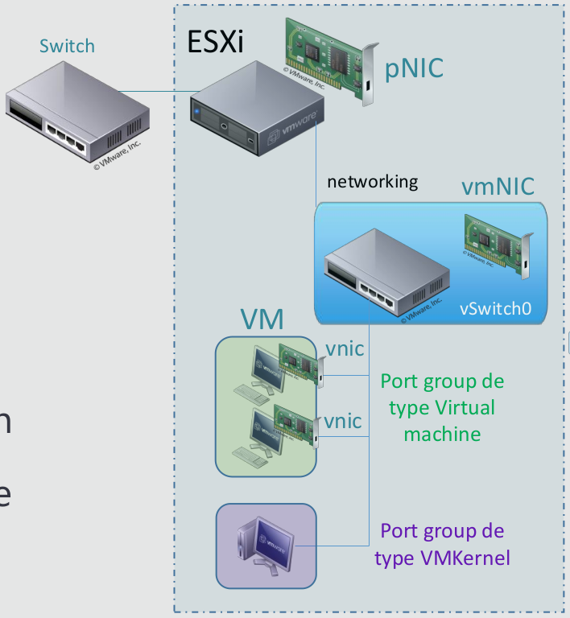
			</a>
		</td>
	</tr>
</table>

### Atelier 4 - Gestion Réseaux

Voir Atelier 4

## Module 7 - Gestion du stockage

La virtualisation du stockage permet de fédérer les volumes en une ressource unique. 

Le principe de base de la virtualisation du stockage est de gérer une interface qui permet de dissocier la gestion physique des disques (et des baies de stockage) vis-à-vis des serveurs qui l'utilisent.

Les systèmes de stockage fournissent soit des données en mode bloc, soit en mode fichier. Les données en mode bloc sont accédées à travers des protocoles tels que iSCSI ou autres. L'accès en mode fichier se fait à travers NFS ou CIFS. 

La virtualisation d'un **système de stockage** peut se faire de 2 façons : 

- **virtualisation en mode bloc**, en introduisant un niveau d'abstraction entre le serveur et le système de stockage, ce qui donne plus de flexibilité pour les administrateurs.
- **virtualisation en mode fichiers**, en accèdant au NAS en masquant les dépendances vis-à-vis de l'emplacement où les données sont physiquement stockées. 

### Les solutions de stockage
Les notions suivantes vont être abordées dans ce chapitre : **mode bloc**, **SAN**, **NAS**, **DAS**.

#### Mode bloc
Le stockage par blocs est une technologie utilisée pour stocker des fichiers de données sur des réseaux de stockage (SAN) ou des environnements de stockage en cloud. Les développeurs privilégient le stockage par blocs dans les cas où ils ont besoin d'un transport de données rapide, efficace et fiable.

Le stockage par bloc divise les données en blocs, puis stocke les blocs en tant qu'éléments distincts, chacun possédant un identificateur unique. Le réseau SAN place ces blocs de données là où l'efficacité est la plus grande, ce qui signifie qu'il peut stocker ces blocs sur différents systèmes, et que chaque bloc peut être configuré (ou partitionné) pour fonctionner avec différents systèmes d'exploitation.

Le stockage par bloc dissocie également les données des environnements des utilisateurs, ce qui permet de répartir ces données dans plusieurs environnements, créant ainsi de multiples chemin d'accès aux données et permettant à l'utilisateur de les récupérer rapidement. Lorsqu'un utilisateur ou une application demande des données à un système de stockage par blocs, le système de stockage sous-jacent reconstitue les blocs de données et présente les données à l'utilisateur ou à l'application.

(Sources : https://www.ibm.com/fr-fr/cloud/learn/block-storage)

La plupart des implémentations permettent une administration unique d'un ensemble de baies de stockages hétérogènes.

#### SAN - Storage Area Network
C'est un réseau spécialisé permettant de mutualiser les ressources de stockage.

Un réseau de stockage se différencie des autres systèmes de stockage tels que le NAS (Network Attached Storage) par un accès bas niveau aux disques. Pour simplifier, le trafic sur un SAN est très similaire aux principes utilisés pour l'utilisation des disques internes (ATA, SCSI). **C'est une mutualisation des ressources de stockage**.

Dans le cas du SAN, les baies de stockage n'apparaissent pas comme des volumes partagés sur le réseau. Elles sont directement accessibles en mode bloc par le système de fichiers des serveurs. 
En clair, chaque serveur voit l'espace disque d'une baie SAN auquel il a accès comme son propre disque dur. L'administrateur doit donc définir très précisement les **Logical Unit Number** (**LUN**, unités logiques), le *masking* et le *zoning*, pour qu'un serveur Unix n'accède pas aux mêmes ressources qu'un serveur Windows utilisant un système de fichiers différent. 

**Avantages du SAN**

- Ne plus avoir à se préoccuper de faire évoluer la quantité de disques autrefois dévolus à un serveur particulier ou de désallouer de l'espace non-utilisé d'un serveur surdimensionné en espace disque.
- Espace disque n'est plus limité par les caractéristiques des serveurs
- Espace disque est évolutif à volonté par l'ajout de disques ou de baies de stockage sur le SAN. 
- L'espace de stockage physique mutualisé pour les serveurs permet d'optimiser la gestion des disques, et de rendre plus aisées les sauvegardes de données.

**Caractéristiques du SAN** 

- **La Qualité de Service** (QoS) : le commutateur garantit un débit fixe de 16 Gbit/s par lien en fibre optique (contre 1, 2, 4 ou 8 précédemment).
- **La disponibilité** : le SAN peut assurer la redondance du stockage càd l'accessibilité du stockage en cas de panne en doublant au minimum chacun des éléments du système (haute disponibilité)
- **L'hétérogènéité** : le SAN peut fonctionnner dans un environnement complétement hétérogène. Les serveurs Unix, Windows, Netware, etc. peuvent tous rejoindre le SAN.
- **Performances variables** : la performance de l'accès aux disques par un hôte varie en fonction des sollicitations de la part des autres hôtes sur les ressources partagées.

#### NAS

Dans le cas du **NAS** (**Network Attached Storage**), la ressource de stockage est directement connectée au réseau IP de l'entreprise. Le serveur NAS intègre le support de multiples systèmes de fichiers réseau, tels que **CIFS** (Common Internet File System) protocole de partage de Microsoft et de Samba, **NFS** (Network File System) qui est un protocole de partage de fichier Unix, ou encore **AFP** (AppleShare File Protocol). Une fois connecté au réseau, il peut jouer le rôle de plusieurs serveurs de fichiers partagés.

*ENI "VMware vSphere6* :

<blockquote>
	
Le NAS est un stockage accessible à travers le réseau, donc accessible par plusieurs machines simultanément. La connectivité des NAS est actuellement basée principalement sur l’Ethernet dont le connecteur est l’adaptateur réseau, ou NIC pour Network Interface Card. Il utilise des protocoles d’interconnexion basés sur TCP/IP. Le NAS est un fournisseur d’accès à des fichiers car il présente un système de fichiers, et s’appuie sur les protocoles applicatifs tels que le CIFS/SMB (Microsoft), l’AFP (Apple) et NFS (Unix/Linux), pour le partager. Le NAS est un espace de stockage dit en mode fichier, cela permet d’avoir accès aux fichiers une fois les droits d’accès configurés.

</blockquote>

{:target="_blank"} 

#### DAS

*Direct Attached Storage* (DAS) est le terme utilisé pour un système de disques durs en attachement direct, par opposition au NAS qui est en attachement réseau. 

Le système disque ainsi installé n'est accessible directement qu'aux machines auquel il est raccordé. Les modes de raccordement au serveur peuvent être ATA, SATA, eSATA, NVMe, SCSI, USB, Fibre Channel, etc.

[Wikipédia](https://fr.wikipedia.org/wiki/Direct_Attached_Storage)

--

Le DAS est une baie de stockage qui, comme son nom l’indique, est directement connectée à un serveur. Elle est connectée à son serveur par le biais de connectiques diverses et variées allant de l’USB au Fibre Channel en passant par le SATA, la gestion des périphériques de stockage présent dans la baie DAS, se fait à partir du serveur. Il faut aussi inclure un disque dur interne connecté en SATA sur la carte mère comme un DAS.

Le coût est faible mais la gestion peut rapidement devenir « compliquée ».

{:target="_blank"} 

[ENI "VMware vSphere6"](https://www.eni-training.com/portal/client/mediabook/home)

#### Services et données
Une infrastructure regroupe un ensemble de services fournis. Ceux-ci sont dépendants de données pour leur fonctionnement. 

Les données sont au coeur du fonctionnement de chaque service. Et les services au coeur des infrastructures réseau.

#### Stockage local et accès aux données
Lorsqu'un machine dispose d'un périphérique de stockage local, l'accès aux données sur ce périphérique est lié :

- à la connectique associée au périphérique 
- au protocole de stockage pris en charge
- au mode d'accès 

Ces trois éléments sont généralement liés entre eux. 

#### Périphériques disques et modes d'accès

Les périphériques de type disque stockent les données sous forme d'ensembles ou blocs.

##### Le protocole SCSI
- Le mode bloc s'applique au protocole SCSI.
- Les données échangées par les couches liaison / transport comportent des commandes SCSI et des blocs de données.

[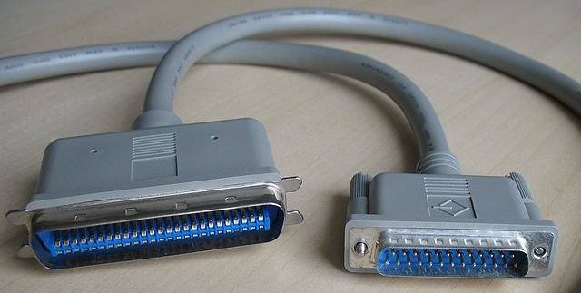](.ressources/img/notes-31.png){:target="_blank"} 

**Small Computer System Interface** (SCSI, prononcé "*skeuzi*") est un standard définissant un bus informatique reliant un ordinateur à des périphériques ou à un autre ordinateur. Aujourd'hui en cours de remplacement par le SAS (Serial Attached SCSI).

Il désigne une technologie qui regroupe un ensemble d'interfaces électroniques normalisées qui permettent aux ordinateurs de communiquer avec des équipements périphériques comme les lecteurs de disque, les lecteurs de bande, les lecteurs de CD-ROM, les imprimantes et les scanners, et ce plus rapidement et avec plus de flexibilité que les interfaces antérieures.

Si tous les périphériques ne prennent pas en charge tous les niveaux de SCSI, les normes SCSI sont généralement rétrocompatibles. Ainsi, si un périphérique d'ancienne génération est connecté à un ordinateur plus récent qui prend en charge une norme postérieure, le périphérique fonctionnera avec l'ancien débit de données, plus lent.

Dans l'informatique personnelle, les interfaces SCSI ont été en grande partie remplacées par le bus universel en série, dit bus USB.

Dans l'entreprise, l'interface SCSI reste utilisée dans les fermes de serveurs pour les contrôleurs de disques durs.

##### Les limites du stockage local

**Limites du stockage local**

- Chaque serveur allouera de l'espace disque à la tolérance de pannes
- Les volumes disques sont créés en fonction des besoins et des contraintes matérielles
- Les sauvegardes impactent les performances de toutes les machines qui y sont soumises 
- Une distances limitée entre un serveur et son stockage

La réponse aux problématiques précédentes : mise en place de solution de stockage centralisé / mutualisé.

Une solution de stockage réseau est caractérisée par :

- son type d'accès (mode bloc ou mode fichier)
- le ou les protocoles d'accès pris en charge

#### Comparaison SAN / NAS

| SAN | NAS |
|:--|:--|
|Les baies **SAN** utilisent des protocoles d'accès comme **Fibre Channel**, ou **iSCSI** et partagent leur capacité sous forme de volumes logiques. Ces derniers sont utilisables comme des disques locaux par les serveurs et sont donc accessibles en mode bloc.| Les baies **NAS** mettent leur capacité disponible à disposition des serveurs sous la forme d'un partage réseau accessible via un protocole de partage de fichiers en réseau comme **NFS** ou **CIFS** (alias **SMB**)|

#### iSCSC
Le protocole iSCSI est utilisé par des solutions de stockage centralisées rendant accessible de l'espace disque en mode bloc par un réseau.

  	

  		<a href=".ressources/img/notes-34.png" target="_blank">
			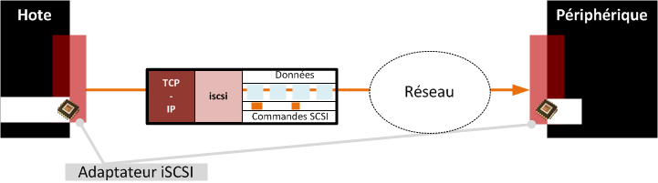
		</a>
	

  	

  		
	

	

D'autres protocoles ont une approche similaire.

### vSphere et le stockage
#### Les composantes de stockage
Dans une infrastructure vSphere, on distingue deux composantes de configuration du stockage :

- Les **adaptateurs de stockage** servent à lier des solutions de stockage aux hôtes amenés à les utiliser.
- Les **banques de données ou datastore** correspondent aux conteneurs "virtuels" dans lesquels sont hébergées les données.

#### Choix d'une solution de stockage
De nombreuses possibilités sont prises en charge pour l'hébergement des VM dans l'environnement vSphere. 

Les points suivants vous permettront de cibler la solution de stockage la plus adaptée à une situation donnée :

- Stockage dédié à un hôte ou mutualisé 
- Quel protocole d'accès à la solution de stockage 
- Quel support 
- Quel mode d'accès
- Quel système de fichiers utiliser 

### Les adaptateurs de stockage
#### Raccordement de la solution de stockage
La solution de stockage retenue est raccordée à l'infrastructure vSphere via la configuration des adaptateurs de stockage. 

Sont affichés dans les adaptateurs de stockage :

- Les disques physiques raccordés directement à l'hyperviseur 
- Les espaces disques accessibles via des adaptateurs HBA ou CNA physiques configurés sur l'hyperviseur 
- Les espaces disques accessibles via des adaptateurs logiciels de l'hyperviseur 

L'environnement vSphere fournit des adaptateurs virtuels FCoE (Fibre Channel on Ethernet) et iSCSI (internet SCSI) pour les hôtes.

L'utilisation de ces adaptateurs se traduit par un impact sur les performances des hôtes, les adaptateurs matériels sont donc à privilégier. 

Dans le cas d'utilisation d'une solution nécessitant un adaptateur de stockage virtuel, celui-ci est à configurer depuis l'hôte.

#### Zoom sur l'iSCSI
- L'utilisation de solutions de stockage basées sur le protocole iSCSI est fréquente dans des environnements virtualisés. Les **performances du réseau** associé sont alors directement liées au bon fonctionnement de la solution.
- Il est recommandé d'utiliser un **réseau dédié** à ses besoins. Et de préférences des mécanismes de **redondance**.
- Le ciblage d'une carte réseau pour le protocole iSCSI permet de dédier cette carte à ce besoin. Celui-ci se configure depuis les propriétés de l'adaptateur iSCSI. La résultante de cette configuration est visible dans les propriétés du vSwitch lié à la carte sélectionnée. 

##### Hôte et MTU
L'utilisation de trames Ethernet pour véhiculer des flux liés au stockage nécessite une adaptation de la configuration réseau afin de limiter la charge CPU et d'améliorer les performances globales de la solution. 

Si les équipements de réseau utilisés pour les flux iSCSI le permettent (prise en charge de bout en bout), il est recommandé d'augmenter la valeur du **MTU à 9000**.

##### iSCSI en environnement vSphere

[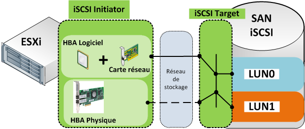](.ressources/img/notes-37.png){:target="_blank"}

<table>
	<caption class="caption">Eléments constitutifs d'une solution de stockage iSCSI</caption>
	<tr>
		<th>SAN</th><td>Storage Area Network : le réseau de stockage qui est caractérisé par son ou ses protocoles d'accès et connectivité, sa volumétrie, ses fonctionnalités associées, ses performances.</td>
	</tr>
	<tr>
		<th>LUN</th><td>Logical Unit Number : unité de stockage d'une baie de disques</td>
	</tr>
	<tr>
		<th>HBA</th><td>Host Bus Adapter : adaptateur de stockage qui (une fois configuré) permettra l'accès à un ou plusieurs espaces disques.</td>
	</tr>
	<tr>
		<th>iSCSI Target</th><td>L'élément qui met à disposition de l'espace disque physique.</td>
	</tr>
	<tr>
		<th>iSCSI Initiator</th><td>L'élément qui accède à de l'espace disque mis à sa disposition.</td>
	</tr>
</table>

### Les banques de données
#### Les datastores
On dispose généralement de plusieurs espaces disques disponibles et accessibles depuis leur adaptateur de stockage associé. Les banques de données, ou **datastore**, vont rendre utilisables ces espaces disques.

Avant leur création, il est important de recenser les besoins en termes de stockage et les caractéristiques attendues pour les espaces correspondants :

<table>
	<caption class="caption">Besoins en terme de stockage</caption>
	<tr>
		<th>Besoins</th><th>VM_PROD</th><th>VM_TESTS</th><th>MODELES</th><th>ISO</th>
	</tr>
	<tr>
		<th>Performances</th>
		<td class="red horiz-align-center">3</td>
		<td class="horiz-align-center">2</td>
		<td class="green horiz-align-center">1</td>
		<td class="green horiz-align-center">1</td>
	</tr>
	<tr>
		<th>Tolérance aux pannes</th>
		<td class="red horiz-align-center">3</td>
		<td class="horiz-align-center">2</td>
		<td class="green horiz-align-center">1</td>
		<td class="green horiz-align-center">1</td>
	</tr>
	<tr>
		<th>Criticité</th>
		<td class="red horiz-align-center">3</td>
		<td class="horiz-align-center">2</td>
		<td class="horiz-align-center">2</td>
		<td class="green horiz-align-center">1</td>
	</tr>
</table>

Des valeurs élevées pour les différents indices sont généralement associées à un coût élevé de l'hébergement.

#### La configuration de banques de données

On distingue 3 types de datastores :

1. VMFS
2. RDM ou VMFS
3. NFS 

<table>
	<caption>Caractéristiques et versions de systèmes de fichiers VMFS</caption>
	<thead>
		<tr>
			<td></td>
			<th class="horiz-align-center">VMFS 2</th>
			<th class="horiz-align-center">VMFS 3</th>
			<th class="horiz-align-center">VMFS 5</th>
			<th class="horiz-align-center">VMFS 6</th>
		</tr>
	</thead>
	<tbody>
		<tr>
			<th>Versions de vSphere prise en charge</th>	
			<td class="horiz-align-center">ESX 2</td>
			<td class="horiz-align-center">Virtual infrastructure 3 vSphere 4.x & vSphere 5.x</td>
			<td class="horiz-align-center">vSphere 5+</td>
			<td class="horiz-align-center">vSphere 6.5+</td>
		</tr>
		<tr>
			<th>Volume maximal</th>	
			<td colspan="2" class="horiz-align-center">2 To</td>
			<td colspan="2" class="horiz-align-center">64 To / defrag manu</td>
		</tr>
		<tr>
			<th>Format de la table de partitions</th>	
			<td colspan="2" class="horiz-align-center">MBR</td>
			<td colspan="2" class="horiz-align-center">GPT</td>
		</tr>
		<tr>
			<th>Taille des blocs</th>	
			<td colspan="2" class="horiz-align-center">1/2/4/8 Mo</td>
			<td colspan="2" class="horiz-align-center">1 Mo</td>
		</tr>
	</tbody>
</table>

**VMFS** est un système de fichiers qui permet un accès concurrentiel en lecture et en écriture à un ensemble d'hôtes.

#### Gestion des datastores

Les principales tâches de gestion des datastores sont :

- Création et formatage 
- Suivi de son taux d'utilisation 
- Extension dynamique
- Parcours, import et export de données 
- Démontage 

**Notes : Affichage des fichiers masqués** : Tous les fichiers ne sont pas visibles depuis l'outil d'exploration, ils peuvent l'être depuis la console de l'ESXi ou après s'y être connecté via *ssh*, au moyen de la commande **ls**. 

### Les disques de VM
#### La mise à disposition d'espace disque aux VM 

<table class="table table-borderless">
	<tr>
		<td>
			
L'espace disque accessible aux hôtes est principalement destiné à être utilisé par les VM qu'il héberge.

			
Deux possibilités permettent de fournir de l'espace disque à une VM :
				<ul>
				    <li>l'utilisation de disque au format VMDK</li>
				    <li>Le mappage d'espace disque en accès direct (Raw Device Mapping)</li>
				</ul>
		</td>
		<td width="500px">
			
		</td>
	</tr>
</table>

#### VMDK ou RDM

p121/156

Dans la plupart des cas, les disques présentés aux VM sont au format VMDK qui apporte le plus de simplicité de gestion et de sauvegarde. Ce format limite cependant à 2 To la taille maximale d'un espace disque.

Le format RDM peut être nécessaire dans certains contextes :

- Utilisation de solutions liées au SAN pour répondre à certains besoins (sauvegarde, etc.)
- Utilisation de services de cluster Microsoft

L'écart de performance entre les 2 formats est peu significatif.

#### Création d'un disque VMDK
Lors de la création d'un disque virtuel au format VMDK, 2 types de provisionnements sont proposés:

<table>
	<caption class="caption">Thick/thin provision</caption>
	<tr>
		<td></td>
		<th>Thick provisioning</th>
		<th>Thin provisioning</th>
	</tr>
	<tr>
		<th>Provisionnement</th>
		<td>Définitif / statique</td>
		<td>A la demande / dynamique</td>
	</tr>
	<tr>
		<th>Espace disque occupé</th>
		<td>Le disque créé occupera dès sa création tout l'espace indiqué</td>
		<td>La taille réelle du disque correspond à l'espace maximum occupé sur le disque. Le disque pourra au maximum atteindre l'espace indiqué.</td>
	</tr>
	<tr>
		<th style="background-color: green;color: white;font-weight: bold;">Avantages</th>
		<td style="background-color: green;color: white;font-weight: bold;">Performances supérieures</td>
		<td style="background-color: green;color: white;font-weight: bold;">Création du disque instantanée. L'espace non utilisé n'est pas bloqué et peut être utilisé.</td>
	</tr>
	<tr>
		<th style="background-color: red;color: white;font-weight: bold;">Inconvénients</th>
		<td style="background-color: red;color: white;font-weight: bold;">Temps de création du disque</td>
		<td style="background-color: red;color: white;font-weight: bold;">Risque de sur-allocation d'un datastore.</td>
	</tr>
</table>

#### Démonstrations - Datastore & Disques de VM
- Ajout d'un datastore local 
- Ajout d'un datastore mutualisé
	+ Configuration d'une solution iSCSI 
	+ Configuration d'une solution NFS
- Affectation d'une carte réseau pour l'initiateur iSCSI 

### Atelier 5 - Gestion de stockage

Voir Atelier 5 Gestion de stockage 

## Module 8 - Gestion du DataCenter
### Contextes et actions de gestion
Dans ce chapitre seront abordées les principales tâches de gestion d'un environnement vSphere. 

Certaines tâches sont réalisables sur des hôtes autonomes, d'autres nécessitent que les hôtes soient dans un contexte de datacenter (vCenter requis). 

| Tâches | Disponibilité sur des hôtes autonomes | Disponibilité dans un contexte de datacenter |
| Gestion des ressources et pools de ressources  | [x] | [x] |
| Gestion des rôles, utilisateurs et privilèges  | [x] | [x] |
| Utilisation du web client vSphere              | [ ] | [x] |
| Utilisation de vMotion et Storage vMotion      | [ ] | [x] | 
| Gestion des modèles VMTX                       | [ ] | [x] |

### La gestion des ressources
#### La réservation de ressources

Il est possible d'affecter à l'ensemble des VM d'un hôte plus de ressources que celles dont il dispose réellement (toutes les VM n'étant pas en fonctionnement en même temps).

La problématique se pose si une VM "plus importante" qu'une autre ne peut être démarrée faute de ressources.

Pour répondre à cette problématique, il est possible de réserver des ressources :

- pour des machines virtuelles 
- pour des ensembles de ressources
- pour le cluster

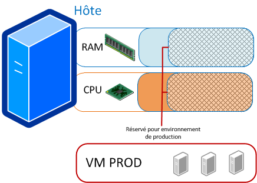

#### Gestion des pools de ressources
Le pool de ressources : objet logique auquel est affectée une partie des ressources physiques (CPU & RAM) réelles. 

Il permet :

- de réserver des ressources en fonction de leur utilisation 
- de restreindre les ressources matérielles de certains environnements (tests)

La configuration de pools peut permettre de garantir la disponibilité de ressources pour les besoins les plus cruciaux pour l'entreprise. 

### vCenter et le contexte de Datacenter

L'ajout d'un vCenter à une infrastructure va permettre :

- de **créer un datacenter** et de lui affecter des **hôtes** afin de les regrouper **au sein d'une même entité de gestion** ;
- de disposer d'objets (réseau et stockage) **uniques et utilisables** sur tous les hôtes du datacenter ;
- d'utiliser les fonctionnalités de **déplacement de VM à chaud** (vMotion) ;
- de créer un contexte de **cluster** (non abordé ici) et de bénéficier des fonctionnalités de **haute disponibilité** associées.

vCenter est un élément indispensable à la mise en oeuvre et au fonctionnement d'un ensemble de services. 

Il est recommandé qu'il soit installé sur une VM **hautement disponible** de l'infrastructure.

#### vCenter Serveur -vs- vCSA
vCenter est un outil de la suite vSphere soumis à licence.

Deux types d'implémentations sont possibles :

- Utiliser l'appliance vCSA fournie par VMware
- Installer l'outil sur un OS serveur Microsoft x64

<table>
	<tr>
		<td></td>
		<th>vCSA</th>
		<th>vCenter Server</th>
	</tr>
	<tr>
		<th>Nb hôtes maxi</th>
		<td>5 ESXi</td>
		<td>1000 ESXi</td>
	</tr>
	<tr>
		<th>Nb VM maxi</th>
		<td>50 VM</td>
		<td>10.000 VM</td>
	</tr>
	<tr>
		<th style="background-color: green;color: white;font-weight: bold;">Avantages</th>
		<td style="background-color: green;color: white;font-weight: bold;">Simplicité de mise en oeuvre</td>
		<td style="background-color: green;color: white;font-weight: bold;">Capacité de prise en charge supérieures</td>
	</tr>
	<tr>
		<th style="background-color: red;color: white;font-weight: bold;">Inconvénients</th>
		<td style="background-color: red;color: white;font-weight: bold;">Limites de prise en charge</td>
		<td style="background-color: red;color: white;font-weight: bold;">Mise en oeuvre plus complexe et coûteuse</td>
	</tr>
</table>

#### Méthodes d'accès à l'appliance vCenter
Les actions de gestion du vCenter sont réalisées depuis le **client Web vSphere** via un navigateur.

Les actions propres à la gestion du vCSA peuvent être effectuées via une connection HTTPS au port 5480.

### Les modèles de VM

<table>
	<caption class="caption">Les modèles</caption>
	<tr>
		<td></td>
		<th>Modèle OVF</th>
		<th>Modèle VMTX</th>
	</tr>
	<tr>
		<th>Prise en charge</th>
		<td>Toutes les solutions VMware (Player, Workstation, vSphere) VirtualBox Xen Server</td>
		<td>Suite VMware vSphere dans un contexte de datacenter</td>
	</tr>
	<tr>
		<th>Actions possibles</th>
		<td>Possibilité d'import / export de l'élément</td>
		<td>Cloner / Dupliquer VM vers template Déployer VM depuis template Possibilité de customisation</td>
	</tr>
	<tr>
		<th>Contexte d'utilisation</th>
		<td>Pour toute mise à disposition d'une VM</td>
		<td>Base utilisée pour la mise en oeuvre de l'OS et ses correctifs sur de nouvelles VM</td>
	</tr>
</table>

**OVF ou OVA ?** Un fichier OVA est une archive compressée qui contient les éléments du dossier OVF. 

#### Les modèles VMTX
Les modèles VMTX sont des images de VM qui sont utilisées pour permettre un déploiement optimisé de nouvelles VM dans l'infrastucture vSphere.

Ils peuvents intégrer un OS, des pilotes, des applications ou des correctifs et mises à jour.

Ils sont généralement personnalisés pour leur utilisation dans le contexte de l'entreprise.

##### Gestion des modèles VMTX
Les tâches de gestion peuvent être initiées :

- depuis la catégorie "VM et modèles" de l'inventaire 
- depuis le composant "Modèle" des actions proposées sur une machine virtuelle 

Deux types d'action peuvent être entreprises :

- La **conversion** permet de **transformer une VM en modèle** ou inversement 
- Le **clonage** conserve l'élément original et le **duplique en modèle ou VM**

##### Personnalisation des modèles
- La personnalisation du système post déploiement permet d'automatiser les tâches de :
	+  Renommage de la machine pour son OS 
	+  Modification de son adressage IP 
	+  Régénération de son identifiant de sécurité 
-  Prérequis de personnalisation 
	+  Les outils d'intégration VMware doivent être installés sur la VM 
	+  SYSPREP doit être implémenté sur le vCenter s'il ne l'est pas nativement sur l'OS invité

##### Etapes de mise en oeuvre de templates VMTX
- Préparer la machine virtuelle de référence 
- Y installer les outils d'intégration (vmtools)
- Convertir cette machine virtuelle en modèle 

#### Les modèles OVF
- Le format de modèle OVF (**Open Virtual Machine Format**) est proposé comme format standard de modèle de VM 
	+ Il facilite les actions d'import et d'export de VM 
	+ Les fichiers modèles ainsi générés peuvent facilement être intégrés au sein d'autres environnements et solutions de virtualisation
	
- Prise en charge de ce format 
	+ Sur les environnements de virtualisation VMware (Player, Workstation, vSphere)
	+ Par les solutions de virtualisation VirtualBox et Xen Server 
	+ Des outils permettent son import pour Hyper-V, QEMU/KVM 

### Utilisateurs et privilèges
#### Gestion des utilisateurs, groupes et privilèges
La gestion des utilisateurs et groupes peut être réalisée au niveau du vCenter ou au niveau de l'ESXi.

Les permissions peuvent être accordées sur tous les objets de l'inventaire : vCenter, datacenter, cluster, datastore, ESXi, VM, etc. 

Les utilisateurs créés sur le vCenter pourront disposer de privilèges sur toute l'infrastructure vSphere. Les utilisateurs créés sur l'ESXi pourront disposer de privilèges uniquement sur cet ESXi ou sur des VM qu'il héberge. 

**SSO et contexte de domaine** : Si on est dans un contexte d'AD, le SSO peut être configuré afin d'utiliser des utilisateurs et groupes du domaine.

#### Méthodologie d'affectation des privilèges
- Créer les utilisateurs
- Créer les groupes et leur affecter des utilisateurs 
- Créer des rôles, leur affecter les privilèges détaillés souhaités
- Sélectionner l'objet d'inventaire sur lequel affecter les privilèges ; lui associer les groupes et rôles correspondants

#### Privilèges d'accès - bonnes pratiques
- Utiliser des groupes plutôt que des utilisateurs.
- Ne pas affecter plus de privilèges que nécessaire : si un rôle offre plus de privilèges que nécessaire, il pourra être dupliqué et modifié.
- Définir ses règles sur les éléments de plus haut niveau, l'héritage permettra leur propagation à l'ensemble d'éléments enfants.

### Déplacement de machines virtuelles
#### Les actions de migration / déplacement
- Une VM a besoin pour son fonctionnement d'un ensemble de ressources. 
- Ces ressources lui sont mises à disposition par l'hôte qui l'héberge :
	+ Certaines de ses ressources lui sont propres : CPU, RAM, réseau
	+ D'autres, tel que le stockage peuvent être externes et accessibles à un ensemble d'hôtes

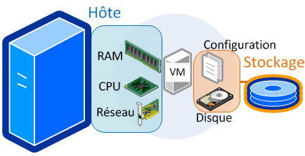

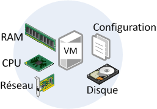

Les actions de migration accessibles sur les VM d'un datacenter utilisent :

- **vMotion** pour permettre le **déplacement à chaud d'une machine virtuelle** d'un hôte vers un autre hôte 
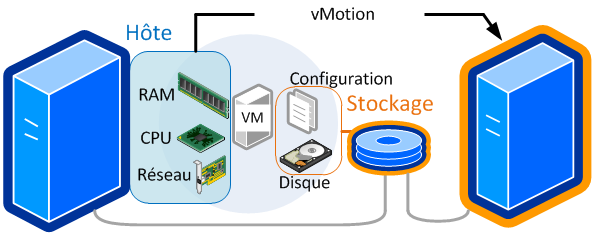
- **Storage vMotion** pour permettre le **déplacement à chaud du stockage** d'une VM d'un datastore vers un autre datastore. 

#### vMotion / Storage vMotion - mise en oeuvre
Prérequis de mise en oeuvre :

- La fonctionnalité vMotion doit être active sur au moins un vSwitch de l'hôte source et de destination 
- L'adressage des hôtes sources et destination utilisée par la fonctionnalité doit être du même domaine de diffusion 
- L'emplacement de stockage des VM à déplacer doit être accessible aux 2 hôtes 

Déplacement :

- Dans le contexte du datacenter, choisir l'action de déplacement proposée sur la VM 
- L'assistant permet alors de déplacer 
	+ La VM vers un autre hôte 
	+ Le stockage de la VM vers un autre point de stockage 
	
**Quelques cas de problématiques de déplacement de VM**: une image iso est présente dans la VM ; le groupement de port de raccordement est inexistant sur l'hôte de destination ; le niveau de support d'instructions CPU ne concorde pas entre les 2 hôtes.

### Atelier 6 - DataCenter

-Fin-

## Glossaire

- Fibre channel : le protocole le plus utilisé pour les SAN.
- iSCSI : le protocole basé sur TCP/IP. 
- FCoE : Fibre Channel on Ethernet.
- Network Attached Storage : une alternative plus répandue de stockage en entreprise.
- RAID : les méthodes d'optimisations et de sécurisation du stockage sur disques. 
- SCSI : le standard utilisé pour communiquer avec les disques.
- SMI-S : norme de gestion de stockage. 
- Hyperviseur de stockage. 
- NFS : Network File System, protocole de partage de fichiers UNIX. 
- CIFS : Common Internet File System, protocole de partage de fichiers Microsoft.
- AFS : AppleShare File Protocol

## Notes

### NFS
#### Avantages du stockage NFS
- NFS est très stable et fiable.
- Peut être agrandi à tout moment sans répercussions côté VMware.
- Souvent déjà existant dans la plupart des organisations.
- Stockage optimal (Thin provisionning : n’est alloué que ce qui est consommé).
- Stockage centralisé pouvant s’adapter à toute structure (Ethernet).
- Peut rivaliser avec les performances de la fibre optique avec l’arrivée de NFSv4 et l’Ethernet 10 Gbit.
- Un partage NFS peut bénéficier directement de la déduplication.

#### Inconvénients du stockage NFS
- L’overhead au niveau CPU est conséquent bien qu’inférieur au protocole iSCSI.
- Seule une session de donnée est active. Ainsi, l’agrégation de lien n’a aucun effet et ne permet pas de dépasser 1 Gbit (il faut une carte 10 Gbit pour augmenter la bande passante).
- Sécurité en retrait (dans la plupart des implémentations)

### SAN

Le SAN contrairement au NAS s’appuie historiquement sur un réseau dédié entre les serveurs et la baie de stockage. Il est à très grande vitesse et faible latence (pour le FC).

Le Lun Masking et le Zoning permettent de limiter les accès et connexions à certaines parties de l’infrastructure SAN au périphérique connecté au réseau FC. Les deux techniques sont utilisées de manière complémentaire en général.

#### Lun Masking

Le Lun Masking est une technique permettant de « cacher » via une gestion des droits des HBA, certaines LUN du stockage. Il s’agit donc d’une technique d’autorisation/révocation d’accès à une LUN.

#### Zoning

Le zoning représente des zones de communication entre des initiateurs et des cibles (targets). Tous les éléments présents dans une même zone peuvent communiquer entre eux et sont indexés dans un annuaire de ressources : le Name Server. Le zoning est l’équivalent d’un Vlan dans un réseau Ethernet.

Au niveau du zoning, on distingue deux types :

##### Soft Zoning

Le Soft Zoning est basé sur l’association entre WWPN dans une même zone. Il est possible d’utiliser des noms symboliques (ou Alias) afin que l’association soit plus aisée à configurer.
images/08EI23.png

##### Hard Zoning

Le hard Zoning se base sur les port_ID (les ports de connexion au niveau du switch FC) auxquels sont connectés les N_Port des équipements de stockage et/ou des serveurs (nodes).

<link rel="stylesheet" type="text/css" href=".ressources/css/bootstrap.min.css">
<link rel="stylesheet" type="text/css" href=".ressources/css/style.css">
<link rel="stylesheet" type="text/css" href=".ressources/css/headings.css">

