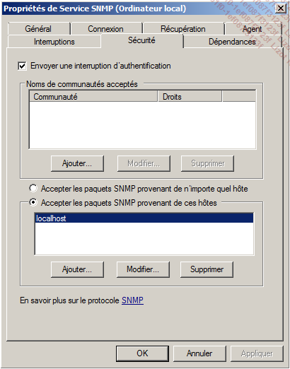
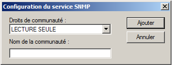
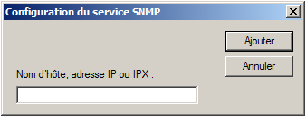

title: extrait-livre

# ENI TSSR 17 - Supervision
Cours TSSR *"Supervision avec Centreon"* @ ENI (2023)

<table>
<tr><th>Dates     :</th><td>du 06/03 au 10/03/2023</td></tr>
<tr><th>Formateur :</th><td>Guillaume CHERAMY</td></tr>
</table>

id: 150

*150 - Supervision avec Centreon*

[TOC]

## Le Protocole SNMP
### 1. Présentation
Le protocole **SNMP (Simple Network Management Protocol)** est un protocole historiquement dédié à la supervision et à l'administration des équipements réseau : routeurs, switchs, etc. Son plébiscite a cependant poussé les éditeurs et les constructeurs à l'utiliser dans bien d'autres domaines : systèmes d'exploitation, logiciels, matériels, etc. Il est aujourd'hui largement adopté et utilisé dans un grand nombre de solutions et souvent installé en standard.

Trois versions majeures du protocole SNMP cohabitent. La version 1 est très peu utilisée aujourd'hui, elle a été remplacée par la version 2c qui comporte davantage de types de données et d'opérations. Le principal reproche fait à ces deux versions est leur faible niveau de sécurité qui se base uniquement sur une chaîne de caractères appelée **communauté**. La version 3 du protocole tente de corriger ce point en apportant des mécanismes d'authentification et de chiffrement. Cependant, elle est lourde à mettre en œuvre, peu supportée et est plutôt à réserver à l'administration des ressources plutôt qu'à la supervision.

**La version 2c du protocole est la plus utilisée aujourd'hui pour la supervision**. Il est bien sûr recommandé de modifier le nom de communauté par défaut et de donner des droits en lecture seule uniquement au niveau des ressources supervisées. Le filtrage par IP est également recommandé, lorsque c'est possible. 

#### Architecture

Une infrastructure SNMP est constituée d'**agents SNMP** installés sur les ressources supervisées et de serveurs de supervision chargés de requêter ces agents et de recevoir les **alertes (trappes SNMP)**.

Chaque agent expose les informations de supervision de la ressource sur laquelle il est installé sous une forme arborescente codifiée. Cette structure est décrite dans des fichiers appelés **MIB (Management Information Base)**.
Les requêtes de supervision sont transmises depuis le serveur de supervision sur le **port UDP 161 en standard**. La ressource répond immédiatement. Il s'agit du **mode actif**.

Des **alertes, appelées trappes SNMP**, sont transmises par les ressources vers le serveur de supervision sur le **port UDP 162**. C'est un message unidirectionnel. Il s'agit du **mode passif**.

#### MIB

Chaque noeud de l'arborescence d'une MIB est identifié de manière unique par une séquence de chiffres appelée **OID (Object IDentifier)**. Chacun de ces objets contient une information à propos de la ressource supervisée : charge processeur, charge mémoire, trafic réseau, etc.
Certaines MIB sont devenues standard et sont présentes par défaut dans les agents des ressources. Cependant la majorité des informations sont exposées par des **MIB spécifiques aux constructeurs et éditeurs**. **Il est parfois très fastidieux de trouver la bonne information dans une MIB**.

**Exemple** :

```
# snmpwalk -c public -v 2c localhost interfaces 
IF-MIB::ifNumber.0 = INTEGER: 3 
IF-MIB::ifIndex.1 = INTEGER: 1 
IF-MIB::ifIndex.2 = INTEGER: 2 
IF-MIB::ifIndex.3 = INTEGER: 3 
IF-MIB::ifDescr.1 = STRING: lo 
IF-MIB::ifDescr.2 = STRING: eth0 
IF-MIB::ifDescr.3 = STRING: sit0 
IF-MIB::ifType.1 = INTEGER: softwareLoopback(24) 
IF-MIB::ifType.2 = INTEGER: ethernetCsmacd(6) 
IF-MIB::ifType.3 = INTEGER: tunnel(131) 
IF-MIB::ifMtu.1 = INTEGER: 16436 
IF-MIB::ifMtu.2 = INTEGER: 1500 
IF-MIB::ifMtu.3 = INTEGER: 1480 
IF-MIB::ifSpeed.1 = Gauge32: 10000000 
IF-MIB::ifSpeed.2 = Gauge32: 1000000000 
IF-MIB::ifSpeed.3 = Gauge32: 0 
```

La commande `snmpwalk` permet de lancer une requête vers les agents SNMP. L'exemple ci-dessus est un extrait des informations codifiées par la MIB `IF-MIB`. 


### 2. Activation des agents SNMP sur quelques ressources
#### a. Système d'exploitation CentOS
La procédure ci-dessous est exécutée sur CentOS 7.

##### Installation

L'agent SNMP est matérialisé par le service `snmpd`. L'installation s'effectue via l'utilitaire `yum` :

```
# yum install net-snmp 
```

##### Configuration

Par défaut, le service autorise la communauté public à interroger l'agent. Pour modifier la communauté, il suffit d'ouvrir le fichier **/etc/snmp/snmpd.conf** et de remplacer `public` dans la ligne ci-dessous avec le nouveau nom de communauté.

```
com2sec notConfigUser default public 
```

Des mécanismes plus avancés de sécurité sont disponibles, comme le filtrage IP, la limitation des MIB consultées, etc.

1. Démarrez le service et configurez-le pour un lancement automatique.
```
# systemctl restart snmpd 
# systemctl enable snmpd 
```

2. **firewalld** : Le firewall `firewalld` est parfois configuré pour bloquer les requêtes SNMP par défaut. Il faut alors exécuter la commande ci-dessous :
```
# firewall-cmd --zone=NOMDELAZONE --add-service=snmpd 
```

#### b. Système d'exploitation Debian
La procédure ci-dessous est exécutée sur Debian 9.

1. Installez le package `snmpd` :
```
# apt-get install snmpd 
```

2. Dans le fichier **/etc/snmp/snmpd.conf**, modifiez la ligne ci-dessous ou commentez-la pour l'adapter à votre interface de supervision
```
agentAddress  udp:127.0.0.1:161 
```

3. Modifiez également la ligne ci-dessous pour l'adapter à votre nom de communauté.
```
rocommunity public default -V systemonly 
```

4. Démarrez le service et ajoutez-le au démarrage du système.
```
# systemctl restart snmpd 
# systemctl enable snmpd 
```

#### c. Système d'exploitation Windows
La procédure ci-dessous est exécutée sur Windows 2008 Server R2 (la même procédure est valable pour tous les environnements Windows ultérieurs).

##### Installation

1. Authentifiez-vous sur le serveur avec un compte **Administrateur**.

2. Dans **Menu démarrer** > **Panneau de configuration** > **Programmes**, cliquez sur **Activer ou désactiver des fonctionnalités Windows**.

3. Dans le menu de gauche, cliquez sur **Fonctionnalités**.

4. Dans la fenêtre centrale, cliquez sur **Ajouter des fonctionnalités**.

5. Cochez la case **Services SNMP**, ce qui aura pour effet d'installer l'agent SNMP et WMI (si vous ne souhaitez pas installer l'agent WMI cliquez sur la croix et décochez **Fournisseur WMI SNMP**).

6. Cliquez sur **Suivant**, puis sur **Installer**.

7. Une fois l'installation terminée, cliquez sur **Fermer**.

##### Configuration

1. Cliquez sur **Menu démarrer** > **Outils d'administration** > **Services**.

2. Double cliquez sur **Service SNMP** > onglet **Sécurité**.



La partie **Noms de communautés acceptés** permet de définir le nom de la communauté ainsi que les droits qui lui sont associés. La seconde partie de la fenêtre permet d'ajouter des filtres sur les IP ayant le droit d'interroger l'agent SNMP.

1. Dans la partie **Noms de communautés acceptés**, cliquez sur le bouton **Ajouter**.



2. Renseignez les champs puis cliquez sur **Ajouter** :
  + **Droits de communauté** : la lecture seule est à privilégier pour la supervision.
  + **Nom de la communauté** : une chaîne de caractères libre.

 En dessous d'**Accepter les paquets SNMP provenant de ces hôtes**, cliquez sur le bouton **Ajouter…**.



3. Renseignez le champ avec l'IP ou le nom d'hôte du ou des collecteurs de la plateforme de supervision.

4. Validez la configuration et redémarrez le **Service SNMP**.

#### d. Routeur Cisco
La procédure ci-dessous est exécutée sur un routeur Cisco 2691 avec IOS 12.3.

##### Configuration

1. Entrez en mode de configuration globale :
```cisco
R1> enable 
R1# configure terminal 
```

2. Tapez la commande suivante pour activer la communauté centreonlivre en lecture seule :
```cisco
R1(config)# snmp-server community centreonlivre ro 
```

##### Sécurité

1. Pour autoriser une seule adresse IP à utiliser la communauté **centreonlivre**, créez une ACL standard :
```cisco
R1(config)# access-list [numero_ACL] permit host [ip_collecteur] 
```
Où
- `[numero_ACL]` est compris entre 1 et 99.
- `[ip_collecteur]` est égal à l'adresse IP du collecteur qui supervise l'équipement.

2. Associez la communauté centreonlivre à l'ACL :
```cisco
R1(config)# snmp-server community centreonlivre [numero_ACL] 
```

3. Sauvegardez la configuration :
```cisco
R1(config)# exit 
R1# copy running-config startup-config 
```

**Notes** : Il est aussi possible d'associer une ACL étendue à la communauté SNMP.


<p class="fin">~To be continued...~</p>


<link rel="stylesheet" type="text/css" href=".ressources/css/bootstrap.min.css">
<link rel="stylesheet" type="text/css" href=".ressources/css/style.css">
<link rel="stylesheet" type="text/css" href=".ressources/css/headings.css">
