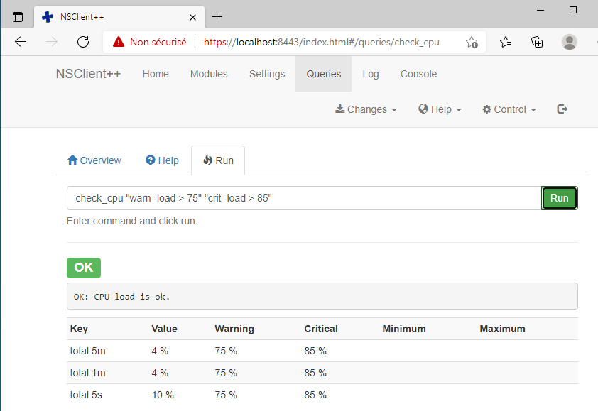
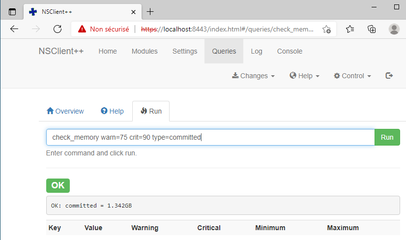
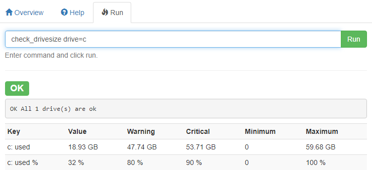
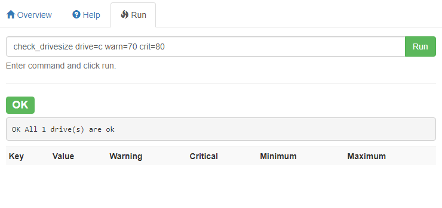

title: tp2-sondes

# ENI TSSR 17 - Supervision

## TP2
Ecriture de sondes de supervision

[TOC]


### Rappels

1. Les sondes de supervision se trouvent aux emplacements suivants :
	+ **/usr/lib/centreon/plugins**
	+ **/usr/lib64/nagios/plugins**
	+ **/usr/lib/nabios/plugins**

2. L'execution des commandes s'effectue **toujours** sous l'utilisateur `centreon-engine`
```
# su - centreon-engine
```


### Créations des commandes

#### 1. Communes aux 2 postes client
##### 1.1 Vérification du ping
- 5 requêtes seront envoyées
- Seuil Warning : RTA de 3 ms ou 20% de perte
- Seuil Critique : RTA de 5 ms ou 60% de perte


- hôtes visés : 
	+ DEB-CLI1 (172.16.1.101)
	+ WIN-CLI2 (172.16.1.100)
- service visé: `ping`

1. Se connecter en ssh au server Centreon (172.16.1.10 root (Pa$$w0rd))
2. Check aide si besoin 
```sh
/usr/lib64/nagios/plugins/check_ping -h
```
3. Devenir utilisateur `centreon-engine` avant d'enregistrer des sondes
4. Executer :
```sh
check_ping --hostname=172.16.1.100 --warning=3,20% --critical=5,60% --packets=5
check_ping -H 172.16.1.101 -w 3,20% -c 5,60% -p 5
```

**Commande entière**:

```sh 
ssh root@172.16.1.10
su - centreon-engine
cd /usr/lib64/nagios/plugins
./check_ping --hostname=172.16.1.100 --warning=3,20% --critical=5,60% --packets=5
./check_ping -H 172.16.1.101 -w 3,20% -c 5,60% -p 5
```

**OUTPUT** :

```sh
$ ./check_ping --hostname=172.16.1.100 --warning=3,20% --critical=5,60% --packets=5
PING CRITICAL -  Paquets perdus = 100%|rta=5.000000ms;3.000000;5.000000;0.000000 pl=100%;20;60;0

$ ./check_ping --hostname=172.16.1.101 --warning=3,20% --critical=5,60% --packets=5
PING OK -  Paquets perdus = 0%, RTA = 0.88 ms|rta=0.879000ms;3.000000;5.000000;0.000000 pl=0%;20;60;0
```

Après désactivation du pare-feu sur 172.16.1.100 :

```sh
$ ./check_ping --hostname=172.16.1.100 --warning=3,20% --critical=5,60% --packets=5PING OK -  Paquets perdus = 0%, RTA = 1.17 ms|rta=1.172000ms;3.000000;5.000000;0.000000 pl=0%;20;60;0
```

Aide `check_ping`

```
$ centreon-engine@centreon-central:/usr/lib64/nagios/plugins
[0] ./check_ping -h
check_ping v2.3.3 (nagios-plugins 2.3.3)
Copyright (c) 1999 Ethan Galstad <nagios@nagios.org>
Copyright (c) 2000-2014 Nagios Plugin Development Team
        <devel@nagios-plugins.org>

Utilise ping pour vérifier les statistiques de connections d'un hôte distant.

Utilisation:
check_ping -H <host_address> -w <wrta>,<wpl>% -c <crta>,<cpl>%
 [-p packets] [-t timeout] [-4|-6]

Options:
 -h, --help
    Afficher l'aide détaillée
 -V, --version
    Afficher les informations relative à la version
 --extra-opts=[section][@file]
    Read options from an ini file. See
    https://www.nagios-plugins.org/doc/extra-opts.html
    for usage and examples.
 -4, --use-ipv4
    Utiliser une connection IPv4
 -6, --use-ipv6
    Utiliser une connection IPv6
 -H, --hostname=HOST
    hôte à tester
 -w, --warning=THRESHOLD
    Valeurs pour le seuil d'avertissement
 -c, --critical=THRESHOLD
    Valeurs pour le seuil critique
 -p, --packets=INTEGER
    nombre de paquets ICMP à envoyer (Défaut: 5)
 -s, --show-resolution
    show name resolution in the plugin output (DNS & IP)
 -L, --link
    show HTML in the plugin output (obsoleted by urlize)
 -t, --timeout=INTEGER:<timeout state>
    Seconds before connection times out (default: 10)
    Optional ":<timeout state>" can be a state integer (0,1,2,3) or a state STRING
```


#### 2. Poste Windows (NRPE)

Ces sondes utiliseront toutes le protocole **NRPE**.

**Paramètrages NRPE**

1. Ouvrir https://localhost:8443/    (Pa$$w0rd)
2. Settings > settings > NRPE > server
3. Onglet Basic
4. "allow arguments" : ecrire `true`
5. "allow nasty characters" : écrire `true`
6. Save
7. Reload (Queries > Control > Reload)

Retourner sur l'interface web

1. Modules > sélectionner les modules voulus
2. Queries > entrer ses requêtes

##### 2.1 Vérification de la charge CPU
- Seuil Warning à 75% d'utilisation et critique à 85%  

- hôtes: WIN-CLI2 @ 172.16.1.100
- service : `check_load`

```
check_cpu "warn=load > 75" "crit=load > 85"
```



*Comment il sait qui il interroge ????*

> Parce qu'il est exécuté en localhost

##### 2.2 Vérification de la quantité de mémoire
- Seuil warning à 75% d'utilisation et critique à 90%

```
check_memory warn=75 crit=90 type=committed
```



##### 2.3 Vérification du stockage
- Vérification du lecteur C:
- Seuil warning à 70% d'utilisation et critique à 80%


```
check_drivesize drive=c warn=70 crit=80
```





```sh
/usr/lib/nagios/plugins/check_centreon_nrpe3 -H 172.16.1.100 -c check_drivesize "warn=used > 70" "crit=used > 85" "drive=c"
```

Output :
```
OK All 2 drive(s) are ok|'C:\ used'=18.92965GB;47.74218;53.70995;0;59.67773 'C:\ used %'=32%;80;90;0;100 'D:\ used'=0B;0;0;0;0
```

#### 3. Poste Linux

Ces sondes utiliseront toutes le protocole **SNMP**

##### 3.1 Vérification de la charge CPU
- Warning 70%, Critique 85%

```sh
/usr/lib/nagios/plugins/check_centreon_nrpe3 -H 172.16.1.100 -c check_cpu -a "warn=load > 70" "crit=load > 85"
```

Output:
```
OK: CPU load is ok.|'total 5m'=2%;70;85 'total 1m'=2%;70;85 'total 5s'=6%;70;85
```

##### 3.2 Vérification de la quantité de mémoire
- Warning 75% critique 90% 

```sh
/usr/lib/nagios/plugins/check_centreon_nrpe3 -H 172.16.1.100 -c check_memory -a "warn=used > 75" "crit=used > 90"
```

Output :
```
OK: committed = 1.475GB, physical = 716.145MB|'committed'=1.47468GB;2.34303;2.81164;0;3.12404 'committed %'=47%;75;90;0;100 'physical'=0.69935GB;1.49928;1.79914;0;1.99904 'physical %'=35%;75;90;0;100
```


##### 3.3 Vérification du stockage
- Warning à 60%, Critique 80%

- Vérification du point de montage `/`
```sh
./centreon_linux_snmp.pl --plugin=os::linux::snmp::plugin --mode=storage --hostname=172.16.1.101 --snmp-community=sniper --snmp-version=2  --name --storage="/" --warning-usage=80 --critical-usage=90
```

- Vérification du point de montage `/usr`
```sh
./centreon_linux_snmp.pl --plugin=os::linux::snmp::plugin --mode=storage --hostname=172.16.1.101 --snmp-community=sniper --snmp-version=2  --name --storage="/usr" --warning-usage=80 --critical-usage=90
```

- Vérification du point de montage `/home`
```sh
./centreon_linux_snmp.pl --plugin=os::linux::snmp::plugin --mode=storage --hostname=172.16.1.101 --snmp-community=sniper --snmp-version=2  --name --storage="/home" --warning-usage=80 --critical-usage=90
```


#### Bonus
Composer la sonde complète permettant de tester la charge CPU via SNMP du poste Windows.


### CORRECTION

```sh
# Check Ping
/usr/lib64/nagios/plugins/check_ping -H 172.16.1.100 -p 5 -w 3,60% -c 5,80%

# Windows by NRPE
# ===========================================
# Check CPU :
/usr/lib/nagios/plugins/check_centreon_nrpe3 -H 172.16.1.100 -c check_cpu -a "warn=load > 70"  "crit=load > 85"

# Check MEM :
/usr/lib/nagios/plugins/check_centreon_nrpe3 -H 172.16.1.100 -c check_memory -a "warn=used > 75"  "crit=used > 90"

# Check Disk :
/usr/lib/nagios/plugins/check_centreon_nrpe3 -H 172.16.1.100 -c check_drivesize -a "warning=used > 70" "critical=used > 85" "drive=c"


# Linux by SNMP
# ============================================

# Check_CPU :
./centreon_linux_snmp.pl --plugin=os::linux::snmp::plugin --mode=cpu --hostname=172.16.1.101 --snmp-community=sniper --snmp-version=2 --warning-average=70 --critical-average=85

# Check_Memory
./centreon_linux_snmp.pl --plugin=os::linux::snmp::plugin --mode=memory --hostname=172.16.1.101 --snmp-community=sniper --snmp-version=2  --warning-usage=75 --critical-usage=90

# Check_Disk : /
./centreon_linux_snmp.pl --plugin=os::linux::snmp::plugin --mode=storage --hostname=172.16.1.101 --snmp-community=sniper --snmp-version=2  --name --storage="/" --warning-usage=80 --critical-usage=90

./centreon_linux_snmp.pl --plugin=os::linux::snmp::plugin --mode=storage --hostname=172.16.1.101 --snmp-community=sniper --snmp-version=2  --name --storage="/usr" --warning-usage=80 --critical-usage=90

./centreon_linux_snmp.pl --plugin=os::linux::snmp::plugin --mode=storage --hostname=172.16.1.101 --snmp-community=sniper --snmp-version=2  --name --storage="/home" --warning-usage=80 --critical-usage=90
```

<p class="fin">~Fin TP2~</p>


<link rel="stylesheet" type="text/css" href="../.ressources/css/bootstrap.min.css">
<link rel="stylesheet" type="text/css" href="../.ressources/css/style.css">
<link rel="stylesheet" type="text/css" href="../.ressources/css/headings.css">
